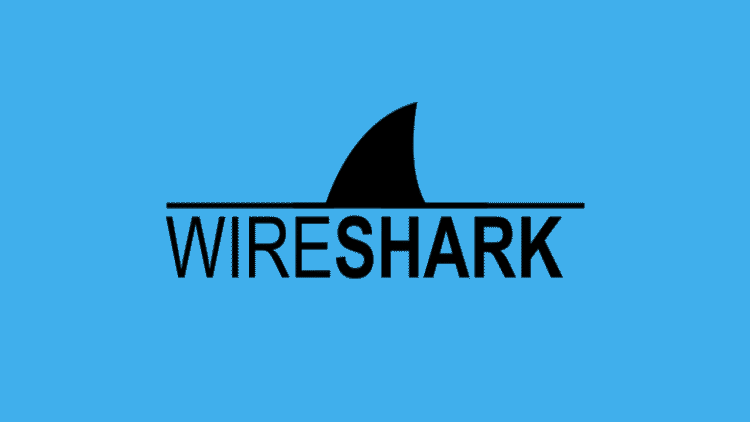
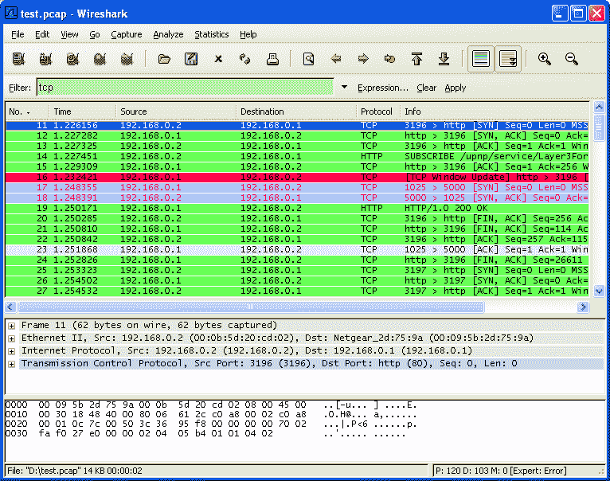
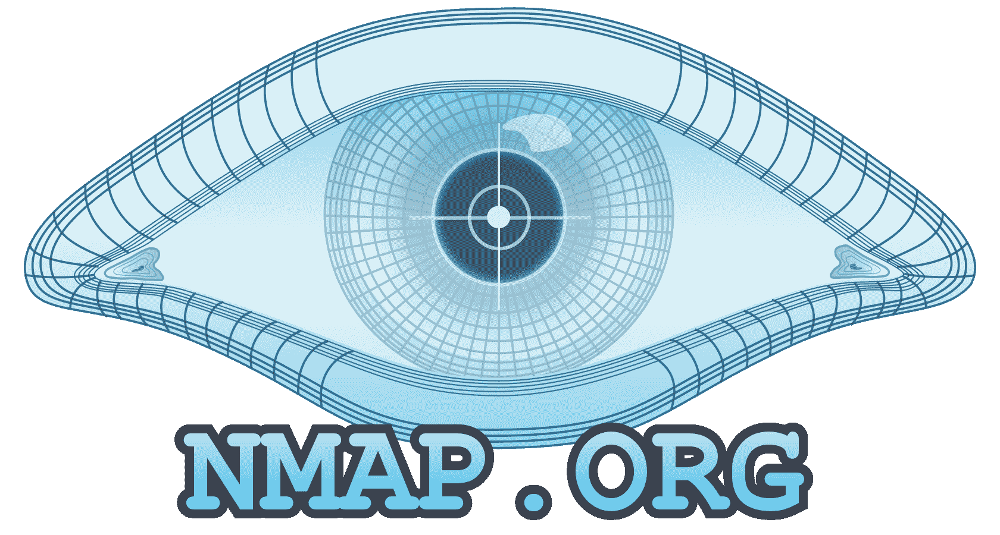
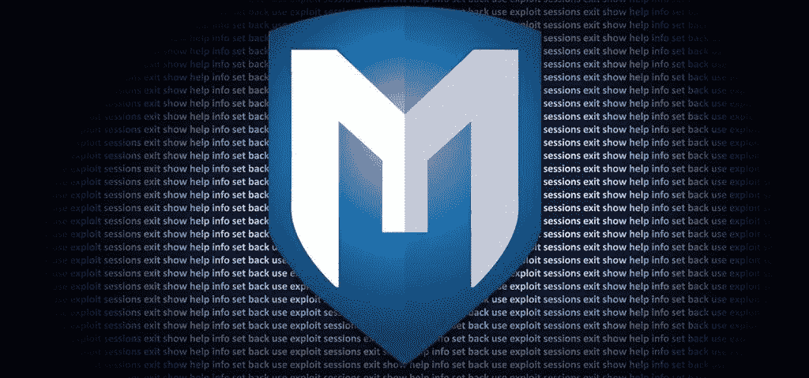
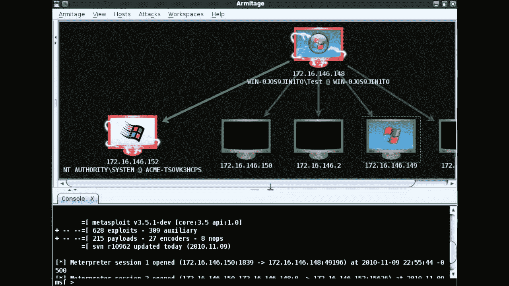
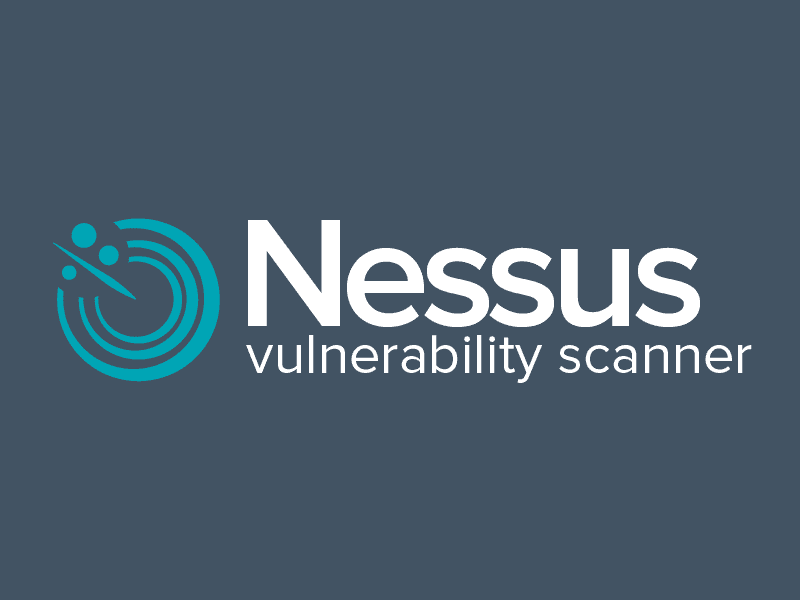
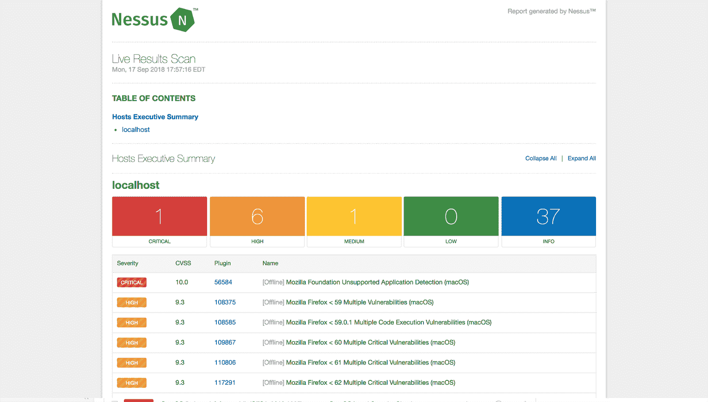

# 作为网络安全工程师，你应该知道的 10 个工具

> 原文：<https://www.freecodecamp.org/news/10-tools-you-should-know-as-a-cybersecurity-engineer/>

如果您是一名渗透测试人员，有许多工具可以帮助您完成目标。

从扫描到后期利用，如果你对网络安全感兴趣，这里有十个你必须知道的工具。

## 什么是网络安全

作为一名网络安全工程师，意味着要对整个网络负责。这个网络包括电脑、路由器、手机以及一切连接互联网的东西。

得益于[物联网](https://en.wikipedia.org/wiki/Internet_of_things)的兴起，我们每天都看到越来越多的设备连接到互联网。像 [Shodan](https://www.shodan.io/) 这样的服务证明了拥有一个没有足够安全性的互联网连接设备是多么的危险。

考虑到当今黑客的复杂程度，我们也不能依赖杀毒软件。此外，现在大多数攻击都使用[社会工程](https://www.csoonline.com/article/2124681/what-is-social-engineering.html)作为切入点。这使得网络安全专业人员更难检测和缓解这些攻击。

新冠肺炎已经成为日益增长的网络攻击的另一个主要催化剂。在家工作的员工无法在工作场所访问相同的企业级安全架构。

越来越多的网络攻击也增加了世界各地对网络安全专业人员的需求。由于这种不断增长的需求，网络安全吸引了许多专家和初学者。

对于那些刚接触网络安全的人来说，黑客并不像电视上看起来那么酷。而且很有可能你会锒铛入狱。

然而，作为一名渗透测试员或白帽黑客是不同的——也是有益的——因为你将使用黑帽黑客(坏黑客)使用的相同工具。除了这一次，它是合法的，你的目标是帮助公司发现安全漏洞，以便他们可以修复它们。

你可以[在这里](https://www.tutorialspoint.com/ethical_hacking/ethical_hacking_hacker_types.htm)了解更多关于黑客的类型。

在任何领域都很难找到合适的工具来开始，尤其是如果你是一个初学者。因此，这里有 10 个工具可以帮助你开始成为一名网络安全工程师。

## 初级网络安全工程师的顶级工具

### Wireshark

拥有坚实的网络基础对于成为一名优秀的渗透测试人员至关重要。毕竟，互联网是一堆相互通信的复杂网络。如果你是网络新手，我推荐网络方向的[这个播放列表。](https://www.youtube.com/watch?v=cNwEVYkx2Kk&list=PLDQaRcbiSnqF5U8ffMgZzS7fq1rHUI3Q8)

Wireshark 是世界上最好的网络分析工具。这是一个开源软件，使您能够检查实时网络数据。

Wireshark 可以将数据包分解成帧和段，为您提供数据包中位和字节的详细信息。

Wireshark 支持所有主要的网络协议和媒体类型。如果您在公共网络中，Wireshark 也可以用作数据包嗅探工具。Wireshark 可以访问连接到路由器的整个网络。

Wireshark UI

多亏了 HTTPS，像脸书和推特这样的网站现在都加密了。这意味着，即使你能从一台受害计算机上捕获传输到脸书的数据包，这些数据包也会被加密。

尽管如此，能够实时捕获数据包对于渗透测试人员来说是一个重要的工具。

### Nmap

Nmap 是您开始渗透测试职业生涯时遇到的第一个工具。这是一个神奇的网络扫描工具，可以给你一个目标的详细信息。这包括开放端口、服务和受害者计算机上运行的操作系统。

由于许多原因，Nmap 在渗透测试人员中很受欢迎。它简单、灵活、可扩展。它提供了一个简单的命令行界面，您可以添加一些标志来选择不同类型的扫描。

Nmap 还提供简单的 ping 扫描，一直到提供详细端口和服务信息的主动扫描。

Zenmap UI

Nmap 还提供了一个名为 Zenmap 的 GUI 工具，增加了一些实用程序。您可以构建可视化网络地图，并通过下拉菜单选择扫描。如果你是初学者，Zenmap 是一个开始使用 nmap 命令的好地方。

我最近在 Nmap 上写了一篇详细的文章，你可以在这里阅读。

### Ncat(以前的 Netcat)

Netcat 通常被称为网络中的瑞士军刀。

Netcat 是一个简单但功能强大的工具，可以查看和记录 TCP 或 UDP 网络连接上的数据。Netcat 充当后端监听器，允许端口扫描和端口监听。

你也可以通过 Netcat 传输文件，或者用它作为受害者机器的[后门。这使得是一个流行的后利用工具，建立成功攻击后的连接。Netcat 也是可扩展的，因为它能够为更大或冗余的任务添加脚本。](https://en.wikipedia.org/wiki/Backdoor_%28computing%29)

尽管 Netcat 很受欢迎，但其社区并不积极维护它。Nmap 团队构建了名为 [Ncat](https://nmap.org/ncat/) 的 Netcat 更新版本，其特性包括支持 SSL、IPv6、SOCKS 和 HTTP 代理。

### Metasploit

如果有一个我喜欢的工具，那就是 Metasploit。Metasploit 不仅仅是一个工具，而是一个完整的框架，可以在整个渗透测试生命周期中使用。

Metasploit 包含对[常见漏洞和暴露](https://cve.mitre.org/)数据库中大多数漏洞的利用。使用 metasploit，您可以将有效负载发送到目标系统，并通过命令行界面访问它。

Metasploit 非常先进，除了利用漏洞之外，还能够执行端口扫描、枚举和脚本编写等任务。您还可以使用 Ruby 编程语言构建和测试自己的漏洞。

Metasploit 在 2009 年之前一直是开源的，之后 Rapid7 收购了该产品。您仍然可以访问免费的社区版，并使用其所有功能。

Armitage UI

Metasploit 曾经是一个纯粹的命令行工具。2013 年发布了一款基于 Java 的 GUI，名为 Armitage。

### Nikto

Nikto 是一个开源工具，能够执行广泛的 web 服务器扫描。Nikto 可以帮助您扫描有害文件、错误配置、过时的软件安装等。

它还检查是否存在多个索引文件、HTTP 服务器配置和安装的 web 服务器软件。

Nikto 是一般 web 服务器安全审计的首选工具。尼克托速度很快，但不安静。您可以非常快速地扫描大型 web 服务器，但是入侵检测系统会很容易地检测到这些扫描。然而，如果你想执行秘密扫描，有反入侵检测插件的支持。

### 打嗝组曲

当谈到笔测试 web 应用程序时，Burpsuite 可以为您提供所有答案。BurpSuite 的目标是成为各种 web 应用程序笔测试用例的一体化工具。它也是专业 web 应用程序安全研究人员和 bug 赏金猎人中的流行工具。

Burpsuite 的工具协同工作，支持整个 web 应用程序测试生命周期。从扫描到利用，Burpsuite 提供了您进入 web 应用程序所需的所有工具。

Burp Suite 的主要特性之一是它能够拦截 HTTP 请求。HTTP 请求通常从您的浏览器发送到 web 服务器，然后 web 服务器发回一个响应。使用 Burp Suite，您可以执行中间人操作来操纵请求和响应。

Burpusite 拥有出色的用户界面。Burpsuite 还提供自动化工具，使您的工作更快、更高效。

除了它的默认特性，Burpsuite 还可以通过添加名为 BApps 的插件进行扩展。

### 开膛手约翰

在大多数系统中，密码仍然是事实上的身份验证标准。即使你成功进入服务器或数据库，你也必须解密密码才能获得[权限提升](https://searchsecurity.techtarget.com/definition/privilege-escalation-attack)。

开膛手约翰是一个用于破解密码的简单工具。这是一个超快的密码破解程序，支持自定义单词表。它可以运行大多数类型的加密方法，如 MD5 和 SHA。

### 空气裂化

Aircrack-ng 是一套帮助您使用无线网络的工具。Aircrack 包含可以捕捉无线网络、破解 WPA 密钥、注入数据包等的工具。

Aircrack-ng 套件中的一些工具包括:

*   airodump —捕获数据包
*   唱片的播送
*   空气裂缝——裂缝 WEP 和 WPA
*   airdecap —解密 WEP 和 WPA

Aircrack 包含破解 WiFi 密码和捕获无线流量的优秀算法。它还可以解密加密的数据包，使其成为一套完整的无线渗透测试工具。

简而言之，您可以使用 Aircrack 来监控、攻击和调试所有类型的无线网络。

### 涅索斯

Nessus 是一款流行的企业漏洞扫描器。Nessus 是一个完整的漏洞分析和报告工具。虽然您可以使用 Nmap 扫描和查找端口或服务，但 Nessus 会告诉您漏洞列表以及如何利用它们。

Nessus 拥有出色的用户界面，数以万计的插件，并支持嵌入式脚本。它经常受到企业的青睐，因为它可以帮助企业审计各种法规遵从性，如 PCI 和 HIPPA。Nessus 还会告诉您漏洞的严重性，以便您可以相应地关注这些威胁。

Nessus UI

Nessus 不是免费软件，但提供了有限的免费家庭版。Nessus 有一个名为 [Open-Vas](https://www.openvas.org/) 的开源替代品，提供类似的功能。

### 鼻息声

Snort 是一个用于检测和防止网络入侵的开源软件。它可以执行实时流量分析并记录传入的数据包，以检测端口扫描、蠕虫和其他可疑行为。

与列表中的大多数其他工具相比，Snort 用于防御。然而，snort 通过记录攻击者的活动来帮助您理解攻击者的方法。您还可以构建 [DNS sinkholes](https://en.wikipedia.org/wiki/DNS_sinkhole) 来重定向攻击者流量，同时通过 Snort 找到攻击媒介。

Snort 还有一个基于 web 的 GUI，叫做 BASE(基本分析和安全引擎)。BASE 提供了一个 web 前端来查询和分析来自 Snort 的警报。

## 结论

在当今的网络世界中，从政府机构到银行，每个人都将关键信息存储在云中。网络攻击甚至有可能瘫痪整个国家。因此，保护这些网络不是一种选择，而是绝对必要的。

无论你是初学者还是有经验的网络安全工程师，你都会发现这十个工具非常有价值。祝你在成为一名成功的渗透测试者的旅途中好运。从[安全工具目录](https://sectools.org/)中了解更多工具。

我定期撰写关于机器学习、网络安全和 AWS 的文章。你可以在这里注册我的 [*周报*](https://www.manishmshiva.com/) *。*