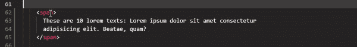
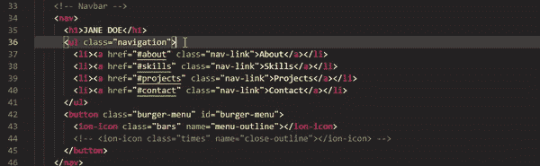
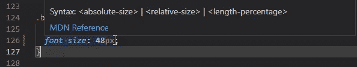
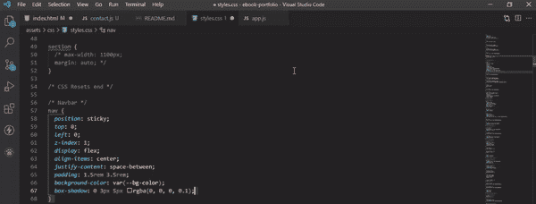
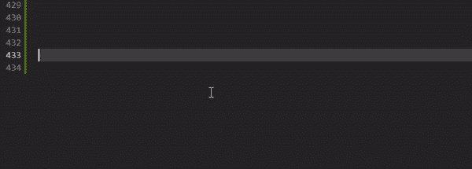
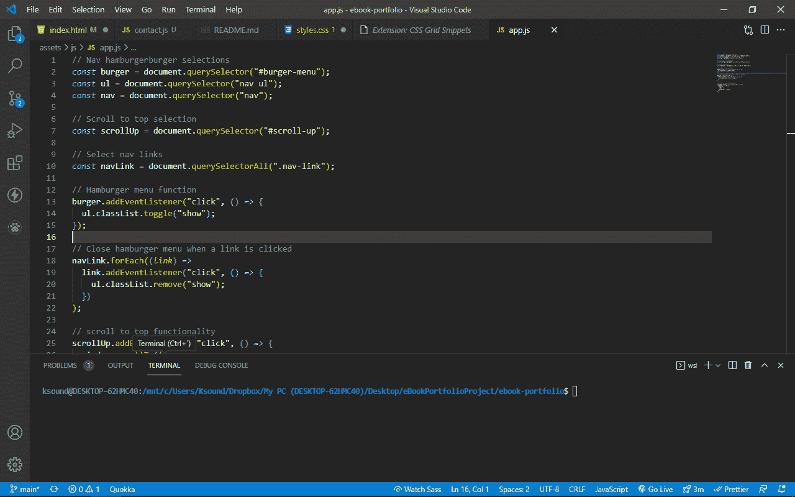
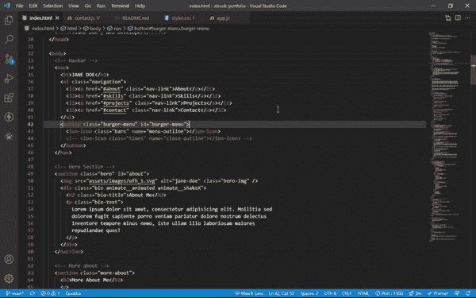
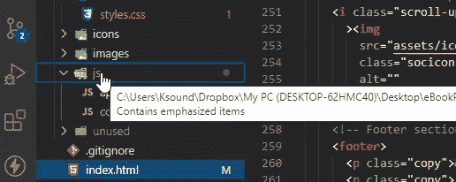
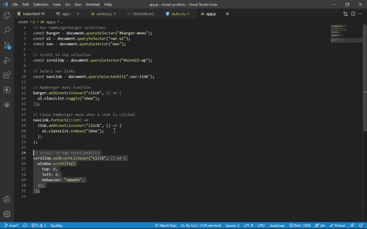

# 10 VS 代码扩展提高您的生产力

> 原文：<https://www.freecodecamp.org/news/10-vscode-extensions-to-increase-productivity/>

VS 代码最大的好处之一是丰富的扩展库，可以用来加速编码，让生活变得更轻松。

其中一些扩展是付费的，但是在 VS 代码市场上有大量免费的质量选项。

在这篇文章中，我将分享 10 个免费的给你阅读的乐趣。让我们开始吧。

## 1.VS 代码自动重命名标记

这个扩展允许您一次性重命名开始和结束标记。这意味着无论你从哪里选择重命名——无论是开始标签还是结束标签——你都不必回到另一个标签去做同样的事情。它只是自动为你重新命名。

## 2.在 VS 代码中更漂亮

“更漂亮”这个名字是不言自明的——这个扩展通过以一种可读性很强的方式格式化代码，使代码更漂亮。

您可以选择在保存或粘贴时格式化代码。

## 3.在 VS 代码中将像素转换为 Rem

有时候，你可能希望你的单位是 rem(根 em)而不是像素(px)，反之亦然。

好消息——你不需要自己做数学转换，因为这是这个扩展为你做的。

要从 rem 转换到 px，反之亦然，请按住 alt + z 键。

## 4.VS 代码 Flexbox 备忘单

Flexbox cheatsheet 扩展将方便的 Flexbox cheatsheet 直接引入 VS 代码。

您可以通过两种方式使用它:在 Windows 上按 Ctrl + Shift + P，在 Mac 上按 Cmd + Shift + P 来弹出它，或者您可以简单地将鼠标悬停在显示设置为 flex 的任何地方。

## 5.网格片段与代码扩展

Grid Snippets 扩展使您能够使用简单的快捷方式在 CSS Grid 中编码，为您带来代码片段。

这些快捷方式包括:

*   DG–显示网格
*   dig–显示内嵌网格
*   gg–网格间隙
*   GTC–网格-模板-列
*   GTA–网格-模板-区域

文档中还有许多其他快捷方式。

## 6.括号对着色机

我们的代码很容易被大括号弄糊涂。这个括号对着色程序通过给括号(括号、花括号、方括号)分配不同的颜色来减轻这种混乱。

你可以在下面的截图中看到，所有的牙套都有不同的颜色，所以你可以跟踪哪个是哪个。

## 7.VS 代码中的实时服务器扩展

我们必须重新加载浏览器才能看到对代码所做的更改的日子已经一去不复返了。

现在，你所要做的就是从 VS 代码市场安装 Live 服务器扩展，然后嘣！您所做的每个更改都会立即在浏览器中更新。

用 Live Server 打开的文件必须是 HTML 文件。此外，HTML 文件必须有开头和结尾的 head 和 body 标记。

## 8.VS 代码图标

VS 代码图标是我最喜欢的扩展之一。有了它，你可以看到你的文件图标用你编码的语言或者框架/库来表示。

## 9.波拉科德

这个扩展是一个非常有趣的工作。它可以让你对你的代码进行漂亮的截图。

要截屏，你只需在 Windows 上按 Ctrl + Shift + P，在 Mac 上按 Cmd + Shift + P，进入命令面板。然后你可以搜索“Polacode”并选中它。只需突出显示您想要截图的部分
，并按下类似相机的图标即可截图并保存在您的设备上。

## 10.代码时间

代码时间是一个扩展，可以帮助你在 VS 代码中跟踪你的进度和度量。

但这只是冰山一角。有了这个超级酷的扩展，你可以静音通知，连接一个空闲的工作空间，并设置你的存在，了解你的编码正常运行时间，你的进展，等等。

此外，你也可以邀请你的团队成员，这将有助于你发现会议或任何其他活动的影响。

安装后你会看到一个小脚状的图标。从那里，您可以探索所有的功能。令人惊讶的是，它是免费的！

我的朋友 Joy Shaheb 制作了这篇文章的视频版本。欢迎在 YouTube 上查看。

感谢您的阅读，祝您愉快。