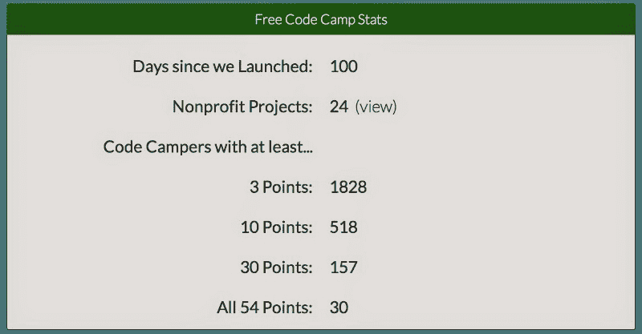
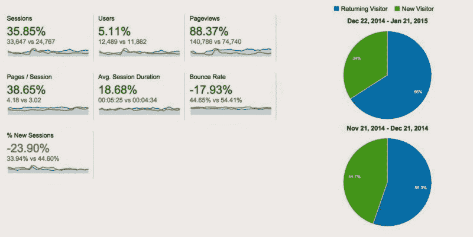

# 100 天免费代码营

> 原文：<https://www.freecodecamp.org/news/100-days-of-free-code-camp-df0c52553382/>

由免费代码营

# 100 天免费代码营

自从我们开始开发 humble Node.js 应用程序以来，地球已经旋转了 100 次，这个应用程序后来成为了自由代码营。在这段时间里，我们的程序员群体爆炸式增长，这主要归功于口口相传。我们没有给任何人打广告或支付任何费用。换手的只有知识和热情。

以下是营员社区通过挑战取得的最新进展:

我们的关键绩效指标不是我们有多少露营者，而是有多少坚持编码。

我们的分析将过去 30 天与之前 30 天进行了比较:

我们的分析似乎都在朝着正确的方向前进。这里展示的两个月的数据，构成了 Free Code Camp 迄今为止一半以上的生活。

万圣节之后发生了很多事。我们已经:

*   推出了 Gitter.im 聊天室，占所有 Gitter 账户的 4%
*   创建了一个由驱动的[话语论坛](http://www.discourse.org/)
*   改进我们的免费、交互式、基于浏览器的 JavaScript 课程。
*   开源我们的代码库，收到了来自我们的营员和善意的非营员的大量贡献

### 未来 100 天

以下是我们未来 100 天的工作重点:

#### 帮助营员完成非营利项目

我们已经开始了我们的首个非营利项目，并将在几周内将更多的营员与非营利利益相关者配对。我们乐观地认为，我们的非营利项目将产生一个开发者教育和社会公益的引擎，增加所有参与者的福祉。

#### 进一步提高自由代码营的可访问性

我们的一些营员是聋的或瞎的。他们帮助我们发现了易访问性的不足。作为一个社区，我们正在合作使自由代码营成为一个每个人都可以学习编码的地方。

#### 点燃篝火

我们正在构建 Bonfire:我们自己的浏览器内 JavaScript 挑战。这些挑战允许您在浏览器中编辑代码并安全地运行它。这个工具将会变得更容易创建 Codecademy 风格的交互式编码课程。

#### 在 Twitch.tv 上扩展我们的实时代码内容

我们每周[的现场 JavaScript Pair 编程](http://freecodecamp.com/live-pair-programming)会议的观众每周都在增加。我们希望扩展我们的 Twitch.tv 节目，以包含所有类型的编码，例如:

*   为开源库做贡献
*   关于编码挑战的结对编程
*   查看新库
*   构建基于浏览器的游戏

#### 非常感谢我们所有的营员！

尽管我们的许多营员已经完成了前 100 个小时的课程，但在为他们的第一份编码工作做准备时，还有很多工作要做。我们期待记录我们遇到的所有挑战，并在我们的博客上与我们的社区和其他学校分享。

同时，继续交新朋友，继续编码！