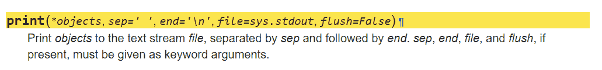
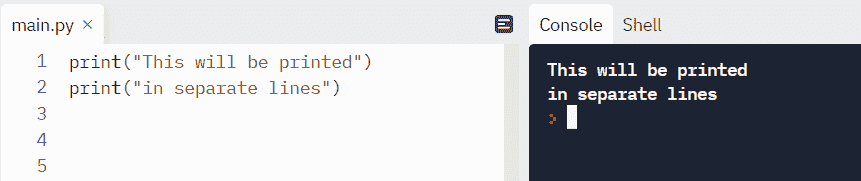
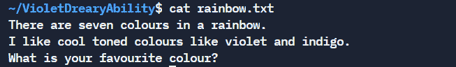
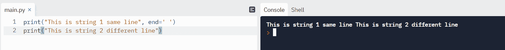
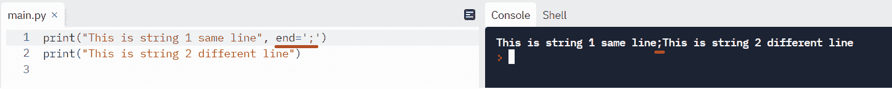
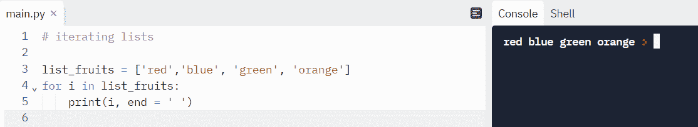
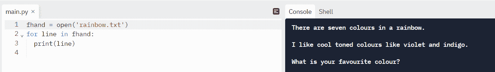
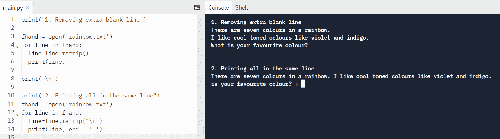

# 不换行的 Python 打印–在同一行打印

> 原文：<https://www.freecodecamp.org/news/python-print-without-new-line-print-on-the-same-line/>

`print`函数是 Python 中的一个重要函数，因为它用于将输出重定向到终端。输出也可以重定向到一个文件。

默认情况下，`print`函数每次都在新的一行上打印。这是由于 Python [文档](https://docs.python.org/3/library/functions.html#:~:text=print(*objects%2C%20sep%3D%27%20%27%2C%20end%3D%27%5Cn%27%2C%20file%3Dsys.stdout%2C%20flush%3DFalse))中对`print()`的定义。

## 为什么 Python 的`print`函数默认打印在新的一行？

在下面的代码片段中，我们可以看到默认情况下`end`的值是`\n`。这意味着每条打印语句都将以一个`\n`结尾。注意`\n`代表一个换行符。



Source: Python [documentation](https://docs.python.org/3/library/functions.html#:~:text=print(*objects%2C%20sep%3D%27%20%27%2C%20end%3D%27%5Cn%27%2C%20file%3Dsys.stdout%2C%20flush%3DFalse)).

让我们看一个打印函数的例子。

**代码示例:**

```
# using Print with default settings

print("This will be printed")
print("in separate lines")
```

**输出**:



在上面的例子中，由于定义:`end='\n'`，行将被单独打印。

## 如何在 Python 中打印同一行

有时，我们需要在同一行打印字符串。这在我们读取 Python 中的文件时特别有用。当我们读取文件时，默认情况下我们会得到一个空白。

让我们看一个例子。我们有一个名为`rainbow.txt`的文件，其内容如下所示:



Contents of file rainbow.txt

**代码:**

```
fhand = open('rainbow.txt')
for line in fhand:
  print(line) 
```

在上面的代码中，我们使用了一个文件处理程序`fhand`来访问文件。接下来，我们使用一个`for`循环遍历这些行。

**输出:**

当我们打印内容时，结果是这样的:


额外的空行是由于在文件中每行的末尾出现了`\n`,它将光标移动到下一行。最后，由于上一节讨论的`print`函数的行为，添加了空白行。

假设我们想删除这些。为此，我们可以做一些改变。为此，我们需要改变`print`的默认行为。我们将在接下来的部分中详细了解如何做到这一点。

### 选项 1–如何修改`print`函数中`end`的值

让我们自定义`print`函数中`end`的值。我们将它设置为`' '`，这是一个空格。

**代码示例:**

```
# Customizing the value of 'end'

print("This is string 1 same line", end=' ')
print("This is string 2 different line") 
```

**输出**:



现在我们可以看到，我们告诉 print 函数在末尾添加一个空白字符，而不是一个新行`(\n)`。

我们还可以提供另一个字符来代替空格，如下所示:

```
# Customizing the value of 'end' with a custom separator

print("This is string 1 same line", end=';')
print("This is string 2 different line") 
```

**输出**:



*用法:*上面的例子只是用你选择的分隔字符在同一行打印的一种方式。

让我们看另一个例子。我们可以遍历一个条目列表，并用`end = ' '`将它们打印在同一行。

```
# iterating lists

list_fruits = ['red','blue', 'green', 'orange']  
for i in list_fruits:  
    print(i, end = ' ') 
```

**输出:**



### 选项 2——使用`rstrip()`删除文件中的空白

我们可以使用`strip()`删除字符串中的某些字符。默认情况下，文件中的每一行末尾都有`"\n"`。由于我们只关心右边的字符，我们将使用`rstrip()`，它代表右移。接下来我们讨论一个`rstrip()`的例子。

你可以在这个博客[帖子](https://www.freecodecamp.org/news/python-strip-how-to-trim-a-string-or-line/)中了解更多关于`strip()`方法的信息。

## 回到我们的文件打印例子

还记得吗，我们讨论了一个打印额外行的文件打印示例:



让我们使用`rstrip()`稍微修改一下代码。

```
print("1\. Removing extra blank line")

fhand = open('rainbow.txt')
for line in fhand:
  line=line.rstrip()
  print(line)

print("\n")

print("2\. Printing all in the same line")
fhand = open('rainbow.txt')
for line in fhand:
  line=line.rstrip("\n")
  print(line, end = ' ') 
```

#### 输出

首先，我们用`rstrip()`去掉了多余的空格。在下一步中，我们用`rstrip("\n")`和`end=' '`再次删除了尾随行，以在一行中获得输出。



## 包扎

我们已经看到了如何用 Python 打印而不需要新的一行。我们还看到了如何在一个文件中打印行而不需要额外的尾随行。我希望这篇教程对你有所帮助。

在 [Twitter](https://twitter.com/hira_zaira) 上与我分享您的想法！

你可以在这里阅读我的其他帖子[。](https://www.freecodecamp.org/news/author/zaira/)