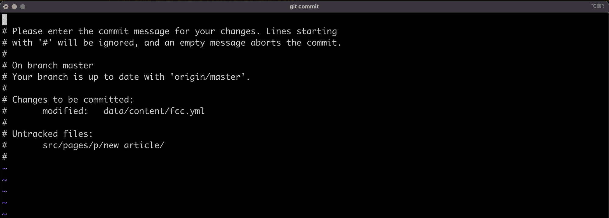
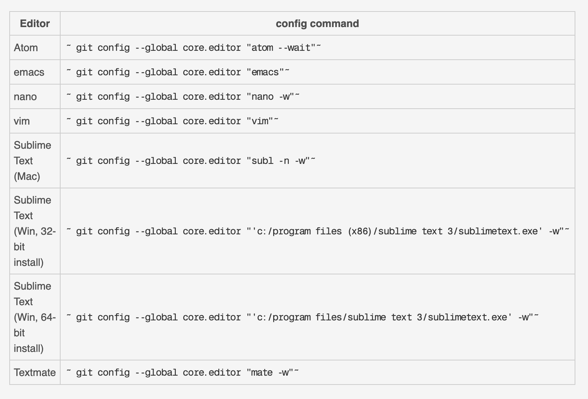

# git 配置——如何配置 Git 设置来改进您的开发工作流程

> 原文：<https://www.freecodecamp.org/news/git-config-how-to-configure-git-settings/>

`git config`是 Git 中一个强大的命令。您可以使用 Git 配置文件定制 Git 的工作方式。

这个文件存在于 Git 初始化的项目级(`/project/.git/config`)或者根级(`~/.gitconfig`)。如果没有指定配置，Git 将使用默认设置。

在本文中，您将了解一些有用的 Git 配置，它们可以改进您的开发工作流。这里分享的建议是对我有用的。看完还有更多的可以尝试。

# Git 配置技巧

这里有一些全局 Git 配置技巧。

## 1.选择 Git 的默认编辑器

当您尝试在 Git 中提交时，默认情况下，它会打开一个类似下面的`vi`编辑器:



这个编辑器可能很难使用，如果你像我一样，你可能想使用你喜欢的编辑器来编写提交。在您的`~/.gitconfig`文件中，添加以下内容:

```
[core]
    editor = code --wait 
```

或者使用以下 shell 命令:

```
git config --global core.editor "code --wait" 
```

这个配置告诉 Git，对于提交和标记之类的操作，我想使用我的 [VSCode 编辑器](https://code.visualstudio.com/)。

对于其他类型的编辑器，请参考这张来自 [Atlassian](https://www.atlassian.com/git/tutorials/setting-up-a-repository/git-config) 的图片:



Editor configurations for git from [git config | Atlassian Git Tutorial](https://www.atlassian.com/git/tutorials/setting-up-a-repository/git-config)

## 2.获取过程中的 Git 修剪

你知道修剪命令在获取时做什么吗？如果没有，您可能想先看看这篇文章，它介绍了如何使用 prune git 选项和 branch delete 命令来[删除过时的本地分支。](https://dillionmegida.com/p/delete-outdated-branches/#git-fetch---prune)

TLDR:fetch 期间修剪是一种清理方法，当你执行`git fetch --prune`时，它会删除你的`.git`目录中过时的远程引用。

正如我在我刚刚链接的文章中解释的那样，您可以自动完成这项工作，而不必总是添加`--prune`选项。为此，将以下内容添加到`~/.gitconfig`:

```
[fetch]
    prune = true 
```

或者使用以下命令:

```
git config --global fetch.prune true 
```

有了这个，每当你做`git fetch`的时候，修剪就会发生。

## 3.Git 别名

在 Git 配置文件中，您可以不时地为那些长命令添加别名。例如，提交、存储等等。

假设您想要添加一个别名来添加一个空提交。在这种情况下，您可以将以下内容添加到配置文件中:

```
[alias]
    empty = "git commit --allow-empty" 
```

或者在终端中:

```
git config --global alias.empty "git commit --allow-empty" 
```

您可以像这样使用命令:

```
git empty "Empty commit" 
```

您还可以在 Git 之外添加其他 shell 命令作为别名。例如，删除已在远程中合并的本地分支的别名:

```
[alias]
    delete-local-merged = "!git fetch && git branch --merged | egrep -v 'master' | xargs git branch -d" 
```

感叹号“！”告诉 Git 将其作为 shell 命令而不是`git *`命令运行。

对于别名，我们进行 git 提取。然后我们得到合并的分支，通过管道将其作为 egrep 命令的输入，过滤掉“主”分支，并删除分支。

## 4.设置默认分支

初始化存储库(`git init`)时，默认分支是`master`。今天，一些开发者更希望是`main`或者其他什么完全不同的地方。

您不必创建一个名为`main`的新分支，删除`master`分支，并使用`main`作为您的默认分支。那是一个漫长的过程。在 Git 配置文件中，您可以在 Git 初始化时设置一个默认分支。方法如下:

```
[init]
    defaultBranch = main (or whatever name you want) 
```

这样，`git init`将创建一个“主”分支作为默认分支。

## 5.默认情况下显示短状态

默认情况下，`git status`命令会向您展示项目中的变更，并提供详细信息。是这样的:

```
On branch [branch name]
Your branch is up to date with ...

Changes not staged for commit:
  (use "git add <file>..." to update what will be committed)
  (use "git restore <file>..." to discard changes in the working directory)
    modified: ...

Untracked files:
  (use "git add <file>..." to include in what will be committed)
    ...

no changes added to commit (use "git add" and/or "git commit -a") 
```

这是一个有用的输出，带有说明，但是有时您只需要一个存储库状态的摘要。添加到`git status`的`--short`选项给出一个简短的格式化输出。结果将如下所示:

```
M [file]
?? [file] 
```

“M”表示修改过的，而“？?"意味着未被追踪。我们可以通过使用以下配置使其成为默认状态视图来进一步改进此流程:

```
[status]
    short = true 
```

# 结论

在这个不完整的列表中，我们看到了五种通过定制 Git 默认工作方式来改进开发工作流的方法。

您可以在 [git-config 文档](https://git-scm.com/docs/git-config)中找到关于所有 Git 配置选项的更多信息(从分支到拉取、到获取等等)。