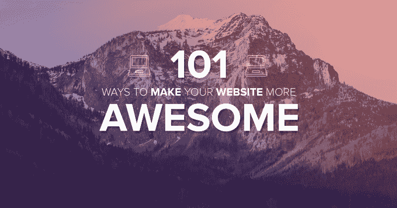

# 让你的网站更棒的 101 种方法

> 原文：<https://www.freecodecamp.org/news/101-ways-to-make-your-website-more-awesome-79c934dd2a11/>

尼古拉斯·塔尔特

# 让你的网站更棒的 101 种方法

This article was originally published on [Bundlify](https://bnd.li/awesite).

上周我和一个老客户聊天，她说，“尼克，我知道我需要网站方面的帮助，但我不确定我需要什么。”

所以我四处打听。朋友、家人、其他非互联网行业人士。他们都说了同样的话:

> “我需要一份清单。我不知道如何建立一个网站。所以我需要雇人。但我还是想知道涉及到了什么。”

所以我开始列出我们在 AwesomeWeb 上做过的所有事情(以及一些我们没有做过的事情)。

这是我的承诺…

…如果你解决了列表中的所有问题，你将拥有一个你所在行业中最好的网站。

你怎么知道的？

在 AwesomeWeb，我审查了 1000 多名世界上最好的自由职业者。据我所知，我从来没有见过一个网站可以勾选每一个框。

作为一个企业主，使用这个列表来知道需要做什么。将它发送给你的设计者或开发者。你甚至可以自己修理其中的一些。

作为一名自由职业者，使用这个列表让你创造的一切更棒。回去对老客户说:

“我回顾了我们构建的内容，并注意到我们可以修复这个、这个和这个。我可以花 500 美元、1000 美元、5000 美元来做这件事，你可以期待这些结果……”

重点是…

…我想帮你让网络变得更棒。从这个列表开始。

### 令人敬畏的品牌

1.  弄个**职业 logo** 。很难找到一个网站或博客有一个伟大的标志。所以这是一个建立即时可信度的好方法。
2.  上传一个 **retina-ready favicon** (浏览器标签上的方形图标)。大多数网站都有 16×16 像素的图标。在视网膜屏幕上，它们是模糊的。使用 [X 图标编辑器](http://www.xiconeditor.com/)生成一个 64×64 像素的图标。
3.  始终使用**视网膜就绪图像**。简单地确保图像是其容器的两倍大，然后缩小它。
4.  最多使用**2–3 种颜色**。你应该有一个背景色，一个行动号召色，和一个强调色。
5.  选择调色板时，从**互补色或三原色**开始。从那里开始调整。好的颜色组合给你一个讲述故事的设计。
6.  **切勿使用真黑** (#000000)。纯黑不存在所以在网上看起来格格不入。事实上，黑色总是另一种颜色的暗色调。
7.  如果你想让你的设计有个性，千万不要使用中灰色(例如#cccccc)。添加黄色以提供温暖，添加红色以赋予活力，添加蓝色以创造信任。

### 超赞的排版

1.  选择一种**高级字体**。使用类似于[类型工具包](https://typekit.com/)的服务。据说 95%的网络都是排版。使用优质字体是给人留下好印象的最简单、最便宜的方法。
2.  最多使用**2–3 种字体**。更多的是混乱和缓慢的加载时间。选择标题字体和段落字体。如果你想要一种特殊情况下的字体，再来一个。
3.  将字体大小设置为最小**16px**。任何更小的东西都难以在大显示器上阅读。在移动设备上缩小到 12px。
4.  选择一种**排印比例**,比如扩大的四分之一、完美的五分之一或黄金比例。使用标尺来设定段落文本、H4、H3、H2 和 H1 的字体大小。根据这个比例确定行高和文本边距。
5.  设计其他**排版元素**，如块引号、项目符号列表、编号列表、标题、帮助文本、提醒、高亮文本、代码示例、缩写，甚至地址。
6.  安装一个**自定义图标字体**，比如[字体 Awesome](https://fortawesome.github.io/Font-Awesome/) ，而不是将图像用于社交媒体徽标、导航按钮和交互式图形等常见元素。图标字体加载速度更快，无休止地缩放，并让你自由地改变它的颜色。

### 令人敬畏的布局

1.  使用三分法则的**进行基本布局。将你的布局水平和垂直分成三份，然后在线条相交处对齐关键的焦点。**
2.  用网格系统保持垂直网格。将你的界面分成 8 列、12 列、16 列布局，各列之间留有足够的间距。
3.  用**基线网格**保持一致的垂直节奏。文本行之间的间距和内容块之间的间距一样重要。每行文本都应该有一个位于基线上的边距底部。
4.  **留白**奢华。它的存在是为了创造呼吸空间和平衡。把你的读者的眼睛吸引到最重要的东西上。
5.  平衡网站的视觉元素，如按钮、输入、表格、标题等。你应该能够模糊你的眼睛，跟踪你希望你的用户走的路。

### 令人惊叹的用户界面

1.  使用大而粗的**行动号召按钮**。每一页都应该有一个目标。几乎总是点击一个按钮。确保那个按钮不会被遗漏。
2.  将**悬停和活动状态**添加到链接、按钮、输入和文本区域。如果你选择在鼠标悬停时让按钮变亮，你也应该让链接和输入的边框变亮。
3.  与**形式造型**一致。所有的文本区域和输入字段应该有相同的样式。相同的边框颜色、背景颜色、悬停时、活动时、占位符文本、活动文本等。确保 tabindex 设置正确，以便您可以按正确的顺序浏览它们。
4.  改变**访问过的链接**的颜色，让用户知道他们以前去过那个页面。
5.  一旦你有了自己的 logo、颜色、排版、布局和图片尺寸，就建立一个**风格指南**。好的用户界面是由风格一致的组件构建的。

### 出色的用户体验

1.  将**微交互**添加到按钮和其他字段。例如，点击“上传”按钮后，它应该变成“上传”或“处理中”。
2.  **无滚动顶起**！千万不要弄乱浏览器的默认行为。你可能认为滚动速度是正常速度的两倍很好，但事实并非如此。
3.  去掉你的主页滑块。它们减少了转换，有更好的方法在小空间里显示更多的信息。
4.  永远不要使用迎宾门。当第一次访问你的主页时，用户希望看到你的主页。
5.  使用**标题、副标题、前导段落、列表和标题**使你的内容易于浏览。大多数访问网页的人在决定阅读之前都会浏览一遍。
6.  将**描述性占位符文本**添加到所有表单、输入和下拉列表中。如果你想让某人以某种方式填写某个字段，告诉他们。对于下拉或选择字段，使第一个选项具有描述性。“选择年份”比“2016”好。
7.  在您的表单上添加 **HTML5 验证**，以便在用户尝试提交表单后，当表单中出现错误时，能够清楚地显示出来。
8.  通过避免模糊的链接名称，减少混乱，使用标点符号，保持简单的布局，在图像中添加替代文本，使用更大的文本，以及保持文本和背景颜色之间的高对比度，使您的网站**对视觉障碍者**来说是可访问的。
9.  检查你的网站是否有**与【BrokenLinkCheck.com】和[断开的](http://brokenlinkcheck.com/)**链接。修复断开的链接，这样当人们点击它们时就不会生气。

### 惊人的发展

1.  确保你的网站是**移动优化的**，以便在任何设备上显示。适当的移动优化网站加载更快，排名更高，给你的用户更好的体验。
2.  生成并**显示最佳图像尺寸**。如果你上传了一个大图片，比如一篇博文的特写图片，并且你想在网站的其他地方显示它，比如侧边栏，确保你显示的是图片的缩略图而不是全尺寸图片。
3.  添加 **alt 和 title 标签到所有图片和链接**。如果由于某种原因，图像无法加载，你的网站将显示替代文本。另外，当您将鼠标悬停在链接上时，浏览器会显示该链接的标题标签。
4.  用`<strong<`和`<em>`代替`<b>`和`<i>`来加粗和斜体文本。两者效果相同，但有本质区别。`<b>`是一种风格。强表示应该如何理解某事。
5.  **修复马虎的 HTML** 。当你复制粘贴内容到一个所见即所得的编辑器中时(就像 WordPress 中的可视视图)，它会增加许多不必要的跨度和内嵌样式。随着时间的推移，你的网站将变得不可读。
6.  说到这里，**从你的 HTML 中移除内嵌样式**。99%的情况下，您的样式规则应该放在一个 CSS 文件中，这样您就可以同时更新组件的所有实例，而不是逐页、逐行更新。
7.  使用 **Sass 变量**而不是 CSS 来保持整个站点的颜色和其他组件一致。想改变一种颜色和该颜色的每一个阴影？更新一行而不是几百行。
8.  **链接到永久链接而不是网址**以防你转换域名。比如链接到某个页面，你的 HTML 应该是，< a href="/slug-goes-here" >而不是<a href = " http://domain . com/slug-goes-here ">。图像源和 CSS 背景也是如此。如果你不这样做，并把网站放在一个新的领域，你所有的来源将链接到不再存在的网页和文件。
9.  开发一个**定制插件**或工具，为你的网站提供独特的功能。定制软件很难维护，但会给你一个相对于类似网站的竞争优势。
10.  通过确保你的网站在 Chrome、Firefox、Safari、Internet Explorer 和其他浏览器中正常显示来测试跨浏览器兼容性。众所周知，旧版 IE 浏览器在显示网站方面表现不佳。使用[浏览器堆栈](https://www.browserstack.com/screenshots)并手动检查。
11.  使用 W3C 的 **标记验证服务**在你的 HTML 中找到明显的错误。请记住，大多数网站没有完全有效的 HTML。这不是首要任务，但如果有任何错误，它会给你一个很好的感觉。
12.  建立一个**临时环境**来改变你当前的网站。理想情况下，你应该有一个生产站点，每个人都可以看到，还有一个中转站点，开发者可以在那里进行修改。一旦变更准备就绪，就将试运行站点推向生产。
13.  在版权页脚显示**当前年份。当你看到一个有旧版权的网站时，你会认为它不再活跃了。使用 PHP 或类似的脚本显示当前年份，而不是静态文本(例如`<建立年份> — <当前年份>`)。**

### 令人敬畏的搜索引擎优化

1.  选择**你希望该页面排名的每页关键词**。专注于优化该关键词页面的各个方面。不是那种把这个关键词放在每个句子里的感觉。只要聪明地知道你希望它如何排名。
2.  在每一页上设置关键词丰富的标题标签。标题在谷歌搜索结果中显示为蓝色链接。限制在 55 个字符以内。
3.  每页包含一个且**只有一个 H1 标签**。在大多数情况下，这将与您的标题标签相同。
4.  在你的页面内容中包含大量的 H2、H3 和 H4 的作品，以创建副标题和视觉层次。
5.  通过在标题、H1、副标题和前 1/3 的内容中包含关键词来优化你的页面。
6.  您的**元描述**在搜索结果中显示为链接下的描述。确保你把它放在每一页上，并且包括关键词。
7.  您的 **permalink** ，即域名后的 URL(即 domain.com/permalink-here/)，应包含由破折号分隔的关键字短语。
8.  谷歌在其算法中考虑了域名年龄，因为注册多年的域名可能是更高质量的资源。提前几年注册你的域名。如果你的域名注册了 10 年，那么你对你的生意是认真的。
9.  平均而言，任何给定关键字在 SERP(搜索引擎结果页面)上的第一个结果都指向每页超过 2000 字的页面。当你写一篇博客或者创建一个你想排名靠前的页面时，试着达到至少 2000 字。
10.  总是**创建一个 sitemap** 作为一个 sitemap.xml 文件，并把它放在你的根目录下，这样它会显示在 domain.com/sitemap.xml.上，它会告诉谷歌你所有页面的位置，当你添加新内容时，它会自动更新。通过[站长工具](https://www.google.com/webmasters/tools/home?hl=en)提交给谷歌。
11.  添加你的网站**谷歌网站管理员工具**，这样你就可以看到谷歌如何索引你的网站，如果有任何关键问题，你可以随时更新。
12.  为了帮助您的图像排名，在上传到您的网站之前，请务必**重命名您的图像**和其他文件(例如，rank _ for _ this _ keyword _ phrase . png)。
13.  在你的网站上包含一个 **robots.txt** 文件，告诉网络爬虫应该和不应该索引哪些页面。
14.  添加一个**规范重定向**来将非 www 指向你的网站的 www 版本，反之亦然。
15.  研究并整合每个页面上的 **LSI 关键词**(潜在语义索引)，帮助页面对主要关键词短语进行排名。通过谷歌搜索你的关键词短语和搜索“与…相关的搜索”链接找到 LSI 关键词。
16.  确保主动**链接你的内容**。你网站上的每一页都应该可以通过三次或更少的点击进入主页。
17.  在相关页面上添加**结构化数据**，帮助谷歌正确索引你的内容。需要自定义结构化数据的页面类型包括人员、产品、事件、组织、电影、书籍和评论。使用[模式创建器](http://schema-creator.org/)生成结构化数据。
18.  查看谷歌的 **页面速度洞察**，确保你已经解决了所有降低页面速度的常见问题。你的网站加载越快，排名就越高。

### 惊人的页面速度

1.  保持**页面重量在 2MB** 以下。使用 tools.pingdom.com[来检查你的主要登陆页面的页面权重。任何超过 2MB 的都太重了。](http://tools.pingdom.com/)
2.  将**页面请求保持在 50** 以下。任何给定页面上的每个文件和图像都是一个 HTTP 请求。请求数量越少，加载速度越快。平均每个网页有 70 个请求。使用 [GTmetrix](https://gtmetrix.com/) 查看您的请求。
3.  用 **CSS 代替背景图片**设计页面元素。不要用图像来显示按钮、表单或网站上的其他常见组件。CSS 加载速度更快，在响应性布局方面更灵活。
4.  在上传图片到你的网站之前，优化图片。像 [TinyPNG](https://tinypng.com/) 这样的工具可以在不损失分辨率或图像质量的情况下，将图像文件大小减少 80–95%。
5.  建立一个**内容交付网络**，在全球多个地点托管您的图像和其他更大的文件。CDNs 根据访问者的实际位置，从位置合理的服务器上存储和传送您的文件，以最大限度地提高加载速度。
6.  在将文件上传到网站之前，使用编译和压缩工具缩小 JavaScript、HTML 和 CSS。对于 JavaScript，使用[闭包编译器](https://developers.google.com/closure/compiler/)。对于 HTML，使用 [HTML Minifier](http://www.willpeavy.com/minifier/) 。对于 CSS，使用 [YUI 压缩机](http://yui.github.io/yuicompressor/)。
7.  将**呈现阻塞 JavaScript 移动到页脚**。唯一应该放在页眉中的脚本是那些直接影响页面设计的脚本(例如自定义字体)。
8.  **避免登陆页面重定向**。重定向会触发一个额外的 HTTP 请求，从而延迟页面呈现。
9.  通过为不经常更新的页面和页面类型设置到期日期，利用**浏览器缓存**。浏览器缓存指示浏览器从本地磁盘而不是通过网络加载以前下载的页面。
10.  在您的服务器配置中启用 **gzip 压缩**。压缩可以减少 90%的传输响应时间，从而缩短首次呈现页面的时间。
11.  在您的服务器设置上启用 **Keep-Alive** 以允许同一个 TCP 连接发送和接收多个 HTTP 请求，从而减少后续请求的延迟。
12.  升级到**专用服务器**或高级托管服务，以改善服务器响应时间。当你使用一个共享的主机环境时，你的站点通常是同一服务器上数百个站点中的一个。如果这一百个网站中的任何一个流量过大，都会降低你的页面速度。

### 超棒的平面设计

1.  获得**定制电子书封面**作为您的选择加入奖励。创建它们并不困难，而且可以极大地提高你的转化率。
2.  为你的主页或销售页面设计一个**自定义图形或插图**。专门为你的网站制作的精美插图是让你的网站更加令人难忘的简单方法。
3.  创建一个定制的或一系列定制的**博客文章特征图像设计**。这是在脸书、推特、Pinterest 等网站上传播的图片。当用户看到与一篇博客文章相关联的某种类型的图像时，他们应该知道这是你写的。
4.  为你自己和你团队的每个成员显示自定义的**头像插图或漫画**。每当你的团队中增加一个人时，定制漫画比雇佣一名专业摄影师更便宜。另外，这也是送给新队员的一份不错的礼物。
5.  以视觉方式展示数据和其他内容的定制信息图比同等的博客文章更容易获得流量。人们喜欢在像 Pinterest 这样的网站上分享信息图，或者在他们自己的网站上重新发布信息图，并通过反向链接回到你的网站。
6.  如果你制作一个视频或一系列视频，你应该有一个**自定义的视频介绍和/或结尾**来给它一个专业的感觉。更不用说其他有助于你的品牌脱颖而出的视频图形或动画了。

### 令人敬畏的网络安全

1.  安装一个 **SSL 证书**以允许从 web 服务器到浏览器的安全连接。如果你接受信用卡，大多数结账软件需要 SSL 证书。谷歌说 SSL 证书会提高你的搜索排名。
2.  保持您的**软件和插件更新**。当 WordPress 和其他 CMS 软件发布更新时，通常是为了修补漏洞。如果你不这样做，你的网站被黑只是时间问题。
3.  为你的管理页面设置一个双重认证登录门。大多数黑客从登录页面开始。
4.  检查并**移除恶意软件**。如果你的网站以前被黑客攻击过，他们很可能添加了不容易找到的损坏文件。如果你不及时删除，你的网站可能会被谷歌列入黑名单，影响你的排名，并在用户访问时警告他们离开。
5.  切勿将您的**管理员用户名**保留为“admin”。删除默认的管理员帐户，并用不同的用户名创建一个新帐户。
6.  定期**备份你的数据库和网站文件**。大多数备份软件和插件只备份你的数据库，其中包括数据和内容。但是如果你丢失了你的站点，你需要备份文件来恢复它。

### 精彩内容

1.  创建一个自定义的**错误 404 页面**，当用户试图访问一个不存在的页面时，这个页面就会显示出来。使用 404 页面引导他们回到主页或帮助他们找到他们想要的东西。
2.  除了你的主页，你的关于页面的**可能是你网站上访问量最大的页面。确保它能很好地代表你和你的公司。**
3.  一个**联系页面**会帮助人们联系你，但它也会在你、你的访问者甚至谷歌之间建立信任。当确定如何对你的网站进行排名时，机器人会找到你的联系页面，并寻找电子邮件、电话号码和地址。联系信息告诉谷歌，该网站稍微更值得信赖。
4.  在你的网站上有策略地散布选择加入表单是好的，但是拥有一个除了高转化率选择加入之外什么都没有的**挤压页面**也是聪明的。当你想让某人订阅时，链接到那个页面。
5.  当有人订阅你的列表时，确保你把他们发送到一个**确认页面**，要求他们确认他们的电子邮件。如果他们不马上确认他们的电子邮件，他们可能会忘记这件事，再也不会回来。
6.  在他们点击电子邮件中的确认链接后，将他们发送到一个**感谢页面**，在那里他们可以看到接下来的内容。这是一个每个订户都会看到的页面，而且他们只会看一次，所以这是一个给他们交易或鼓励他们购买的绝佳机会。
7.  你的网站或主题应该有一个**登陆页面**模板，当你需要你的用户采取特定行动时，你可以使用它。
8.  如果你卖东西，确保你有一个好看的**销售页面**。从一个标题开始。为你的推销腾出空间。也许可以添加一个销售视频。并在页面底部引导人们购买。

### 超赞的社交媒体

1.  限制你的帖子和页面上社交媒体按钮的数量，因为每个按钮运行一个脚本会增加页面的额外加载时间。仅包括 1-5 个按钮，例如脸书、Twitter、LinkedIn、Pinterest、Google+等。你的内容最常被分享的地方。
2.  为你的脸书页面、Twitter 账户和 YouTube 频道创建**社交媒体图片**。自定义图形会立即给人留下积极的印象，鼓励首次访问者喜欢、关注和订阅您的页面、个人资料或频道。
3.  设置**脸书开放图元标签**以确保你的内容在脸书上被正确分享。使用[脸书调试器](https://developers.facebook.com/tools/debug/)检查你的主页、帖子和其他页面，看看当有人分享那个 URL 时它们是如何显示的。
4.  设置 **Twitter 卡**以便当您网站上的 URL 被共享时，自动将丰富的照片和视频附加到您的推文中。点击这里，开始使用[的推特卡。](https://dev.twitter.com/cards/getting-started)
5.  设置 **Google+ Snippets** 来定制当你的网站在 Google+上被共享时人们看到的内容。使用[代码片段向导](https://developers.google.com/+/web/snippet/)来生成代码。即使你的网站没有得到很多 Google+的喜爱，Google 也会知道你是否正确地添加了元数据，这应该有一定的分量。
6.  收起你网站上链接到你个人资料的社交媒体图标。让它们变小或者只在页脚显示。社交媒体营销的目的是让人们回到你的网站，而不是相反。

好吧，我错过了什么？作为一名自由职业者或企业主，你有什么办法让你的网站更棒吗？

我很想听听你的反馈。留言或推文 [**@wntart**](https://twitter.com/wntart) 。

如果你觉得应该有更多人看到这个榜单，请推荐。让我们让网络变得更棒！

干杯，
尼克

**附言**如果你需要这份清单上的任何帮助，[在这里](https://www.awesomeweb.com/skill/web-design)雇佣设计师，[在这里](https://www.awesomeweb.com/skill/web-development)雇佣开发者。我们有世界上最好的自由职业者，他们很乐意帮忙！

如果你想以自由职业者的身份加入 AwesomeWeb 以获得更多客户，请在这里注册。