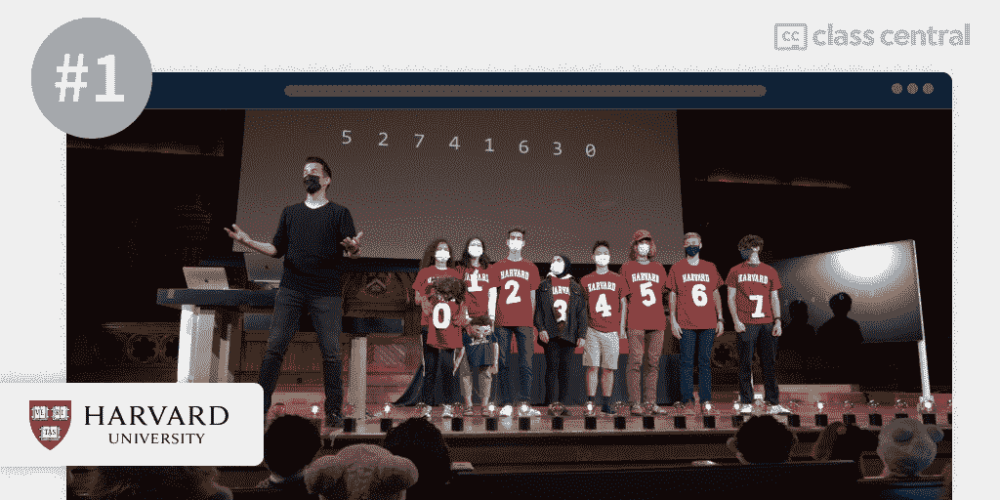
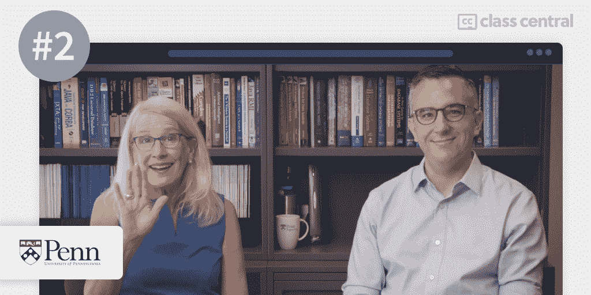
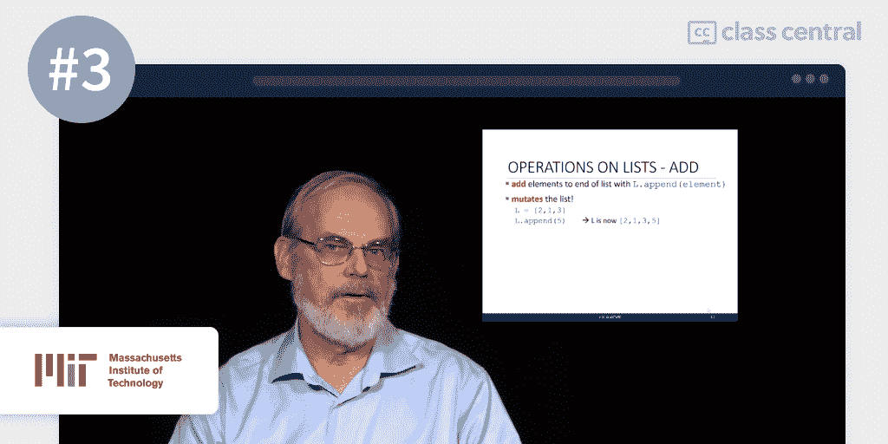
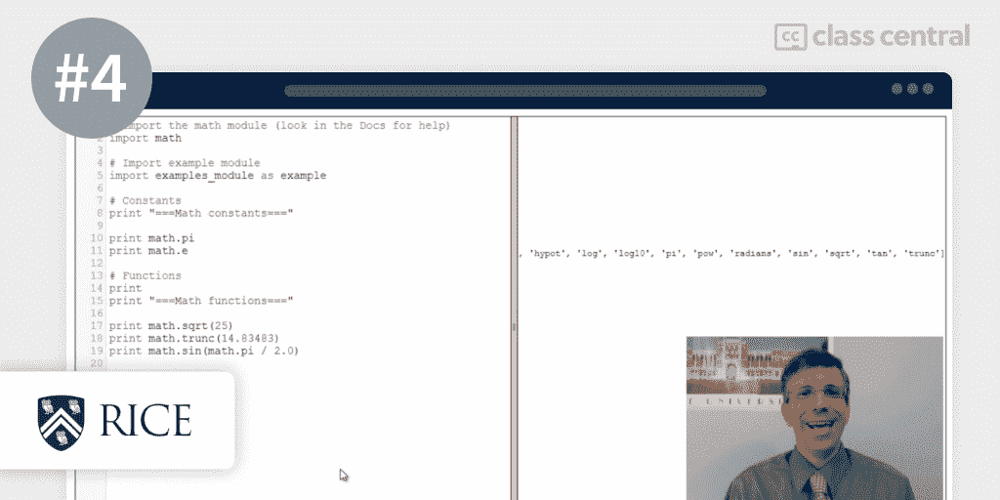
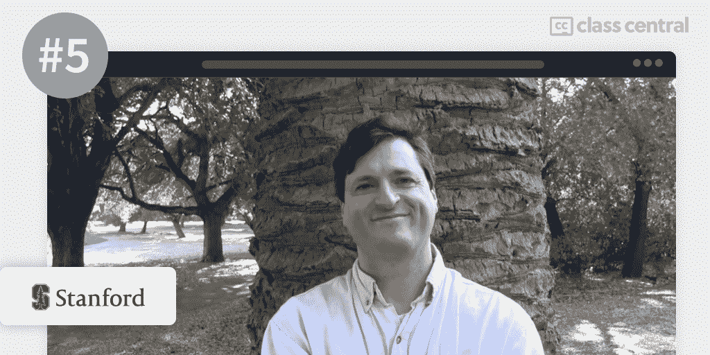
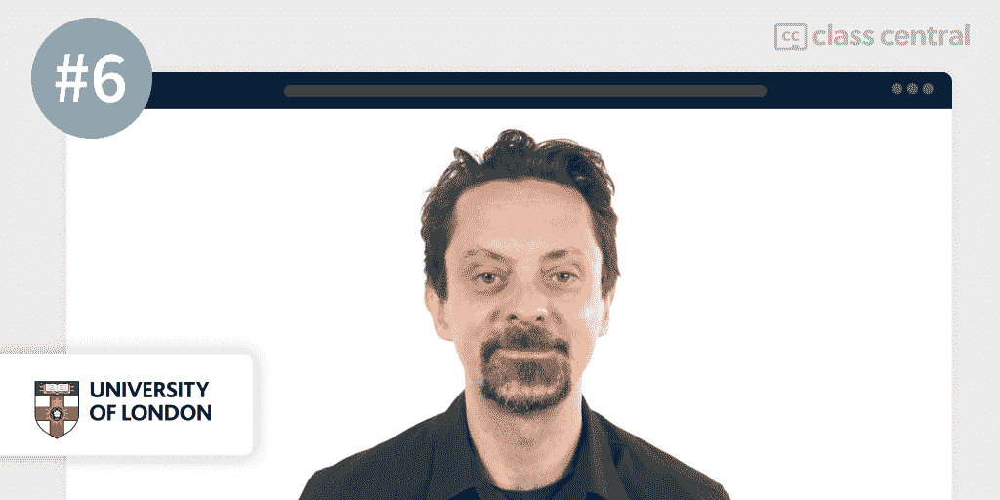
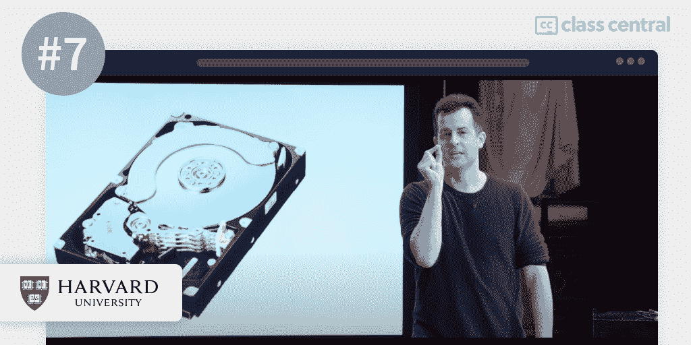
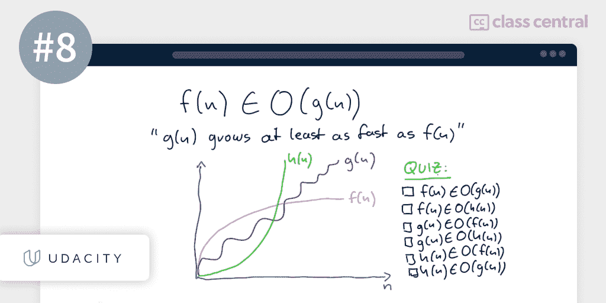
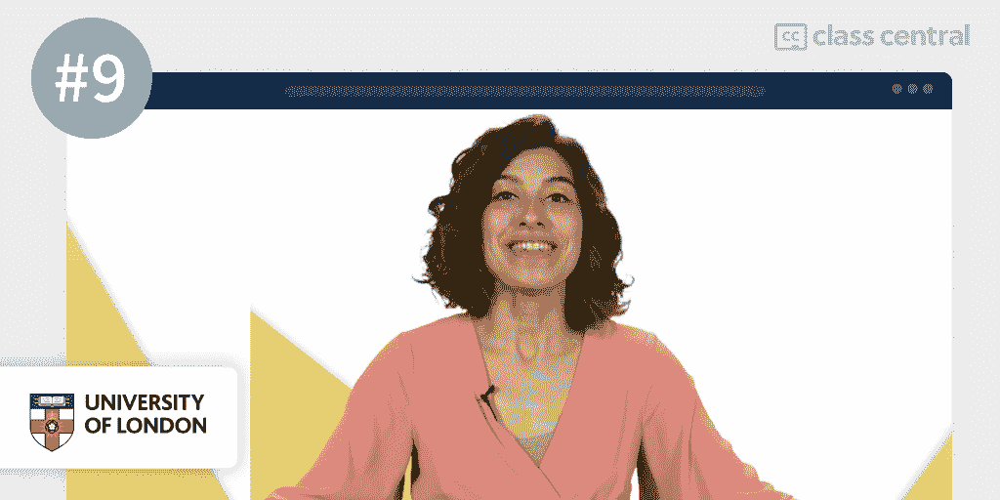
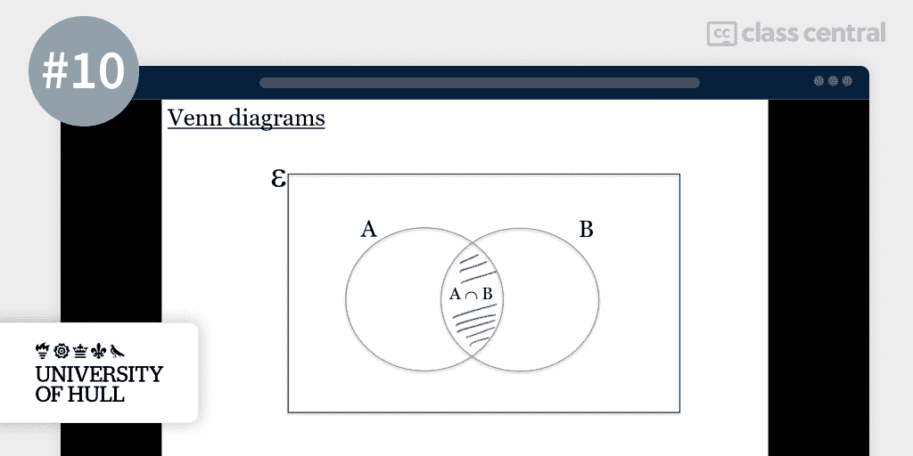

# 2022 年 10 门最佳计算机科学课程

> 原文：<https://www.freecodecamp.org/news/best-computer-science-courses/>

你在寻找计算机科学的最佳入门书吗？我按照一种可靠的方法，对网上的顶级课程进行了排名。而且都是免费查账。你可以在下面了解一下。

但是如果你赶时间，这里是我的首选。点击其中一个，跳到课程详情:

| **排名&课程** | **工作量** | **简而言之** |
| [1。CS50 的计算机科学导论(哈佛)](#1-cs50-s-introduction-to-computer-science-harvard-university-) | 100-200 小时 | 全面、超高质量的 CS 调查。 |
| [2。解决问题的计算思维(佩恩)](#2-computational-thinking-for-problem-solving-university-of-pennsylvania-) | 70 小时 | 获得解决问题的心态和方法。 |
| [3。计算机科学和使用 Python 编程简介(麻省理工学院)](#3-introduction-to-computer-science-and-programming-using-python-massachusetts-institute-of-technology-) | 80-140 小时 | 通过 Python 的镜头进行全面的 CS 调查。 |
| [4。【莱斯计算原理】](#4-principles-of-computing-part-1-rice-university-) | 40 小时 | CS 基础知识的实践概述，如概率。 |
| [5。计算机科学 101(斯坦福)](#5-computer-science-101-stanford-university-) | 36 小时 | 主要 CS 主题的调查，包括网络。 |
| [6。计算机如何工作(UoL)](#6-how-computers-work-university-of-london-) | 40 小时 | 计算机功能的自下而上视图。 |
| [7。CS50 的理解技术(哈佛)](#7-cs50-s-understanding-technology-harvard-university-) | 36 小时 | 技术基础，如果你还没有准备好主要的 CS50。 |
| [8。理论计算机科学导论(Udacity)](#8-intro-to-theoretical-computer-science-udacity-) | 25 小时 | 复杂性和可计算性理论。 |
| [9。计算机科学数学(UoL)](#9-mathematics-for-computer-science-university-of-london-) | 40 小时 | 计算机科学的综合数学概述。 |
| 10。计算机科学数学(赫尔大学) | 9 小时 | 伟大的数学介绍，如果你是从零开始。 |

## 什么是计算机科学？

计算机科学的定义几乎和物理学的定义一样宽泛。因此，说计算机科学是对计算机和计算概念的研究，就像说物理学是对自然及其现象的研究一样“有用”。

相反，我会告诉你大多数大学在教学大纲中包含的计算机科学的主要子领域。

*   计算机架构和组织天真地思考:“我如何设计一台计算机？”
*   编程人员介入并提问:“但是计算机将如何理解人类？”
*   操作系统插话:“等等，人类应该如何与计算机互动？”
*   [数据结构](https://en.wikipedia.org/wiki/Data_structure)和[算法](https://en.wikipedia.org/wiki/Analysis_of_algorithms)叽叽喳喳地说:“在你搞清楚这一点之后，我们如何高效地存储和计算数据？”
*   [网络和交流](https://www.britannica.com/science/computer-science/Networking-and-communication)在询问之前礼貌地等待:“这很酷，但是我们怎样才能让电脑相互交流呢？”

你明白要点了。我相信你以前也有过这种有趣的想法。幸运的是，这些是计算机科学试图回答的问题。

通过学习计算机科学，你可以成为一名更好的程序员。正如兽医可能比一般的宠物主人更了解动物一样，通过学习计算机科学，你可以更好地掌握这些我们称之为“计算机”的令人敬畏的代码运行机器的特性、能力和局限性。

## 课程排名方法

我遵循了三个步骤来建立这个排名:

**首先**，自我介绍一下。我是领先的在线课程搜索引擎 [Class Central](https://www.classcentral.com/) 的成员。我( [@elham](https://www.classcentral.com/@Elham) )与我的朋友兼同事 [@manoel](https://www.classcentral.com/@manoel) 合作建立了这个排名，遵循了我们在之前的[最佳 Python 课程](https://www.freecodecamp.org/news/best-python-courses)和[最佳机器学习课程](https://www.freecodecamp.org/news/best-machine-learning-courses/)的排名中取得一些成功的相同方法。在这一点上，我要说这是一个非常健壮的方法。

我们通过查看我们的数据库 [50K+在线课程](https://www.classcentral.com/subjects)开始建立这个排名。我们对评分、评论和课程书签感兴趣。这让我们可以进行初步选择。所以这个阶段完全是数据驱动的。

这试探性的第一步迅速帮助我们找到了一些最佳选择。口碑在网络学习中非常有效。好的课程会受到关注。最优秀的作品会吸引大量的关注和狂热的评论。

也就是说，评论并不总是告诉你事情的全部。事实上，一些课程非常善于在早期抓住焦点，以至于其他优秀的资源可能会被忽视。所以下一步是将我们个人的在线教育知识融入其中。

第二个，我们用我们作为在线学习者的经验来评估我们最初的选择。

我们都有计算机科学背景，都是多产的在线学习者，已经完成了大约 45 门 MOOCs 课程。此外，Manoel 拥有计算机科学的在线学士学位，我目前正在完成计算机科学的基础课程。

当我写你正在阅读的文章时，Manoel 收集了这些课程。在整个过程中，我们互相交换意见，不断改进排名，直到我们都对最终结果感到满意。

**第三个**，在我们的研究中，我们遇到了一些感觉制作精良但并不知名的课程。如果我们采用一种纯粹以数据为中心的方法，我们将不得不把这些课程排除在排名之外，哪怕只是因为它们的注册人数和评级较少。

但不是。这个排名是故意固执己见和全面的。当我们确信一门课程值得被收录时，即使这门课程可能还没有它的竞争对手那么多的评论，我们也会跟着感觉走，把它收录进去。

我们还增加了各种各样的计算机科学课程，有望满足不同学习者的需求，无论你是真正的初学者还是具有计算机科学基础的人，或者对数学等特定主题感兴趣的人。

经过这一过程——结合班级中心数据、我们作为终身学习者的经验和大量编辑——我们得出了最终排名。到目前为止，我们已经花了超过 10 个小时来建立这个排名，我们打算在未来继续更新它。

## 课程排名统计

以下是一些关于排名的汇总数据:

*   总的来说，该排名中的课程累计注册人数超过 500 万，其中有 2 门课程的注册人数超过 100 万。
*   列表中最受欢迎的课程有 350 万人注册。
*   这个排名中的所有课程要么完全免费，要么免费审核。
*   edX 和 Coursera 各有 4 门课程，并列排名中最具代表性的供应商。
*   大约有 48 万人在中央课堂上学习计算机科学课程。

事不宜迟，让我们来看看最佳选择。

## 1. [CS50 的计算机科学导论(哈佛大学)](https://www.classcentral.com/course/edx-cs50-s-introduction-to-computer-science-442)

Course instructor Prof. Malan with his students

我的第一选择是哈佛大学在 edX 上提供的 [CS50 的计算机科学导论](https://www.classcentral.com/course/edx-cs50-s-introduction-to-computer-science-442)。CS50 于 2012 年在 edX 上推出，是互联网上的计算机科学课程*。它以出色的制作质量和每年更新的课程而闻名。*

它提供了关于计算机科学的简明而全面的概述。无论你是一个从未听说过“你好世界”的新手或者是一个对计算机略知一二的程序员，你会从这门课程中学到一些新的东西。

### 有一点需要注意

虽然课程练习有两个版本，简单的和有挑战性的，但我发现即使是简单的练习也会有点棘手。如果你对编程一无所知，我建议你找个人一起学习这门课程。

幸运的是，CS50 有一个最大最活跃的在线课程社区:[检查他们的不和谐](https://discord.gg/cs50)。

或者，如果你正在寻找一个更短、更实用的课程，你可能想看看我的 [Python 排名](https://www.freecodecamp.org/news/best-python-courses)，它包括一些进入编程世界的更温和的入口。

### 教练

我们不能不提到教授这门课程的哈佛教授大卫·j·马兰。很少有教师对一门课程的成功起到如此重要的作用。

除了是一名优秀的教育家，马兰教授还是一名真正的表演者，表演近乎完美。当你在学习一门可能需要几十个小时才能完成的学术课程时，有一个能够吸引学习者注意力的老师会有很大的不同。

因此，如果尽管有真诚的学习愿望，你发现自己在参加在线课程时睡着了，这可能就是适合你的课程。马兰教授的能量是会传染的！

### 你会学到什么

本课程从计算机科学的核心是解决问题这一前提开始。它向您介绍了计算机的基本语言二进制，并解释了 1 和 0 的序列如何以某种方式表示文本、图像、视频甚至声音。

你将了解到算法是为解决问题而设计的一步一步的指令。在整个课程中，你会遇到的最常见的算法类型是用于[排序](https://en.wikipedia.org/wiki/Sorting_algorithm)和[搜索](https://en.wikipedia.org/wiki/Search_algorithm)的算法，比如冒泡排序、合并排序和二分搜索法。

你可能会想，“如果它们都做同样的事情，那么拥有许多不同的算法有什么意义？”。这是你学习用[大 O 符号](https://en.wikipedia.org/wiki/Big_O_notation)测量算法效率的时候。

该课程教授的第一门编程语言是初学者友好的 Scratch 语言。通过基于块的编码，您将使用 Scratch 来说明基本的编程概念，如函数、条件语句、布尔表达式、循环和变量。

在课程的后面，你会注意到这些基本概念不断出现，因为它们可以在 CS50 教授你的几乎所有编程语言中找到。

然后，该课程会移除你的训练轮，将你拖入低级编程语言的深处。我说的“低级”，不是指“没那么值钱”。在计算机科学中，低级编程语言是接近机器代码的语言:越接近机器代码，就越“低级”。

[汇编语言](https://en.wikipedia.org/wiki/Assembly_language)是我们最接近二进制的语言，课程会简单讨论一下。但是我们第一次深入传统编程(编写代码行，而不是像 Scratch 那样排列彩色块)将使用 C，这是一种低级编程语言，在这里您将手动管理内存并实现您的第一个数据结构。

您将了解计算机将数据存储在内存中的位置序列中，以及计算机如何通过地址和指针来定位和访问数据。您还将了解我们创建和存储值列表的不同方法，如数组、链表和树。

您将比较每种数据结构的优缺点。例如，散列表可以在固定时间内被访问，但是需要降低数据冲突的风险。

然后，您将被带回到“更高级”编程的表面，在这里，当您开始使用 Python 时，您将能够舒适地呼吸，并继续从一个主题跳到另一个主题。

您将探索 SQL，这是许多数据库的编程语言。课程的最后几周将会让你用 HTML、CSS、JavaScript 和一个叫做 Flask 的 Python 框架来构建和设计一个交互式网站。

### 你将如何学习

这门课程长达十周，加上一个开放式的期末项目，可能需要额外的一周时间(或者更多，如果你想做一些真正雄心勃勃的事情)。

该课程每年在哈佛校园内录制，第二年春天在网上推出。在录制过程中，你或许可以通过直播与一百名其他学习者交流，或者如果你住在校园附近，甚至可以亲自参加——尽管在可预见的未来，疫情可能不会这样做。否则，你可以通过哈佛开放式课程在 edX 或[上点播录像。](https://cs50.harvard.edu/x/2021/)

关于评估，你将完成十个问题集、八个实验和一个期末项目，这个项目必须由你自己或团队设计完成。你将能够通过一个方便的浏览器内编辑器而不是基于代码的编辑器来编码和提交这些内容。

| **机构** | 哈佛大学 |
| **供应商** | edX |
| **教官** | 余腾渤·戴维·马兰 |
| **级别** | 新手 |
| **工作量** | 总共 100-200 小时 |
| **报名人数** | 3.4 米 |
| **证书** | 免费和付费(见下文) |

### CS50 系列

很多人听说过 CS50 对计算机科学的介绍，但没有多少人知道在 CS50 品牌下还有 10 门其他课程。值得一提的几个后续课程是:

*   [用 Python 介绍人工智能](https://www.classcentral.com/course/edx-cs50-s-introduction-to-artificial-intelligence-with-python-18122)
*   [游戏开发简介](https://www.classcentral.com/course/edx-cs50-s-introduction-to-game-development-11504)
*   [使用 Python 和 JavaScript 进行 Web 编程](https://www.classcentral.com/course/edx-cs50-s-web-programming-with-python-and-javascript-11506)

更好的是:这些课程中有许多提供免费证书。如果你想了解更多关于 CS50 课程的信息，以及如何获得免费证书，你可以阅读 Manoel 的 CS50 指南。

### 有趣的事实

*   课程讲师 David J. Malan 教授 CS50 已经有 15 年了，最初是在哈佛大学，从 2012 年开始在 edX [教授 CS50。](https://www.harvardmagazine.com/2012/11/classroom-in-the-cloud)
*   CS50 已经被收藏了大约 30k 次，在 Class Central 上有超过 100 条评论。
*   每年，CS50 都会组织[字谜日](https://cs50.harvard.edu/x/2022/puzzles/)，这是一个友好的解决问题的竞赛，在这里你将有机会与世界各地的学习者合作。
*   CS50 是我们的[史上最受欢迎课程](https://www.classcentral.com/report/most-popular-online-courses/)和[史上最佳免费课程](https://www.classcentral.com/collection/top-free-online-courses)的一部分。
*   David J. Malan 是硬盘和存储卡数据恢复公司 Diskaster 的创始人和董事长。课程中的练习之一是向他之前的作品致敬。
*   由于其综合性，CS50 是该排行榜上最长的课程。

如果您对此课程感兴趣，您可以在这里找到[更多关于该课程以及如何注册的信息](https://www.classcentral.com/course/edx-cs50-s-introduction-to-computer-science-442)。

## 2.[解决问题的计算思维(宾夕法尼亚大学)](https://www.classcentral.com/course/computational-thinking-problem-solving-12278)

The course instructors, Susan Davidson and Chris Murphy

我的第二个选择是宾夕法尼亚大学 Coursera 上的[解决问题的计算思维](https://www.classcentral.com/course/computational-thinking-problem-solving-12278)。

本课程着重于计算机科学的基本技能——计算思维。

计算思维是将一个问题分解成几个部分，然后提出一个可以由计算机执行的解决方法的过程。

一旦你接受了计算思维，你就会有正确的心态去处理额外的计算机科学课程。所以你可以把这门课看作是基础之前的基础。也就是说，如果你的兴趣在于解决问题本身，而不是整个计算机科学，这个课程也非常适合你。

虽然一些基本的高中数学知识会很有用，但是你不需要任何计算机科学或编程的经验就可以学习这门课程。

### 你会学到什么

该课程涵盖四个主要主题:计算思维、算法、计算机体系结构和 Python。

首先，课程概述了计算思维的四大支柱。您将从分解开始，将一个复杂的问题分解成更小、更简单的问题。然后通过模式识别，你可以将这个问题与之前已经解决的其他类似问题进行比较。

随后，在数据表示和抽象过程中，您将通过识别问题的哪些特征是重要的并过滤掉那些不重要的来进一步简化问题。

计算思维的最后一个支柱，算法，构成了课程的第二部分。本课程将算法定义为一组解决问题的逐步指令。有了算法，你可以教计算机如何解决问题，而不用明确地告诉它们如何解决。相反，你的算法将能够处理许多不同的情况，只要这些情况满足一些先决条件。

您将探索各种算法，如线性和二分搜索法。您将学习如何用流程图表示算法，分析算法的复杂性(大 O)，以及计算一个优化问题的可能解决方案的数量。最后，您将比较常见算法解决问题的优势和局限性。

课程的第三部分给出了计算机的简史，然后才是现代计算机使用的计算机体系结构——冯·诺依曼体系结构。

它由三个基本单元组成:内存、CPU 和 I/O。您将了解数据和指令如何在计算机中以位和字节的形式存储和访问，以及执行代码如何在内存中移动数据并在 CPU 中对其进行操作。

在第四部分，也是最后一部分，课程将向您介绍 Python 编程的基础知识。您将探索迭代、类和调试。课程结束时，您将编写自己的 Python 程序，在这里，您将把之前学到的算法实现到代码中。

### 你将如何学习

该课程为期 4 周，每周约有 18 个小时的课程材料。你将主要从视频讲座中学习，在每个视频之后会有一个小测验来测试你的记忆力。对于那些对自己的数学能力不太自信的人来说，还有一些数学方面的补充材料。

在每个周末，你将会看到一个案例研究，在这个案例中，你将会看到计算思维被用来解决现实生活中的问题。之后，你将完成一个项目，在这个项目中你将应用你所学到的东西。请注意，本课程中的评估面向经过认证的学员。

| **机构** | 宾夕法尼亚大学 |
| **供应商** | Coursera |
| **教官** | 苏珊·戴维森和克里斯·墨菲 |
| **级别** | 新手 |
| **工作量** | 总共 70 小时 |
| **报名人数** | 74K |
| **评级** | 4.7 / 5.0(千片装) |
| **证书** | 有报酬的 |

### 有趣的事实

*   这门课程得到了谷歌的认可，谷歌决定将其作为其数字车库的一部分，这是一个为希望获得技术技能的学习者收集的课程和资源。
*   宾夕法尼亚大学的苏珊·戴维森教授，这门课的讲师，在 2021 年被任命为美国科学促进协会的研究员。
*   戴维森教授还教授宾夕法尼亚大学计算机和信息技术硕士(MCIT)的一些课程，这些课程通过 Coursera 在线提供。

如果您对此课程感兴趣，您可以在这里找到[更多关于该课程以及如何注册的信息](https://www.classcentral.com/course/computational-thinking-problem-solving-12278)。

## 3.[计算机科学与使用 Python 编程入门(麻省理工学院)](https://www.classcentral.com/course/edx-introduction-to-computer-science-and-programming-using-python-1341)

Prof. Eric Grimson, course instructor

我的第三个最佳计算机科学课程是麻省理工学院在 edX 上提供的[计算机科学和使用 Python 编程导论](https://www.classcentral.com/course/edx-introduction-to-computer-science-and-programming-using-python-1341)。

本课程通过 Python 探讨计算机科学和编程领域。该课程侧重于广度而非深度，为学生提供了大量计算应用的背景知识。

因此，这门课程与我们的第一个选择相似，因为它是一门调查课程:它涵盖了很多内容，但不是非常详细。但它的不同之处在于，它完全专注于一种编程语言，Python，而哈佛的课程涉及多种语言。

根据你的目标，这种对 Python 的关注可以被看作是积极的或消极的。不管怎样，我相信 Python 是一种优秀的第一编程语言。

抬头！这门课程试图反映麻省理工学院的校园经验，所以不要指望它是一件轻而易举的事。你不需要任何计算机科学或编程的经验，但你需要高中数学背景。

### 你会学到什么

本课程探讨的主要主题是计算思维、数据结构、迭代和递归、分解、抽象、算法和复杂性。

你会得到一个关于计算和计算思维的简要介绍。你将了解什么是计算机，它们如何工作，以及它们的局限性。

通过理解计算机只知道你告诉它们的东西(以及它们可以从你告诉它们的东西中推断出的东西)，你会意识到为了让计算机完成一项任务，它们需要一个包含它们应该遵循的指令序列的“配方”。这就是计算机科学家所说的算法。

您的编程之旅从学习 Python 及其基本语法开始。使用 Python，您将探索大多数编程语言共有的概念。这些包括变量、条件语句和控制流。

此外，还将向您介绍函数及其在分解、抽象和递归中的作用，这些是计算机科学中解决问题的基本概念。

到那时，你应该能够编写简单的程序，通过猜测和检验的方法，为复杂的数学方程提供近似的解决方案。

最后，您将了解我们在 Python 中表示信息的不同方式，称为数据结构。您将使用列表、元组和字典，并了解何时使用一种数据结构而不是另一种数据结构。

### 你将如何学习

该课程为期 9 周，预计每周工作量为 14 至 16 小时。学习的主要模式是视频讲座，课程包括大量的活动，将你来之不易的技能付诸实践。您还可以访问学习者论坛，在那里您可以与其他学习者进行讨论。

有 3 个包含有挑战性的编码练习的问题集，可以帮助你巩固你的知识。如果你是一个认证的学习者，你必须完成一次定期的期中和期末考试才能获得证书。

| **机构** | 麻省理工学院 |
| **供应商** | edX |
| **教官** | 约翰·古塔格，埃里克·格里姆森，安娜·贝尔 |
| **级别** | 中间的 |
| **工作量** | 总共 80-140 小时 |
| **报名人数** | 1.5 米 |
| **证书** | 有报酬的 |

### 有趣的事实

*   这门课程在 Class Central 上有超过 18k 个书签和 120 条评论。
*   这是 edX 上两门课程的 XSeries 课程的第一部分。第二个是[计算思维和数据科学的介绍](https://www.classcentral.com/course/mitx-computational-thinking-using-python-18506)，这可能是一个很好的后续。
*   其中一名讲师约翰·古塔格教授领导着麻省理工学院传奇的[计算机科学和人工智能实验室](https://www.csail.mit.edu/) (CSAIL)的数据驱动推理小组。

如果您对此课程感兴趣，您可以在这里找到[更多关于该课程以及如何注册的信息](https://www.classcentral.com/course/edx-introduction-to-computer-science-and-programming-using-python-1341)。

## 4.[计算原理(第一部分)(莱斯大学)](https://www.classcentral.com/course/principlescomputing1-1724)

Prof. Scott Rixner, course instructor

莱斯大学在 Coursera 上发表的《计算原理(第一部分)》是我第四次选择最佳计算机科学导论。课程强调做而不是看，要求你完成很多编码作业。

这门课程旨在通过教你计算问题解决来帮助你提高编程技能，计算问题解决是计算机科学的基础，也是我们第二个选择的焦点。这将包括学习重要的编程实践，并为解决问题打下数学基础。

要学习这门课程，你需要熟悉用 Python 编写小程序(100 多行),并具备一些高中数学背景。所以这本书不是从零开始的，因此是面向那些已经有一些基础知识的学习者的。

如果你正在寻找一个较少先决条件的问题解决课程，你可能想[看看我们的第二个选择](#2-computational-thinking-for-problem-solving-university-of-pennsylvania-)。

### 你会学到什么

课程包括 Python、代码测试、概率和随机性、组合学和函数增长。

在简要回顾 Python 之后，本课程将解释如何构建测试，以及为什么对 Python 程序进行测试是有用的。

许多程序员不喜欢或者根本懒得为他们的代码编写测试，但是正如一位教师解释的那样，这是一种最佳实践，值得作为编程过程的一个组成部分来对待。

编写测试将帮助您节省时间和精力，并作为一个可重用的健全性检查，检查您的程序实际上做了它应该做的事情。对于您的第一个迷你项目，您将使用 Python 重新创建著名的游戏 [2048](https://en.wikipedia.org/wiki/2048_(video_game)) 。

然后，本课程将转移到概率和随机性在计算机科学中的作用。您将学习如何识别概率中不合理的结果，以及计算多个结果的期望值。

例如，骰子在十次投掷中掷出七次六的几率有多大？如果发生这种情况，我们能在多大程度上断定骰子是重的——也就是说，掷骰子是不公平的？

您还将看到我们如何使用 Python 来模拟结果的概率，这是统计建模中使用的一个有价值的工具。在你的第二个小项目中，你将通过概率来创造一个你可以在井字游戏中面对的对手。

本课程还涉及组合学，涉及计数、排列和组合。您将了解如何计算一个事件可能发生的总次数。

这非常有助于计算算法需要的步骤数，从而允许您估计算法的运行时间，进而确定该算法是否值得实现。你可以看到为什么组合学在密码和计算机安全中起着重要作用。对于您的第三个迷你项目，您将编写熟悉的骰子游戏 [Yahtzee](https://en.wikipedia.org/wiki/Yahtzee) 。

在课程的最后一部分，你会学到计算在解决复杂问题中的重要性。计数回答了给定一个任务，一个算法可能需要多长时间运行的问题。计数的另一个名字你可能更熟悉，那就是“时间复杂度”。

您还将学习 Python 中的高阶函数，即以其他函数作为算法的函数，如`map`函数。在你上一个迷你项目中，你将使用这些概念来制作你自己版本的 [Cookie Clicker](https://en.wikipedia.org/wiki/Cookie_Clicker) 。

### 你将如何学习

这门课程分为 5 周，每周学习 7 到 10 个小时。你将主要通过视频讲座和分级作业来学习，尽管本课程为进一步的阅读和练习提供了补充笔记和活动。

你将在他们的伙伴网站 [CodeSkulptor](https://py2.codeskulptor.org/) 上编码并提交作业和迷你项目，浏览器内的代码编辑器将预先设置本地编码环境。

| **机构** | 莱斯大学 |
| **供应商** | Coursera |
| **教官** | 斯科特·里克斯纳，乔·沃伦，卢埃·纳克勒 |
| **级别** | 中间的 |
| **工作量** | 总共 40 小时 |
| **报名人数** | 30K |
| **评级** | 4.7 / 5.0 (600) |
| **证书** | 有报酬的 |

### 有趣的事实

*   该课程在课堂中心有大约 15k 个书签。
*   本课程是构成计算专业化基础[的七门课程中的第三门。获得专业化认证证书后，您将完成 20 多个项目，包括一个顶点项目。](https://www.classcentral.com/course/computer-fundamentals-18928)
*   如果您在本课程结束后对完全专业化不感兴趣，但您想了解更多关于课程主题的信息，正如课程名称所暗示的，还有后续课程:[计算原理(第 2 部分)](https://www.classcentral.com/course/principlescomputing2-3198)。
*   课程讲师斯科特·里克斯纳教授是莱斯大学两个在线学位项目的主任。因此，他对在线教育的奉献超出了他自己的 MOOCs 的范围。

如果您对此课程感兴趣，您可以在这里找到[更多关于该课程以及如何注册的信息](https://www.classcentral.com/course/principlescomputing1-1724)。

## 5.[计算机科学 101(斯坦福大学)](https://www.classcentral.com/course/edx-computer-science-101-2175)

Prof. Nick Parlante, course instructor

计算机科学 101 旨在通过展示计算机遵循一些相对简单的模式来工作，从而揭开计算机的神秘面纱。

本课程将帮助你熟悉这些模式。它将让我们深入了解计算机如何工作以及它们的局限性。

此外，本课程还深入研究了计算机科学中的网络和其他主要课题。不需要计算机科学知识！

### 你会学到什么

课程从计算机的基本等式开始:计算机=强大+愚蠢。计算机很强大，因为它们每秒可以执行数十亿次运算。但是他们很愚蠢，因为他们需要有人告诉他们该做什么。这就是程序员发挥作用的地方。

本课程使用 JavaScript 的小片段向您介绍编程和其他计算机科学概念。您将掌握变量、循环和迭代、条件语句等编程概念。该课程后来涵盖了低级和高级语言，以及编译器和解释器。

计算机是一个工具，程序员使用这个工具。因此，为了有效地编程，理解该工具的工作原理是很重要的。该课程涵盖了所述工具的许多方面，包括硬件。您将了解组成计算机的部件，并了解计算机如何表示不同的信息格式。

您将使用的主要格式是图像。你要做的事情之一是“绿屏”图像，以及通过在单个像素级别操作将彩色图像转换为灰度图像。

本课程涉及的另一个主题是计算机网络，即计算机如何相互通信。您将了解不同类型的网络。

您将学习什么是 IP 地址，以及它们如何允许计算机相互定位。本课程讨论计算机如何通过数据包传输信息，以及互联网运行的通信协议——TCP/IP。

本课程还简要介绍了各种其他主题，如数据库和电子表格、计算机安全以及模拟和数字数据。

### 你将如何学习

本课程为期 6 周，每周需要 4-6 个小时完成。课程通过视频授课提供，并辅以笔记和评估。但是，您需要成为经过认证的学员才能访问评估。

| **机构** | 斯坦福大学 |
| **供应商** | edX |
| **讲师** | 尼克·帕兰特 |
| **级别** | 新手 |
| **工作量** | 总共 36 小时 |
| **报名人数** | 100K |
| **证书** | 有报酬的 |

### 有趣的事实

*   这位教师感谢谷歌对他创建这个类的早期研究的支持。我认为这适用于我们所有人！
*   这门课在课堂中央有 3k 个书签。
*   课程讲师尼克·帕兰特目前感兴趣的是 [CodingBat Java](https://codingbat.com/java) ，一个实验性的在线代码练习工具。

如果您对此课程感兴趣，您可以在这里找到[更多关于该课程以及如何注册的信息](https://www.classcentral.com/course/edx-computer-science-101-2175)。

## 6.[计算机如何工作(伦敦大学)](https://www.classcentral.com/course/how-computers-work-12188)

Dr. Marco Gillies, course instructor

伦敦大学在 Coursera 上教授的这一简明课程触及了计算机科学中的几个关键主题，但它最感兴趣的是帮助您建立对硬件的基础理解。真的如标题所示:课程结束时，你将知道计算机是如何工作的。

通过这种理解，你也会对如何利用计算机来帮助解决日常问题有一个更清晰的认识。

这门课程同样适合那些想为计算机科学的进一步研究打下坚实基础的人，也适合那些只是对计算机如何工作感到好奇，并想探索一些关键的计算机科学主题，但不一定要深入研究的人。

学习这门课程不需要任何计算机科学方面的知识。

### 你会学到什么

本课程涵盖计算机硬件、抽象、模块化、计算机网络和通信。

这门课程从抽象开始——一种在过滤噪音的同时将注意力吸引到重要细节的艺术。许多学科都依赖于抽象，计算机科学在硬件和软件层面都是如此。

当课程开始讨论计算机硬件，如内存、CPU 和其他设备时，这个概念会变得很明显。您将使用[名义机器](https://www.felienne.com/archives/6375)作为捕获这些抽象的手段。

之后，您将继续学习另一个关键思想:状态和模块化。这将帮助您回答“为什么关闭和打开我的电脑可以解决大多数问题？”

使用概念机器，你将解释计算机应用程序如何通过不同的状态转换来运行，以及模块化如何允许它们与其他应用程序交互。你将学习如何调试东西，这的确是一项非常有用的技能。

接下来，您将了解计算机如何通过网络和通信协议在互联网上相互通信。您还将了解计算机(和用户)面临的各种安全威胁，以及如何保护自己免受恶意行为者的攻击。

最后，您将探索基本的 web 开发。通过应用你新发现的抽象、状态和模块化的知识，你将能够清楚地理解网站是如何工作的。

### 你将如何学习

该课程为期 4 周，每周 10 个小时。它包括视频讲座和测验，以测试你的材料知识。你将有机会在讨论提示中分享你的想法。

| **机构** | 伦敦大学 |
| **供应商** | Coursera |
| **讲师** | 马尔科·吉利斯 |
| **级别** | 新手 |
| **工作量** | 总共 40 小时 |
| **报名人数** | 25K |
| **评级** | 4.6 / 5.0 (440) |
| **证书** | 有报酬的 |

### 有趣的事实

*   课程讲师 Marco Gillies 教授是伦敦大学金匠学院远程教育的学术主任。
*   这门课程是对伦敦大学在 Coursera 上提供的[在线计算机科学学士](https://www.classcentral.com/course/goldsmiths-london-bachelor-computer-science-20885)的介绍。
*   这是[计算机科学导论和编程专业](https://www.classcentral.com/course/introduction-computer-science-programming-18878)的三门课程中的两门，第一门课程是[计算机编程导论](https://www.classcentral.com/course/introduction-to-computer-programming-12185)。

如果您对此课程感兴趣，您可以在这里找到[更多关于该课程以及如何注册的信息](https://www.classcentral.com/course/how-computers-work-12188)。

## 7. [CS50 的理解技术(哈佛大学)](https://www.classcentral.com/course/edx-cs50-s-understanding-technology-10142)

Prof. Malan (again!), course instructor

这是 CS50 家族的另一门课程。但与我们的第一个选择不同，这是 CS50 的主要课程，这门课程是为那些每天与技术打交道，但不了解它在引擎盖下如何工作或当出现问题时如何解决问题的人开设的。它也适用于那些(还)不接触技术的人——尤其是计算机——但仍然想了解其功能的人。

本课程旨在填补您在硬件、互联网、多媒体、编程和 web 开发方面的知识空白，为您应对当今和未来的技术做好准备。

这门课程没有先决条件。

### 你会学到什么

本课程从介绍计算机语言二进制开始。它解释了计算机如何使用二进制来表示文本和其他信息。然后，你将转移到计算机的硬件上:CPU、RAM 和主存储器。您将了解这些组件的功能。

本课程讨论互联网和多媒体，以及支撑它们的技术。它将告诉你计算机如何找到彼此并互相交谈。您将了解通用互联网协议 TCP/IP 以及更多内容。

您将了解多媒体的不同数据表示，如音频、图像和视频。有许多文件格式和压缩技术——本课程将向您概述一些主要的文件格式和压缩技术。

接下来，你将学会如何在互联网上保持安全。您将发现几种保护您的数据和隐私的方法。本节将包括 cookies、密码、双因素身份验证、加密等课程。

您将继续学习 web 开发的基础知识。您将了解 web 浏览器如何通过 HTTP 请求访问 web。当你试图访问一个网页时，你见过 404 或 500 错误吗？你可能见过。在这门课中，你会学到这些错误意味着什么。简要概述了允许我们建立和设计网页的语言，HTML 和 CSS。

最后，你会发现编程的基础。您将主要使用基于块的语言 Scratch 来探索几乎所有编程语言共有的概念，如变量、表达式、循环等等。

此外，为了演示什么是算法(更具体地说是[分而治之的范例](https://en.wikipedia.org/wiki/Divide-and-conquer_algorithm))，您将看到讲师将电话簿撕成两半……我不得不提到这一点，因为它既有启发性又令人难忘！

### 你将如何学习

本课程为期 6 周，根据您之前对内容的熟悉程度，每周需要 2 到 6 个小时来完成。每周至少有一个小时的讲座。

关于评估，你必须完成课程中六个主题的每一个主题的作业才能获得证书。

| **机构** | 哈佛大学 |
| **供应商** | edX |
| **讲师** | 戴维·j·马兰 |
| **级别** | 新手 |
| **工作量** | 总共 36 小时 |
| **报名人数** | 100K |
| **证书** | 免费和付费(见下文) |

### 有趣的事实

*   学完这门课程后，你将更容易掌握我们的第一选择[CS50。](#1-cs50-s-introduction-to-computer-science-harvard-university-)
*   本课程在课堂中央有 1.6k 的书签。
*   关于课程讲师 David J. Malan 的另一个事实是:他是 SIGCSE 的活跃成员，SIGCSE 是 T2 ACM 的分支，负责计算机科学教育。

如果您对此课程感兴趣，您可以在这里找到[更多关于该课程以及如何注册的信息](https://www.classcentral.com/course/edx-cs50-s-understanding-technology-10142)。

## 8.[理论计算机科学简介(Udacity)](https://www.classcentral.com/course/udacity-intro-to-theoretical-computer-science-455)

Screenshot from the course

对于那些对编程和算法有所了解，并希望进一步了解计算机科学中的问题解决方法的人来说，这门严格但有见地的课程可能是你正在寻找的。

由 Udacity 提供的《理论计算机科学导论》探索了是什么使得一个问题“难以”解决，甚至对于计算机来说也是如此。然后，它显示了如何减少和简化这些“困难”的问题，使它们更容易通过计算来解决。

### 你会学到什么

这门课程涵盖了理论计算机科学的两个主要领域:复杂性理论和可计算性。

复杂性理论询问计算机解决一个问题需要多少资源，如时间或内存。另一方面，可计算性询问计算机是否能解决问题，即使给它更多的时间和内存。

本课程向你介绍电信、生物信息学和金融领域的各种现实问题。你会认识到是什么让问题变得具有挑战性，以及认识到这些问题的价值。这将帮助你理解什么是 NP 完全性。然后，你会明白是什么让一个问题“难以”解决，并且能够证明它。

课程的其余部分将讨论一旦我们证明这个问题很难(甚至不可能解决)时该如何处理。

克服这一障碍的方法之一是采用高效、智能的算法。另一种方法是接受问题可能不是完美可解的，而是找到一个近似的解决方案。还有一种方法是利用随机性和概率来探索并找到解决方案。

你将能够在实际情况中描述和使用这些技术:本课程讨论理论，但也需要动手操作。

最后，你将继续讨论理论上任何计算机都无法解决的问题。你将了解不确定性，并认识到可计算性的局限性。

### 你将如何学习

课程时长 8 周，共有 14 个小时的视频授课。一些视频有一个小测验来帮助你练习回忆你所学的内容。共有 7 章，每章结束时，你将完成一个问题集，以便很好地运用你新发现的技能。

最后，在课程结束时有一次总结性考试。

| **供应商** | Udacity |
| **教官** | 塞巴斯蒂安·韦尼克，肖恩·班尼特，莎拉·诺瑞尔 |
| **级别** | 中间的 |
| **工作量** | 25 小时 |
| **证书** | 没有人 |

### 有趣的事实

*   本课程在课堂中央有 2.2k 的书签。
*   课程讲师之一塞巴斯蒂安·韦尼克已经在 TED 大会上多次发言。
*   要学习这门课程，你可能想先学习算法。导师们推荐了另一门关于算法的 Udacity 课程作为复习。此外，良好的数学基础也会很有用。如果需要，请查看下面的精选。

如果您对此课程感兴趣，您可以在这里找到[更多关于该课程以及如何注册的信息](https://www.classcentral.com/course/udacity-intro-to-theoretical-computer-science-455)。

## 9.[计算机科学数学(伦敦大学)](https://www.classcentral.com/course/mathematics-for-computer-science-12817)

Dr. Sara Santos, course co-instructor

该课程由伦敦大学提供，向您介绍计算机科学家在工作中使用的数学和数学思维。这门课程区别于其他数学课程的地方在于它的趣味性，带有趣味性和互动练习。

更具体地说，这门课程结合了代数、分析和几何的元素——这些主题都是精心挑选的，作为计算机科学教育的主干。

本课程讨论了数的基数，这是理解二进制的一个基本主题，以及二进制和其他基数(如十六进制)之间的转换。它探索数字级数，如著名的 Fibonnaci 序列。它将触及几何和函数图形。

在本课程结束时，您将获得理解支撑其他计算机科学课程的数学所需的基础，并且您将准备好处理更高级的数学主题。

本课程假设你了解一些高中数学以及基本的 Python 编程。

### 你会学到什么

本课程研究五个主要课题:数字基础、模运算、序列、数列、图形草图和运动学。

这门课程从研究数的基数开始。你可能知道二进制是计算机使用的基数。但是你知道计算机科学家也使用十六进制吗？

您将了解位值和数字系统的关键概念，包括二进制、十六进制和十进制之间的转换，以及它们之间的加、减和乘。哦，这门课教你的一个很酷的东西是隐写术，一种在图像中隐藏信息的艺术！

接下来，您将讨论模运算。你有没有想过“模 7”是什么意思？您将了解同余和模运算在计算机科学中的用途(psst，它可用于加密)。

您将识别、描述和计算数字序列及其总和。您将学习一类特殊的序列，称为级数，由算术和几何级数组成。您将了解如何使用序列来生成随机数。此外，您将能够判断一个级数何时收敛(在一点相交)或发散(接近无穷大)

最后，课程描述了如何用坐标和图形来表示和描述空间。您将看到图形如何帮助我们可视化和转换直线、二次曲线、三次曲线、倒数等函数。将给出一个模拟运动的例子:数学领域称为运动学。

### 你将如何学习

本课程为期 6 周，包含约 40 个小时的材料。每周都有一次或多次测验，让你边做边学。然而，你需要为课程签名者的证书付费来标记你的答案。

| **机构** | 伦敦大学 |
| **供应商** | Coursera |
| **教官** | 马修·伊金和萨拉·桑托斯 |
| **级别** | 新手 |
| **工作量** | 总共 40 小时 |
| **报名人数** | 22K |
| **评级** | 4.1 / 5.0 (200) |
| **证书** | 有报酬的 |

### 有趣的事实

*   这是[计算机科学和编程专业](https://www.classcentral.com/course/introduction-computer-science-programming-18878)入门的第三门也是最后一门课程。
*   萨拉·桑托斯博士喜欢数学街头表演，这种表演试图用植根于数学的表演给街上的人们带来惊喜和欢乐。

如果您对此课程感兴趣，您可以在这里找到[更多关于该课程以及如何注册的信息](https://www.classcentral.com/course/mathematics-for-computer-science-12817)。

## 10.[计算机科学数学:基本技能(赫尔大学)](https://www.classcentral.com/course/mathematics-for-computer-scientists-58371)

Laura Broddle, course instructor, teaching Venn diagrams

如果你已经看了前面两门课，但还没有数学基础，这门课可以帮助你掌握基础知识。

本课程是一门关于计算机科学数学技能的短期课程，由赫尔大学在未来学习中提供。

本课程面向开始或考虑在大学学习计算机科学的学习者，涵盖了维恩图和集合论、代数技术、向量和矩阵，所有这些都是计算机科学中普遍存在的基本概念。

本课程不要求学生事先具备数学知识。你从零开始。

### 你会学到什么

从维恩图和集合论开始，你将学习如何形式化和操作“集合”(一袋袋的对象，如果你愿意)。你将学习对计算和计算对象进行推理。维恩图将帮助你形象化这种类型的推理。

然后你将继续学习代数及其技巧。你将得到代数的概述(可以描述为使用变量而不是显式数字来做数学)及其在算法和科学计算中的应用。这门课将教你如何用代数解线性方程和二次方程。

本课程以向量和矩阵的概述结束。您将学习什么是向量，以及为什么它们在图形编程中特别重要。您将学习如何将向量表示为矩阵，以及如何修改、变换和反转矩阵来解决复杂的问题。

### 你将如何学习

本课程为期 3 周，每周约 3 小时。你将主要通过视频材料来学习，尽管也有一些论坛，你可以在那里和其他学习者讨论问题。

在每个周末，有一个测验可以帮助你加强对数学概念和应用的理解。

| **机构** | 赫尔大学 |
| **供应商** | 未来学习 |
| **讲师** | 劳拉·布洛德尔 |
| **级别** | 新手 |
| **工作量** | 总共 9 小时 |
| **报名人数** | 1.2K |
| **证书** | 有报酬的 |

### 有趣的事实

*   课程讲师劳拉·布洛德尔于 2015 年加入赫尔大学，担任基础数学助教。
*   她还参观了乌干达的一所姐妹学校，并在 2013 年被 Ofsted 评为杰出教师。

如果您对此课程感兴趣，您可以在这里找到[更多关于该课程以及如何注册的信息](https://www.classcentral.com/course/mathematics-for-computer-scientists-58371)。