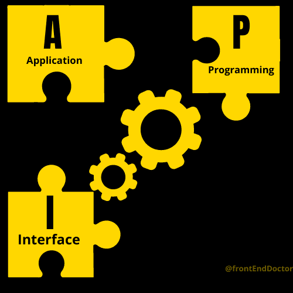
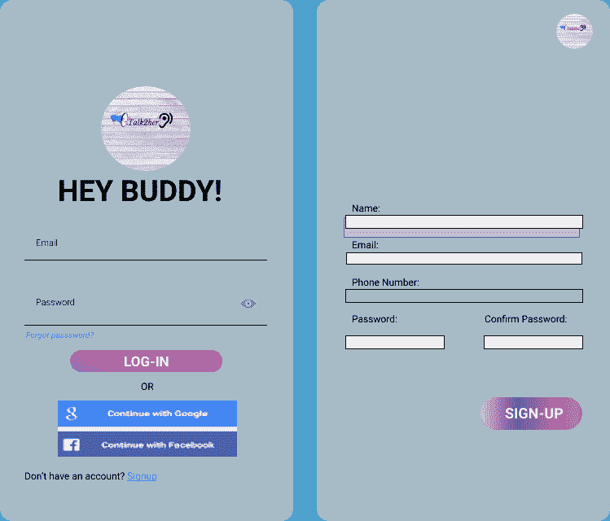

# 软件测试-初学者指南

> 原文：<https://www.freecodecamp.org/news/software-testing-for-beginners/>

## 什么是软件测试？

假设你正在做一个编码项目。你一直在写一堆代码，熬夜修正 bug。所有这些都是你发布软件产品之前的过程的一部分。

然后，您将检查您的代码，以验证它实际上执行了它被编程要做的事情。这就是软件测试的用武之地。

本文将讨论软件测试的类别以及开发人员最常用的不同类型的测试。您将看到一些测试是根据它们的功能命名的。所以，当我说 API 测试时，我指的是在源代码中使用的 API 上执行的测试。

但是在进一步讨论之前，让我们确保我们知道软件测试的含义。

简单地说，软件测试是检查软件产品各个方面的过程，以验证软件的规格并确保它可以使用。

## 软件测试的目标

从一行代码到一段代码，甚至到最终产品，您测试软件的目的是:

*   检查缺陷并确保产品按规定运行
*   确保产品符合市场标准
*   在生产阶段解决任何漏洞
*   防止产品将来出现故障

## 软件测试的特点

当您测试您的软件时，您希望确保您的测试是:

*   实际的
*   可靠的
*   真正的
*   能够发现错误
*   能够检查你的软件的有效性

## 你应该什么时候测试你的软件？

何时测试你的软件将取决于你想要执行什么样的测试。

您可以在软件开发阶段测试您的软件——也就是说，在编写源代码时，就像单元测试、API 测试和其他情况一样。

您也可以在软件开发完成后进行测试，例如在用户界面(UI)测试中。

## 测试应该何时停止？

在以下情况下，您可以停止测试您的软件:

*   所有必要的测试都已有效进行
*   源代码中的错误已经被减少到最低限度或被根除
*   测试人员完成了测试
*   产品完全不受威胁
*   产品发布

## **软件测试方法**

现在你知道软件测试是什么意思了，那么具体是怎么做的呢？

软件测试基于两种主要方法:

1.  功能测试
2.  非功能测试

这些软件测试类别之间的主要区别在于，功能测试测试软件产品的功能，而非功能测试关注软件产品的性能。

### **功能测试**

功能测试是测试软件的过程，以验证其规格的有用性。

简而言之，它包括对软件进行的各种测试，通常是为了验证其功能。

功能测试有助于软件团队了解软件是否按要求工作。请注意，功能测试并不意味着测试单元功能或模块。

### 功能测试的例子

#### 单元测试

在单元测试中，您测试软件源代码的单个单元或功能。单元测试可以自动或手动完成。

自动单元测试是在人工协助下进行的，而手动单元测试是由人工主动完成的。

这两种方法的区别在于，前者是自动化的，而后者需要硬编码。

单元测试的目的是确保每个单元组件都按预期工作。

#### API 测试

应用程序编程接口(或 API)是您的程序和外部资源之间的链接。所以，如果你想让你的程序做更多的事情，你也可以使用另一个程序的特性。这就是使用 API 的意义所在。

例如，假设我希望我的应用程序具有地图功能。通过使用一个现成的 map APIs，我可以节省一些时间和压力，而不是从头开始编码。

但是，使用 API，尤其是从外部来源使用 API，有它的优点和缺点。我打赌你想尽可能地减少坏处。这就是为什么你需要在产品发布前测试 API。

当您在开发软件时使用公共或私有 API 时，您应该在发布之前检查 API 在产品中的可靠性、安全性和有效性。

Image representing API

#### UI(用户界面)测试

用户界面是用户和软件之间的沟通渠道。

每个软件产品都是按照特定的用户界面规范开发的。这意味着在开发产品之前，用户与应用程序的交互方式是预先确定的。

为了确保设计符合这些规范，您可以对 UI 进行测试——这就是所谓的 UI 测试。

UI 测试包括检查注册页面是否正确接受输入，检查提交按钮是否正常工作，以及许多其他 UI 特性。

Image of a Payment Page

#### 集成测试

将组件分组进行测试被称为集成测试。集成测试包括检查每个独立的组件如何协同工作以实现产品的共同目标。

例如，在电子商务应用程序中，集成测试可以检查当单击购物车菜单时主页如何连接到购物车页面。

集成测试的目的是确保组件同步工作——也就是说，组件 A 和组件 b 工作良好。

Image of two UI pages

#### 回归测试

软件开发涉及迭代，这通常是因为源代码中的错误而发生的。

在调试代码、更新软件程序或对代码进行任何其他更改后，您应该测试该软件以验证其功能。这种测试称为回归测试。

回归测试的例子有校正回归测试、选择性回归测试、渐进回归测试等等。

### **非功能或性能测试**

非功能性测试指的是对产品进行的各种测试，以检查其市场准备情况。非功能测试更进一步，以确保产品的生存能力和价值。

### 非功能测试的例子

#### 容量测试

每种产品的优势在于其处理不同数据量的能力。有些软件可能无法在大型数据库中运行。为了避免这样的破损，你可以做体积测试。

容量测试包括向软件提供一个大型数据库，根据大量数据检查其功能。在不同的数据量上测试你的产品表明你的产品在给定的时间里可以承受更多或更少的数据。

#### 安全测试

在当今世界，安全是一个重要的、经常讨论的话题。关注的范围从物理安全到网络空间——每个人都希望在互联网上获得安全保证。

作为软件开发人员，您希望避免的一个问题是对您的应用程序的威胁。您可以对您的软件产品执行安全测试，以检查其漏洞级别。

安全测试包括身份验证、授权保密以及保护您的软件免受风险和威胁所需的其他措施。

## 将测试文件放在程序文件夹的什么位置

您的测试文件应该放在项目根文件夹中的一个测试文件夹中。这是为了便于导航和集成到项目中。

## **结论**

既然您已经知道了测试在软件开发中的重要性，那么您应该确保编写的代码在测试时没有错误和缺陷。

这将减少你浪费在修复 bug 上的时间，从而使产品发布日期更容易实现。

最后，注意把你的测试文件放在同一个文件夹中，尤其是单元测试之外的测试。