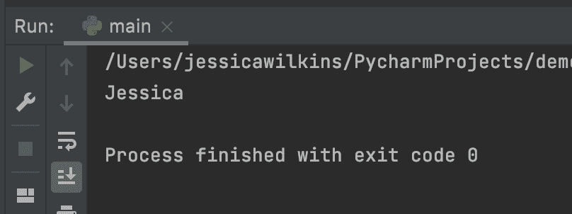
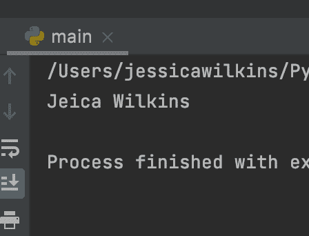
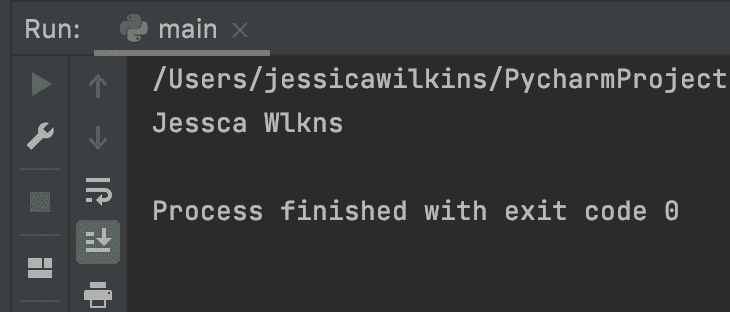
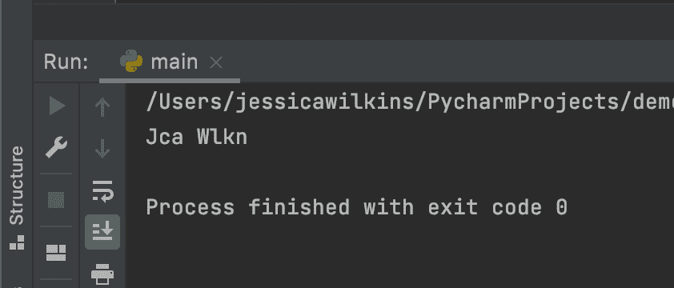

# Python 从字符串中删除字符——如何从字符串中删除字符

> 原文：<https://www.freecodecamp.org/news/python-remove-character-from-a-string-how-to-delete-characters-from-strings/>

在 Python 中，可以使用`replace()`和`translate()`方法来指定要从字符串中删除哪些字符，并返回一个新的修改后的字符串结果。

重要的是要记住，原始字符串不会被改变，因为字符串是不可变的。

在本文中，我将通过使用代码示例向您展示如何使用`replace()`和`translate()`方法。

## 如何使用 Python 的 replace()方法

下面是`replace()`方法的基本语法。

```
str.replace(old_str, new_str[, optional_max])
```

`old_str`参数表示您想要替换的子字符串。

`new_str`参数表示您想要使用的新的子字符串。

`optional_max`参数表示用新子串替换旧子串的最大次数。

`replace()`方法的返回值将是原始字符串的副本，旧的子字符串被新的子字符串替换。

### Python replace()示例

让我们来看一些例子。

在第一个例子中，我们有一个名为`developer`的字符串，它被赋予了我的名字。

```
developer = 'Jessica Wilkins'
```

如果我们想删除我的姓，我们可以像这样使用`replace()`方法:

```
developer.replace('Wilkins', '')
```

这告诉计算机获取旧的子串`Wilkins`并用空串替换它。

如果我们打印出结果，那么我们会得到:

```
print(developer.replace('Wilkins', ''))
```



重要的是要记住，原始字符串保持不变，因为字符串是不可变的。方法将返回一个新的字符串。

在下一个例子中，我们想要使用参数`optional_max`来设置我们想要从我的名字中删除字母`s`的次数。

```
developer.replace('s', '', 2)
```

这一行代码说只从字符串`Jessica Wilkins`中删除字母`s`两次。

如果我们打印出结果，它看起来会是这样的:

```
print(developer.replace('s', '', 2))
```



## 如何使用 Python 的 translate()方法

另一种从字符串中删除字符的方法是使用`translate()`方法。此方法返回一个新字符串，旧字符串中的每个字符都被映射到转换表中的一个字符，并被转换成一个新字符串。

下面是 Python 的`translate()`方法的基本语法。

```
str.translate(table)
```

### Python translate()示例

让我们看一些例子来更好地理解`translate()`方法。

在这个例子中，我们想要从字符串`Jessica Wilkins`中删除字母`i`的所有实例。

我们首先需要使用 Python 内置的`ord()`函数来获取字母`i`的 Unicode 码位值。`ord()`函数将返回一个数值。

```
ord('i')
```

对于我们的表，我们需要指定`None`的值，这样计算机就会知道用空值替换字母`i`。

```
{ord('i'): None}
```

现在我们在`translate()`方法中使用我们的表。

```
developer.translate({ord('i'): None})
```

如果我们打印出结果，它看起来会是这样的:

```
developer = 'Jessica Wilkins'

print(developer.translate({ord('i'): None}))
```



在下一个例子中，我们想要返回一个去掉了字母`e`、`s`和`i`的新字符串。为此，我们可以在表参数中使用迭代器。

```
{ord(letter): None for letter in 'esi'}
```

那行代码告诉计算机找到所有出现的`e`、`s`和`i`，并用`None`替换它。

如果我们打印出结果，它看起来会是这样的:

```
developer = 'Jessica Wilkins'

print(developer.translate({ord(letter): None for letter in 'esi'}))
```



## 结论

在 Python 中，可以使用`replace()`和`translate()`方法来指定要从字符串中删除哪些字符，并返回一个新的修改后的字符串结果。

重要的是要记住，原始字符串不会被改变，因为字符串是不可变的。

下面是`replace()`方法的基本语法。

```
str.replace(old_str, new_str[, optional_max])
```

`replace()`方法的返回值将是原始字符串的副本，旧的子字符串被新的子字符串替换。

另一种从字符串中删除字符的方法是使用`translate()`方法。此方法返回一个新字符串，旧字符串中的每个字符都被映射到转换表中的一个字符，并被转换成一个新字符串。

下面是 Python 的`translate()`方法的基本语法。

```
str.translate(table)
```

我希望您喜欢这篇文章，并祝您的 Python 之旅好运。