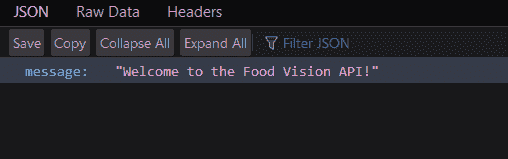
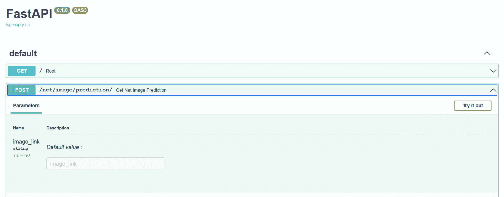
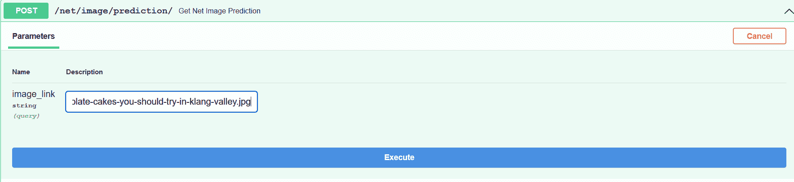
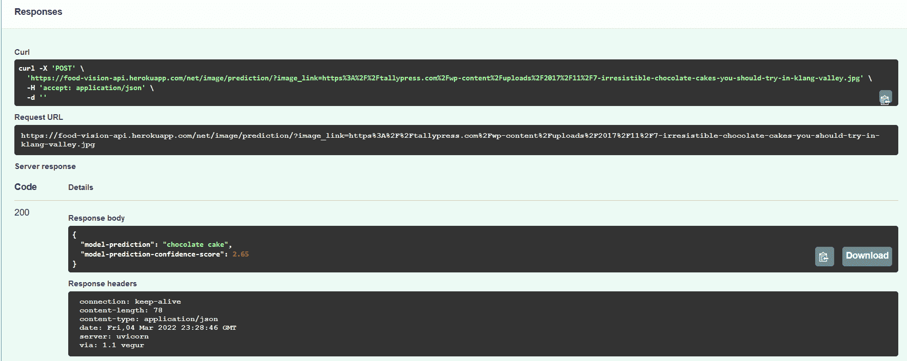

# 如何将 TensorFlow 模型部署为 RESTful API 服务

> 原文：<https://www.freecodecamp.org/news/deploy-an-ml-model-using-fastapi-and-docker/>

如果你和我一样，那么你可能已经看过并阅读了许多关于使用 TensorFlow、PyTorch、Scikit-Learn 或任何其他框架创建机器学习模型的教程。

但是有一件事是这些教程容易忽略的，那就是模型部署。

在本教程中，我将讨论如何部署一个 CNN TensorFlow 模型，使用 FastAPI 和 Docker 将食物图像分类到 Heroku。

### 我们将使用的技术

如果您不熟悉，FastAPI 是用于创建快速 API 应用程序的 Python web 框架。在我看来，它是所有 Python web 框架中最容易学习的。

FastAPI 还默认集成了 swagger 文档，使其易于配置和更新。

另一方面，Docker 是软件工程中的一个行业标准，因为它是最流行的容器化软件之一。Docker 用于在称为容器的虚拟化环境中开发、部署和管理应用程序。

使用 Docker 的主要卖点是，它解决了“它在我的机器上可以工作，为什么在你的机器上不行？”。巧合的是，我实际上在这个项目中遇到了这个问题，最终在我决定使用 Docker 时解决了这个问题。

最后，Heroku 是一个云平台，你可以在这里部署、管理和扩展网络应用。它适用于后端应用程序、前端应用程序或全栈应用程序。

## 先决条件

在我们开始之前，您首先需要以下内容:

1.  码头帐目
2.  Heroku 帐户和 Heroku CLI
3.  Python 安装

## 我们正在构建的应用程序

我们将为 TensorFlow CNN 模型构建一个 RESTful API 服务，对食物图像进行分类。

构建完 API 服务后，我将向您展示如何将应用程序 dockerize，然后将其部署到 Heroku。

## 如何下载必需品

您首先需要在这个[链接](https://github.com/eRuaro/food-vision-api)处克隆 GitHub 库。

`git clone https://github.com/eRuaro/food-vision-api.git`

这个存储库中有两个分支——您将使用`start-here`分支，因为`main`是完整的分支。

一旦你得到了克隆的库，你需要下载 [Docker](https://docs.docker.com/get-docker/) 到你的本地系统，还有 [Heroku CLI](https://devcenter.heroku.com/articles/heroku-cli) 。

您还必须在 pip 上安装以下软件包:

1.  FastAPI
2.  TensorFlow
3.  Numpy
4.  独角兽企业
5.  图像

为此，在`start-here`分支上创建一个`requirements.txt`文件，并放入以下内容。请注意，您可以使用下面列出的软件包的任何其他版本，只要它们仍然可以一起工作。

```
fastapi==0.73.0
numpy==1.19.5
uvicorn==0.15.0
image==1.5.33
tensorflow-cpu==2.7.0 
```

之后您可以使用命令
`pip install -r requirements.txt`安装软件包。

目前，我们的`start-here`分支拥有保存的模型文件，以及用于创建模型的 Jupyter 笔记本。笔记本也有实现我们的 API 特性的代码。也就是说，它实现了根据图像的 URL 链接来预测图像的食品类别。

## FastAPI 简介

记住这一点，让我们开始编写代码吧！在根目录下，创建一个`main.py`文件。在该文件中，添加以下代码行:

```
from fastapi import FastAPI
from fastapi.middleware.cors import CORSMiddleware
from uvicorn import run
import os

app = FastAPI()

origins = ["*"]
methods = ["*"]
headers = ["*"]

app.add_middleware(
    CORSMiddleware, 
    allow_origins = origins,
    allow_credentials = True,
    allow_methods = methods,
    allow_headers = headers    
)

@app.get("/")
async def root():
    return {"message": "Welcome to the Food Vision API!"}

if __name == "__main__":
	port = int(os.environ.get('PORT', 5000))
	run(app, host="0.0.0.0", port=port)
```

main.py

运行命令`python -m uvicorn main:app --reload`将运行应用程序，并将监听我们在服务器上所做的更改。

或者，您可以使用`python main.py`，它将在端口 5000 上运行应用程序，这是最后 3 行代码的功劳。然而，这不会让应用程序听到我们所做的更改，所以每次你想看到你的更改时，你都必须重新运行应用程序。

我们还添加了`CORSMiddleware`，它本质上允许我们在不同的主机中访问 API。也就是说，我们可以通过为它创建一个前端接口来进一步扩展应用程序。我们不会在本文中讨论这个问题，但是我把它放在这里，以防万一您也想创建一个前端来与 API 交互。

转到应用程序运行的端口，您会看到这个。

```
{
    "message": "Welcome to the Food Vision API!"
} 
```

命令`python -m uvicorn main:app --reload`指的是:

```
main -> The file main.py
app -> The object created inside of main.py with the line app = FastAPI()
--reload -> Make the server restart after code changes 
```

让我们仔细分析一下到目前为止我们所写的代码。

```
@app.get("/")
async def root():
    return {"message": "Welcome to the Food Vision API!"} 
```

FastAPI 命令需要`@app`。`get`是一个 HTTP 方法，而`"/"`是特定 API 请求的 URL 路径。在那下面我们调用一个函数来返回一些东西。这里我们只返回一个简单的`json`消息。

也就是说，我们有了一个用 FastAPI 编写 API 端点的模板。

```
@app.http_method("url_path")
async def functionName():
    return something 
```

## 如何编写 API 功能

让我们来编写主要的 API 功能，即从互联网上获取一个食物图片 URL，并预测该食物的名称。

首先，让我们扩展我们之前编写的代码，导入我们将使用的所有必需的函数，并加载模型本身。

```
from fastapi import FastAPI
from tensorflow.keras.models import load_model
from tensorflow.keras.utils import get_file 
from tensorflow.keras.utils import load_img 
from tensorflow.keras.utils import img_to_array
from tensorflow import expand_dims
from tensorflow.nn import softmax
from numpy import argmax
from numpy import max
from numpy import array
from json import dumps
from uvicorn import run
import os

app = FastAPI()
model_dir = "food-vision-model.h5"
model = load_model(model_dir)

...
...
...

if __name == "__main__":
	port = int(os.environ.get('PORT', 5000))
	run(app, host="0.0.0.0", port=port)
```

main.py

在加载到模型中之后，让我们添加我们拥有的食品类，它们基于食品 101 数据集。

```
class_predictions = array([
    'apple pie',
    'baby back ribs',
    'baklava',
    'beef carpaccio',
    'beef tartare',
    'beet salad',
    'beignets',
    'bibimbap',
    'bread pudding',
    'breakfast burrito',
    'bruschetta',
    'caesar salad',
    'cannoli',
    'caprese salad',
    'carrot cake',
    'ceviche',
    'cheesecake',
    'cheese plate',
    'chicken curry',
    'chicken quesadilla',
    'chicken wings',
    'chocolate cake',
    'chocolate mousse',
    'churros',
    'clam chowder',
    'club sandwich',
    'crab cakes',
    'creme brulee',
    'croque madame',
    'cup cakes',
    'deviled eggs',
    'donuts',
    'dumplings',
    'edamame',
    'eggs benedict',
    'escargots',
    'falafel',
    'filet mignon',
    'fish and chips',
    'foie gras',
    'french fries',
    'french onion soup',
    'french toast',
    'fried calamari',
    'fried rice',
    'frozen yogurt',
    'garlic bread',
    'gnocchi',
    'greek salad',
    'grilled cheese sandwich',
    'grilled salmon',
    'guacamole',
    'gyoza',
    'hamburger',
    'hot and sour soup',
    'hot dog',
    'huevos rancheros',
    'hummus',
    'ice cream',
    'lasagna',
    'lobster bisque',
    'lobster roll sandwich',
    'macaroni and cheese',
    'macarons',
    'miso soup',
    'mussels',
    'nachos',
    'omelette',
    'onion rings',
    'oysters',
    'pad thai',
    'paella',
    'pancakes',
    'panna cotta',
    'peking duck',
    'pho',
    'pizza',
    'pork chop',
    'poutine',
    'prime rib',
    'pulled pork sandwich',
    'ramen',
    'ravioli',
    'red velvet cake',
    'risotto',
    'samosa',
    'sashimi',
    'scallops',
    'seaweed salad',
    'shrimp and grits',
    'spaghetti bolognese',
    'spaghetti carbonara',
    'spring rolls',
    'steak',
    'strawberry shortcake',
    'sushi',
    'tacos',
    'takoyaki',
    'tiramisu',
    'tuna tartare',
    'waffles'
])
```

main.py, after `model = load_model(model_dir)`

现在我们有了食物类，让我们来编写主要的 API 功能。

```
@app.post("/net/image/prediction/")
async def get_net_image_prediction(image_link: str = ""):
    if image_link == "":
        return {"message": "No image link provided"}

    img_path = get_file(
        origin = image_link
    )
    img = load_img(
        img_path, 
        target_size = (224, 224)
    )

    img_array = img_to_array(img)
    img_array = expand_dims(img_array, 0)

    pred = model.predict(img_array)
    score = softmax(pred[0])

    class_prediction = class_predictions[argmax(score)]
    model_score = round(max(score) * 100, 2)

    return {
        "model-prediction": class_prediction,
        "model-prediction-confidence-score": model_score
    }
```

main.py, after `root()` function`

这里，我们向端点`/net/image/prediction/`发出一个 **post** 请求，并提供`image_url`作为查询参数。也就是说，发布图像 URL 链接时的完整端点应该是`/net/image/prediction/image_url=image-url`。

为了简单起见，我们给`image_link`一个默认值`""`，当没有链接传递到端点时，我们简单地返回一条消息，说明没有提供图像链接。

`get_file()`通过提供的 URL 链接下载图片，而`load_img()`则加载 PIL 格式的图片，并将其变成模特想要的合适的图片尺寸。

`img_to_array()`将加载的图像转换为 NumPy 数组。`expand_dims()`在第 0 个索引处将数组的维数增加 1。

然后，我们使用`model.predict()`获得加载图像的模型预测，并使用`softmax()`获得模型对所述预测的置信度得分。我在这里使用 softmax，因为这是创建模型时使用的激活函数。

然后，我们最终通过在模型的置信度得分上使用`argmax()`来获得食物类型。我们将使用它作为索引，在包含各种食物类别的`class_predictions`数组中进行搜索。

最后，我们将模型的置信度乘以 100，这样分数的范围就是从 1 到 100。

然后，我们返回模型的预测，以及模型的置信度得分。

## 为什么我们需要使用 Docker 来部署这个应用程序

您实际上可以在 Heroku 上部署这个应用程序，使用定义一个`Procfile`的常用方法。但是当我尝试这种方法时，我不断得到一个 [`ValueError: Out of range float values are not JSON compliant`](https://stackoverflow.com/questions/71152285/valueerror-out-of-range-float-values-are-not-json-compliant-error-on-heroku-an) 错误。当我在 Linux 的 (WSL)的 *Windows 子系统上运行应用程序时，我也得到这个错误。然而，当我在 Windows 上运行时，错误消失了。*

实际上，您可以通过在初始赋值变量`model_score`之后添加这行代码来避免这个错误:

```
model_score = dumps(model_score.tolist())
```

In `main.py`, below `model_score = round(max(score) * 100, 2)`

这使得应用程序可以在 Heroku 和 WSL 上运行，但是它只会在发出 POST 请求时返回这些值。

```
{
    "model-prediction": "apple pie",
    "model-prediction-confidence-score": NaN,
}
```

所以，它在我的机器(Windows)上可以工作，但在 Heroku(使用 Procfile)和 WSL 上都不行。这就是 Docker 解决的那种问题！

## 如何对申请进行归档

让我们开始整理申请吧。在项目的根目录下创建一个`Dockerfile`,放入以下内容:

```
FROM python:3.7.3-stretch

# Maintainer info
LABEL maintainer="your-email-address"

# Make working directories
RUN  mkdir -p  /food-vision-api
WORKDIR  /food-vision-api

# Upgrade pip with no cache
RUN pip install --no-cache-dir -U pip

# Copy application requirements file to the created working directory
COPY requirements.txt .

# Install application dependencies from the requirements file
RUN pip install -r requirements.txt

# Copy every file in the source folder to the created working directory
COPY  . .

# Run the python application
CMD ["python", "main.py"]
```

这将提取 Python 3.7.3 映像，并安装在`requirements.txt`文件中定义的所有必需的包。然后，它使用文件最后一行中定义的命令`python main.py`运行应用程序。

然后，您可以使用以下 CLI 命令构建并运行该应用程序:

```
$ docker image build -t <app-name> .
$ docker run -p 5000:5000 -d <app-name>
```

Commands to build, and run the app

然后，您可以停止该应用程序，并通过运行以下命令来释放系统资源:

```
$ docker container stop <container-id>
$ docker system prune
```

Commands to stop the app, and free up system resources

当运行上面的`docker run`命令时，返回`container-id`。

## 如何部署到 Heroku

随着应用程序现在 dockerized，我们可以将它部署到 Heroku。我假设您已经安装了 Heroku CLI，并且已经将 CLI 登录到您的 Heroku 帐户。

让我们首先通过 CLI 在 Heroku 中创建应用程序:

```
$ heroku create <app-name>
```

然后，我们可以使用以下命令，通过我们之前制作的 Docker 容器来推送和发布应用程序:

```
$ heroku container:push web --app <app-name>
$ heroku container:release web --app <app-name>
```

在这之后，你可以去你的 Heroku 仪表盘打开应用程序。您应该会看到我们在应用程序的`"/"`目录中的 JSON 消息。



JSON message greeting on `"/"` directory

当你导航到`/docs`的时候，你会看到应用程序的华丽文档。在这里，您可以试验我们创建的 POST 请求，看看模型预测是否正确。注意，你必须上传带有`jpeg`或`png`的图片链接。



Swagger documentation of the application on `/docs` 

让我们用一张巧克力蛋糕的图片来试试，它的 URL 链接是 [this](https://tallypress.com/wp-content/uploads/2017/11/7-irresistible-chocolate-cakes-you-should-try-in-klang-valley.jpg) 。


Image from *tallypress.com*

将链接原样粘贴到`/docs`中的文本框，然后按`Execute`。



Demonstration of the app

按下`Execute`按钮后，需要几秒钟才能得到模型预测。这是因为我们正在使用`tensorflow-cpu`，因为当使用 Heroku 的自由层时，我们受到应用程序的 RAM 和段大小的限制。

执行完成后，您应该会看到这样的响应:



Response of the API after usage

可以看到，模型预测正确，置信度为 2.65%。这个置信度分数是可以的，因为我们没有处理模型的准确性(这需要事先得到真实值)，我们处理的是模型以前没有见过的数据。

## 结论

在本文中，您学习了如何将 TensorFlow CNN 模型作为 RESTful API 部署到 Heroku，以及如何使用 Docker。

如果你觉得这篇文章有帮助，请在社交媒体上分享。我们在[推特](https://twitter.com/neil_ruaro)上连线吧！你也可以通过[给我买杯咖啡](https://www.buymeacoffee.com/eRuaro)来支持我。