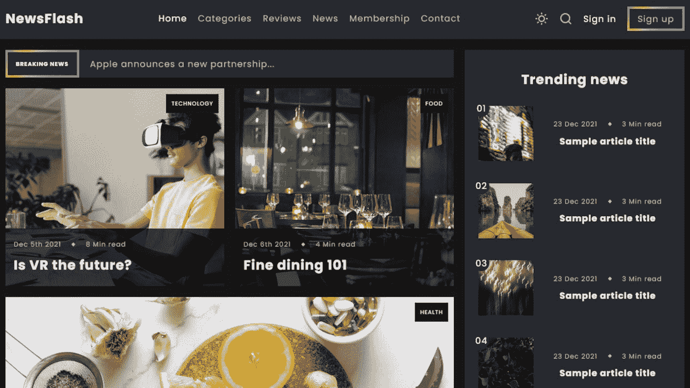

# 前端开发项目-用 HTML 和 CSS 创建一个博客

> 原文：<https://www.freecodecamp.org/news/frontend-development-project-create-a-blog-with-html-css/>

是时候通过创建博客来提高你的 HTML 和 CSS 技能了。

我们刚刚在 freeCodeCamp.org YouTube 频道上发布了一个前端开发课程，将教你如何用 HTML 和 CSS 建立一个博客。

胡里奥代码创建了这个课程。他有一个很受欢迎的 YouTube 频道，在那里他发布惊人的技术课程。

The blog you will create.

本课程包括以下几个部分:

*   介绍和演示
*   设置
*   标题- HTML
*   基本 CSS
*   标题- CSS
*   JavaScript 事件
*   搜索栏- HTML
*   搜索栏- CSS
*   JavaScript 事件继续
*   特色文章- HTML
*   特色文章- CSS
*   快速阅读- HTML
*   快速阅读- CSS
*   瑞士
*   旧帖子- HTML
*   旧帖子- CSS
*   流行标签- HTML
*   流行标签- CSS
*   时事通讯- HTML
*   时事通讯- CSS
*   页脚- HTML
*   Footer - CSS
*   博客文章- HTML
*   博客帖子- CSS
*   媒体查询

观看以下全部课程或在 freeCodeCamp.org YouTube 频道观看[(3 小时观看)。](https://youtu.be/Aj7HLsJenVg)

[https://www.youtube.com/embed/Aj7HLsJenVg?feature=oembed](https://www.youtube.com/embed/Aj7HLsJenVg?feature=oembed)