# 如何使用 Express、Postgres、Github 和 Heroku 构建和部署后端应用程序

> 原文：<https://www.freecodecamp.org/news/how-to-build-a-backend-application/>

在本教程中，我们将学习如何构建和部署映像管理应用程序后端。

它将能够在数据库中存储图像的记录，从数据库中获取图像的记录，更新记录，甚至根据具体情况完全删除记录。

为了实现这一切，我们将使用 Express(一个 Node.js 框架)、Postgres(一个数据库)、Cloudinary(一个基于云的图像存储)、GitHub(用于版本控制/存储)和 Heroku(一个托管平台)。

这些工具都是免费的。所以你不必担心如何支付这些费用。感谢这些伟大的创新者。

### 先决条件

如果你对这些技术中的大部分都不熟悉，我建议你去看看我的另一个教程，关于如何[创建一个服务器并上传图像到 Cloudinary](https://www.freecodecamp.org/news/build-a-secure-server-with-node-and-express/) 。

如果你完全是为了 Postgres，那就去看看这个[教程](https://dev.to/ogwurujohnson/-persisting-a-node-api-with-postgresql-without-the-help-of-orms-like-sequelize-5dc5)。

你准备好了，我们就开始工作吧！

## 如何存储和检索图像记录

### 创建数据库和表

因此，如果您还没有这个[项目](https://github.com/EBEREGIT/server-tutorial/tree/cloudinary-upload),那么您需要从克隆它开始。

在您的 **pgAdmin** 中:

*   创建一个数据库，并将其命名为`tutorial`
*   创建一个表格，并将其命名为`tutorial`
*   创建一个登录/组角色，并将其命名为`tutorial`。**(别忘了给它所有权限。)**

回到您的项目目录，安装[节点-postgres](https://node-postgres.com/) ( `npm i pg`)和[make-runnable](https://www.npmjs.com/package/make-runnable)(`npm i make-runnable`)包。

在你的`package.json`文件中，用`"create": "node ./services/dbConnect createTables"`替换`"scripts"`的内容。我们将用它来执行我们将要创建的`dbConnect`文件。

创建一个包含以下代码的`services/dbConnect`文件:

```
 const pg = require("pg");

const config = {
  user: "tutorial",
  database: "tutorial",
  password: "tutorial",
  port: 5432,
  max: 10, // max number of clients in the pool
  idleTimeoutMillis: 30000,
};

const pool = new pg.Pool(config);

pool.on("connect", () => {
  console.log("connected to the Database");
});

const createTables = () => {
  const imageTable = `CREATE TABLE IF NOT EXISTS
    images(
      id SERIAL PRIMARY KEY,
      title VARCHAR(128) NOT NULL,
      cloudinary_id VARCHAR(128) NOT NULL,
      image_url VARCHAR(128) NOT NULL
    )`;
  pool
    .query(imageTable)
    .then((res) => {
      console.log(res);
      pool.end();
    })
    .catch((err) => {
      console.log(err);
      pool.end();
    });
};

pool.on("remove", () => {
  console.log("client removed");
  process.exit(0);
});

//export pool and createTables to be accessible from anywhere within the application
module.exports = {
  createTables,
  pool,
};

require("make-runnable"); 
```

现在我们已经准备好在数据库中创建表了。如果你准备好了，让我们开始摇滚吧！

在您的终端中执行以下代码:

```
 npm run create 
```

如果下图是您的结果，那么您可以开始了:

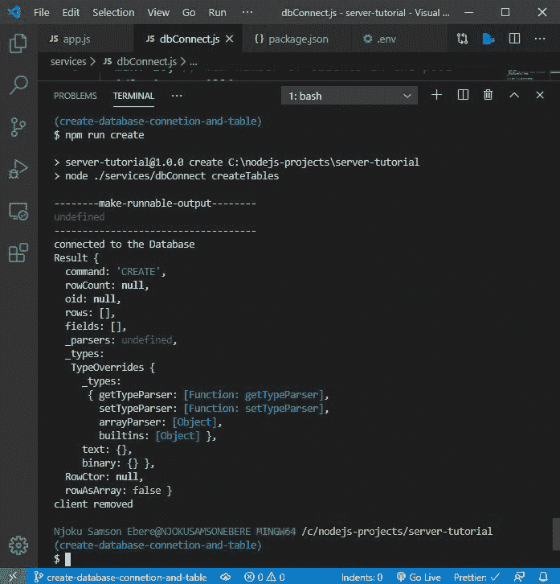

检查您的 **pgAdmin** ，您应该将您的表正确地放置在数据库中，如下图所示:

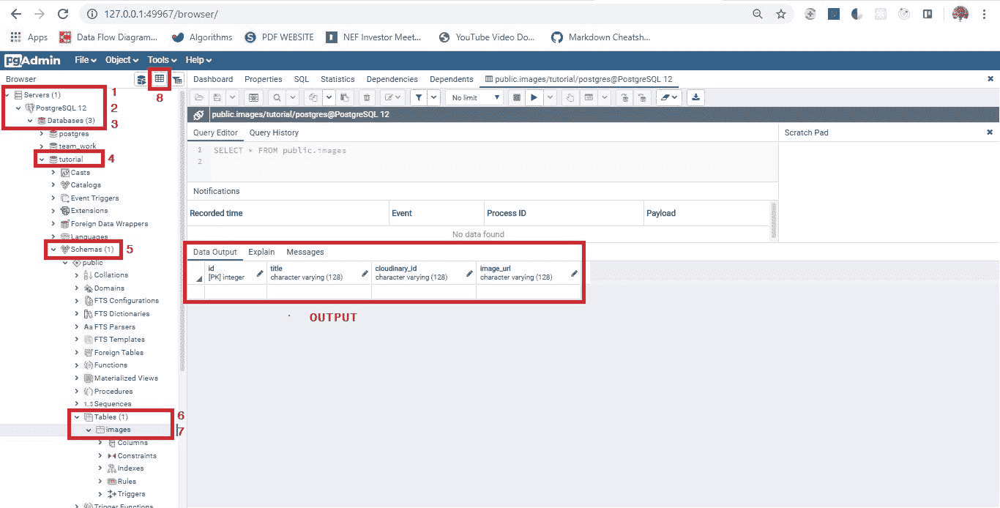

好吧，这是一条漫长的路。是时候联合 Node、Postgres 和 Cloudinary 了。

## 如何创建端点来存储和检索图像记录

### 端点 1:持久图像

首先，要求将`dbConnect.js`文件放在`app.js`文件的顶部，如下所示:

```
 const db = require('services/dbConnect.js'); 
```

然后在`app.js`文件中，用下面的代码创建一个新的端点 *(persist-image)* :

```
 // persist image
app.post("/persist-image", (request, response) => {
  // collected image from a user
  const data = {
    title: request.body.title,
    image: request.body.image,
  }

  // upload image here
  cloudinary.uploader.upload(data.image)
  .then().catch((error) => {
    response.status(500).send({
      message: "failure",
      error,
    });
  });
}) 
```

用以下代码替换`then`块:

```
 .then((image) => {
    db.pool.connect((err, client) => {
      // inset query to run if the upload to cloudinary is successful
      const insertQuery = 'INSERT INTO images (title, cloudinary_id, image_url) 
         VALUES($1,$2,$3) RETURNING *';
      const values = [data.title, image.public_id, image.secure_url];
    })
  }) 
```

在图像成功上传到 Cloudinary 后，`image.public_id`和`image.secure_url`作为返回的图像细节的一部分被获取。

我们现在保存了`image.public_id`和`image.secure_url`的记录(正如您在上面的代码中看到的)，以便在我们认为合适的时候使用它来检索、更新或删除图像记录。

好吧，让我们继续前进！

仍然在`then`块中，在我们创建的查询下添加以下代码:

```
 // execute query
client.query(insertQuery, values)
      .then((result) => {
        result = result.rows[0];

        // send success response
        response.status(201).send({
          status: "success",
          data: {
            message: "Image Uploaded Successfully",
            title: result.title,
            cloudinary_id: result.cloudinary_id,
            image_url: result.image_url,
          },
        })
      }).catch((e) => {
        response.status(500).send({
          message: "failure",
          e,
        });
      }) 
```

所以我们的`persist-image`端点现在看起来像这样:

```
 // persist image
app.post("/persist-image", (request, response) => {
  // collected image from a user
  const data = {
    title: request.body.title,
    image: request.body.image
  }

  // upload image here
  cloudinary.uploader.upload(data.image)
  .then((image) => {
    db.pool.connect((err, client) => {
      // inset query to run if the upload to cloudinary is successful
      const insertQuery = 'INSERT INTO images (title, cloudinary_id, image_url) 
         VALUES($1,$2,$3) RETURNING *';
      const values = [data.title, image.public_id, image.secure_url];

      // execute query
      client.query(insertQuery, values)
      .then((result) => {
        result = result.rows[0];

        // send success response
        response.status(201).send({
          status: "success",
          data: {
            message: "Image Uploaded Successfully",
            title: result.title,
            cloudinary_id: result.cloudinary_id,
            image_url: result.image_url,
          },
        })
      }).catch((e) => {
        response.status(500).send({
          message: "failure",
          e,
        });
      })
    })  
  }).catch((error) => {
    response.status(500).send({
      message: "failure",
      error,
    });
  });
}); 
```

**现在让我们测试一下我们所有的努力:**

打开您的 *postman* ，测试您的端点，如下图所示。我的成功了。希望你的也没有错误？

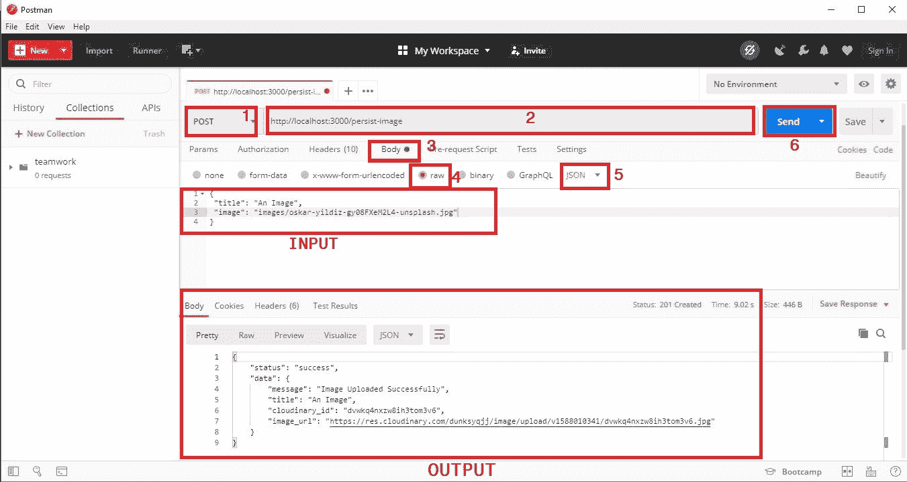

打开您的 Cloudinary 控制台/仪表盘，检查您的`media Library`。你的新形象应该舒服地坐在那里，就像我下面的一样:


现在我们来到这里的主要原因是:检查你的 **pgAdmin** 中的`images`表。我的如下图所示:

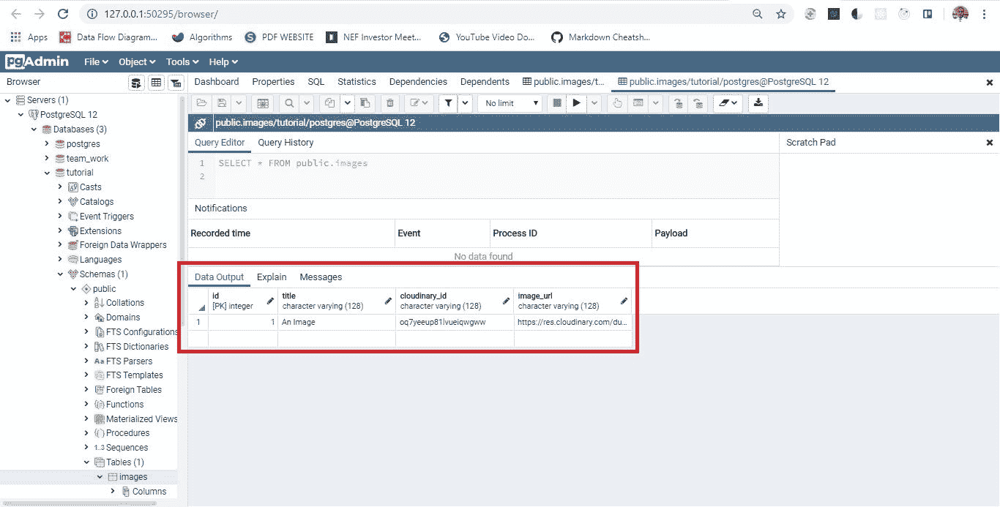

呜啦啦！我们已经走了这么远。如果需要，请休息一下。我会在这里等你回来。:)

如果你准备好了，那么让我们检索刚才保存的图像。

### 端点 2:检索图像

从这段代码开始:

```
 app.get("/retrieve-image/:cloudinary_id", (request, response) => {

}); 
```

接下来，我们需要从用户那里收集一个惟一的 ID 来检索特定的图像。因此，将`const { id } = request.params;`添加到上面的代码中，如下所示:

```
 app.get("/retrieve-image/:cloudinary_id", (request, response) => {
  // data from user
  const { cloudinary_id } = request.params;

}); 
```

将以下代码添加到上面代码的正下方:

```
 db.pool.connect((err, client) => {
      // query to find image
    const query = "SELECT * FROM images WHERE cloudinary_id = $1";
    const value = [cloudinary_id];
    }); 
```

在查询下，使用以下代码执行查询:

```
 // execute query
    client
      .query(query, value)
      .then((output) => {
        response.status(200).send({
          status: "success",
          data: {
            id: output.rows[0].cloudinary_id,
            title: output.rows[0].title,
            url: output.rows[0].image_url,
          },
        });
      })
      .catch((error) => {
        response.status(401).send({
          status: "failure",
          data: {
            message: "could not retrieve record!",
            error,
          },
        });
      }); 
```

现在我们的`retrieve-image` API 看起来像这样:

```
 app.get("/retrieve-image/:cloudinary_id", (request, response) => {
  // data from user
  const { cloudinary_id } = request.params;

  db.pool.connect((err, client) => {
    // query to find image
    const query = "SELECT * FROM images WHERE cloudinary_id = $1";
    const value = [cloudinary_id];

    // execute query
    client
      .query(query, value)
      .then((output) => {
        response.status(200).send({
          status: "success",
          data: {
            id: output.rows[0].cloudinary_id,
            title: output.rows[0].title,
            url: output.rows[0].image_url,
          },
        });
      })
      .catch((error) => {
        response.status(401).send({
          status: "failure",
          data: {
            message: "could not retrieve record!",
            error,
          },
        });
      });
  });
}); 
```

**让我们看看我们做得有多好:**

在你的 postman 中，复制`cloudinary_id`并将其添加到 URL，如下图所示:

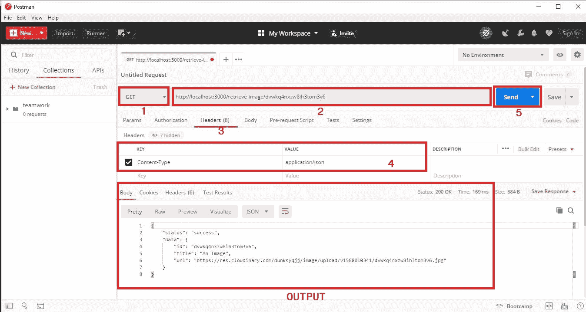

耶斯。我们也可以检索我们的图像。

如果你在这里，那么你应该为你的勤奋赢得掌声和起立鼓掌。

恭喜你！你刚刚达到了一个伟大的里程碑。

存储和检索图像记录的代码在这里是。

## 如何更新和删除图像记录

我们现在将看看如何删除和更新图像记录，视情况而定。让我们从删除端点开始。

### 删除端点

在 app.js 文件中，从以下代码开始:

```
 // delete image
app.delete("delete-image/:cloudinary_id", (request, response) => {

}); 
```

接下来，我们要从 URL 中获取我们想要删除的图片的唯一 ID，也就是`cloudinary_id`。所以在上面的代码中添加:

```
 const { cloudinary_id } = request.params; 
```

我们现在开始删除过程。

首先，我们从 Cloudinary 中删除。添加以下代码以从 Cloudinary 中删除映像:

```
 cloudinary.uploader
    .destroy(cloudinary_id)
    .then((result) => {
      response.status(200).send({
        message: "success",
        result,
      });
    })
    .catch((error) => {
      response.status(500).send({
        message: "Failure",
        error,
      });
    }); 
```

此时，我们的 API 只能从 Cloudinary 中删除图像(可以在 postman 中查看)。但是我们也想删除 Postgres 数据库中的记录。

其次，我们从 Postgres 数据库中删除。为此，用下面的`query`替换`then`块中的代码:

```
 db.pool.connect((err, client) => {

      // delete query
      const deleteQuery = "DELETE FROM images WHERE cloudinary_id = $1";
      const deleteValue = [cloudinary_id];

}) 
```

使用下面的代码执行查询:

```
 // execute delete query
      client.query(deleteQuery, deleteValue)
      .then((deleteResult) => {
        response.status(200).send({
          message: "Image Deleted Successfully!",
          deleteResult
        });
      }).catch((e) => {
        response.status(500).send({
          message: "Image Couldn't be Deleted!",
          e
        });
      }); 
```

所以我们的端点应该是这样的:

```
 // delete image
app.delete("/delete-image/:cloudinary_id", (request, response) => {
  // unique ID
  const { cloudinary_id } = request.params;

  // delete image from cloudinary first
  cloudinary.uploader
    .destroy(cloudinary_id)

    // delete image record from postgres also
    .then(() => {
      db.pool.connect((err, client) => {

      // delete query
      const deleteQuery = "DELETE FROM images WHERE cloudinary_id = $1";
      const deleteValue = [cloudinary_id];

      // execute delete query
      client
        .query(deleteQuery, deleteValue)
        .then((deleteResult) => {
          response.status(200).send({
            message: "Image Deleted Successfully!",
            deleteResult,
          });
        })
        .catch((e) => {
          response.status(500).send({
            message: "Image Couldn't be Deleted!",
            e,
          });
        });
      })
    })
    .catch((error) => {
      response.status(500).send({
        message: "Failure",
        error,
      });
    });
}); 
```

考验我们终点的时候到了。

下面是我的 Cloudinary `media library`和我已经上传的两张图片。记下他们唯一的 ID ( `public_id`)。


如果您还没有，请使用 persist-image 端点上传一些图像。

现在让我们继续邮差:


请注意，唯一的 ID 与我的 Cloudinary 媒体库中的一个图像相匹配。

从输出中，我们执行了 DELETE 命令，从数据库的图像表中删除了一行。

这是我的媒体库，还剩下一张图片:


瓦拉 hhh...我们现在可以去掉一个图像了。

如果需要的话，一定要休息一下。✌🏾

如果你准备好了，我准备好更新图像。

### 更新图像 API

在`delete-image` API 下面，让我们用下面的代码开始创建`update-image` API:

```
 // update image
app.put("/update-image/:cloudinary_id", (request, response) => {

});

All codes will live in there. 
```

使用以下代码从用户处收集唯一的 Cloudinary ID 和新的图像细节:

```
 // unique ID
  const { cloudinary_id } = request.params;

// collected image from a user
  const data = {
    title: request.body.title,
    image: request.body.image,
  }; 
```

使用以下代码从 Cloudinary 中删除映像:

```
 // delete image from cloudinary first
  cloudinary.uploader
    .destroy(cloudinary_id)
      // upload image here
    .then()
    .catch((error) => {
      response.status(500).send({
        message: "failed",
        error,
      });
    }); 
```

接下来，将另一张图片上传到 Cloudinary。为此，在`then`块中输入以下代码:

```
 () => {
      cloudinary.uploader
        .upload(data.image)
        .then()
        .catch((err) => {
          response.status(500).send({
            message: "failed",
            err,
          });
        });
    } 
```

现在让我们用新的图像细节替换我们的初始记录。用以下内容替换`then`块的内容:

```
 (result) => {
          db.pool.connect((err, client) => {

            // update query
            const updateQuery =
              "UPDATE images SET title = $1, cloudinary_id = $2, image_url = $3 WHERE cloudinary_id = $4";
            const value = [
              data.title,
              result.public_id,
              result.secure_url,
              cloudinary_id,
            ];
          });
        } 
```

我们使用查询声明下的以下代码执行查询:

```
 // execute query
            client
              .query(updateQuery, value)
              .then(() => {

                // send success response
                response.status(201).send({
                  status: "success",
                  data: {
                    message: "Image Updated Successfully"
                  },
                });
              })
              .catch((e) => {
                response.status(500).send({
                  message: "Update Failed",
                  e,
                });
              }); 
```

在这一点上，这是我所拥有的:

```
 // update image
app.put("/update-image/:cloudinary_id", (request, response) => {
  // unique ID
  const { cloudinary_id } = request.params;

  // collected image from a user
  const data = {
    title: request.body.title,
    image: request.body.image,
  };

    // delete image from cloudinary first
    cloudinary.uploader
      .destroy(cloudinary_id)

      // upload image here
      .then(() => {
        cloudinary.uploader
          .upload(data.image)

          // update the database here
          .then((result) => {
            db.pool.connect((err, client) => {
            // update query
            const updateQuery =
              "UPDATE images SET title = $1, cloudinary_id = $2, image_url = $3 WHERE cloudinary_id = $4";
            const value = [
              data.title,
              result.public_id,
              result.secure_url,
              cloudinary_id,
            ];

            // execute query
            client
              .query(updateQuery, value)
              .then(() => {

                // send success response
                response.status(201).send({
                  status: "success",
                  data: {
                    message: "Image Updated Successfully"
                  },
                });
              })
              .catch((e) => {
                response.status(500).send({
                  message: "Update Failed",
                  e,
                });
              });
            });
          })
          .catch((err) => {
            response.status(500).send({
              message: "failed",
              err,
            });
          });
      })
      .catch((error) => {
        response.status(500).send({
          message: "failed",
          error,
        });
      });

}); 
```

测试时间到了！

下图中是我的邮递员:

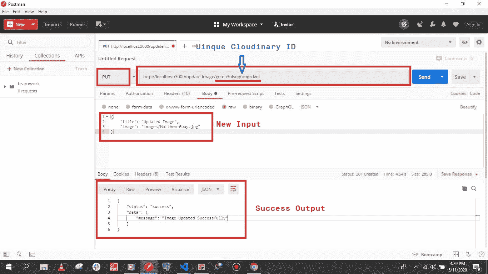

记下唯一的 cloudinary ID，它与我的 cloudinary 媒体库中留下的图像相匹配。

现在请看下图中我的 Cloudinary 媒体库:


请注意，新图像将替换上面“我的媒体库”中的初始图像。

另外，查看惟一的 Cloudinary ID 是否与我的数据库中的新标题相匹配。见下图:


耶！你做得太棒了！💪

我们刚刚用 Node.js、Cloudinary 和 Postgres 完成了一个图像管理应用。

## 使用快速路由进行代码优化

Express Routing 使我们能够通过将业务逻辑从控制器中分离出来，使 Node.js 代码更加优化，或者给它一个更加模块化的结构。我们想用它来清理到目前为止的代码 [](https://dev.to/ebereplenty/cloudinary-and-postgresql-deleting-and-updating-images-using-nodejs-l8d) 。

我们首先在根目录下创建一个名为`routes`的新文件夹:

```
 mk dir routes 
```

在 routes 文件夹中，创建一个名为`routes.js`的文件。

对于 Windows:

```
 echo . > routes.js 
```

对于 Mac:

```
 touch routes.js 
```

清空`routes.js`文件(如果有),并输入以下代码:

```
 const express = require('express');

const router = express.Router();

module.exports = router; 
```

在最后一行上方添加以下代码:

```
 const cloudinary = require("cloudinary").v2;
require("dotenv").config();
const db = require("../services/dbConnect.js");

// cloudinary configuration
cloudinary.config({
  cloud_name: process.env.CLOUD_NAME,
  api_key: process.env.API_KEY,
  api_secret: process.env.API_SECRET,
}); 
```

回到 App.js 文件，删除以下代码:

```
 const cloudinary = require("cloudinary").v2;
require("dotenv").config();
const db = require("./services/dbConnect.js");

// cloudinary configuration
cloudinary.config({
  cloud_name: process.env.CLOUD_NAME,
  api_key: process.env.API_KEY,
  api_secret: process.env.API_SECRET,
}); 
```

将所有 API 移动到`routes.js`。

小心地将所有出现的`app`更改为`router`。

我的`routes.js`文件现在看起来像[这个](https://github.com/EBEREGIT/server-tutorial/blob/routing/routes/routes.js)。

回到`app.js`文件，像这样导入`routes.js`文件:

```
 // import the routes file
const routes = require("./routes/routes") 
```

现在像这样注册路由:

```
 // register the routes 
app.use('/', routes); 
```

这是我此刻的`app.js`文件:

```
 const express = require("express");
const app = express();

// import the routes file
const routes = require("./routes/routes")

// body parser configuration
const bodyParser = require("body-parser");
app.use(bodyParser.json());
app.use(bodyParser.urlencoded({ extended: true }));

// register the routes 
app.use('/', routes);

module.exports = app; 
```

是时候测试一下，看看我们的路线是否还像以前一样工作。

确保你的工作方式和我的一样:

#### 持久图像

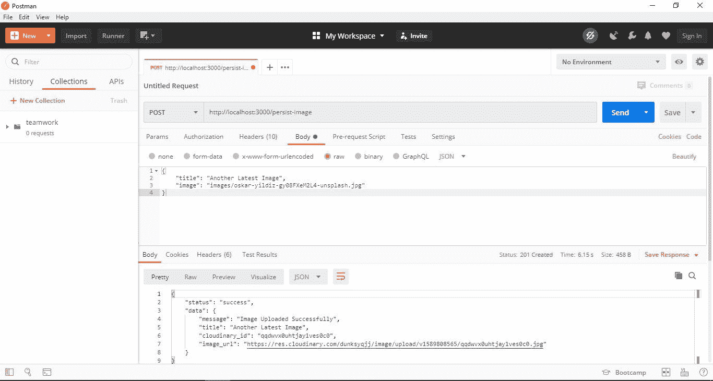

#### 检索图像

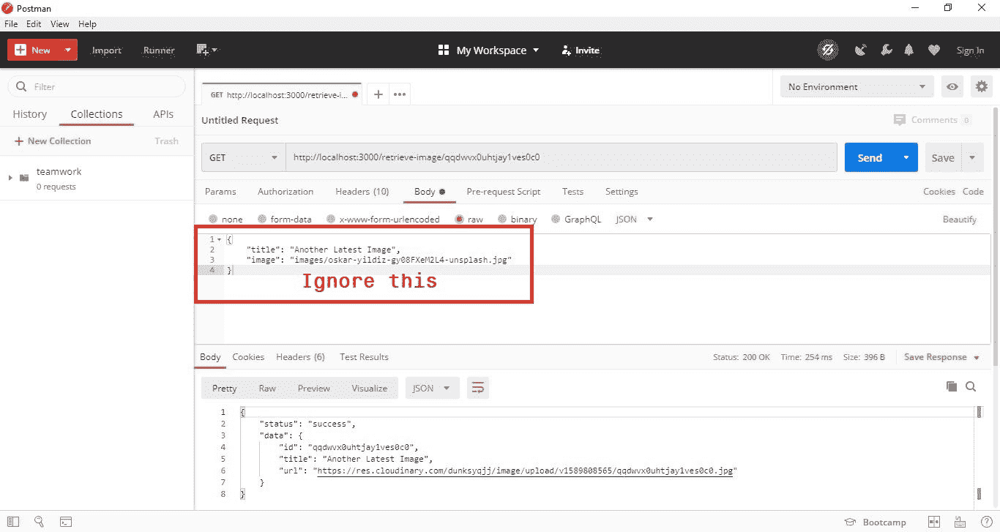

#### 更新-图像

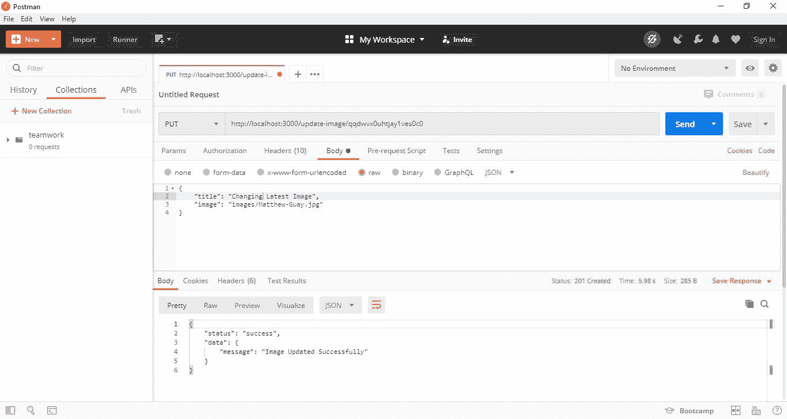

#### 删除图像

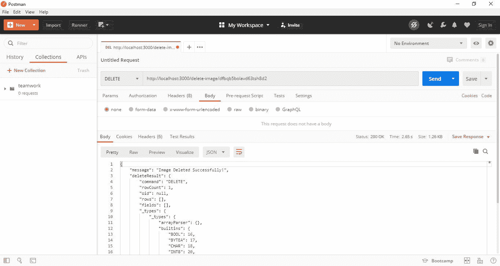

哇！我们已经能够从我们的`app.js`文件中分离出我们的路线。

这里的代码是[这里是](https://github.com/EBEREGIT/server-tutorial/tree/routing)。

尽管我们的`routes.js`文件仍然很长，但是我们有很好的基础将我们的业务逻辑从我们的控制器中分离出来。现在是这样做的时候了。

## 如何将每个端点移动到不同的文件

首先在`routes`文件夹中创建一个新文件夹，并将其命名为`controllers`。

在控制器文件夹中，创建 5 个文件，并以 5 个端点命名。

我们的文件夹和文件的结构应该如下:

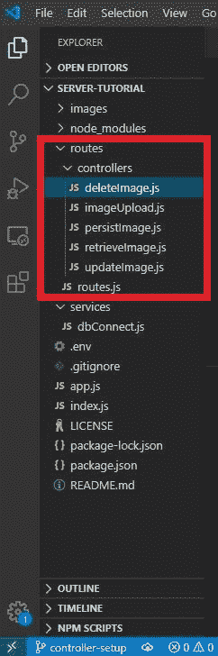

回到 routes.js 文件，让我们研究一下`image-upload` API。剪切以下代码:

```
 (request, response) => {
  // collected image from a user
  const data = {
    image: request.body.image,
  };

  // upload image here
  cloudinary.uploader
    .upload(data.image)
    .then((result) => {
      response.status(200).send({
        message: "success",
        result,
      });
    })
    .catch((error) => {
      response.status(500).send({
        message: "failure",
        error,
      });
    });
} 
```

在`imageUpload`文件中，将您已经从`image-upload`端点剪切的代码等同于`exports.imageUpload`，如下所示:

```
 exports.imageUpload = (request, response) => {
    // collected image from a user
    const data = {
      image: request.body.image,
    };

    // upload image here
    cloudinary.uploader
      .upload(data.image)
      .then((result) => {
        response.status(200).send({
          message: "success",
          result,
        });
      })
      .catch((error) => {
        response.status(500).send({
          message: "failure",
          error,
        });
      });
  } 
```

现在让我们导入代码运行所必需的东西。这是我现在的`imageUpload`文件:

```
 const cloudinary = require("cloudinary").v2;
require("dotenv").config();

// cloudinary configuration
cloudinary.config({
  cloud_name: process.env.CLOUD_NAME,
  api_key: process.env.API_KEY,
  api_secret: process.env.API_SECRET,
});

exports.imageUpload = (request, response) => {
    // collected image from a user
    const data = {
      image: request.body.image,
    };

    // upload image here
    cloudinary.uploader
      .upload(data.image)
      .then((result) => {
        response.status(200).send({
          message: "success",
          result,
        });
      })
      .catch((error) => {
        response.status(500).send({
          message: "failure",
          error,
        });
      });
  } 
```

让我们像这样在`routes.js`文件中导入并注册`imageUpload` API:

```
 const imageUpload = require("./controllers/imageUpload");

// image upload API
router.post("image-upload", imageUpload.imageUpload); 
```

现在我们有了从`routes.js`文件指向`imageUpload.js`文件中的`imageUpload` API 的这行代码。

多牛逼啊！我们的代码可读性更好。

确保测试 API 以确保它正常工作。我的工作完全正常。见下图:

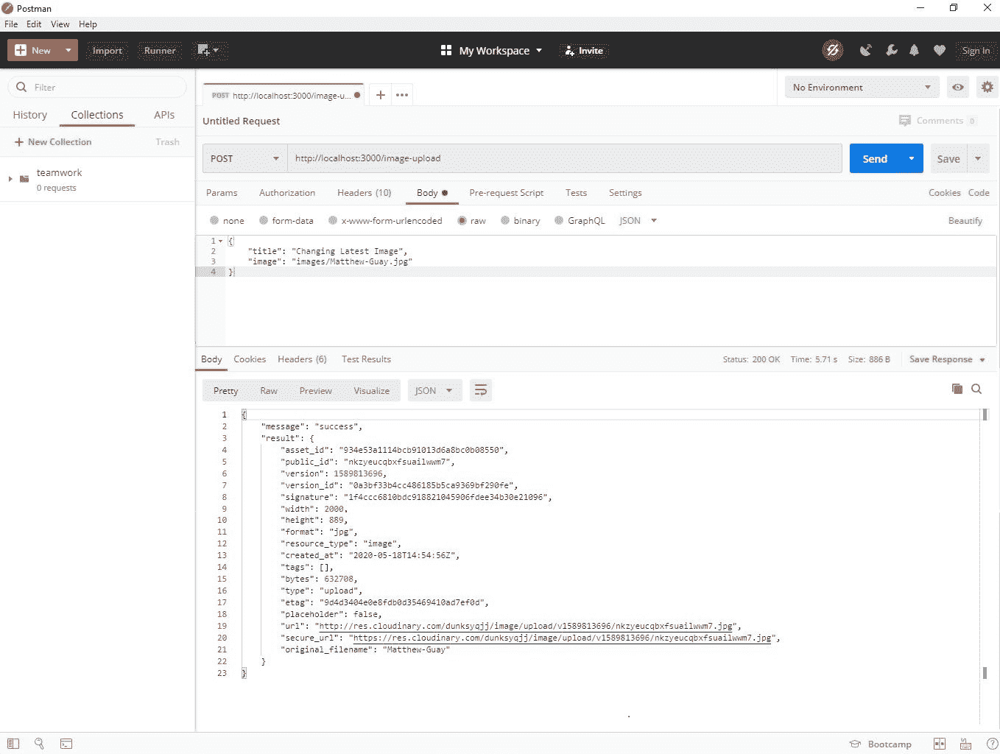

现在，轮到你了！

将您学到的知识应用到其他 API 中。让我们看看你有什么。

我会在另一边等着...

如果你在这里，那么我相信你已经完成了你的工作，他们工作得很完美——或者至少，你已经尽力了。太棒了。

结账地雷[这里](https://github.com/EBEREGIT/server-tutorial/tree/controller-setup/routes)。

恭喜你。你很牛逼:)

这里的代码优化代码是。

好了，进入下一步。

## 如何部署到 GitHub 和 Heroku

现在我们已经完成了我们的应用程序，让我们将它部署到 Heroku 上，这样我们甚至可以不在编写代码的笔记本电脑上访问它。

我将带您浏览将我们的应用上传到 [GitHub](https://github.com/) 并部署到 [Heroku](https://heroku.com/) 的过程。

事不宜迟，让我们把手弄脏吧。

## 如何将代码上传到 GitHub

上传或推送至 GitHub 就像吃自己喜欢的饭一样简单。查看这个资源,了解如何将你的项目从本地机器推送到 GitHub。

## 如何部署到 Heroku

让我们先在 [Heroku](https://heroku.com/) 上创建一个账户。

如果您已经创建了一个帐户，系统可能会提示您创建一个应用程序(这是一个存放您的应用程序的文件夹)。您可以这样做，但我将使用我的终端来完成我的任务，因为终端附带了一些我们稍后将需要的附加功能。

如果您尚未在终端中打开项目，请在终端中打开。我将使用 VS 代码集成终端。

安装 Heroku CLI:

```
npm install heroku 
```

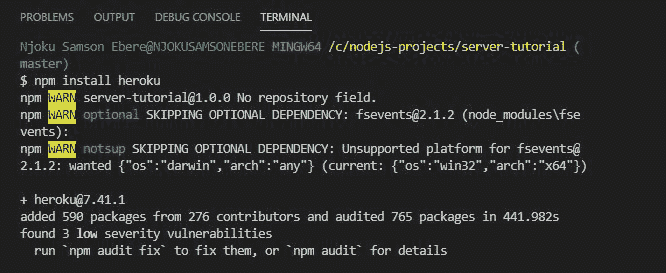

登录 Heroku CLI。这将打开一个浏览器窗口，您可以使用该窗口登录。

```
heroku login 
```

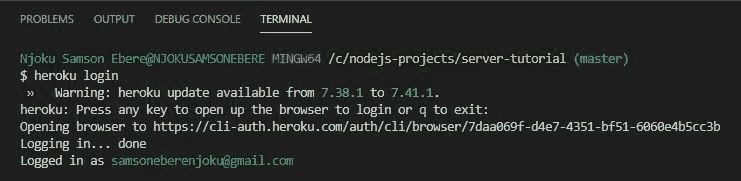

创建应用程序。它可以有任何名称。我在用`node-postgres-cloudinary`。

```
heroku create node-postgres-cloudinary 
```

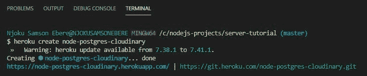

转到你的 [Heroku 仪表板](https://dashboard.heroku.com/apps)，你会发现新创建的应用程序。

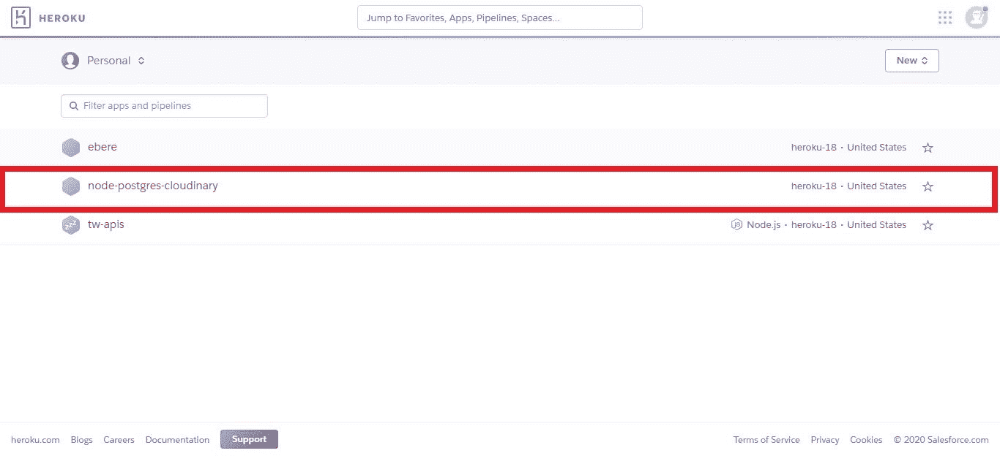

Waalaah！

这就是上图中我的样子。我已经有一些应用程序，但你可以看到我刚刚创建的一个。

现在让我们将 PostgreSQL 数据库添加到应用程序中。

### 如何添加 Heroku Postgres

点击你刚刚创建的应用程序。它会带你到应用程序的仪表板。

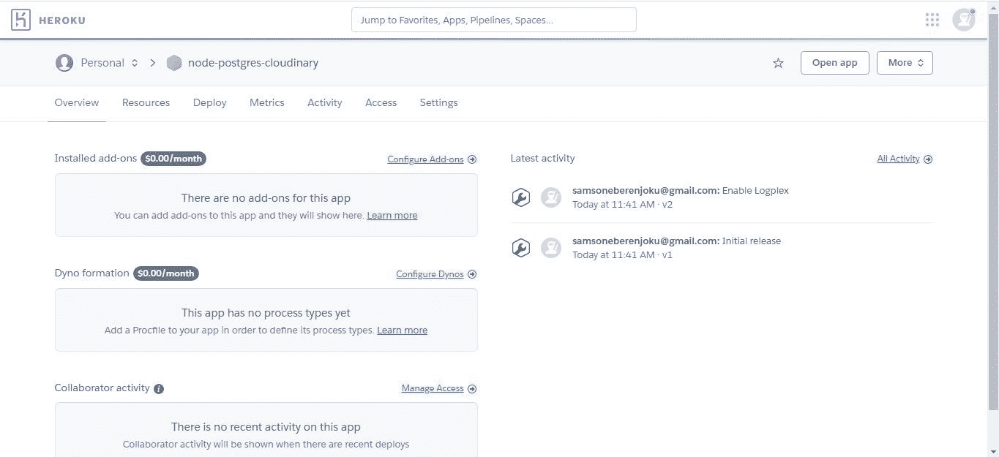

点击`Resources`标签/菜单。


在`Add-ons`部分，搜索并选择`Heroku Postgres`。

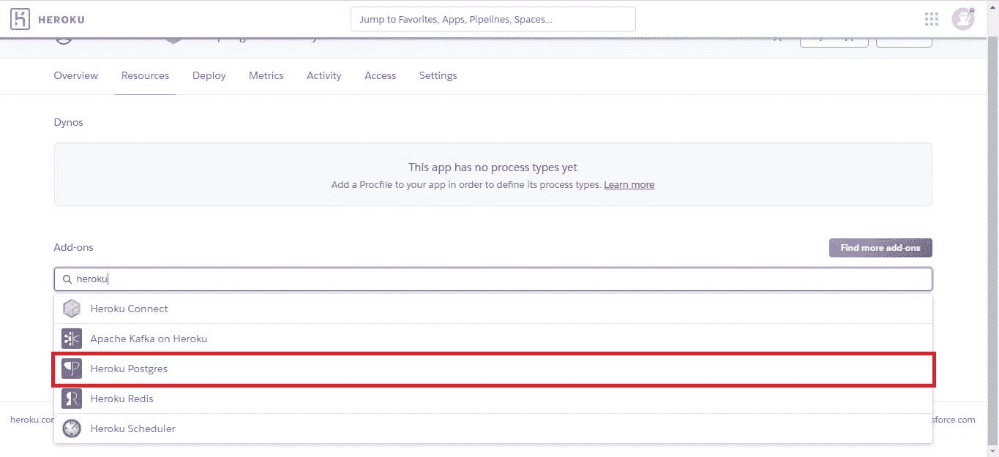

确保在随后的弹出窗口中选择`Hobby Dev - Free`计划:

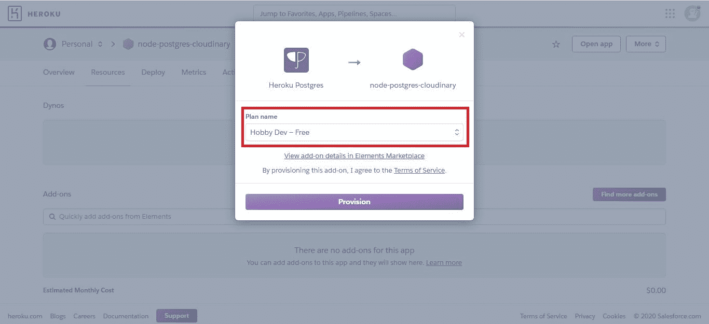

点击`provision`按钮，将其添加到应用程序中，如下所示:

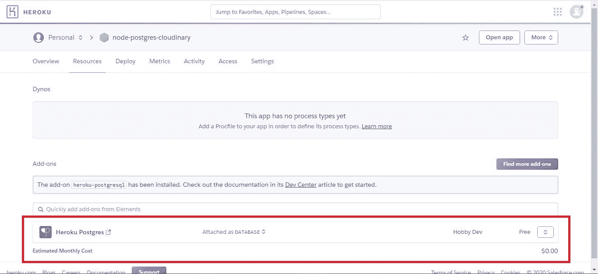

点击`Heroku Postgres`进入`Heroku Postgres`仪表盘。

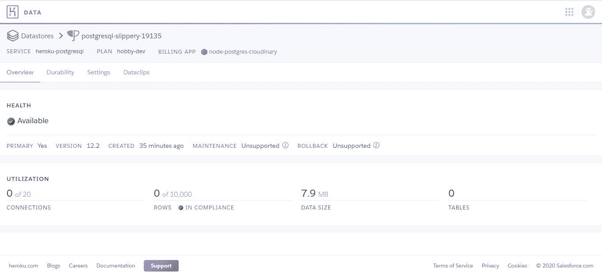

点击`settings`选项卡:

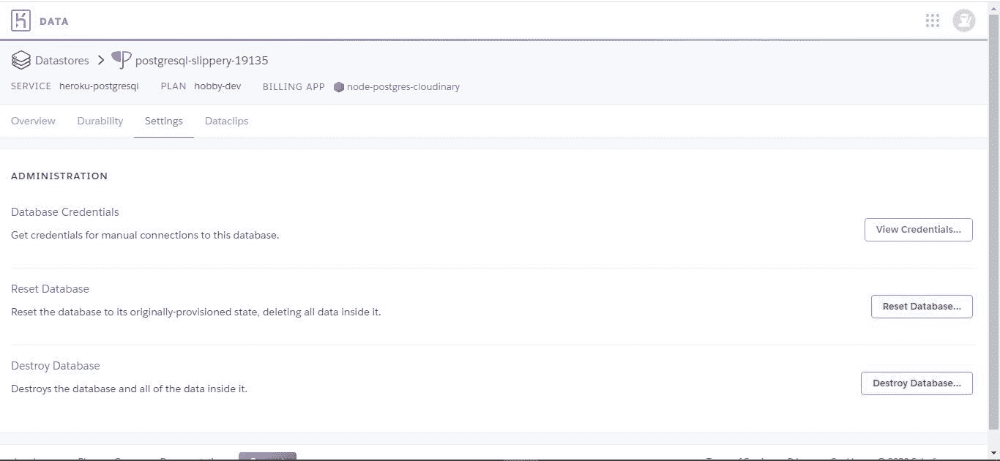

点击`View Credentials`:


在凭据中，我们对 Heroku CLI 感兴趣。我们一会儿会用到它。

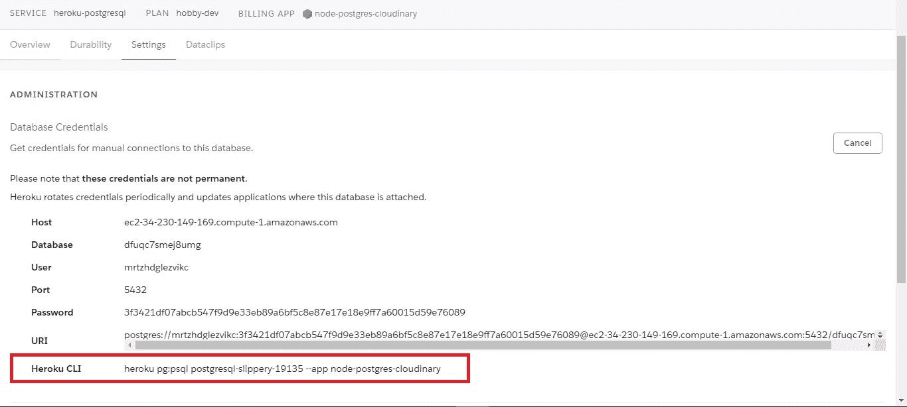

回到终点站。

让我们确认一下`Heroku Postgres`是否添加成功。在终端中输入以下内容:

```
heroku addons 
```

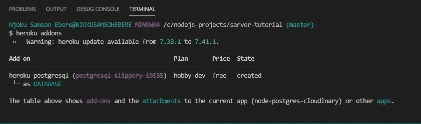

耶！已成功添加。

在我们继续之前，**如果您使用的是 Windows** ，请确保您的 PostgreSQL `path`设置正确。跟随这个[链接](https://www.computerhope.com/issues/ch000549.htm)学习如何设置一个`path`。路径应该是这样的:`C:\Program Files\PostgreSQL\<VERSION>\bin`。

版本将取决于您机器上安装的版本。我的是:`C:\Program Files\PostgreSQL\12\bin`，因为我用的是`version 12`。

下图可能会有所帮助:

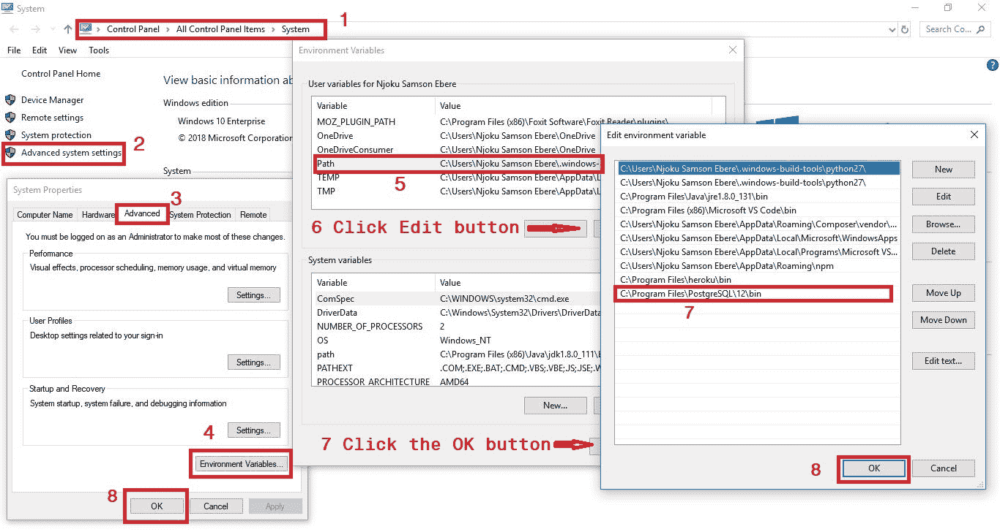

您可能需要导航到计算机上安装 PostgreSQL 的文件夹，找到自己的路径。


从我们的`Heroku Postgres` 使用  登录`Heroku Postgres`。这是我的——你的将会不同:

```
heroku pg:psql postgresql-slippery-19135 --app node-postgres-cloudinary 
```

如果出现错误，很可能是因为您的设置不正确。

### 如何准备我们的数据库连接来匹配 Heroku 的

目前，我的数据库如下所示:

```
 const pg = require("pg");

const config = {
  user: "tutorial",
  database: "tutorial",
  password: "tutorial",
  port: 5432,
  max: 10, // max number of clients in the pool
  idleTimeoutMillis: 30000,
};

const pool = new pg.Pool(config);

pool.on("connect", () => {
  console.log("connected to the Database");
}); 
```

如果你试图将 Heroku 连接到这个，你会得到一个错误。这是因为 Heroku 已经有了一个`connection string`设置。所以我们必须建立连接，这样 Heroku 就可以轻松连接。

我将重构我的数据库连接文件(`dbConnect.js`)和`.env`文件来实现这一点。

*   dbConnect.js

```
 const pg = require('pg');
require('dotenv').config();

// set production variable. This will be called when deployed to a live host
const isProduction = process.env.NODE_ENV === 'production';

// configuration details
const connectionString = `postgresql://${process.env.DB_USER}:${process.env.DB_PASSWORD}@${process.env.DB_HOST}:${process.env.DB_PORT}/${process.env.DB_DATABASE}`;

// if project has been deployed, connect with the host's DATABASE_URL
// else connect with the local DATABASE_URL
const pool = new pg.Pool({
  connectionString: isProduction ? process.env.DATABASE_URL : connectionString,
  ssl: isProduction,
});

// display message on success if successful
pool.on('connect', () => {
  console.log('Teamwork Database connected successfully!');
}); 
```

*   。环境文件

```
 DB_USER="tutorial"
DB_PASSWORD="tutorial"
DB_HOST="localhost"
DB_PORT="5432"
DB_DATABASE="tutorial" 
```

随着`dbconnect`和`.env`文件的设置，我们已经准备好将我们的数据库和表格从本地机器导出到`heroku postgres`。

### 如何导出数据库和表格

转到您的`pgAdmin`并找到本教程的数据库。我的是教程。

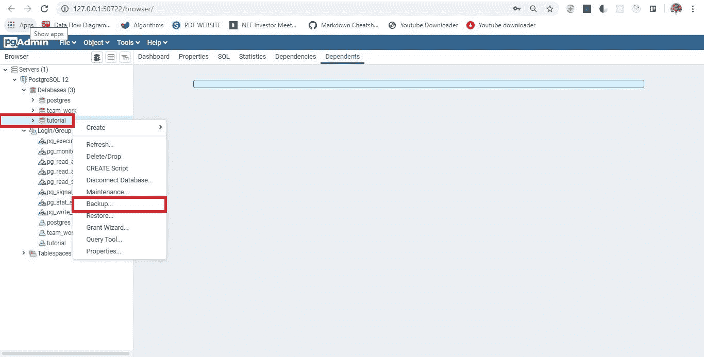

右键点击并选择`Backup`。这将打开一个新窗口。

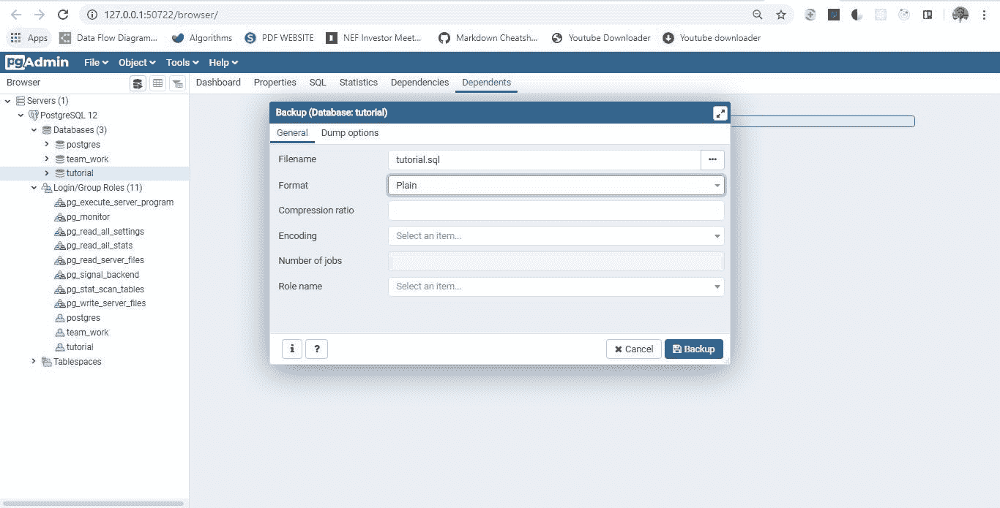

像我一样输入 SQL 文件的名称。选择`plain`格式。然后单击备份。这将把文件保存到您的文档文件夹中。

找到文件并将其移动到项目目录中。它可以在目录中的任何地方，但是我选择将我的移动到`services`目录中，因为它保存了数据库相关的文件。

回到终端，导航到包含 SQL 文件的文件夹，运行下面的代码，将我们刚刚导出的表添加到`heroku postgres`数据库中:

```
cat <your-SQL-file> | <heroku-CLI-from-the-heroku-posgres-credentials> 
```

这是我的样子:

```
cat tutorial.sql | heroku pg:psql postgresql-slippery-19135 --app node-postgres-cloudinary 
```

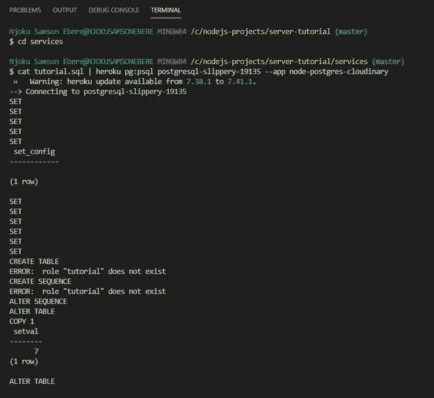

你注意到我把目录改成了服务(`cd services`)了吗？那就是我的`sql`文件所在的位置。

哇！我们刚刚成功地将数据库和表格导出到 Heroku。

几乎结束了...

### 如何告诉 GitHub 我们做出了改变

将我们已更改的文件添加到:

```
$ git add . 
```

句点(`.`)会添加所有文件。

提交您的最新更改:

```
$ git commit -m "refactored the dbConnect and .env file to fit in to heroku; Added the database SQL file" 
```

推送提交的文件:

```
$ git push origin -u master 
```

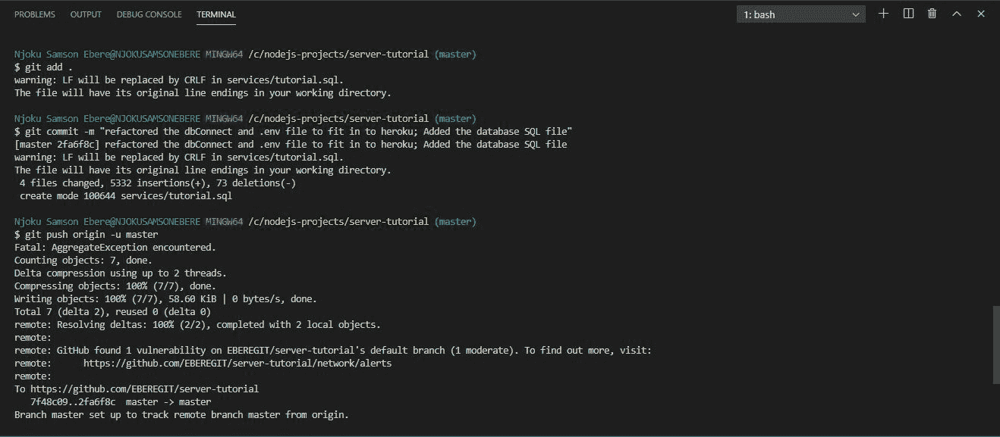

### 最终部署我们的应用

转到你的应用仪表板:


选择 GitHub 部署方法:


搜索并选择一个回购，然后点击`connect`:

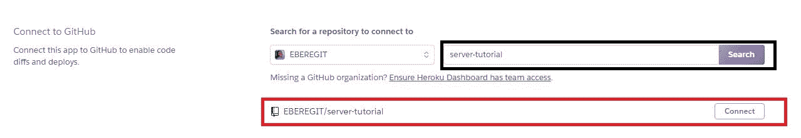

选择您想要部署的分支(在我自己的例子中，它是`master`分支):

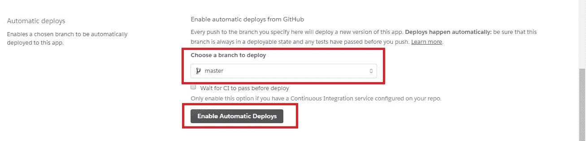

如上图所示，通过点击`Enable automatic deployment`按钮启用自动部署。

点击手动部署中的`Deploy`按钮


对于后续部署，我们不必做所有这些。

现在您有一个按钮，告诉您在构建完成后“查看站点”。点击它。这将在一个新标签页中打开你的应用。

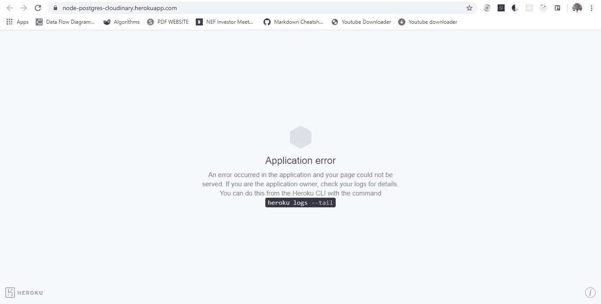

哦，不！一只虫子？应用错误？？

别担心，这只是个小问题。这是您在进行部署时永远不要忘记的事情。大多数托管服务将需要它。

### 如何修复 Heroku 应用程序错误

回到项目的根目录。

创建一个文件，命名为`Procfile`(没有扩展名)。

在该文件中，输入以下代码:

```
web: node index.js 
```

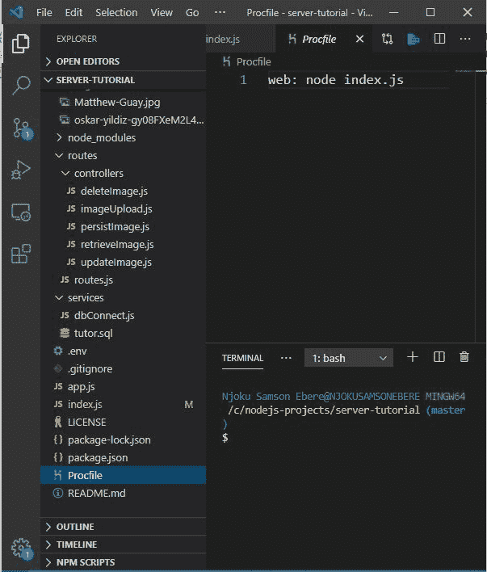

这将 Heroku 定向到服务器文件(`index.js`)，这是应用程序的入口点。如果您的服务器在不同的文件中，请根据需要进行修改。

保存文件并将新的更改推送到 GitHub。

等待 2 到 5 分钟，让 Heroku 自动检测 GitHub repo 中的更改，并在应用程序上呈现这些更改。

现在，您可以刷新错误页面，看到您辛勤工作得到了回报:


你也可以测试一下`retrieve image`路线，看看它是否有效。

恭喜你！你取得了多么大的成就。

其他路由**(持久镜像、更新镜像和删除镜像)**将不起作用，因为我们尚未提供或添加`cloudinary`附加组件。它和我们刚刚做的`PostgreSQL`一样简单。所以你可以试一试。

## 结论

我们开始本教程的目的是学习如何使用 Express、Postgres、Cloudinary、Github 和 Heroku 构建后端应用程序。

我们学习了如何存储、检索、删除和更新图像记录。然后，我们用 Express Routing 组织我们的代码，将其推送到 GitHub，并部署在 Heroku 上。太多了。

我希望你会同意这是值得的，因为我们学到了很多。你应该尝试自己添加 Cloudinary 插件来进一步提高你的知识。

感谢阅读！