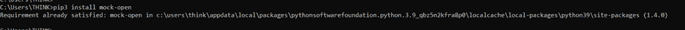
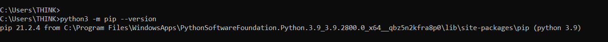
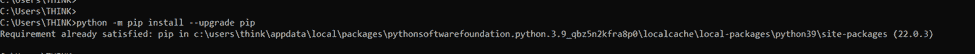

# 找不到 pip 命令–Mac 和 Linux 错误已解决

> 原文：<https://www.freecodecamp.org/news/pip-command-not-found-mac-and-linux-error-solved/>

使用 Python 时，您可能需要安装和使用某些包。有一个称为“画中画”的命令。

使用 pip，您可以安装、升级和卸载各种 Python 包。在本文中，您将学习如何使用它，以及如何处理 pip 错误。

## 如何使用画中画

Pip 是一个可以在 Linux 或 Mac 命令行上使用的命令。您可以在此从[中选择一个套餐。](https://pypi.org/)

下面是一个如何用`pip`安装`mock-open`包的例子。

```
pip3 install mock-open
```

输出:



由于这个包已经安装，我们得到的消息是，要求已经得到满足。

注意我用的是 pip3，因为我用的是 Python3。我们稍后将详细讨论这一点。

## 什么是错误`pip: command not found`？

有时当你安装软件包时，你可能会遇到错误: **`pip: command not found`** 。此错误可能是由以下原因造成的:

1.  未安装 Pip。
2.  Pip 已安装，但它与当前环境不兼容。

在 Linux 上，您必须单独安装 pip 软件包管理器，因为它是一个独立的软件包。但是在 Mac 上，只要使用 Python 3.x，就不需要手动安装 pip。

### 排除错误 **`pip: command not found`**

1.  检查是否安装了 pip。

在 Mac 和 Linux 上，您可以使用下面的命令来检查是否安装了 pip。

```
 python3 -m pip --version 
```



Here's the output if pip is installed correctly

如果没有安装 pip，您可以按照您各自操作系统的安装步骤[进行安装。](https://pip.pypa.io/en/stable/installation/)

**2。将 pip 升级至最新版本**

如果 pip 仍然不工作，请尝试将 pip 升级到最新版本:

```
python -m pip install --upgrade pip
```



Output after upgrading pip

**3。修复环境问题**

有可能您正在尝试使用错误的 pip 版本。例如，`pip3`对`Python3`有效，而`pip`仅对`Python2`有效。

您可以像这样在 Linux 和 Mac 上检查您的 Python 版本:


I am using Python3

如果您的代码是 Python 2，并且您仍然希望使用 pip 的旧版本，那么您可以遵循下面的步骤。

请注意，Python 2 已经走到了生命的尽头。最好将您的代码库升级到 Python 3，并使用最新版本的 pip。

只有在使用 Python2 时，才需要遵循以下步骤:

1.  安装 pip(旧版本)

```
sudo easy_install pip
```

此命令将 pip 命令安装到您的系统上。

现在尝试使用 pip 命令——它应该没有错误。

## 包扎

Pip 是安装 Python 包的有用命令。我们已经介绍了错误 **`pip: command not found`的一些故障排除方法。**

我希望这篇教程对你有所帮助。

我们在[推特](https://twitter.com/hira_zaira)上连线吧！

你可以在这里阅读我的其他帖子[。](https://www.freecodecamp.org/news/author/zaira/)