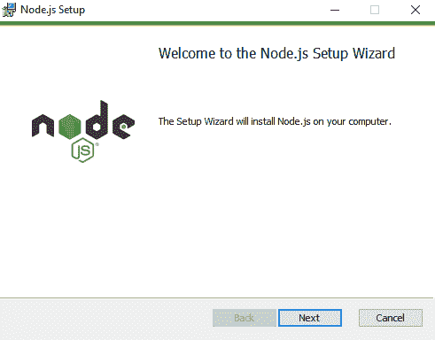
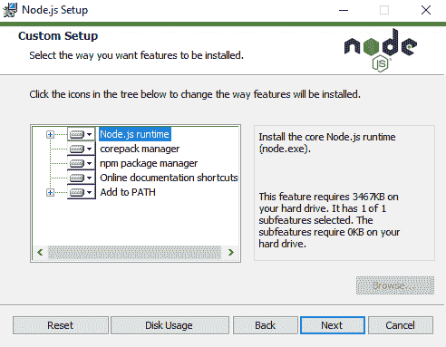
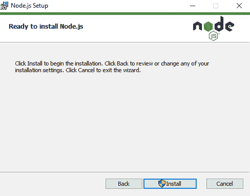
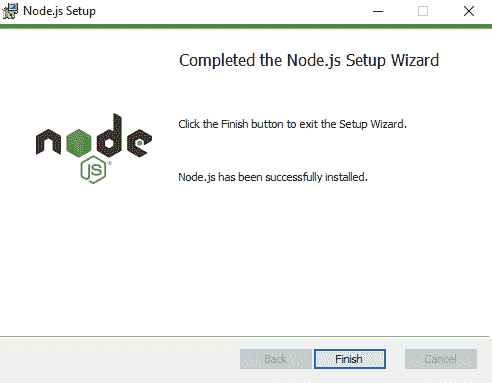
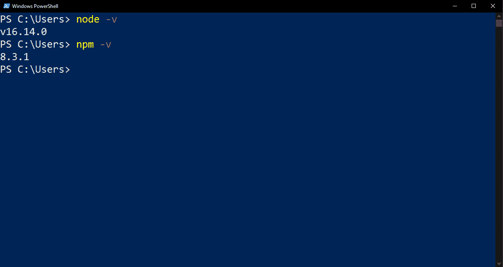
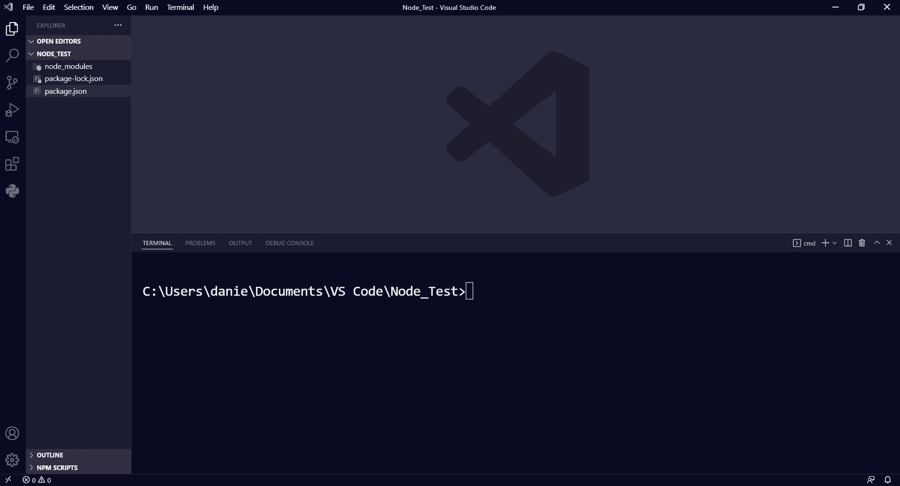
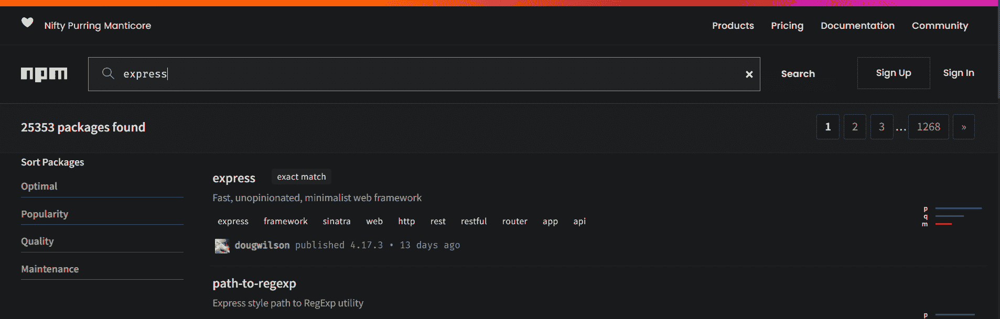
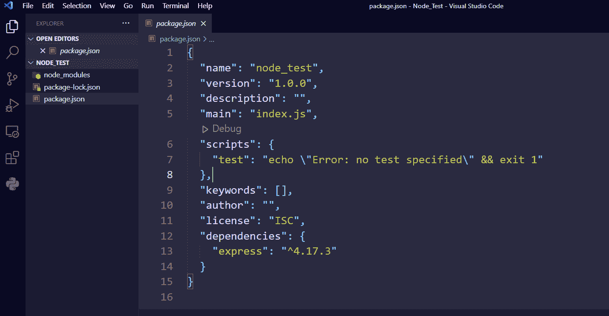

# 如何在 Windows 上安装 Node.js 和 npm

> 原文：<https://www.freecodecamp.org/news/how-to-install-node-js-and-npm-on-windows-2/>

在本文中，您将学习如何在 Windows 上使用 Node 在后端使用 JavaScript。

当您开始使用 JavaScript 并发现您不仅可以在前端使用它，还可以在后端使用它时，一个新的可能性世界似乎展现在您面前。

首先，您意识到您不需要学习另一种语言来启动和运行您的应用程序的后端。其次，Node.js 安装简单，可以在我们熟悉的所有开发平台上工作:Mac、Linux 和 Windows。

在本文中，我将通过一步一步的指导向您展示如何在 Windows 上安装 Node，以便您准备好使用它。

您还会很高兴地知道，软件包管理变得更加容易，因为 npm(节点软件包管理器)是随 Node 的安装一起提供的。

有了它，你将能够获得几乎无穷无尽的社区制作的依赖。你可以简单地把它们安装到你的应用程序中，这样你就不用一次又一次地重复劳动了。

因此，让我们在 Windows 上安装 Node，并开始使用它。

## 如何在 Windows 上安装节点

首先要做的是访问 [Node 的官方网站](https://nodejs.org/)。

Node site front page

该网站足够智能，可以检测到您使用的系统，因此如果您使用的是 Windows，您很可能会看到如上所示的页面。在它的正中间，两个按钮向你展示了最常见的下载可能性，也是最新的。

如果您对 Node 提供的所有最新功能感兴趣，请点击右边的按钮。然而，对于大多数人来说，网站本身推荐使用长期支持版本，这将引导你点击左边的按钮。

在撰写本文时，LTS 版本是 16.14.0。

当你点击其中任何一个，一个。msi 文件下载到您的计算机上。下一步是点击它，安装将开始。向导打开，出现以下窗口:

Node installation wizard's initial page

单击下一步。在下面的窗口中，你会读到(你确实读过，对吗？)节点的 EULA，接受它的条款，然后再次单击 Next。下一个窗口是为节点选择目标文件夹的窗口。

Windows 通常建议将程序安装在 Program Files 文件夹中，在它们自己的文件夹中(在我们的例子中，我们安装 Node.js，因此 nodejs 文件夹是我们的首选位置)。

为了简单起见，让我们按照向导的建议，使用`C:\Program Files\nodejs\`作为目标文件夹。

在下面的窗口中，您可以自定义您的安装。除非你有磁盘空间的问题或者对你正在做的事情有一个清晰的想法，否则我建议保持选项不变，然后再按下一步。

在这个窗口上，我想指出的一点是您看到的第三个选项。该选项允许您在计算机上安装 npm 和 Node。这样，如果您仍然想以某种方式更改此页面中的设置，请保持该选项不变，npm 将在过程结束时为您安装。

下一个窗口处理“本机模块工具”的自动安装。同样，除非你确定你需要它们，否则我建议不要选中这个复选框，只需再按一次 Next。

我们已经到达最后的预安装窗口。正如它所说，从这里，你只需点击安装开始安装，所以让我们这样做。

注意到 Install 旁边的盾形标志了吗？这意味着当您单击该按钮时，Windows 会要求您确认是否确实要完成安装过程。假设这是您阅读本文的原因，只需单击“是”并让安装程序完成它的工作。

我们最终到达了我们希望看到的窗口，告诉我们 Node 已经成功地安装在我们的 Windows 计算机上。单击 Finish，让我们检查一下是否一切正常。

## 如何检查您的节点安装

为了检查 Node(和 npm)是否正确安装在您的计算机上，您可以选择打开 Windows Powershell 或命令提示符。

我们就选第一个。点击开始菜单按钮旁边的搜索栏，输入`powershell`。单击 Enter，Windows Powershell 将在一个窗口中为您打开。

在任何文件夹中(比如像`C:\Users`，你可以输入`node -v`来检查你正在使用的节点版本。正如我上面提到的，我写这篇文章时的最新版本是 16.14.0，这正是我们在上面的 Powershell 上看到的。

顺便提一下，你可能会问自己，为什么我们可以在任何文件夹中检查它。自定义设置中的一个选项(我们保留原样)是将节点添加到路径中。通过这样做，我们可以在浏览文件夹时从任何地方访问它。

也可以检查 npm 版本。为此，键入`npm -v`并按回车键。在我们的例子中，最新的版本是 8.3.1，所以我们可以说我们是最新的。

## 如何使用 npm

好的，但是你并不是在安装了 Node 和 npm 之后才开始阅读的，对吗？您希望看到两者的实际应用。那就让我们开始吧。

为了了解如何使用 Node 启动项目并使用 npm 安装包，我们将使用 Visual Studio 代码。

我们将创建一个名为 Node_Test 的文件夹，在这里我们将使用 Node 和 npm。

让我们从简单的开始。在 Node_Test 文件夹中，右键单击该文件夹，然后单击“用 Visual Studio 代码打开”。这将使 VS 代码在这个空文件夹中自动打开。

在 VS 代码里面，如果你还没有，通过按`Ctrl+Shift+'`(单引号)打开一个新的终端。

单击终端，并在命令行上键入`npm init -y`。这将为我们自动启动一个节点项目，而不需要我们担心初始配置的问题(`-y`标志会自动完成)。这将在 Node_Test 文件夹中创建一个 package.json 文件。

接下来，让我们将 Express 安装为一个依赖项。您可以在[https://www.npmjs.com/](https://www.npmjs.com/)上找到它和 npm 的其他可能依赖项的列表。

另一个旁注:每次你打开 npm 的网站，在左上角，你会看到似乎是三个词的无意义组合。但是，如果你看看首字母，你会发现这是一个全新的序列，首字母缩写为 npm。

好了，现在让我们用这个可爱的咕噜咕噜的蝎狮安装 Express。回到 VS 代码和终端，键入`npm i express`并按回车键。将安装 Express。您可以对您能想到的任何其他依赖项做同样的事情。

要确保安装了 Express，请打开 package.json，向上滚动到依赖项列表，您会在那里看到 Express。

## 包扎

差不多就是这样。在本文中，您了解了如何在 Windows 上安装 Node 和 npm。

我希望这对你有用。更多类似的教程，请查看[freecodecamp.org/news](https://freecodecamp.org/news)并浏览你想了解的主题。

编码快乐！😊