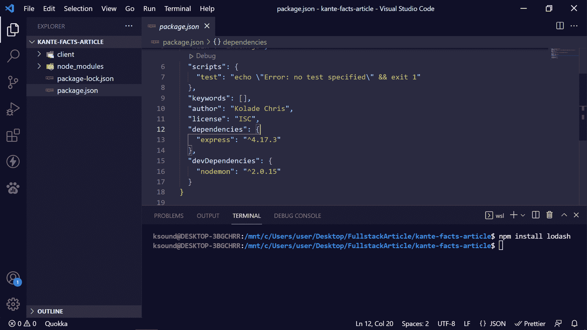
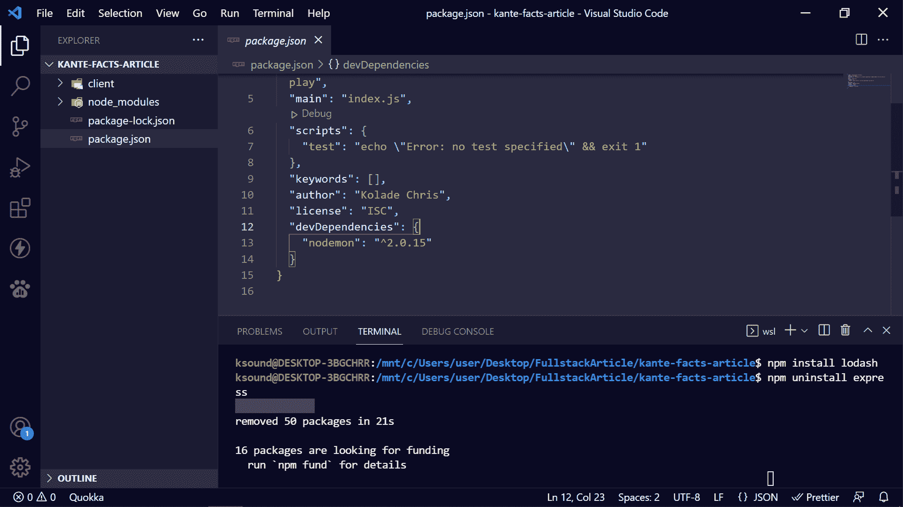
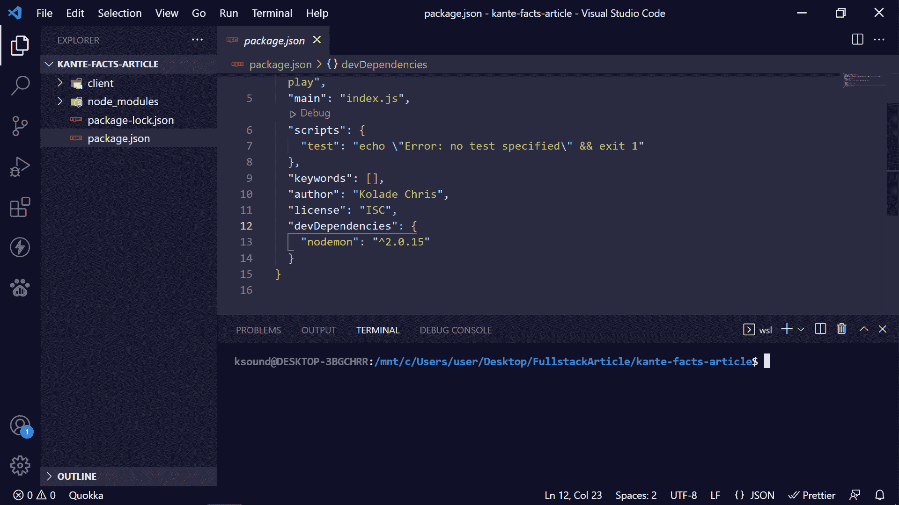
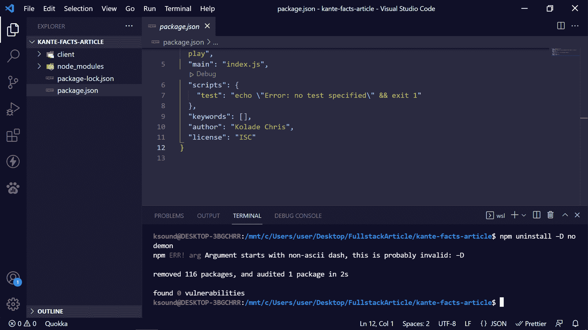
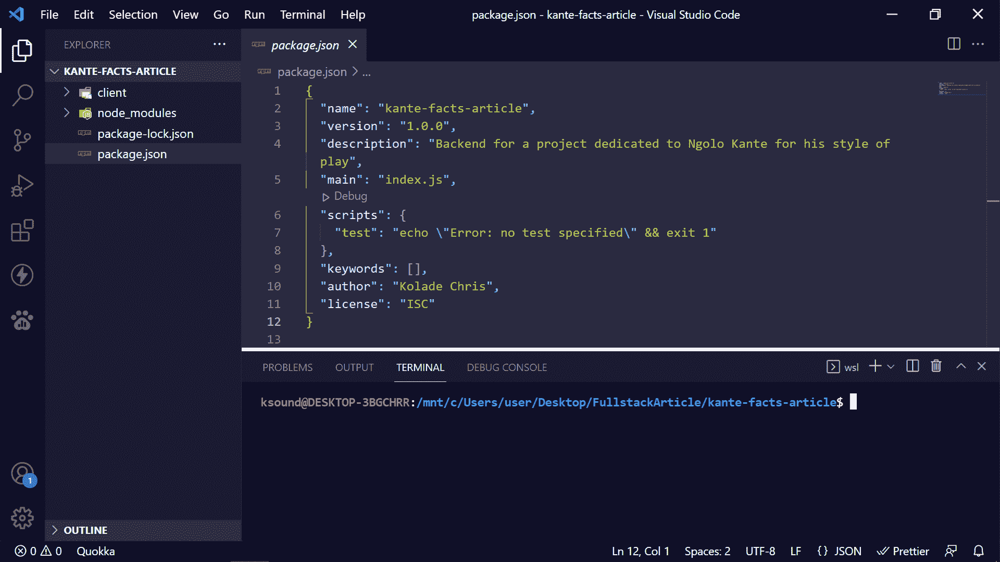
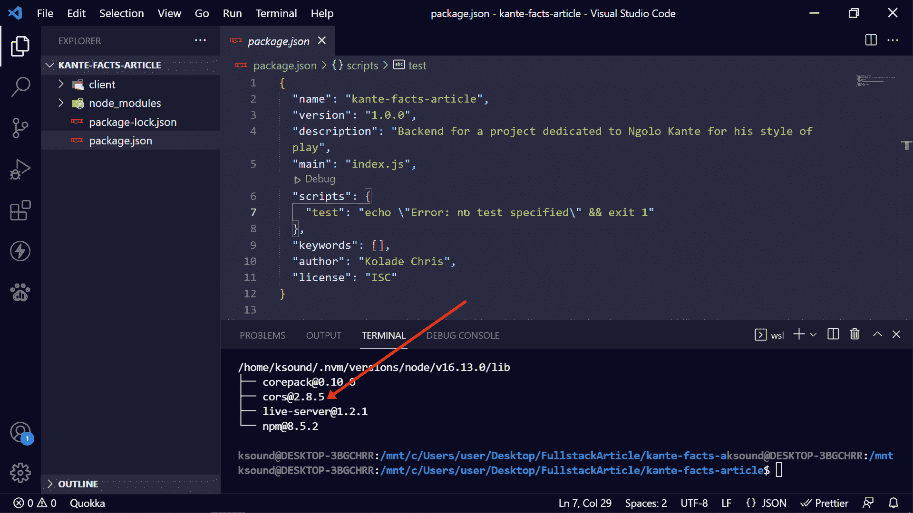
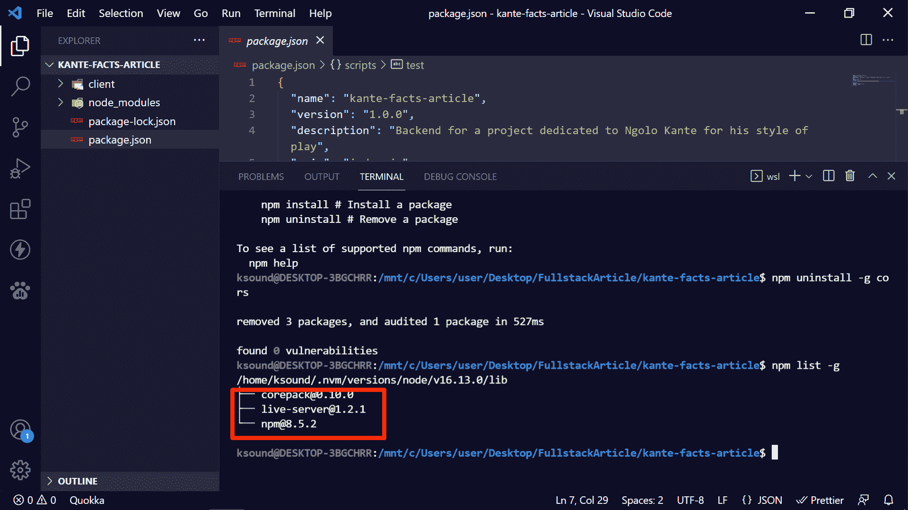

# npm 卸载–如何删除软件包

> 原文：<https://www.freecodecamp.org/news/npm-uninstall-how-to-remove-a-package/>

节点程序包管理器(NPM)提供了各种命令，让您可以使用程序包。

正如您可以从 npm 库中安装软件包一样，您也可以卸载它。

要卸载软件包，您可以使用 npm 为此目的提供的命令—`npm uninstall`。

不过，卸载一个常规包或依赖项的方式并不是卸载一个全局包和一个开发依赖项的方式。

在本文中，我将向您展示如何卸载一个常规包、一个全局包和一个 dev 依赖项。

## 如何使用 npm 卸载删除软件包

要用`npm uninstall`命令删除一个包，可以在包所在的目录中使用语法`npm uninstall package-name`。

我将用来演示如何卸载一个包的包是 Express——一个 NodeJS 框架。

在下面的截图中，可以看到 Express 在`package.json`文件中被列为依赖项。

但是在我运行`npm uninstall express`之后，你不会再看到 Express 被列为依赖项:

你可以看到已经没有快车了。甚至不再有依赖键，因为没有依赖。

## 如何使用 npm 卸载删除开发依赖项

开发依赖是一个只在开发过程中使用的包。

要删除一个 dev 依赖项，您需要将`-D`或`--save-dev`标记附加到 npm uninstall，然后指定包的名称。

这样做的基本语法是`npm uninstall -D package-name`或`npm uninstall --save-dev package-name`

您必须在依赖项所在的目录(文件夹)中运行该命令。

我将使用 Nodemon 来演示如何删除一个 dev 依赖项。

在开发过程中，Nodemon 允许 NodeJS 应用程序在检测到文件或文件夹发生变化时自动重新加载。

在下面的截图中，您可以看到 Nodemon 被列为 dev 依赖项。

要删除它，我将运行`npm uninstall –D nodemon`

您可以看到在`package.json`文件中已经没有 Nodemon 了。

## 如何使用 npm 卸载删除全局软件包

全局包是全局安装在您的计算机上的包，因此您不必在每次需要时都重新安装它。

要删除一个全局包，您需要将`-g`标志附加到 npm uninstall，然后指定包的名称。

这样做的基本语法是`npm uninstall -g package-name`。

为了向您展示如何删除全局包，我将使用一个名为 CORS(跨源资源共享)的包。

CORS 阻止浏览器的同源策略(SOP ),这样你就可以从一个浏览器向另一个浏览器发出请求。

在下面的截图中，可以看到 CORS 并没有被列为`package.json`文件中的一个包:

CORS 没有列出，因为它是全局安装在我的机器上，而不是在一个项目的目录中。

如果你在全球范围内安装了一个软件包，并且你想看到它，运行`npm list -g`

你可以看到 CORS 现在被列为全球套餐。

为了在全球范围内卸载 CORS，我现在将运行`npm uninstall -g cors`。

运行该命令后，当我运行`npm list –g`时，您可以看到不再有 CORS:

## 结论

在本文中，您了解了卸载不同种类的 NPM 包的各种方法，因此您可以更好地控制您的代码库并删除不必要的包。

感谢您的阅读。

如果你觉得这篇文章有帮助，请分享给其他人看。