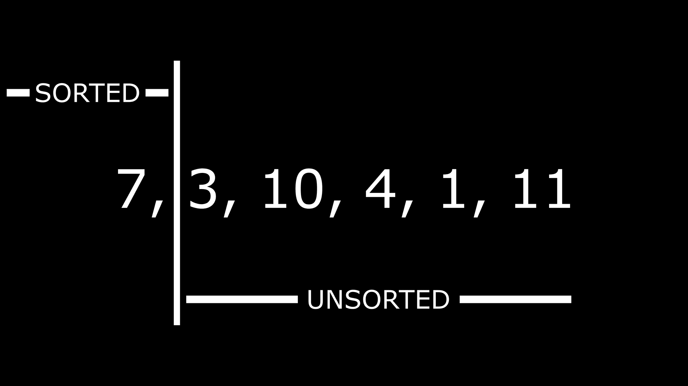
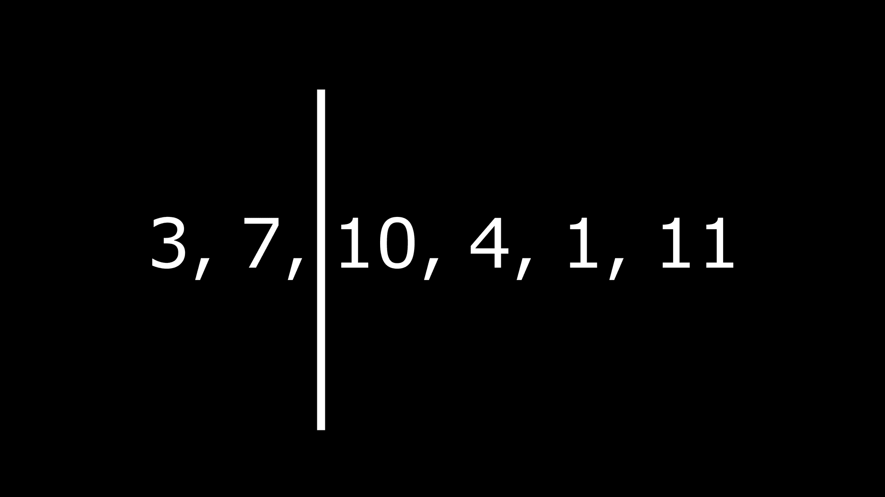
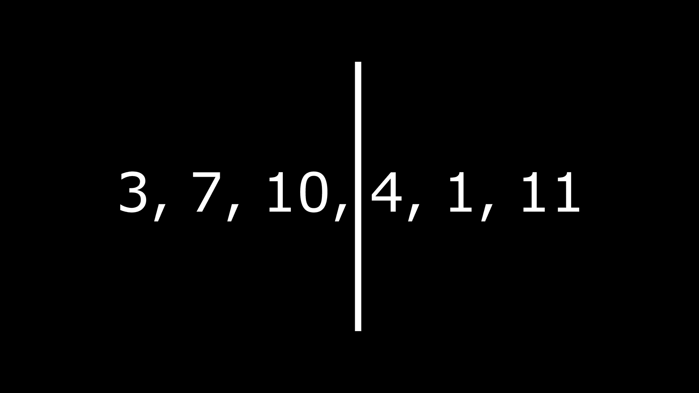

# 插入排序–Java 和 C++中的算法示例

> 原文：<https://www.freecodecamp.org/news/insertion-sort-algorithm-example-in-java-and-c/>

**插入排序**是一种排序算法，它从未排序的数组中创建一个排序的数组，一次一个项目。

在本文中，我们将看到算法如何工作，以及如何在我们的代码中应用它。

## 如何使用插入排序

考虑一组数字:7，3，10，4，1，11。这些数字没有按照任何顺序(升序或降序)进行排序/组织。使用插入排序算法，我们可以从最小到最大的数字对它们进行排序。

原始数组将被一分为二——排序后的数组和未排序的数组。然后，我们将从未排序的数组中挑选数字，并将它们放在正确的位置。

当一个数从未排序的数组中选取时，我们从排序后的数组的后面开始排序。如果选取的数字小于排序数组中的最后一个数字，则最后一个数字将向右移动，选定的数字将占据它的位置。迭代继续，直到选定的数字到达下一个要比较的数字不大于它的位置。

这看起来像是很多信息，但是您可以通过一个例子更好地理解:

这是我们的数列:7，3，10，4，1，11

我们将把这个数组一分为二——排序数组和未排序数组。像这样:



默认情况下，我们将第一个数字放在排序部分，因为我们将开始与它进行比较。

那么，我们如何对这个数组排序呢？

未排序数组中的第一个数字是 3，因此它成为选定的数字。当我们将 3 移动到排序后的数组时，那里的数字是 7。因为 7 大于 3，所以它将被移到右边，然后 3 将占据它的位置。

该阵列现在将如下所示:



对于 10，我们从后面的排序数组开始比较，后面的第一个数字是 7。因为 7 小于 10，所以不需要移位，所以 10 将直接停留在 7 之后。

现在看看每一面的数字的当前位置:



当这些数字在排序区域上移动时，它们的位置是如何变化的，您可能会有点困惑。让我们用下一个例子来证明这一点。

下一个要排序的数字是 4。

这是我们排序后的数组现在的样子:3，7，10。

现在要排序的当前数字是 4。所以从后面开始，我们比较 4 和 10。10 大于 4，所以它向右移动一个空格，为 4 空出一个空格。大概是这样的:3，7，？, 10.

问号是创造的空间。但是我们现在还不能插入 4；我们必须将它与下一个数字 7 进行比较。另一个空间将被创建，因为 7 大于 4，我们的数组看起来像这样:3，？, 7, 10.

下一个数字是 3。我们已经到达了这样一个点，被比较的数字小于我们从未排序的数组中选取的当前数字。因为 3 小于 4，所以 4 将被插入到最后创建的空格中。我们排序后的数组看起来像这样:3，4，7，10。

对于 1，如果你已经理解了最后一个例子，那么它应该很容易解决。你应该自己尝试排序并插入最后两个数字。

提醒一下，如果未排序数组中的当前数字小于排序数组中与之比较的任何数字，排序数组中的数字将向右移动，并在其先前位置创建一个空白空间来插入当前数字。

这将继续下去，直到当前数字到达一个大于与之比较的数字的位置。此时，将当前数字插入到最后创建的空间中。

当你完成后，数组将会是这样的:1，3，4，7，10，11。

让我们来看一些代码示例！

## Java 中的插入排序示例

如果我们想用代码来做这件事，下面是它的样子:

```
public class InsertionSort {

	void sortArray(int arr[])
	{
		int n = arr.length;
		for (int i = 1; i < n; i++) {
			int current = arr[i];
			int j = i - 1;

			while (j >= 0 && arr[j] > current) {
				arr[j + 1] = arr[j];
				j = j - 1;
			}
			arr[j + 1] = current;
		}
	}

	static void printArray(int arr[])
	{
		int n = arr.length;
		for (int i = 0; i < n; i++)
			System.out.print(arr[i] + " ");

		System.out.println();
	}

	public static void main(String args[])
	{
		int arr[] = { 7, 3, 10, 4, 1, 11 };

		InsertionSort arrayOfNumbers = new InsertionSort();
		arrayOfNumbers.sortArray(arr);

		printArray(arr);

        // prints 1 3 4 7 10 11
	}
} 
```

让我们来分解代码。

```
void sortArray(int arr[])
	{
		int n = arr.length;
		for (int i = 1; i < n; i++) {
			int current = arr[i];
			int j = i - 1;

			while (j >= 0 && arr[j] > current) {
				arr[j + 1] = arr[j];
				j = j - 1;
			}
			arr[j + 1] = current;
		}
	}
```

上面，我们创建了一个对数组排序的函数。它接受数组数据类型作为参数。然后，我们将数组长度存储在一个名为`n`的变量中。

在我们的循环中，您可能会注意到`i`变量是 1。你可能习惯于把它看作循环中的 0。这里是 1，因为我们从数组中的第二个值开始排序。

`current`变量是正在排序的当前值。`j`用于通过减少其值将`current`变量的位置向左移动。

接下来的 while 循环帮助我们通过提供的条件检查何时停止减少`current`变量的位置。

当满足这些条件时，当前值被插入到正确的点。这与我们在上一节中看到的示例相同。

```
static void printArray(int arr[])
	{
		int n = arr.length;
		for (int i = 0; i < n; i++)
			System.out.print(arr[i] + " ");

		System.out.println();
	}
```

上面的代码只是一个打印数组值的函数。

```
public static void main(String args[])
	{
		int arr[] = { 7, 3, 10, 4, 1, 11 };

		InsertionSort arrayOfNumbers = new InsertionSort();
		arrayOfNumbers.sortArray(arr);

		printArray(arr);

        // prints 1 3 4 7 10 11
	}
```

现在我们已经用它对数组进行了排序，然后我们用已经创建的函数打印出了值。

## C++中的插入排序示例

```
#include <bits/stdc++.h>
using namespace std;

void insertionSort(int arr[], int n)
{
	int i, current, j;
	for (i = 1; i < n; i++)
	{
		current = arr[i];
		j = i - 1;

		while (j >= 0 && arr[j] > current)
		{
			arr[j + 1] = arr[j];
			j = j - 1;
		}
		arr[j + 1] = current;
	}
}

void printArray(int arr[], int n)
{
	int i;
	for (i = 0; i < n; i++)
		cout << arr[i] << " ";
	cout << endl;
}

int main()
{
	int arrayOfNumbers[] = { 7, 3, 10, 4, 1, 11 };
	int n = sizeof(arrayOfNumbers) / sizeof(arrayOfNumbers[0]);

	insertionSort(arrayOfNumbers, n);
	printArray(arrayOfNumbers, n); // 1 3 4 7 10 11 

	return 0;
} 
```

该代码与我们在上一节中使用的代码相同。唯一不同的是我们在这一节用 C++写了。所以你可以看看上一节给出的解释，以便更好地理解。

## 结论

在本文中，我们通过一些例子了解了插入排序算法是如何工作的，以及如何在 Java 和 C++代码中应用它。

编码快乐！