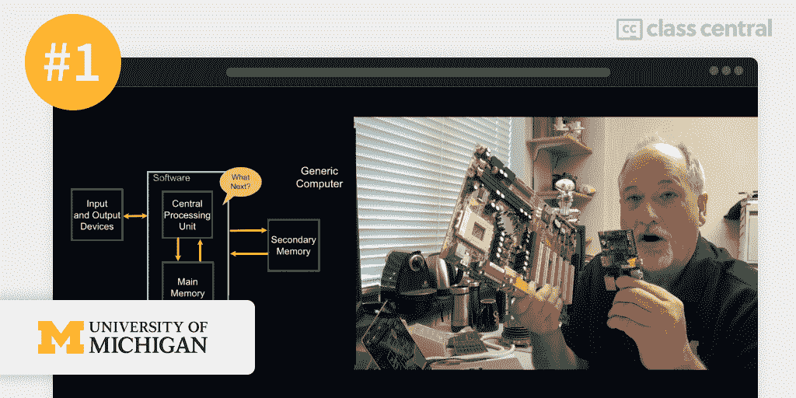
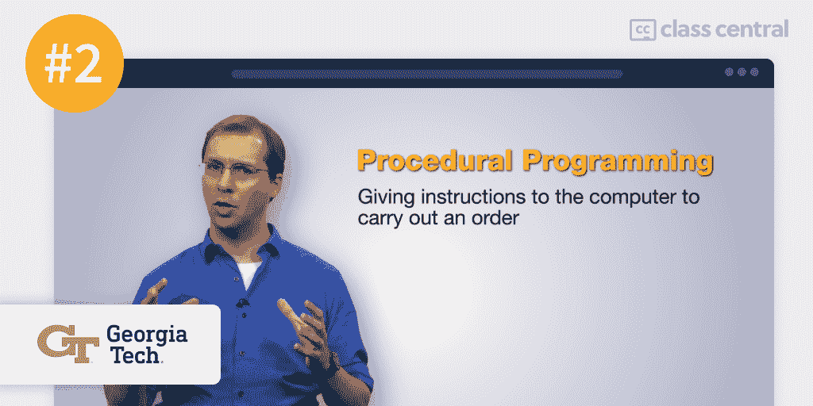
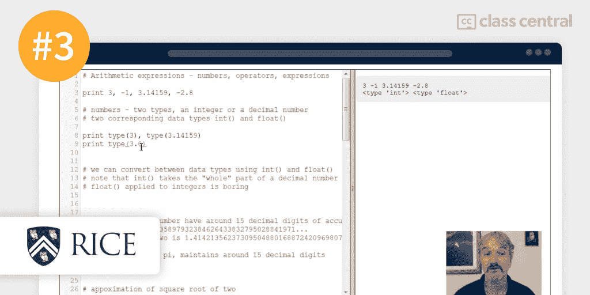
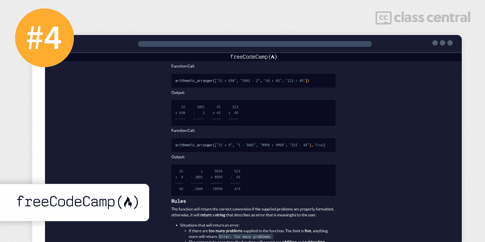
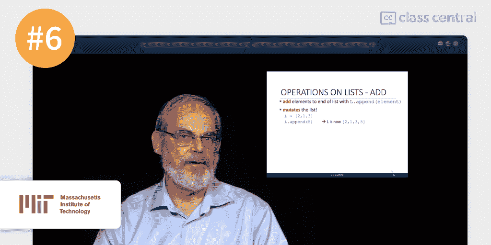
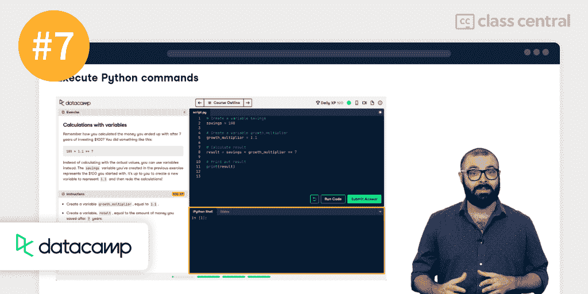
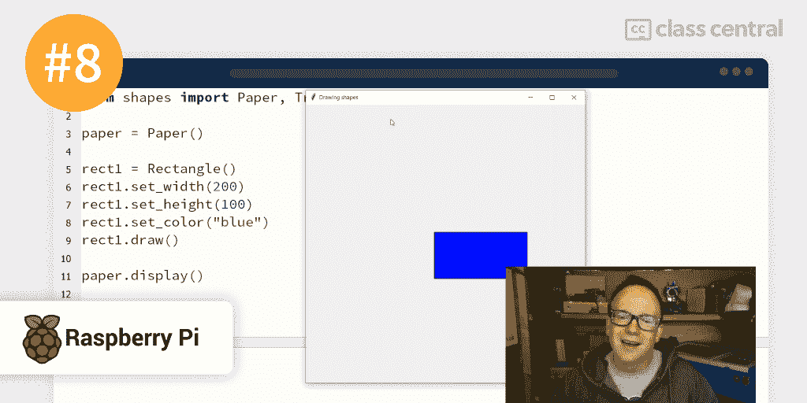
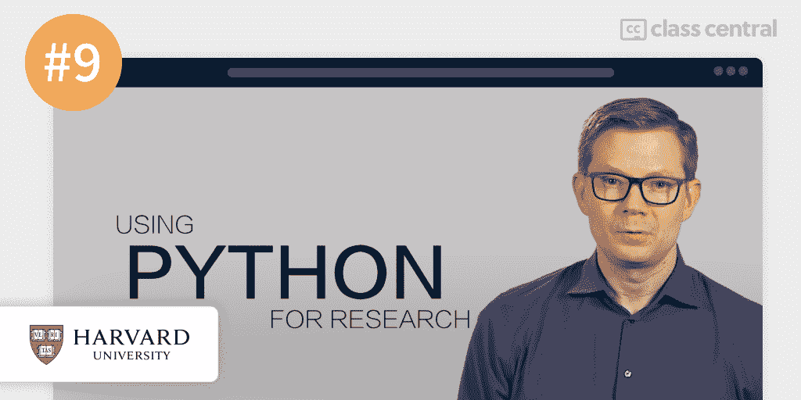
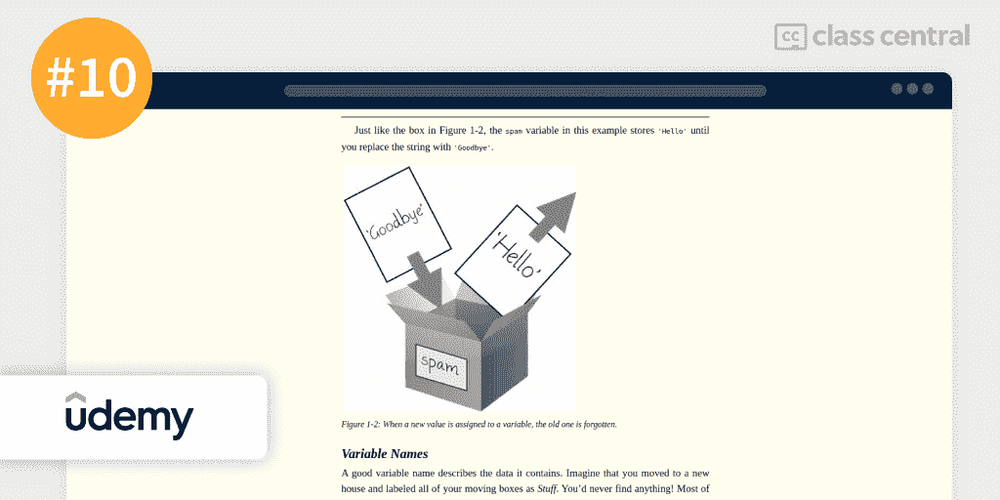

# 2022 年 10 门最佳 Python 课程

> 原文：<https://www.freecodecamp.org/news/best-python-courses/>

如果你想学习 Python，有很多很好的资源。

但是如果你正在专门寻找学习 Python 的最佳在线课程，那么你来对地方了。

在这篇文章中，我给出了一个很棒的 Python 课程列表，这些课程是根据一个经过验证的方法进行排名的，您可以在下面阅读👇。

但是，如果你想跳过阅读，这里是我的首选:

1.  [人人编程(密歇根大学)](#1-programming-for-everybody-getting-started-with-python-university-of-michigan-)
2.  [用 Python 计算(](#2-computing-in-python-i-fundamentals-and-procedural-programming-georgia-institute-of-technology-) [佐治亚理工](https://www.classcentral.com/course/edx-computing-in-python-i-fundamentals-and-procedural-programming-11469) [)](#2-computing-in-python-i-fundamentals-and-procedural-programming-georgia-institute-of-technology-)
3.  [Python 交互式编程入门(莱斯大学)](#3-an-introduction-to-interactive-programming-in-python-part-1-rice-university-)
4.  [用 Python 进行科学计算(freeCodeCamp)](#Scientific Computing with Python (freeCodeCamp))
5.  [Python(谷歌)速成班](#5-crash-course-on-python-google-)
6.  [计算机科学与使用 Python 编程入门(麻省理工学院)](#6-introduction-to-computer-science-and-programming-using-python-massachusetts-institute-of-technology-)
7.  [数据科学 Python 简介(DataCamp)](#7-intro-to-python-for-data-science-datacamp-)
8.  [Python 中的面向对象编程:创造你的冒险(Raspberry Pi Foundation)](#8-object-oriented-programming-in-python-create-your-own-adventure-game-raspberry-pi-foundation-)
9.  [使用 Python 进行研究(哈佛大学)](#9-using-python-for-research-harvard-university-)
10.  [用 Python 编程自动化枯燥的东西(Udemy)](#10-automate-the-boring-stuff-with-python-programming-udemy-)

## Python 是什么？

Python 是一种通用编程语言，它把简单性放在第一位。它通过隐藏诸如内存管理和代码样板等丑陋的细节来简化编程过程，而是选择友好的、人类可读的代码。它很容易理解，所以它是初学者学习的最好的语言之一。

[它的应用范围很广](https://github.com/vinta/awesome-python)——从创作游戏到制作网页应用。这种多功能性使它非常受欢迎。事实上， [Python 目前高居 TIOBE 指数](https://www.tiobe.com/tiobe-index/)的榜首，该指数对最常用的编程语言进行了排名。根据[栈溢出](https://insights.stackoverflow.com/survey/2021#technology-most-popular-technologies)，Python 是仅次于 JavaScript 和 HTML/CSS 的第三大流行语言。

Python 也是机器学习和数据分析的首选语言，70%的从业者更喜欢 Python 而不是其他类似的语言。

巧合的是，根据世界经济论坛的 [*未来就业报告*](https://www3.weforum.org/docs/WEF_Future_of_Jobs_2020.pdf) ，到 2025 年，对机器学习和数据科学专家的需求将比任何其他领域都要增长得快。

说到这里，如果你对机器学习感兴趣，这里有一个在线提供的[最佳机器学习课程](https://www.freecodecamp.org/news/best-machine-learning-courses/)的排名。

注意，Python 目前的主要版本是 Python 3，本列表中的每门课程都使用 Python 3。

## 课程排名方法

我遵循了三个步骤来建立这个排名:

首先是 T1，我是领先的在线课程搜索引擎 T2 课堂中心 T3 的成员。我们有一个超过 5 万门在线课程的数据库。所以这似乎是自然的起点。

单独建立排名就可以了。但是合作建立更好。所以我( [@elham](https://www.classcentral.com/@Elham) )和我的朋友兼同事 [@manoel](https://www.classcentral.com/@manoel) 一起建立了这个排名。

我们首先利用数据库对 Python 课程进行初步选择，查看评级、评论和课程书签等内容。因此，这是一个纯粹的数据驱动的步骤，依靠硬指标来创建一个初始排名，然后我们可以迭代和扩展。

使用这种方法，一些最佳选择很快变得明显，因为最好的 Python 课程往往会得到好评如潮。但我们并没有就此止步。评分和评论很少能说明事情的全部。所以下一步是将我们个人的在线教育知识融入其中。

第二个，我们用我们作为在线学习者的经验来评估我们的每一个初步选择。

我们都有计算机科学背景，都是多产的在线学习者，已经完成了大约 45 门 MOOCs 课程。此外，Manoel 拥有计算机科学的在线学士学位，而我目前正在完成计算机科学的基础课程——所以毫不奇怪，我们在学习期间都广泛使用了 Python。

马诺埃尔收集、分析并排列了这些课程，我写了你现在正在阅读的这篇文章。在整个过程中，我们互相交换想法，不断改进，直到我们都对最终结果感到满意。

**第三个**，在我们的研究中，我们遇到了一些感觉制作精良但并不知名的课程。如果我们采用纯粹以数据为中心的方法，我们将不得不把这些课程排除在排名之外，哪怕只是因为它们的注册人数较少。

相反，我们倾向于整体方法。我们在列表中加入了这些课程:更多的个人选择，希望会让那些已经看过或上过更受欢迎的 Python 课程并正在寻找一些不同的课程的人感到惊讶。

经过这一过程——结合班级中心数据、我们作为终身学习者的经验和大量编辑——我们得出了最终排名。到目前为止，我们已经花了超过 16 个小时来建立这个排名，我们打算在未来继续更新它。

## 课程排名统计

以下是一些关于排名的汇总数据:

*   总的来说，该排名中的课程累积了 900 万注册，其中 4 门课程的注册人数超过 100 万。
*   Coursera 有四门课程，是排名中最具代表性的课程提供商。
*   排名中最受欢迎的课程有大约 400 万人注册。
*   八门课程完全免费或免费审核。两个被支付。
*   这些课程在 Class Central 已经积累了 38k 的评论。

现在，让我们继续挑选吧！

## 1.[面向所有人的编程 Python 入门(密歇根大学)](https://www.classcentral.com/course/python-4319)

Dr. Chuck, course instructor

我认为最适合初学者的 Python 课程是密歇根大学在 Coursera 上提供的[面向所有人的编程](https://www.classcentral.com/course/python-4319)。这门课程是 Coursera 上最受欢迎的 Python 课程，注册人数接近 250 万，这是有充分理由的。

这门课程是对编程世界的友好介绍。它从一开始就假设你没有任何编码经验，也不知道程序如何工作。然后，它从一个概念转移到另一个概念，帮助您建立对 Python 语言的全面理解。

要学这门课，你只需要一些基本的算术。学完这门课程后，你就可以开始学习更高级的编程课程了。

### 你会学到什么

这门课程不会马上从编程开始，而是从你将要编程的东西开始:一台计算机。

计算机的基本组成部分是什么？什么是程序，计算机如何理解它？为什么计算机很容易不去做你让它做的事情？这些是你在课程第一部分结束时能够回答的问题。

之后，将向您展示如何在您的机器上安装和运行 Python，以及如何选择合适的代码编辑器。然后，你就可以写代码了！您将学到 Python 的词汇、其独特的“语法”以及更高级的编程概念。

您将知道如何编写变量和表达式来存储和计算不同数据类型的值。您将知道如何以及为什么可以在代码中使用条件语句来指定分支条件。您将学习函数和参数，以及如何利用它们进行代码重用。最后但同样重要的是，您将理解循环和迭代的作用。

本课程结束时，你将知道如何编写一个程序，接受用户输入，计算结果，并向用户返回输出。一次完整的经历！

### 你将如何学习

本课程分为 7 周，每周包含约 4 小时的视频讲座和编程任务。讲座本身是基于可以在附带的[课程网站](https://www.py4e.com/)上找到的书，并且它们已经被翻译成 9 种语言，如果英语不是你的强项的话。

编码评估通常每周要完成两到三次，可以在同一个课程网站上找到，将自动评分或由参加该课程的其他学习者评分。

| 机构 | 密歇根大学 |
| 供应商 | Coursera |
| 讲师 | 查尔斯·塞弗伦(又名查克博士) |
| 级别 | 初学者 |
| 工作量 | 总共 28 小时 |
| 报名人数 | 2.5 米 |
| 评级 | 4.8 / 5.0 (205K) |
| 证书 | 已付 |

### 有趣的事实

*   本课程是面向所有人的专业 [Python 五个课程中的第一个](https://www.classcentral.com/course/python-18625)。如果你想在完成本课程后总结你的 Python 技能，这里是系列的下一个: [Python 数据结构](https://www.classcentral.com/course/python-data-4174)——也可以免费审核。
*   如果你想免费参加整个专业，并有额外的项目，并在顶部获得免费认证，请查看排名第四位的。
*   本课程在 Class Central 上有超过 123，000 个书签和 35，000 个评论。
*   查克博士的课程是我们的[史上最受欢迎课程](https://www.classcentral.com/report/most-popular-online-courses/)和[史上最佳课程](https://www.classcentral.com/collection/top-free-online-courses)的一部分。所以，是的，这是一个简单的第一选择。
*   课程导师[查克博士](https://www.dr-chuck.com/)是一位超受欢迎的导师。如果你喜欢他的教学，一定要看看他在 [Django](https://www.coursera.org/specializations/django) 和 [Web 应用](https://www.coursera.org/specializations/web-applications)上的其他课程。

如果您对此课程感兴趣，您可以在这里找到[更多关于该课程以及如何注册的信息](https://www.classcentral.com/course/python-4319)。

## 2.[Python I 中的计算:基础和过程编程(佐治亚理工学院)](https://www.classcentral.com/course/edx-computing-in-python-i-fundamentals-and-procedural-programming-11469)

Dr. David Joyner, course instructor

我的第二个最佳 Python 课程是佐治亚理工学院 edX 上的[Python I 中的计算:基础和过程编程](https://www.classcentral.com/course/edx-computing-in-python-i-fundamentals-and-procedural-programming-11469)。

虽然只有基本的算术是必要的，但 Python 中的计算是一门强大的课程，旨在为希望全面了解编程及其他内容的学习者提供帮助。

这门课程不仅是 Python 的入门，也是计算机科学的基础，向学习者展示每个程序员都能从中受益的概念。

这门课由大卫·乔伊纳博士讲授。碰巧的是，我的同事 Manoel 已经在他的[在线硕士学位](https://omscs.gatech.edu/)的背景下修了他的四门课程，他甚至见过那个家伙。他只对大卫·乔伊纳和他的课程有好评，这些课程总是经过深思熟虑的，特别是在教学设计和教学方法方面。

该课程是[Python 编程专业证书](https://www.classcentral.com/course/introduction-to-python-programming-18449)入门的一部分，紧密匹配佐治亚理工学院的计算机科学本科入门，为你提供探索更高级概念和为职业世界做准备所需的技能。

### 你会学到什么

这门课程从介绍计算开始，并解释计算机是如何工作的。您将学习计算术语，并理解代码处理是如何工作的。

设置好编程环境后，您将了解编程的基本原则，比如编译和执行代码以及编写-运行-调试周期之间的区别。您将知道如何分析运行代码的结果，并使用这些结果来修改代码。

接下来，将向您介绍 Python 中过程化编程的范例。本课程让你认识到程序只是为了实现一个目的而执行的一系列代码，程序可以被链接起来实现更复杂的功能。

最后，你将学习变量，变量的不同类型，以及它们在程序中的作用。将向您介绍数学、关系和布尔运算符，并了解如何使用它们来表达代码中的复杂关系，甚至做出“决策”，例如仅当满足预定义的条件时才运行某些代码行。

### 你将如何学习

本课程包含 5 周的材料，预计你每周要花 9-10 个小时学习。这门课程附有一本作为基础的在线书籍。此外，每周致力于计算机科学和编程的一个特定领域。鼓励你跳过你已经知道的领域，以充分利用你的时间。

如果您免费旁听该课程，您将能够完成两种评估:练习和两次模拟测试。如果你是一个认证的学习者，你将有机会接触到章节级的问题集，并在课程结束时完成一个定时评估。

| 机构 | 乔治理工学院 |
| 供应商 | edX |
| 讲师 | 大卫·乔伊纳 |
| 级别 | 初学者 |
| 工作量 | 总共 50 小时 |
| 报名人数 | 207K |
| 评级 | 4.8 / 5.0 (213) |
| 证书 | 已付 |

### 有趣的事实

*   本课程的专业证书是在 [2020 年重塑教育奖](https://www.reimagine-education.com/winners-2020-2019-2/#1591154714692-81cd1471-5132)上获得计算和 IT 铜奖的一部分。
*   该课程在 Class Central 上的评分高达 4.8 分(满分为 5.0 分)，有数百条评论。
*   实际上，你将会完成乔治亚理工学院本科生的学分课程。

如果您对此课程感兴趣，您可以在这里找到[更多关于该课程以及如何注册的信息](https://www.classcentral.com/course/edx-computing-in-python-i-fundamentals-and-procedural-programming-11469)。

## 3.[Python 交互式编程介绍(第一部分)(莱斯大学)](https://www.classcentral.com/course/interactivepython1-408)

Prof. Joe Warren, course co-instructor

我的第三个最佳 Python 编程课程是莱斯大学在 Coursera 上提供的[Python 交互式编程导论(第一部分)](https://www.classcentral.com/course/interactivepython1-408)。

本课程旨在帮助很少或没有计算背景的学生学习用 Python 创建简单的交互式应用程序的基础，尽管你需要一些高中数学背景(希望你还记得毕达哥拉斯定理！).

本课程与其他课程的不同之处在于，它是基于项目的，鼓励你从零开始构建和研究东西，这对于现实世界中的开发人员来说是一项无价的技能。

不过，需要提醒的是，这门初学者课程并不容易。老师说，做困难的事情你会学得更快(我发现这是真的)，所以你必须付出大量的努力来完成课程。

### 你会学到什么

课程开始时，您将学习如何用 Python 表达算术表达式，以及如何给变量赋值。你会看到 Python 可以当计算器用！

接下来，本课程将从编程和视觉的角度介绍功能。这将让你了解函数是如何工作的，以及错误是如何产生的。T

讲师还会给出一些提示，告诉你如何根据代码产生的结果来调试代码。您将学习逻辑和比较操作符，以及条件语句，并使用这些概念来构建一个[石头剪刀布蜥蜴史波克游戏](https://en.wikipedia.org/wiki/Rock_paper_scissors#Additional_weapons)。

接下来，您将学习事件驱动编程的基础知识，这对构建游戏和应用程序至关重要。然后，您将学习什么是局部变量和全局变量，最终您将为一个数字猜谜游戏构建一个简单的响应图形用户界面。

您将学习如何处理用户给出的字符串，以及如何在画布上绘制文本和形状。您将使用这个概念来构建一个数字秒表，它将记录时间，精确到十分之一秒。

在课程结束时，您将在 Python 中重现经典游戏 Pong。在这个过程中，您将学习如何处理列表，如何读取用户的键盘输入，如何在应用程序中绘制和模拟乒乓球的运动，以及如何跟踪谁赢了谁输了。这将证明你有能力创建有许多活动部件的应用程序。

### 你将如何学习

本课程分为 5 周，每周涉及大约 7 到 10 个小时的材料，包括一个每周项目。该课程附带了一个名为 [CodeSkulptor](https://py2.codeskulptor.org/) 的网站，在这里你可以运行并提交你的 Python 脚本。

每周有两次自动评分的测验和一个由同学评分的每周项目。

| 机构 | 莱斯大学 |
| 供应商 | Coursera |
| 教官 | 约翰·格雷内尔、黄长兴、斯科特·里克斯纳、乔·沃伦 |
| 级别 | 初学者 |
| 工作量 | 总共 50 小时 |
| 报名人数 | 194K |
| 评级 | 4.8 / 5.0 (3.1K) |
| 证书 | 已付 |

### 有趣的事实

*   课程在课中央有 97.3k 书签和 3.3k 评论。
*   本课程是构成计算专业化基础[的七门课程中的第一门。获得专业化认证证书后，您将完成 20 多个项目，包括一个顶点项目。](https://www.classcentral.com/course/computer-fundamentals-18928)
*   课程讲师之一 Scott Rixner 博士已经为嵌入式系统和网络浏览器开发了 Python 解释器。他知道他的东西！

如果您对此课程感兴趣，您可以在这里找到[更多关于该课程以及如何注册的信息](https://www.classcentral.com/course/interactivepython1-408)。

## 4.[用 Python 进行科学计算(freeCodeCamp)](https://www.classcentral.com/course/freecodecamp-scientific-computing-with-python-34065)

Arithmetic formatter project on freeCodeCamp

由 freeCodeCamp 的人们提供的使用 Python 的科学计算是基于面向所有人的 T2 Python，Coursera 的专业包括 T4，这是排名第一的 T5。

然而，虽然 Coursera 上的专业化是付费的，但在 freeCodeCamp 上，你可以获得免费的结业证书。

此外，freeCodeCamp 认证包括额外的项目，因此，如果您已经完成了面向所有人的 Python 课程，并且想要应用您新获得的知识，您将在这里找到一些实践机会来磨练您的技能。

### 你会学到什么

除了 Python 为每个人提供的材料，你将参与五个科学计算项目。科学计算最常见于专业和技术行业，如工程或数据科学。在每个项目中，你会得到一些起始代码，并会被要求完成它。

第一个项目涉及构建一个算术格式化程序，它可以垂直对齐算术表达式，就像手工计算一样。您将学习解析字符串，如何处理边缘情况，以及如何在命令行中漂亮地格式化文本。

第二个项目涉及创建一个时间计算器。您必须解析初始时间和工作日，添加特定的持续时间(比如 14 小时)，最后返回新的时间和日期。

在第三个项目中，您将制作一个预算应用程序。项目结束时，您将了解如何创建作为预算类别的类和属性，然后在命令行中打印一个表示每个类别花费百分比的图表。

对于第四个项目，你的任务是创建矩形和正方形类。这些类应该包含形状属性以及计算面积或获得形状的字符串表示的方法。所以你真的可以练习 OOP，特别是继承。

最后，第五个也是最后一个项目要求你写一个函数来确定从帽子中随机抽取特定颜色的球的概率。通过面向对象编程，您将学习如何创建具有不同参数的函数，如何使用 Python 的随机模块，以及如何深入了解统计数据和概率。

### 你将如何学习

freeCodeCamp 上提供了 56 个完整的 Python 讲座集。每次讲座结束后，你会被问到你从视频中学到了什么。

总的来说，认证可能需要 300 个小时才能完成，但如果你已经知道一些编程的基本知识，它可能需要你一半的时间。

您还将创建 5 个科学计算项目，每个项目都会自动评分。

| 供应商 | freeCodeCamp |
| 讲师 | 查尔斯·塞弗伦 |
| 级别 | 初学者 |
| 工作量 | 总共 150 小时 |
| 证书 | 免费 |

### 有趣的事实

*   如你所知，freeCodeCamp 是一个非营利组织，帮助人们通过构建项目来学习编码，而且是免费的。他们提供免费认证的 10 门课程。
*   freeCodeCamp 的 Youtube 频道拥有超过 500 万用户和 1200 多个视频，涉及各种编程和计算机科学主题。(是的，我们是粉丝)
*   如果你想支持 freeCodeCamp 提供免费教育的使命，你可以在这里捐款。
*   关于 Chuck 博士的更多信息:他是密歇根大学的信息临床副教授，除了 freeCodeCamp，他的课程还在 Coursera、edX 和 FutureLearn 上提供，几乎在所有主要平台上都有。

如果您对此课程感兴趣，您可以在这里找到[更多关于该课程以及如何注册的信息](https://www.classcentral.com/course/freecodecamp-scientific-computing-with-python-34065)。

## 5.[Python(谷歌)速成班](https://www.classcentral.com/course/python-crash-course-18058)

Christine Rafla, Google system administrator

谷歌在 Coursera 上提供 Python 速成班，作为“与谷歌一起成长 T2 计划”的一部分。

本课程是关于 Python 的一门相当全面的课程，向您传授该语言的大部分特性。

这门课程不需要任何编程经验。本课程结束时，您将了解 Python 的功能，并能够用 Python 编写简单的程序。

### 你会学到什么

你将从学习编程的一般知识开始，以及为什么学习用你的计算机自动操作是一项节省时间的技能。

然后，将向您介绍 Python 及其特性。例如，您将能够识别、区分和转换 Python 中不同类型的数据类型，您将了解什么是函数以及它们在代码重用中的作用，您将了解 Python 提供的逻辑和比较运算符，以及条件语句。该课程还会教你如何使用注释来使你的代码更加整洁。

接下来，您将继续学习更高级的主题，如循环和迭代，以及如何避免创建无限循环。关于递归的一个简短部分——一个基本的(但很棘手！)编程概念—也包括在内。

您将深入研究常见的数据类型，如字符串、字典、元组和列表。您将知道如何从中提取某些值，以及如何修改它们。还有一个关于面向对象编程的可选部分，在这里您将了解类及其实例、属性、方法和继承。

您还将了解如何使用 docstrings 进行文档记录，如何导航和使用 Jupyter 笔记本，以及如何在代码中导入和使用 Python 模块。是的，这门课包含了很多信息。

### 你将如何学习

课程为期 6 周，每周 4 至 5 小时。你将通过视频讲座和补充笔记来学习，并在每周练习中练习你所学的内容。

关于作业，在每周末你必须完成一份评分作业。

| 组织 | 谷歌 |
| 供应商 | Coursera |
| 级别 | 初学者 |
| 工作量 | 总共 30 小时 |
| 报名人数 | 507K |
| 评级 | 4.8 / 5.0 (22K) |
| 证书 | 已付 |

### 有趣的事实

*   这是六门[谷歌 It 自动化与 Python 专业证书](https://www.classcentral.com/course/google-it-automation-18564)课程中的第一门。
*   该课程在 Coursera 上有大约 50 万人注册，有大约 2.2 万条评论。
*   [与谷歌一起成长计划](https://grow.google/)这门课程是为在线学习者提供的许多其他资源的一部分。

如果您对此课程感兴趣，您可以在这里找到[更多关于该课程以及如何注册的信息](https://www.classcentral.com/course/python-crash-course-18058)。

## 6.[计算机科学与使用 Python 编程入门(麻省理工学院)](https://www.classcentral.com/course/edx-introduction-to-computer-science-and-programming-using-python-1341)

Prof. Eric Grimson, course co-instructor

如果你阅读课程描述页面，你会看到麻省理工学院在 edX 上的[计算机科学和使用 Python 编程简介](https://www.classcentral.com/course/edx-introduction-to-computer-science-and-programming-using-python-1341)明确指出它不是 Python 的简介。所以你可能会奇怪我为什么把它列入这个排名。

嗯，学习 Python 本身很少是最终目标。学习 Python 是为了能够处理编码项目，或者作为学习其他东西的垫脚石——例如，计算机科学。如果你在那个位置，这个课程对你来说是一个极好的选择。

该课程的主要目的是为学生提供计算机科学中各种主题的简要介绍，侧重于广度而不是深度。这是为了让学生了解在考虑使用计算来完成特定目标时，无论是在学习还是职业生涯中，都有什么可能。

这门课程试图反映麻省理工学院的校园经历，所以它具有挑战性和综合性。就先决条件而言，你希望有一些高中代数知识，并愿意接受一些数学，因为这门计算机科学课程并不回避这一点。

### 你会学到什么

这门课程从简单介绍计算开始。它告诉你什么是计算机，它们做什么，以及它们的一些局限性。

它向您展示了编程语言的“配方”:如何组合低级结构(如变量)来构建高级功能(如成熟的程序)。它深入研究了 Python 的特性，特别是。

与本列表中的许多其他课程一样，您将学习 Python 中的对象和数据类型，并学习使用数学、逻辑或条件运算符构造简单的表达式。

您还将了解循环和迭代背后的基本概念，以及它们对于构建算法的重要性，例如，在没有明确“教授”如何做的情况下找到方程的解。

接下来，您将学习分解和抽象，以及函数如何实现这些目的和封装功能。您将知道如何编写函数并理解全局和局部作用域。你将理解递归以及它与数学归纳法的关系(你甚至可以用它来证明一些很酷的定理！).

在课程结束时，您将涉足数据结构池:您将了解列表、元组和字典。您将理解这些数据类型的可变性、别名和克隆的复杂性，以及对它们进行操作的方法。

### 你将如何学习

本课程为期 9 周，预计你每周要花大约 14 到 16 个小时学习课程材料。本课程有 6 章，每一章都包括几个讲座和多个活动来应用你的知识。

有 3 个问题集，还有一个期中考试和期末考试，如果你想获得证书，你必须完成。

| 机构 | 麻省理工学院 |
| 供应商 | edX |
| 教官 | 约翰·古塔格，埃里克·格里姆森，安娜·贝尔 |
| 级别 | 中级 |
| 工作量 | 总共 144 小时 |
| 报名人数 | 1.5 米 |
| 证书 | 已付 |

### 有趣的事实

*   本课程是关于 edX 的两门课程的 XSeries 课程的第一门。第二个是[计算思维与数据科学导论](https://www.classcentral.com/course/mitx-computational-thinking-using-python-18506)。
*   本课程教你如何安装 Anaconda，而不是默认的 Python 安装程序。Anaconda 是一个很好的工具，尤其是如果您喜欢数据科学的话。
*   其中一名讲师，约翰·古塔格教授领导着麻省理工学院著名的计算机科学和人工智能实验室的数据驱动推理小组( [CSAIL](https://www.csail.mit.edu/) )。

如果您对此课程感兴趣，您可以在这里找到[更多关于该课程以及如何注册的信息](https://www.classcentral.com/course/edx-introduction-to-computer-science-and-programming-using-python-1341)。

## 7.[数据科学 Python 简介(DataCamp)](https://www.classcentral.com/course/datacamp-intro-to-python-for-data-science-7631)

Dr. Hugo Bowne-Anderson, course instructor

DataCamp 提供的数据科学 Python 入门课程，正如课程名称所述:它专门教你数据科学 Python。

因此，如果你想以进入数据科学为最终目标学习 Python，或者如果你想了解数据科学是怎么一回事，这可能是一门非常好的课程。

### 你会学到什么

从 Python 的基础开始，您将了解变量和不同的数据类型。由于数字的精度在科学计算中非常重要，您将会学到 Python 何时隐式转换类型以及如何显式转换。

接下来，您将了解列表以及如何使用它们来存储数据。您将发现如何创建列表并通过子集化、扩展、替换或删除它们的元素来操作它们。

您将创建函数并向它们提供参数。此外，您还将了解字符串和列表等数据类型可能具有的不同方法以及如何使用它们。

在课程结束时，您将导入您的第一个 Python 包 NumPy。NumPy 是数据科学家和分析师使用的一个流行的 Python 包。您将了解 NumPy 数组和常规 Python 列表之间的区别，并看到使用 NumPy 计算和分析数据是多么容易。

### 你将如何学习

课程包括 4 章，每一章大约一小时。每次讲座后，你都有机会将你在练习中学到的东西应用到实践中。

您将使用 Datacamp 的浏览器内编程环境进行编码，这使得通过最少的设置即可轻松开始。

| 供应商 | 数据营 |
| 教官 | 雨果·鲍恩-安德森文森特·范布伦菲利普·舒华 |
| 级别 | 初学者 |
| 工作量 | 总共 4 小时 |
| 报名人数 | 4M |
| 证书 | 免费 |

### 有趣的事实

*   这是 DataCamp 上少数完全免费的课程之一。
*   这个课程只有四个小时:与这个排名中的一些更长的课程不同，这个课程非常侧重于 Python 基础，而且它也是一个复习课程。
*   如果在学完这门课程后，你想进一步探索数据科学，请查看我们列出的 2022 年要学的 [10 门最佳机器学习课程。](https://www.freecodecamp.org/news/best-machine-learning-courses/)

如果您对此课程感兴趣，您可以在这里找到[更多关于该课程以及如何注册的信息](https://www.classcentral.com/course/datacamp-intro-to-python-for-data-science-7631)。

## 8.[Python 中的面向对象编程:创建自己的冒险游戏(Raspberry Pi Foundation)](https://www.classcentral.com/course/object-oriented-principles-8884)

Martin O'Hanlon, course co-instructor

[Python 中的面向对象编程:创建你自己的冒险游戏](https://www.classcentral.com/course/object-oriented-principles-8884)是为那些已经掌握 Python 基本语法并想专门学习面向对象编程的人准备的，面向对象编程是 Python 支持的一种流行的编码范式。

这门课是由树莓派基金会在 FutureLearn 上提供的。课程结束时，您将创建自己的基于文本的冒险游戏。

### 你会学到什么

本课程首先向您介绍对象，并解释 Python 中几乎所有的东西都是对象。您将了解与每个对象相关的方法，并使用 Python 的 turtle 模块在画布上绘制不同颜色和大小的多种形状。

接下来，您将开始编写您的文本冒险游戏，这将涉及到提出您自己的类。您将了解可以用来操作实例属性的基本方法，比如 getters 和 setter——尽管 Python 在处理这一点上非常灵活。一点一点地，你会添加“房间”和“物品”到你的文字冒险世界。

您还将通过被称为继承和多态的概念来扩展其他人的类。例如，你可以给一个“角色类”添加新的属性和方法来制造一个你的玩家可以战斗的“敌人类”。

您将学习如何使用图来理解继承，如果您发现自己在计划更大规模的编码项目，这项技能在以后可能会很有用。

### 你将如何学习

课程为期四周，平均每周学习时间为 2 小时。课程材料由视频和附带文章组成。

FutureLearn 是非常社会化的:你可以在每篇文章下访问一个专门的论坛，在那里你可以与参加该课程的其他学习者进行讨论。

| 组织 | 树莓派粉底 |
| 供应商 | 未来电工 |
| 讲师 | 劳拉·萨克，马丁·奥汉隆 |
| 级别 | 中级 |
| 工作量 | 总共 8 小时 |
| 报名人数 | 54K |
| 评级 | 4.7 / 5.0 (133) |
| 证书 | 已付 |

### 有趣的事实

*   该课程基于[教授计算课程](https://teachcomputing.org/curriculum/key-stage-4/object-oriented-programming)。
*   首席讲师 Martin O'Hanlon 是一本教你如何在《我的世界》玩得开心的同时用 Python 编程的书的合著者。
*   树莓 pi 棒极了，其应用范围从机器人到网站托管。Pi 基金会还提供一门入门课程。

如果您对此课程感兴趣，您可以在这里找到[更多关于该课程以及如何注册的信息](https://www.classcentral.com/course/object-oriented-principles-8884)。

## 9.[使用 Python 进行研究(哈佛大学)](https://www.classcentral.com/course/edx-using-python-for-research-7204)

Prof. Jukka-Pekka JP Onnela, course instructor

由哈佛大学在 edX 上提供的使用 Python 进行研究填补了初级和高级 Python 课程之间的尴尬空白，为那些了解一些 Python 但不知道如何使用它的研究人员提供了帮助。

本课程向人们介绍科学计算中常用的 Python 模块和概念，如 NumPy 和 SciPy，以及统计学习。它允许学习者从一个知者上升到一个实干家，并在实际环境中应用他们的技能。

### 你会学到什么

本课程从 Python 3 的基础回顾开始，目的是让每个人都跟上速度，为接下来的几周做准备。不过，在此之前，建议你做一个自我评估测验，看看这门课程是否适合你。

在第 2 周，您将从学习 Python 中的作用域开始。然后，您将使用 NumPy 进入真正的科学计算，学习矢量化(批量处理计算的一种重要优化技术)，并使用 Python 中非常流行的可视化库 matplotlib 创建图表。

在第 3 周和第 4 周，您将探索 Python 如何应用于研究的具体示例——如果您愿意的话，是研究案例。这一探索将涉及 DNA 翻译、语言处理(NLP)、分类问题、利用 GPS 数据跟踪研究鸟类迁徙、社会网络分析等主题。

最后，您将探索统计学习。使用 SciPy，您将学习和应用线性和逻辑回归的基础知识，并学习如何使用随机森林来分析电影数据集。

### 你将如何学习

这门课程为期 5 周，你每周要花 2 到 4 个小时。视频讲座和项目材料作为资源提供，每周你会有一个或多个家庭作业要完成。

作为一名合格的学习者，你必须完成最后一个项目。

| 机构 | 哈佛大学 |
| 供应商 | edX |
| 讲师 | 祝你好运“jp” |
| 级别 | 中级 |
| 工作量 | 总共 20 小时 |
| 报名人数 | 308K |
| 证书 | 已付 |

### 有趣的事实

*   课程讲师 Jukka-Pekka "JP" Onnela 因其在数字表型方面的工作获得了 2013 年美国国家卫生研究院主任新人奖。
*   因此，他是哈佛大学生物统计学副教授也就不足为奇了。

如果您对此课程感兴趣，您可以在这里找到[更多关于该课程以及如何注册的信息](https://www.classcentral.com/course/edx-using-python-for-research-7204)。

## 10.[用 Python 编程自动化枯燥的东西(Udemy)](https://www.classcentral.com/course/udemy-automate-23543)

Excerpt from the book *Automate the Boring Stuff with Python*

最后，也是不容忽视的一点是[用 Python 编程自动化枯燥的东西](https://www.classcentral.com/course/udemy-automate-23543)，由 Al Sweigart 在 Udemy 上讲授。本课程基于同名书籍[用 Python](https://automatetheboringstuff.com/) 自动化枯燥的东西，在线免费阅读。

本课程相当全面，向您介绍了一些其他入门课程通常不提供的主题，如正则表达式、web 抓取和 GUI 自动化。另外，正如你可能已经猜到的那样，本课程非常注重实践和项目驱动。

### 你会学到什么

您将从在您的机器上安装 Python 开始，并熟悉 IDLE，Python 附带的默认编程环境。

您将通过图表的视觉效果了解控制流，让您很好地理解条件语句、循环和迭代等概念。您将创建自己的函数，并学习 Python 中的变量范围。

在通过构建猜数字游戏巩固您的理解之前，您还将学习如何处理“try-except”块中的错误。

当然，您将探索列表、字典和字符串等数据结构，以及如何操作它们。

使用命令行运行 Python 程序，您将发现如何在您的计算机上实现自动化:是的，课程名称是准确的！为此，您将学习正则表达式、如何导航目录以及如何读写文件。

该课程探索了自动化任务，如网页抓取、阅读和编辑 Excel、Word 或 PDF 文档、发送和检查电子邮件、使用 Python 控制鼠标和键盘以及实现图像识别脚本。

### 你将如何学习

这门课程分为 16 个部分，共 51 堂课。总共有大约 9 小时 30 分钟的讲座。

有 95 种可下载的资源，包括讲座和其他课程材料。

| 供应商 | 我们打 |
| 讲师 | 阿尔·斯威加特 |
| 级别 | 初学者 |
| 工作量 | 总共 10 个小时 |
| 报名人数 | 1M |
| 评级 | 4.6 / 5.0 (98K) |
| 证书 | 已付 |

### 有趣的事实

*   课程的创建者偶尔会在 Reddit 上免费发放他的课程的 Udemy 优惠券。
*   如果你已经完成了课程或书籍，并想继续学习更高级的 Python 内容，你可以看看作者的新书[Beyond the Basic Stuff with Python](https://inventwithpython.com/beyond/)，这本书也是免费在线的。

如果您对此课程感兴趣，您可以在这里找到[更多关于该课程以及如何注册的信息](https://www.classcentral.com/course/udemy-automate-23543)。