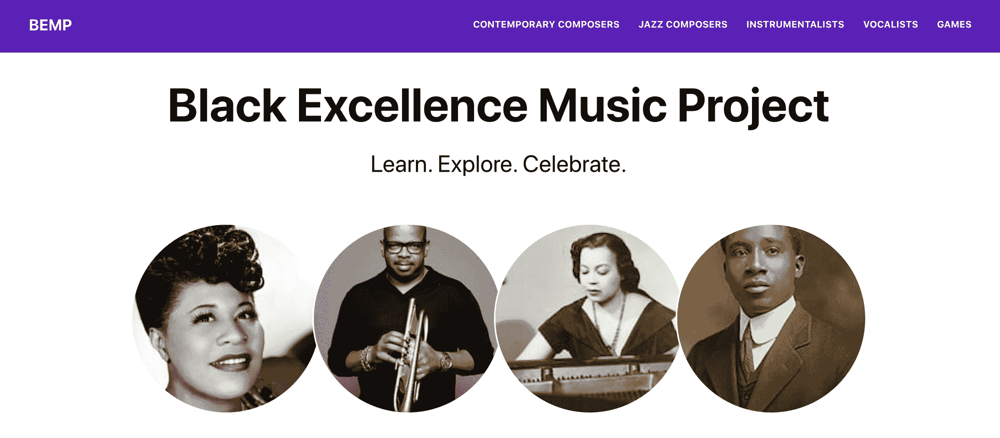
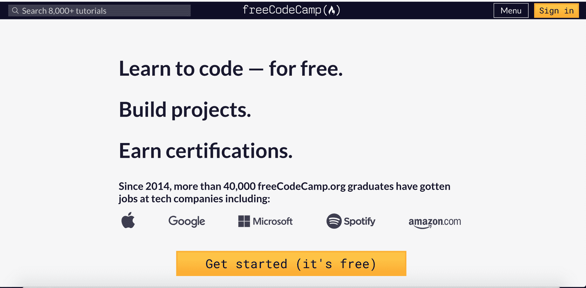
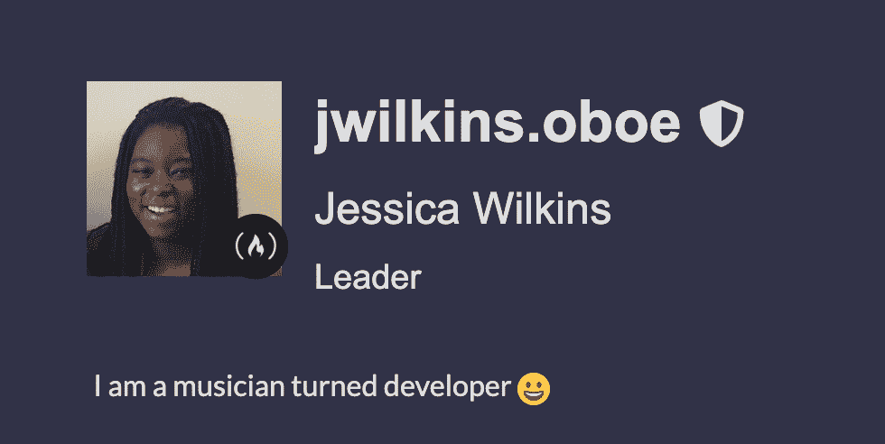
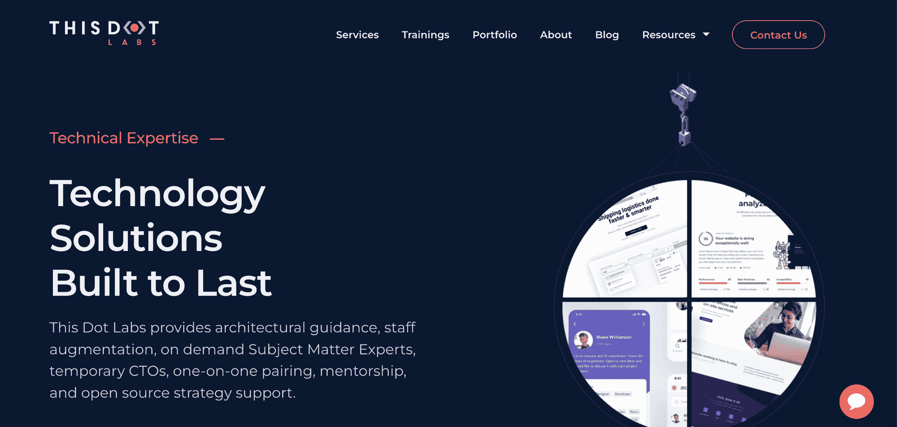
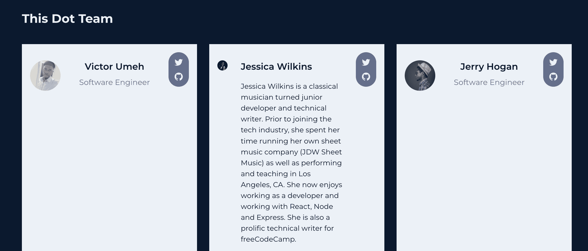

# 我是如何使用 freeCodeCamp 从古典音乐家变成软件开发人员的

> 原文：<https://www.freecodecamp.org/news/how-i-went-from-a-classical-musician-to-software-developer-and-techinal-writer/>

在疫情之前，我一生都在表演、教学和作曲。但在 2020 年 6 月，我决定学习如何编码，并成功找到了一份软件开发员的工作。

以下是我如何使用 [freeCodeCamp](https://www.freecodecamp.org/learn/) 学习如何编码的故事，以及我一路走来学到的经验教训。

## 我在疫情之前的生活

The Southeast Symphony

在我之前的职业生涯中，我在整个南加州的录音会议、歌剧、音乐剧、管弦乐队和管乐合奏中，过着非常活跃的教学、作曲和表演生活。

我的主要乐器是双簧管，我在大学时在 T2 伊斯曼音乐学院(学士学位)和 T4 大学(硕士学位)学习过。这是我[和洛杉矶风一起演奏协奏曲](https://youtu.be/g8ZBjYXqBkM?t=1033)的片段。

我也有创业精神，经营了 8 年自己的乐谱公司，名为 [JDW 乐谱](https://www.jdwsheetmusic.com/)。我对自己建立的职业生涯非常满意，但 2020 年 3 月改变了我的一切。

起初，我以为疫情奖只会持续几个月，我就能重返音乐生涯了。但令我惊讶的是，疫情向我敞开了软件开发的大门。

## 启发我学习如何编码的项目

Black Excellence Music Project

2020 年 6 月，由于乔治·弗洛伊德谋杀案，美国的种族紧张关系达到了历史最高点。各州爆发了声势浩大的抗议活动，包括古典世界在内的许多行业都在讨论缺乏多样性的问题。

我的许多朋友和同事都在寻找资源，以更多地了解过去和现在的黑人古典和爵士艺术家。我很快意识到没有一个中心网站可以让人们找到所有这些信息。

那就是[黑人卓越音乐项目](https://black-excellence-music-project.netlify.app/)的想法诞生的时候。我想创建一个网站，是教育和充满了数百名艺术家的个人资料和游戏。

所以我决定学习如何编码——但是不知道从哪里开始。

## 你好免费代码营

freeCodeCamp homepage

在我的编码之旅的开始，我浏览了不同的在线资源，开始学习 HTML 和 CSS。虽然我喜欢学习这些课程，但我真的想找到一种资源，我可以坚持并遵循一条特定的道路。

2020 年 7 月，我发现了 [freeCodeCamp](https://www.freecodecamp.org/learn) ，并决定尝试一下这个课程。我真的很喜欢互动的学习环境，通过建立认证项目学到了很多东西。

在接下来的几个月里，我努力完成了[响应式网页设计](https://www.freecodecamp.org/learn/responsive-web-design/)课程和 [JavaScript 算法和数据结构](https://www.freecodecamp.org/learn/javascript-algorithms-and-data-structures/)课程。

在我学习的时候，我想加入一个社区，与像我一样的自学成才的开发人员联系。所以我决定加入 [freeCodeCamp 论坛](https://forum.freecodecamp.org/)，希望能向其他开发者学习。

我一点也不知道，我在论坛上的参与会带来新的职业机会。

## 我是如何遇见昆西·拉森的

my freeCodeCamp profile

当我第一次加入[自由代码营论坛](https://forum.freecodecamp.org/)的时候，我从来没有计划过要那么活跃。但是这种能量是如此的热情和丰富，以至于我发现自己回答了很多问题，并说了一些鼓励的话。

在论坛上活跃了一个月后，我收到了一条来自昆西·拉森本人的消息。

我们安排了一次谷歌会议，最终聊到了我们在进入科技行业之前的职业。然后他建议我成为自由代码营新闻出版物的一名作家。

我很震惊，但对这个机会感到兴奋，所以我决定填写申请，并被接受为志愿作者。

我花了几个月的时间写我熟悉的主题，比如 HTML、CSS 和 JavaScript。

就在我认为事情不会变得更好的时候，另一个机会来了。

## 寻找初级开发人员

大约在 2020 年 10 月昆西联系我的同时，我收到了一封电子邮件，邮件内容是一个人在为他的软件公司寻找一名初级开发人员来完成一些小任务。

起初，我不确定这是合法的还是某种骗局。所以我决定做一些研究，发现这是合法的。

会议结束得很顺利，我将要做的工作听起来也很有趣。这不是一份全职工作，但它足以让我在学习如何编码的同时获得一些经验。

在我答应这份工作之前，我确实问过他一个问题，“你为什么选择我？”

在这一点上，我知道一点 HTML，CSS，香草 JavaScript 和刚刚开始学习反应。但是有很多更合格的初级开发人员知道的比我多，那么为什么我会被选中呢？

他解释说，他在论坛上找到了我，并喜欢我提供给其他用户的答案。他理解我在职业生涯的早期，但认为我可以学得很好，学得很快。

2020 年在一个强有力的音符中结束了，我已经准备好迎接这份新的兼职开发工作的挑战。

## 我第一次经历骗子综合症

当我开始做这份新的兼职工作时，有很多次我都感到力不从心。第一个时刻可能是我必须在本地机器上设置项目的时候。

到目前为止，我从未使用过真实世界的应用程序。我只使用 GitHub 页面为类构建过小项目或部署过个人项目。

但是我从来没有处理过建立一个包括数据库和后端系统的项目。我的老板指导我完成设置，并给了我在终端中运行的命令列表，但我几乎一点也不懂。

在那一刻，我开始怀疑我是否真的适合这份工作，也许雇佣我是个错误。但他向我保证，我做得很好，与这些事情斗争是完全正常的。

在 2021 年的过程中，有很多时候我觉得我可能无法完成分配给我的任务。但我一直试图安慰自己，这是一个学习的机会，我应该从中成长。

第一份工作非常有价值，因为我开始学习如何在真正的代码库中工作，并从一名高级开发人员那里学习如何改进我的代码。我现在视他为良师益友。

2021 年看起来是科技领域充满希望的一年，今年夏天，昆西再次联系我，给我提供了一个职位，让我作为自由代码营团队的一员进行写作。

带着前所未有的自信，我决定在 2021 年末寻求一个新的职业机会。

## 你好，这里是 Dot 实验室

This Dot Labs homepage

我第一次被介绍给这个 Dot Labs 是在 2021 年初，当我发布关于我的[黑人卓越音乐项目](https://black-excellence-music-project.netlify.app/)时，他们的 Twitter 账户开始关注我。

他们在我的一个帖子上留下了关于加入他们的下一个[女性科技聚会](https://women-in-tech.thisdotmedia.com/)的评论，所以我注册查看了一下。我喜欢上了会议的气氛，并认识了一些不可思议的女性软件工程师。

我继续参加他们每月一次的聚会，并开始更加积极地参与他们举办的其他活动。我也开始接触公司的其他现任和前任成员，建立简短的咖啡聊天来了解他们。

在接下来的几个月里，我继续建立关系，提高我的技能。2021 年 12 月，我决定是时候申请了。

## 面试过程

Dot Labs 的面试过程包括一系列行为问题、带回家的项目和最终的技术面试。

带回家的项目类似于你可以在 [freeCodeCamp 的编码面试准备部分](https://www.freecodecamp.org/learn/coding-interview-prep/)找到的项目。在最后的技术面试中，他们问了我一些关于我以前的开发工作经验和我个人项目的问题。

他们想知道 [Black Excellence 音乐项目](https://black-excellence-music-project.netlify.app/)的特点，我为什么选择 React 参与该项目以及未来的改进。我觉得我与面试官建立了良好的关系，并确保尽可能诚实、详细地回答所有问题。

当我收到电子邮件说我得到了那份工作时，我很兴奋。我知道这对我来说是一个很好的学习机会，也是我职业生涯中一个伟大的下一步。

## 我开始新工作的头几周

My This Dot Labs team profile

2022 年情人节那天，我第一天作为初级开发人员在 Dot Labs 工作。上午充满了入职会议，帮助我被介绍给我的经理、团队和项目。

一开始有点让人不知所措，因为我在为新项目设置后端时遇到了一些麻烦，而且有大量新信息需要消化。但是我尽力问问题，和我的新队友交流。

最初的几周充满了会议、代码审查和完成我的第一批票。我有过冒名顶替综合症的时候，因为我比团队中比我级别高的其他人慢得多。

但是我的团队非常支持我，让我放心，我进展得很好。我开始找到最佳状态，并对自己的技能更加自信。

## 我一路走来学到的教训

过去的一年半是一段疯狂、意想不到、有趣、有时令人沮丧的经历。但我一路走来确实学到了很多好的经验。

### 学好基本面，不要操之过急

我来自一个没有技术背景的家庭，学习如何编码对我来说并不总是那么容易。有很多时候，我在课程或班级项目中挣扎，并开始怀疑我是否能学会如何编码。

但我继续前进，并决定慢慢来。我知道跳过基础知识和匆忙完成学习过程是没有好处的。

我给新人的建议是，在基本面上打好基础，一路打好很多项目。

我建立了大量的小项目，仅仅是为了学习。构建项目可以让您更好地理解技术是如何工作的，并培养您的技术和调试技能。

### 建立一个你可以在面试中谈论的实质性的独特项目

初学者犯的最大错误之一是在简历和文件夹上展示课程项目。这种方法的问题在于，招聘经理和招聘人员已经看过几十遍同样的项目了。

课堂项目对学习目的很有帮助，在你第一次学习时也是很好的练习。但重要的是，也要构建需要一些时间、比小玩具应用程序更有实质内容的项目。

记住面试官会问你关于你的项目和你添加的功能。如果这是一个花了一两个小时完成的小项目，那就没什么可谈的了。

我的建议是，从你以前的职业或个人爱好中获得灵感，建造一些东西。或者甚至可以构建一些东西来帮助你自动化工作中的一些任务，或者构建一些对你所在的社区有益的东西。

### 公开学习

在公共场合学习是与其他开发人员联系的好方法，可能会带来意想不到的工作机会。我建议加入 Twitter，定期发布你的进步。

你可以发表关于你正在经历的课程或者你正在构建的项目。代码挑战 100 天是一种流行的方式。

请记住，一致性是关键，在一段时间内发布好的内容将有助于你建立一个追随者。你也永远不知道谁会阅读你的帖子。

### 加入社区，与其他开发人员联系

无论您在学习之旅的哪个阶段，加入开发人员社区进行学习和交流都是非常重要的。我从我所在的社区中学到了很多，也遇到了很多优秀的人。

当你在一个社区中建立联系时，他们可以帮助你度过困难的学习时刻，并帮助你找到好的工作机会。希望你能鼓舞他人，并在前进的道路上帮助他们。

有很多技术社区可以加入，包括 meetups、discords、chats、Slack groups、Twitter 等等。试着找一个支持初学者的小组，让你以自己觉得舒服的方式参与。

### 了解工作流程是如何运作的

在我旅程的开始，我确保研究工作流程实际上是如何工作的。我在[职业咨询区](https://forum.freecodecamp.org/c/career/299)阅读了几十篇论坛帖子，都是来自那些正在找工作的人。

我从别人那里学到了该做什么和不该做什么，也学到了获得第一份初级开发人员工作的方法。

我听到很多人抱怨说，这个过程应该像填写申请表一样简单，他们不应该做额外的事情，如建立在线存在或网络。

在一个完美的世界里，会是这样的。但是软件招聘过程并不是这样的。

我的建议是学习如何写好简历，学习如何建立关系网，学习如何写好 LinkedIn 个人资料，以及如何找到好的工作机会。

以下是一些有用的参考资料:

*   [没有工作经验如何撰写开发人员简历](https://www.freecodecamp.org/news/build-your-developer-resume-without-job-experience/)
*   [如何获得你的第一份开发工作——从查看职业转换者的简历中得到的启示](https://www.freecodecamp.org/news/how-to-get-your-first-dev-job/)
*   [如何写一份招聘人员会看的开发人员简历](https://www.freecodecamp.org/news/how-to-write-a-developer-resume-recruiters-will-read/)
*   [为什么你的简历被拒绝——如何解决这个问题](https://www.freecodecamp.org/news/why-your-resume-is-being-rejected/)
*   [如何使用 LINKEDIN 作为一名开发人员获得一份技术领域的工作！如何联网！](https://www.youtube.com/watch?v=SG5Sb5WTV_g)
*   如何找到一份软件工程师的工作
*   [面试秘密](https://www.youtube.com/watch?v=YjsSopoIJ2c)
*   面向开发者的博客！由 Hashnode 赞助！

我希望您喜欢这篇文章，并祝您的编程之旅好运。您也可以通过 [Twitter](https://twitter.com/codergirl1991) 与我联系。