# 网页动画性能基础——如何让你的网页看起来流畅

> 原文：<https://www.freecodecamp.org/news/web-animation-performance-fundamentals/>

如果我告诉你网页是由你的网络浏览器播放的交互式动画会怎么样？

每当我们在网页上时，我们都会看到各种各样的动作。

而且我说的不仅仅是 JavaScript 或者 CSS 动画。从技术上来说，滚动、缩放、文本选择甚至悬停在按钮上都是动画，工作方式类似。

事实上，它们是快速显示的连续图像，给我们一种运动的感觉或简单地反映一种变化。

每当 JavaScript 代码更改页面时，之前图像中的一个区域就会失效，浏览器会绘制一个新的区域。

这些改变可以简单到添加或删除一个`<div>`元素或者改变一个按钮的样式。

我们将这些图像称为**帧**。

[根据 W3C 帧时序指南](https://www.w3.org/TR/frame-timing/#h-introduction)，网络浏览器必须能够每秒显示六十帧(60 fps)。

当然，如果没有变化的话，一个帧会留在屏幕上。

我给你看一些例子怎么样？

当您滚动浏览页面时，浏览器会在您向下(或向上)滚动时显示文档的屏幕外区域。

下图显示了在几秒钟的滚动过程中产生和显示的连续帧。

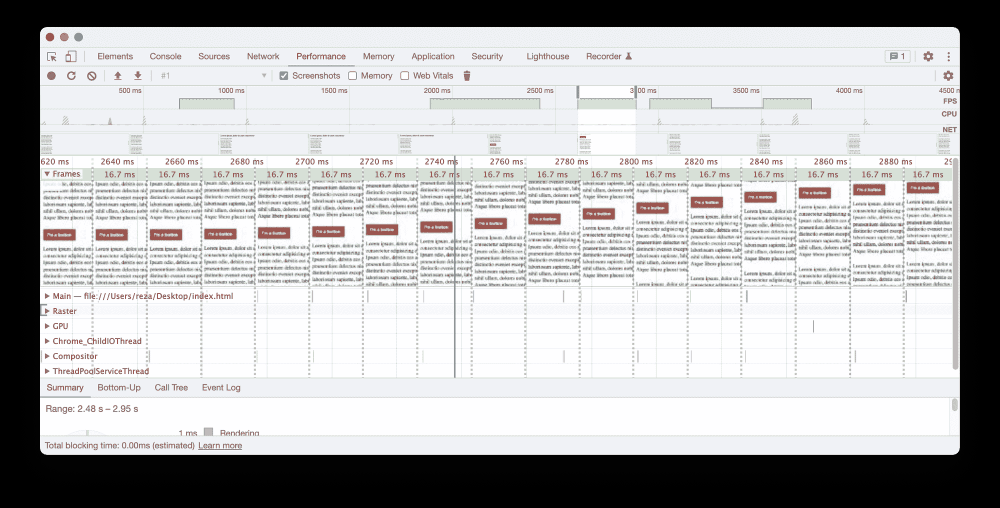

Generated frames during a few seconds of scrolling

如你所见，每一帧显示了 16.7 毫秒(60 fps)。

我用[谷歌 Chrome DevTools](https://developer.chrome.com/docs/devtools/) 制作了上面这段录音。如果你愿意，你可以复制它。在 DevTools 中，转到**性能**面板，点击记录按钮。然后，滚动页面几秒钟，并停止录制。

您将看到类似上面的概述。

即使您选择了一段文本，当您选择更多的字母和行时，也会显示新的框架。

在下面的录音中，我将鼠标移动到时间帧上来重放文本选择:

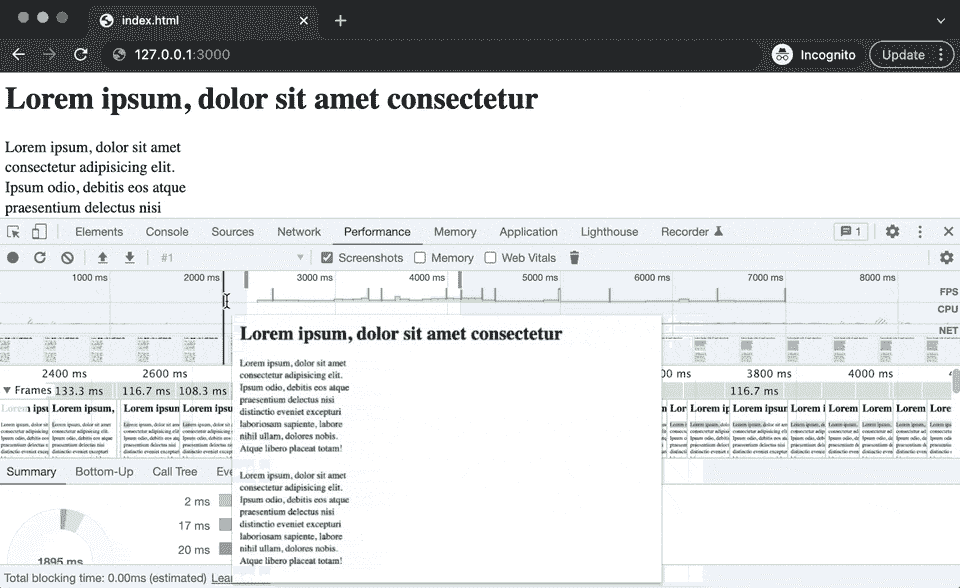

为什么我需要知道这些？你可能会问。

当一个页面不能快速响应用户交互或者有不稳定的动作时，一定是出了什么问题。

这通常是由于浏览器的主线程太忙了，以至于不能按时发送帧(下面会详细介绍)。

在本指南中，我将解释浏览器如何将代码转换成像素，以及我们如何使用它们来提供令人愉快的用户体验。

在本文中，我将重点介绍谷歌浏览器。然而，所有浏览器的高级概念都是相同的。

这里涉及许多理论，我希望你不要介意。

迈克尔·乔丹说过，“把基本面保持下去，你做的每一件事的水平都会上升。”

相信我，知道这些理论不会没有回报的！

你会对网页的变化有新的看法。最后我们会有很多动作。

## 刷新率还是帧率？

普通显示设备每秒刷新屏幕 60 次(60Hz)。

对于人眼来说，任何高于 12Hz 的频率都被认为是运动。Paul Bakaus 的这篇文章很好地解释了这个问题。

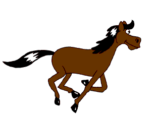

**[Animated Horse](https://en.wikipedia.org/wiki/Frame_rate#/media/File:Animhorse.gif)** (12 drawings per second) by [**Janke**](https://en.wikipedia.org/wiki/User:Janke), Licensed under **[CC BY-SA 2.5 ](https://creativecommons.org/licenses/by-sa/2.5/)**

有更高刷新率的屏幕，如 120Hz 或 144Hz，但 60Hz 是大多数显示设备的标准。

尽管刷新率不同于**帧速率**。

刷新率是显示设备在一秒钟内刷新图像的次数。帧速率是每秒捕获或绘制的任意数量的帧(在电影系统中)。

例如，录制电影的标准速率是 [24 fps](https://www.masterclass.com/articles/how-frame-rates-affect-film-and-video#3-standard-frame-rates-for-film-and-tv) ，尽管这不是现代电视的最高刷新率。

在这种情况下，显示设备使用一种算法来重复特定的帧，以使帧速率与其刷新率兼容。这意味着您可以在 144Hz 的电视上以原来的 24 fps 观看 24 fps 的电影。

你可能会问，为什么帧速率对网页如此重要？

以 120 fps 玩游戏的用户会注意到在同一台电脑上页面滚动缓慢。

他们也不会喜欢低于 60 fps 的网页动画。

你有没有碰到过那些有大量广告和 gif 的网站？我通常很快离开这样的网页，因为我知道找到另一个网站会节省我一些时间！

## 制作每一帧都有截止日期

浏览器绘制新的框架需要时间。

每秒显示 60 帧意味着每一帧必须在 16.7 毫秒(1 秒÷ 60)内准备就绪。

否则，该帧会被**延迟**或**丢弃**。这个问题通常在网页上被称为 **jank** 。


An animation with frame drops and delays

所以我们现在的首要任务很明确:我们需要让我们的页面免费👆。

但首先，我们需要知道一切是如何运作的。

## 框架是如何产生的

web 浏览器会生成一个新的框架，因为页面上的某些内容发生了变化。它应该反映这种变化。

网页在以下情况下会发生变化:

**用户与页面**交互。他们滚动，缩放，点击，选择一段文字，等等。

**一段 JavaScript 代码改变页面**。例如，它添加了一个`<div>`元素或者改变了一个 CSS 样式。

每一个变化都会启动一系列的任务，从而形成一个单一的框架。

这个任务序列被称为**像素流水线**、**渲染瀑布**或**渲染流水线**。

从高层次的角度来看，这就是它的样子:

*   **JavaScript 评估**–浏览器:哦，有东西变了！我需要生成一个新的框架。
*   **样式计算**–浏览器:现在我必须将类`some-class`应用于那个`<div>`元素。
*   **Layout(reflow)**–浏览器:我看到一些元素现在有了新的样式。我需要计算它们在屏幕上占了多少空间，以及它们应该基于这些样式放置在哪里。此外，我需要计算受此变化影响的每个其他元素的几何形状！
*   **Paint**–浏览器:现在，我应该将元素(有输出)分组到多个层中，并将每个层转换成内存或视频 RAM 中的位图表示。
*   **合成**–**浏览器:现在，我应该按照定义的顺序组合这些位图，形成最终的帧。**

**当第一次呈现网页时，也采取相同的步骤。**

**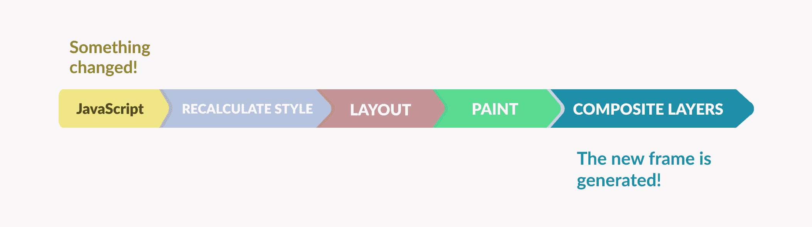

The pixel pipeline** 

**每个管道活动都会触发其后续活动。例如，布局触发绘画，并持续到最后一步。**

**我们需要留意管道中的每项活动，因为每项活动都可能导致低绩效。**

**让我们更好地了解他们。**

### **评估 JavaScript–当 JavaScript 代码运行时**

**您通常从您的 JavaScript 代码中更改页面。**

**我们中的许多人删除了这样一个元素:**

```
`let myBox = document.querySelector('.my-box')

if (myBox) {
 myBox.remove()
}`
```

**或者这样隐藏:**

```
`let myBox = document.querySelector('.my-box')

if (myBox) {
  myBox.style.display = 'none'
}`
```

**或者将 CSS 选择器添加到其类列表中:**

```
`let myBox = document.querySelector('.my-box')

if (myBox) {
  myBox.classList.add('my-special-box')
}`
```

**这些更改使文档的一部分无效，并使浏览器产生一个新的框架。**

### **样式–哪个 CSS 样式与哪个元素相配**

**接下来，web 浏览器基于匹配的选择器将新样式与相应的元素相关联。**

**例如，如果将类`my-special-box`添加到元素的类列表中:**

```
`let myBox = document.querySelector('.my-box')

if (myBox) {
  myBox.classList.add('my-special-box')
}`
```

**这一步是计算各自的样式并应用到元素的地方。**

**还有，你可能知道， [HTML 元素和样式分别被转换成 DOM 和 CSSOM 树](https://developers.google.com/web/fundamentals/performance/critical-rendering-path/constructing-the-object-model)。**

**浏览器在内部使用这些数据结构。但是它也通过[浏览器 API](https://www.decodingweb.dev/books/decoding-web-development/front-end-skills-to-get-you-started#web-apis)将它们暴露给 JavaScript。这就是我们在前面的例子中操作文档的方式——我们使用了 DOM API。**

**web 浏览器**将** DOM 和 CSSOM 结合起来，用它们计算出的 CSS 样式为`<body>`标签中的所有可见元素创建一个树。**

**这棵树叫做**渲染树，渲染树，**或者**帧树**。**

**拥有`content`的 CSS 伪元素也将出现在渲染树中。**

**现在的目标是将渲染树转化为图像。**

### **布局–更改后重新计算元素的几何图形**

**一个 HTML 元素的几何可以影响它的兄弟和子元素。**

**当您的代码添加(或移除)一个元素或改变其样式时，浏览器会重新计算该元素的新的维度和位置。**

**它还计算它可能影响的每个兄弟/子的尺寸和位置。**

**例如，如果你用 JavaScript 增加一个段落的`margin-top`,它将向下推文档中的每个后续元素。**

**或者，如果一个容器的`width`变小了，它的子容器可能也要缩小。**

**也就是说，对一个元素的几何形状的简单更改可能会迫使浏览器重新计算受该更改影响(直接或间接)的数百个其他元素的几何形状。**

**浏览器使用渲染树来重新计算视口内每个可见元素的几何图形。**

**这个过程也被称为**回流**。**

## **绘画–当代码转换为像素时**

**此时，web 浏览器已经拥有了它需要的所有数据结构。样式计算完毕，布局准备就绪。**

**根据渲染引擎(Blink、Gecko 等)的不同，内部会创建更多的抽象和辅助数据结构。但是由于浏览器的内部结构经常变化，我们将尽可能保持高层次的讨论。**

**下一步是将代码转化为像素。这个过程叫做绘画。**

**在这一步，浏览器的渲染器为渲染树中的每个元素创建一个绘制命令的显示列表。**

**这些命令看起来像基本的绘图命令:**画一个矩形**，**画一个圆**或者**在这些坐标上画一段文字**。**

**谷歌 Chrome 使用 [Skia](https://skia.org/) 来完成绘图工作。Skia 是一个 2D 图形库，它提供了跨各种平台的标准 API。**

**Chrome 将这些命令记录在 Skia `[SkPicture](https://api.skia.org/classSkPicture.html)`对象中。SkPicture 有一个`playback`方法，把画图命令一个一个发送到指定的画布上。**

**最终，显示列表的输出将是一组**位图**。**

**为了确保我们都在同一页上，让我们快速定义什么是位图。**

**您可能知道像素(图片元素)是数字图像的最小元素。每个图像都是一个像素网格(a*b)，每个像素都有特定的颜色。这些像素一起形成图像。**

**现在，什么是位图？**

**位图(在图形环境中)是一种将每个像素的颜色信息存储为一组位的方法。**

**

**[The smiley face](https://en.wikipedia.org/wiki/Raster_graphics#/media/File:Rgb-raster-image.svg)** (remixed), Licensed under **[CC0 1.0](https://creativecommons.org/publicdomain/zero/1.0/deed.en)**** 

**在上面的图像中，三个像素及其颜色信息(红色、绿色和蓝色的混合)被高亮显示。**

**这些值一起构成了图像的位图。**

**另一方面，位图是计算机在内存或存储设备中存储图像的方式。**

**将网页内容转换成位图被称为**绘制**或**栅格化**。**

**不过，什么也没画。这一步更像是绘制设置(或预绘制)，而不是实际的绘制工作。**

### **元素被绘制在多个层上**

**实际的油漆工作是由排字工人决定的。但是渲染器为合成器提供了足够的提示，说明元素应该如何绘制在多个层上。**

**一些元素被组合为一个图层并一起栅格化(它们共享同一个位图)。然而，一些元素被绘制在专用层上。**

**例如，在下面的动画中，元素被绘制到四个层上:**

 **[https://www.youtube.com/embed/sSgtcdklEgQ?feature=oembed](https://www.youtube.com/embed/sSgtcdklEgQ?feature=oembed)** 

**您可以在“图层”面板中看到这些图层。**

**要启用图层面板，在 Chrome DevTools 中，按住⌘+ **⇧** +P(或 Ctrl+ **⇧** Shift+P)来激活命令面板。然后，键入“显示图层”并运行它。**

**这些层(也称为复合层)使复合成为可能。**

**然后，这些复合层按照定义的顺序组合在一起，形成最终的图像(下文将详细介绍)。**

**复合图层类似于 Photoshop 等光栅图形编辑器中的图层。通过将形状作为层来管理，设计者可以在不影响其他形状的情况下变换形状。**

**如果你想改变一个展平的图像，你可能需要重新设计整个图像。**

**像 Photoshop 一样，将元素绘制到单独的图层上可以使网络浏览器显著减少绘制工作量。**

**因此，如果一个层上的一个元素被无效(它被改变)，只有相应层的无效区域(瓷砖)需要重新绘制。**

**呈现器考虑各种因素来做出分层决定。例如，如果一个元素的 CSS `opacity`将在运行时改变，它将被栅格化到一个专用层上。**

**您还可以使用`will-change`或`translateZ(0)` CSS 属性提升要在专用层上绘制的元素。**

**不过，您应该总是出于某种原因提升一个层。**

**拥有许多层会导致内存和处理时间的开销。这在容量有限的设备上可能会成为问题。**

### **合成:当最终帧生成时**

**合成器从呈现器接收具有辅助数据结构的显示列表。**

**它的工作(除了其他事情之外)是安排绘制多层元素。**

**根据页面上的内容(及其样式)，可以通过软件(软件光栅化)或直接在 GPU 上(硬件光栅化)进行绘制。**

**以下是它在谷歌 Chrome 上的工作方式(对于其他浏览器，你应该查看他们的设计文档):**

**在软件光栅化的情况下，图形命令由一组光栅工作线程执行，然后生成的位图作为纹理与 GPU 共享。**

**然而，如果硬件光栅化开始，Skia 通过向操作系统的图形 API 发出低级命令，直接在 GPU 上生成位图。**

**一旦层准备就绪，合成器可以在每个层上应用合成器级别的变换(如`transform`和`opacity`)。**

**最后，它将各层组合成一层。如果硬件加速打开，合成也将在 GPU 上完成——通过向操作系统的图形 API 发出低级命令。**

**记住这一部分，因为它在优化动画性能方面起着很大的作用。**

**

Layers after being composited** 

**每当我想到复合层，它就会让我想起旧的 cel 动画制作，其中每一帧都是在透明的赛璐珞片上绘制的。**

**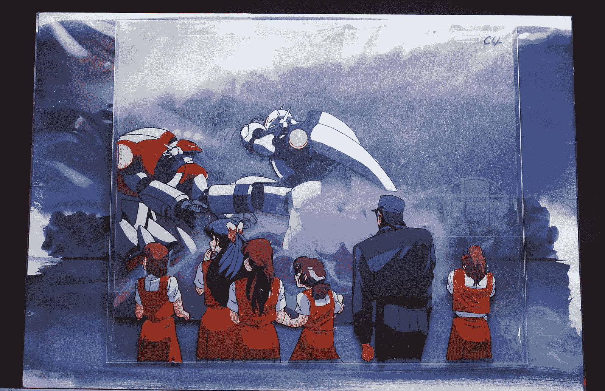

[**My GunBuster Animation Cel**](https://www.flickr.com/photos/gogdog/5281815537), Licensed **[CC BY-NC 2.0](https://creativecommons.org/licenses/by-nc/2.0/)**** 

**背景是一幅静态的图画，动画师把它向左移动了一英寸(用一个滚轮),并在上面放置了下一个 cel 帧。**

**这种技术大大减少了绘图工作，并帮助动画工作室将设计工作分配给多个团队。**

**如果你对这种古老的制作方法感到好奇，你可以观看迪士尼[动画制作白雪公主](https://www.youtube.com/watch?v=aQkJM13PMKw)的视频。**

**浏览器中的合成也有类似的目的:**当某些东西改变时，最小化绘画作品。****

**这是流水线的最后一步——新框架诞生的地方。**

## **如何优化管道活动**

**然而，还有一个问题。我如何才能避免不稳定的页面移动，并停止打扰我的用户？**

**这里有一些你应该做的事情。**

### **知道最昂贵的变化**

**并非所有的改变都涉及像素流水线的每一个活动。有些更改需要较少的工作，可能会跳过一两步。**

**对元素几何的任何更改(当您更改高度、宽度、左、上、下、右、填充、边距等)都会涉及整个管道。**

**这种类型的更改是您对网页所做的最昂贵的更改。**

**有时是必要的，但有时是完全可以避免的(我来告诉你怎么避免)。**

**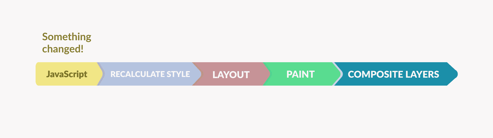

All steps of the pixel pipeline** 

### **优化漆面**

**如果你改变一个 div 的`background-color`属性，浏览器不需要重新计算它的几何图形——因为你只改变了颜色。**

**这意味着网络浏览器**这次跳过布局步骤**并跳转到绘画。**

**这幅画仍然是一项昂贵的任务。然而，你可以通过降低绘画的复杂性来优化它——选择简单的风格而不是复杂的风格。**

**例如，文本阴影或渐变比简单的背景色更昂贵。**

**总是问自己能不能选一套比较便宜的款式。有时候它们在审美上没什么区别。**

**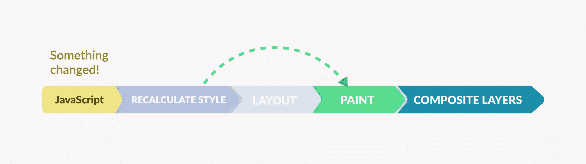

Pixel pipeline without the layout step** 

### ****使用仅复合转换****

**有些更改不需要布局和绘画，因为合成器可以自己应用它们。**

**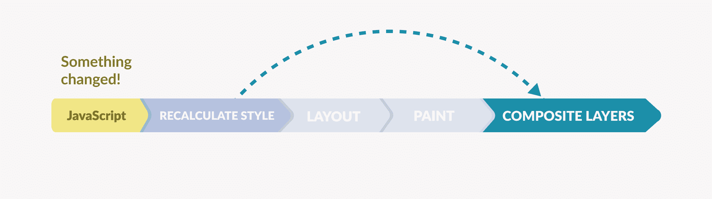

The pixel pipeline without Layout and Paint** 

**下面列出了浏览器在合成时可以低成本完成的更改:**

*   ****用变换重新定位**:`translate(mpx, npx)`**
*   ****用`transform:rotate(xdeg)`旋转****
*   ****缩放**与`transform: scale(x)`**
*   ****不透明度**与`opacity(x)`**

**这些 CSS 属性看起来就像是你在修改页面时所需要的全部(嗯，大部分)！**

**更好的是，如果硬件加速保持开启，合成器可以使用 GPU 的计算能力来应用这些转换。GPU 就是为此类工作负载而创建的。**

**因此，根据我们对 DOM 所做的更改，这个过程将是这三个场景之一。**

*   **JavaScript →样式→布局→绘画→合成**
*   **JavaScript →样式→绘画→合成**
*   **JavaScript →样式→复合**

**“表演是逃避工作的艺术。”**

**当然，最后一种情况是最便宜的选择。**

### **尽量减少主线程的工作量**

**网络浏览器基本上是一个计算机程序，作为一个计算机程序，它在运行时会在内存中有一个或多个进程。**

**大多数浏览器都有一个多进程架构，其中活动分布在不同进程的多个线程中(如渲染器进程和 GPU 进程、浏览器进程等)。**

**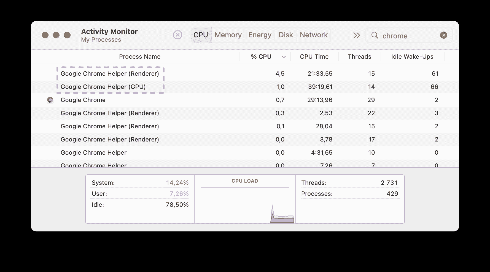

The Renderer and GPU process in Google Chrome** 

**在 Chrome 的情况下，JavaScript、样式、布局、画图设置发生在渲染器进程的主线程中(每个选项卡都有一个专用的渲染器)。**

**这几乎是一切！**

**浏览器最初通过 [HTTP 请求](https://www.decodingweb.dev/books/decoding-web-development/http)获取的 HTML 内容在专用线程上解析，但是渲染和您添加的任何内容都在主线程上解析。**

**也就是说，重点应该是减轻主线程的负担。反过来，它帮助我们获得一致的帧速率。**

**CSS 触发器网站可以帮助你理解改变 CSS 属性是如何触发布局、绘画和合成的。**

**您也可以使用我创建的这个备忘单:**

**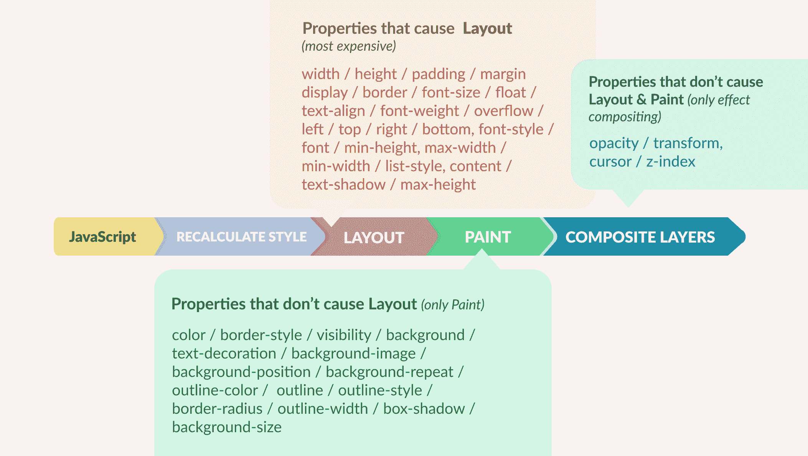

CSS properties and their initial step in the pixel pipeline** 

### **确保您的 JavaScript 回调赶上了火车！**

**好了，现在我们知道了如何帮助浏览器少走几步(可能的话！)，但是还有一点要考虑。**

**无论是动画还是一次性更改，我们都需要确保我们的更改与浏览器显示内容的帧速率同步。**

**这到底是什么意思？你可能会问。**

**想象一列行驶中的火车，有许多货车。**

**这列火车正在快速行驶，你有 16.7 毫秒的时间画一幅画，并把它扔进每节车厢(在它行驶的时候)。**

**如果你未能在 16.7 毫秒内装载一辆货车，它将短暂停止，直到你扔出图片。**

 **[https://giphy.com/embed/TlK63EDww4g4tXUd0gE](https://giphy.com/embed/TlK63EDww4g4tXUd0gE)

[通过 GIPHY](https://giphy.com/gifs/train-subway-station-TlK63EDww4g4tXUd0gE)

移动的火车可以是网页上的任何移动。它可以是动画、过渡、页面滚动、文本选择或任何其他动作。

如果火车不得不为你停下来，它会延迟发送帧。用户会注意到，也不会喜欢！

任何时候你想换页，你都需要以某种方式在 16.7 毫秒的时间段内滑动你的作品而不减慢它。

不过，有时候做起来很棘手。

很多开发者还在用`setInterval()`做定时循环。例如，重复动作或创建动画。

不过，`setInterval()`有一个问题。它没有足够的精度以你定义的精确频率运行你的代码。

如果您将时间间隔设置为每 16.7 毫秒重复一次代码，那么您的代码可以在每个 16.7 毫秒的时间段内的任何时间点运行。

因此，如果我们有 16.7 毫秒来进行更改，生成帧，并将其加载到专用的货车上，我们需要确保我们的代码在每个 16.7 毫秒的时隙开始时正确执行。

否则，它将需要超过 16.7 毫秒才能完成，并且不会为当前插槽做好准备。

如果有一种方法可以在每个 16.7 毫秒的时隙开始时运行回调会怎么样？

就是为此而设计的。

它确保你的回调在下一帧的开始被执行。


requestAnimationFrame() v.s. setInterval()

这样，你的代码有更大的机会在 10 毫秒的时间内完成，从而在 16.7 毫秒的总持续时间内为 web 浏览器留下足够的时间来完成它的内部工作

所以与其说:

```
setInterval(
	() => {
    	// make some change
    },
    16.7
)
```

您可以:

```
const animateSomething = function () {
	// make some change

    // Next call
    requestAnimationFrame(animateSomething)
}

// First manual call to start the animation
requestAnimationFrame(animateSomething)
```

使用`requestAnimationFrame`的另一个好处是浏览器可以更高效地运行你的动画。

例如，如果用户切换到另一个选项卡，浏览器将暂停动画。这减少了处理时间和电池寿命。

## 如何优化动画——看它的实际效果

正如所承诺的，是时候做一些实验了。

对于这个实验，我用两种不同的方式制作了一个动画。

这部动画讲述的是一架飞机在日落时飞过地平线。

在第一种方法中，我使用了所有的布局触发属性(左和上),而不用担心任何性能上的权衡。

我还用 16.7 毫秒的频率为我的定时循环`setInterval`。

在第二种方法中，我重构了代码并使用了仅支持合成器的样式。我还用`will-change`属性提升了我的移动元素(飞机),以确保它有自己的层。

为了更好地计时，我还用`requestAnimationFrame`替换了`setInterval`。

为了模拟飞机的运动，我用`Math.sine()`做了一些调整。行进路径也用基于 SVG 的正弦图绘制。

下面是第一种方法的[代码链接](https://codepen.io/lavary/pen/YzEpLbE):

[https://codepen.io/lavary/embed/preview/YzEpLbE?default-tabs=css%2Cresult&height=300&host=https%3A%2F%2Fcodepen.io&slug-hash=YzEpLbE](https://codepen.io/lavary/embed/preview/YzEpLbE?default-tabs=css%2Cresult&height=300&host=https%3A%2F%2Fcodepen.io&slug-hash=YzEpLbE)

以及[第二种方式](https://codepen.io/lavary/pen/eYvOojp)带图层提升(`will-change: transform`)仅限排版风格(`transform: translate()`)，以及`requestAnimationFrame`:

[https://codepen.io/lavary/embed/preview/eYvOojp?default-tabs=css%2Cresult&height=300&host=https%3A%2F%2Fcodepen.io&slug-hash=eYvOojp](https://codepen.io/lavary/embed/preview/eYvOojp?default-tabs=css%2Cresult&height=300&host=https%3A%2F%2Fcodepen.io&slug-hash=eYvOojp)

### 让我们比较一下这两种方法

您可以使用的指标之一是帧速率。它有助于您在运动过程中监控帧的一致性。

看看下面的录音:

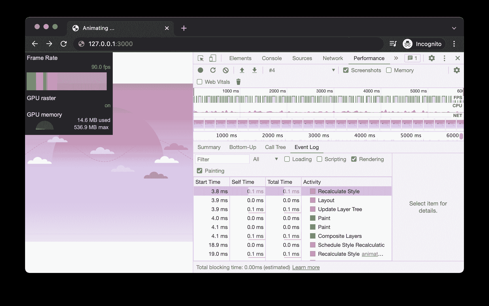

你可以在上图中看到 FPS 米(截图左上角)。尽管屏幕截图显示 90 帧/秒，但黄/红条表示一些帧被错过或延迟。

事件日志(右下方)显示了录制过程中涉及的所有步骤:**重新计算样式>布局>绘制>复合图层。**

要启用 FPS 计量器，在 Chrome DevTools 中，按住⌘+ **⇧** +P(或 Ctrl+ **⇧** Shift+P)来激活命令调板。然后，键入`FPS meter`并选择显示每秒帧数(FPS)米。

这里有一个快速阅读指南:

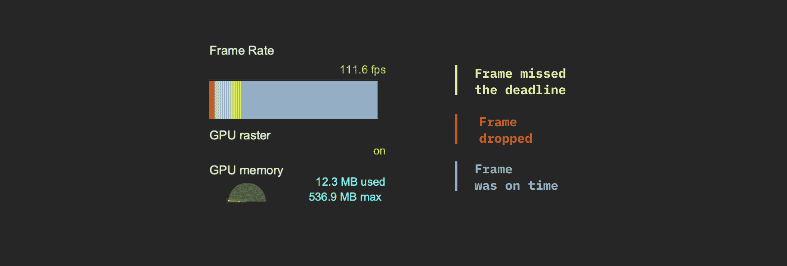

FPS meter

现在，让我们来衡量第二种方法:


在第二次录制中，平均 FPS 为 118.8，没有丢失或丢帧。

事件日志也确认没有布局和绘画是必要的，合成器做了所有的事情(重新计算样式→合成层)。

你也可以使用 Chrome 的**绘画闪烁**工具来查看页面的哪些部分被重画。这对于在用户交互过程中检测不需要的绘画非常有用。

在飞机示例中，被重画的区域(移动的飞机)显示为绿色边框的矩形。

[https://www.youtube.com/embed/1rd2aemUGCE?feature=oembed](https://www.youtube.com/embed/1rd2aemUGCE?feature=oembed)

为第二种方法启用绘画闪烁不会显示任何内容，因为在动画过程中没有绘画。

问题是用户能注意到这种改进吗？

让我们看看。

这两个动画都是慢动作(慢了 10 倍),看看有没有什么变化:

[https://www.youtube.com/embed/X05WCbC-ITY?feature=oembed](https://www.youtube.com/embed/X05WCbC-ITY?feature=oembed)

我将让你来判断。

## 太长；没看？

要在页面上实现流畅的动作，您需要做的就是确保:

*   Fames 准时送达
*   帧始终按时**交付**

下面是实现这一目标的清单:

*   通过使用`requestAnimationFrame`，确保您的 JavaScript 更改发生在每一帧的开始。
*   当改变一个元素的尺寸时，使用`transform:scale()`超过`height` & `width`。
*   要移动元素，总是在坐标上使用`transform: translate()`(`top`、`right`、`bottom`和`left`)。
*   通过使用简单的 CSS 样式而不是昂贵的样式来降低绘画的复杂性。例如，如果可能的话，在渐变或阴影上使用纯色。
*   使用移动版本上的过渡进行标准化。尽管手机的计算能力有限，但由于手机屏幕较小，移动版 UX 通常包含更多的过渡/效果。
*   使用浏览器的开发工具来诊断动画性能。使用绘画闪烁和 FPS 指示器等工具来微调动画。
*   使用 DevTool 的性能面板来查看您的代码如何在低端设备上运行。

您可以在进行任何类型的更改时应用这些微优化。无论你是在制作 JavaScript 还是 CSS 动画，或者只是用 JavaScript 做一次性的改变。

这是本指南的开头一行:

> 如果我告诉你网页是由你的网络浏览器播放的交互式动画会怎么样？

但是，如果我现在告诉你这只是冰山一角呢？！

不要担心，你已经可以做很多事情来使你的网页看起来赏心悦目。

如果你想让你的性能知识更上一层楼，我维护了一个[专用页面，从各个创作者那里收集 web 性能资源](https://www.decodingweb.dev/courses/web-performance)。看看吧！

如果您有任何问题或意见，或者我遗漏了什么(或者我弄错了)，请随时在 Twitter *上通过 **@lavary_** 提问。*

感谢阅读！

### 属性:

*   贴出图片: **[白兔](https://commons.wikimedia.org/wiki/File:Antics_2-D_Animation_infobox_screenshot.png)** 的滑稽动作二维动画【图片被裁剪】由**滑稽工作室**下 **[CC BY-SA 3.0](https://creativecommons.org/licenses/by-sa/3.0/)****