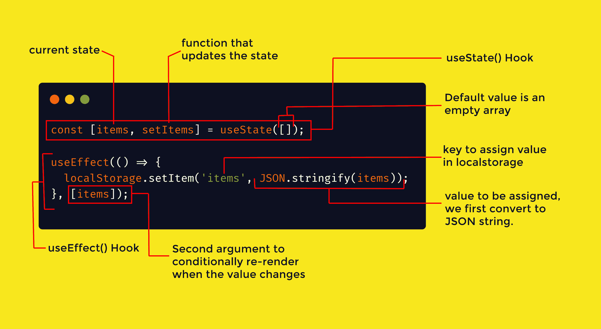
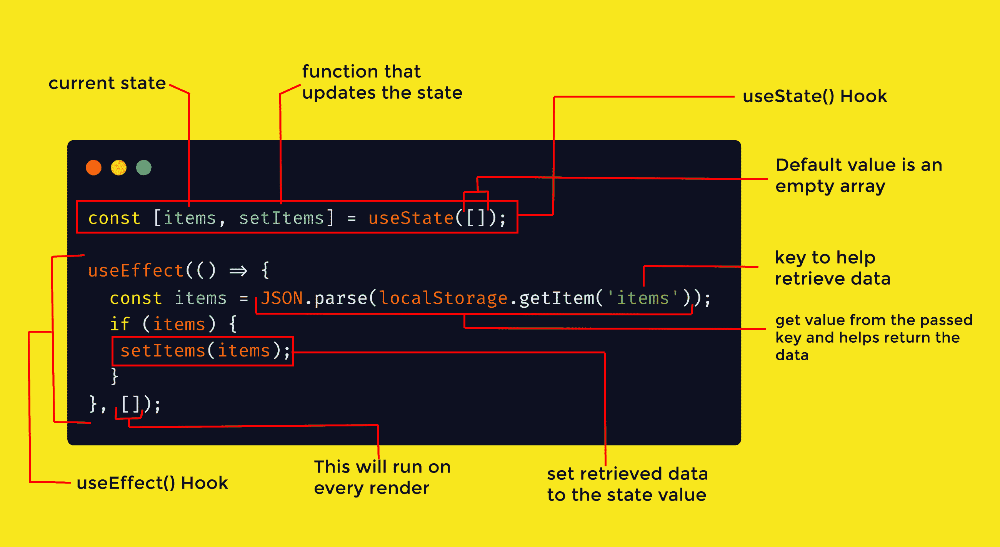

# 如何使用带有 React 挂钩的 localStorage 来设置和获取项目

> 原文：<https://www.freecodecamp.org/news/how-to-use-localstorage-with-react-hooks-to-set-and-get-items/>

localStorage 是一个 web 存储对象，它允许 JavaScript 站点和应用程序在 web 浏览器中保存键值对，并且没有截止日期。

这意味着数据在页面刷新(会话存储)甚至浏览器重启后仍然存在。这表示即使浏览器窗口关闭，存储在浏览器中的数据仍将保留。

基本上，本地存储使开发人员能够在浏览器中存储和检索数据。

尽管如此，理解使用 localStorage 作为项目的数据库并不是一个好的实践，因为当用户清空缓存时数据会丢失，这一点很重要。

开发人员经常使用 localStorage 为应用程序添加黑暗模式功能，保存待办事项，或者保存用户的表单输入值，还有许多其他场景。

在这篇文章中，我们将看看如何使用带有 React 挂钩的 localStorage 来轻松设置和获取项目。

## 什么是 React 钩子？

React 挂钩是 JavaScript 函数，您可以从 React 包中导入这些函数来为您的组件添加功能。

钩子允许 React 开发人员在功能组件中使用状态和生命周期方法。它们还可以操作现有的代码，这使得它们很容易被代码库采用。

为了将 localStorage 与 react 挂钩一起使用，我们需要两个挂钩:

*   你的应用程序的状态肯定会在某个时候改变。`useState()`钩子是一个函数，它接受一个参数，即初始状态(可能是变量、对象或组件中任何其他类型数据的值)，并返回两个值:当前状态和可用于更新状态的函数。

*   `useEffect()`–效果挂钩在第一次渲染后和每次状态改变时默认激活。顾名思义，它用于在每次状态改变时执行一个效果。这个钩子对于配置监听器、从 API 中检索数据以及在组件从 DOM 中移除之前删除监听器非常有用。

## 如何在 React 中实现 localStorage

localStorage 为我们提供了对浏览器存储对象的访问，它包括五种方法:

*   `setItem()`:该方法用于向 localStorage 添加一个键和值。
*   `getItem()`:该方法用于使用 key 从 localStorage 中获取一个项目。
*   `removeItem()`:该技术用于根据项的键从 localStorage 中删除项。
*   `clear()`:该技术用于删除本地存储的所有实例。
*   当您提供一个数字时，它有助于检索本地存储密钥。

在本帖中，我们将只考虑最流行的方法，即前两种方法。

### 如何使用`setItem()`方法

通过给一个键赋值，这种技术用于在 localStorage 中存储对象。这个值可以是任何数据类型，包括文本、整数、对象、数组等等。

重要的是要记住，为了在 localStorage 中存储数据，必须首先用`JSON.stringify()`函数将它字符串化。

```
const [items, setItems] = useState([]);

useEffect(() => {
  localStorage.setItem('items', JSON.stringify(items));
}, [items]);
```

在上面的代码中，我们首先创建了一个状态，并为它分配了一个空数组(您的数组可以是任何其他数据类型)。其次，每当我们的状态值改变时，我们使用`useEffect()`将对象添加到 localStorage。我们通过将状态作为第二个参数传递来实现这一点。

基本上，这是负责向 localStorage 添加键值对的主要代码:

```
localStorage.setItem('items', JSON.stringify(items));
```

简单地说，前面的代码命名了键(items ),然后给它赋值，但是我们必须首先确保我们添加的数据是一个 JSON 字符串。

我们使用 JSON.stringify()将 JSON 对象转换为存储在字符串中的 JSON 文本，然后可以将它传输到 web 服务器。



Structure of how hooks works with localstorage to set items

### 
如何使用`getItem(`方法

此方法从 localStorage 中检索对象。有其他方法可以用 React 实现这一点，但是我们将使用`useEffect()`钩子，因为它是最好的方法。

`useEffect()`钩子帮助我们在第一次渲染时获取所有项目，这意味着当组件挂载或重新渲染时，它从 localStorage 获取我们所有的数据。

请注意，这就是我们传入第二个空参数的原因。

```
const [items, setItems] = useState([]);

useEffect(() => {
  const items = JSON.parse(localStorage.getItem('items'));
  if (items) {
   setItems(items);
  }
}, []);
```

重要的是要记住，当我们存储数据时，我们首先将它转换成一个 JSON 字符串。这意味着为了让我们现在使用它，我们需要将 JSON 字符串转换回 JSON 对象。我们用`JSON.parse()`方法来做这件事。



Structure of how hooks works with localstorage to get items

## 结论

在本文中，我们学习了如何将 localStorage 与 React 挂钩一起使用，何时使用，以及使用哪个挂钩。

如果你想看看这在实践中是如何工作的，你可以获得一个简单的待办事项应用程序的源代码，它利用了 localStorage 和这些钩子[这里](https://github.com/olawanlejoel/Todo-App)。