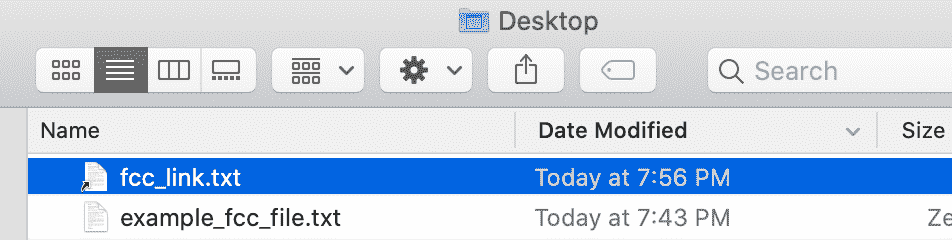
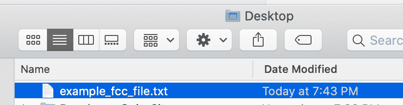

# Linux ln——如何在 Linux 中创建符号链接 Bash 命令示例]

> 原文：<https://www.freecodecamp.org/news/linux-ln-how-to-create-a-symbolic-link-in-linux-example-bash-command/>

符号链接(符号)是一种指向 Linux 中其他文件或目录(文件夹)的文件。

您可以在命令行中使用`ln`命令创建一个符号链接(符号)。

符号链接非常有用，因为它们可以作为文件或目录的快捷方式。

在本文中，我将介绍如何使用`ln`命令创建一个指向文件或目录的符号链接。

## Linux 中的软链接和硬链接有什么区别？

软链接或符号链接将指向您系统上的原始文件。硬链接将创建文件的副本。

软链接可以指向不同文件系统上的其他文件或目录，而硬链接则不能。

## 如何创建指向文件的符号链接

您可以使用 Mac 上的终端应用程序或 Windows 上的命令提示符找到命令行。

下面是在终端中创建文件符号链接的基本语法。

```
ln -s existing_source_file optional_symbolic_link 
```

使用`ln`命令为文件创建链接，使用`-s`选项指定这将是一个符号链接。如果你省略了`-s`选项，那么将会创建一个硬链接。

existing_source_file 表示计算机上要为其创建符号链接的文件。

optional_symbolic_link 参数是要创建的符号链接的名称。如果省略，那么系统将在您当前所在的目录中为您创建一个新的链接。

让我们看一个例子来更好地理解这是如何工作的。

在我的桌面上有一个名为`example_fcc_file.txt`的文件。


我需要首先打开我的终端，然后确保我在桌面目录中。我可以运行命令`cd Desktop`来导航到我的桌面。

运行该命令后，您应该看到您现在在桌面上。

```
jessicawilkins@Dedrias-MacBook-Pro-2 ~ % cd Desktop
jessicawilkins@Dedrias-MacBook-Pro-2 Desktop % 
```

然后我可以使用`ln`命令创建一个名为`fcc_link.txt`的新符号链接。

```
ln -s example_fcc_file.txt fcc_link.txt
```

当您在终端中运行该命令时，您会注意到没有返回任何内容。这是因为当`ln`命令成功时，将没有输出，它将返回零。

```
jessicawilkins@Dedrias-MacBook-Pro-2 Desktop % ln -s example_fcc_file.txt fcc_link.txt

jessicawilkins@Dedrias-MacBook-Pro-2 Desktop % 
```

要检查符号链接是否成功，可以使用`ls`命令。`ls`命令将列出关于文件的信息，`-l`标志代表符号链接。

```
ls -l fcc_link.txt
```

当您运行该命令时，您应该会在终端中看到这种结果。

```
lrwxr-xr-x  1 jessicawilkins  staff  20 Feb 19 19:56 fcc_link.txt -> example_fcc_file.txt 
```

输出的`fcc_link.txt -> example_fcc_file.txt`部分显示符号链接指向名为`example_fcc_file.txt`的文件。

您还应该看到新符号链接出现在您的目录中。



## 如何创建指向目录的符号链接

在这个例子中，我们想要创建一个名为`my_music`的符号链接，它将指向我电脑主目录中的音乐文件夹。

首先，确保您在主目录中。您可以在命令行中运行`cd`来返回您的主目录。

```
jessicawilkins@Dedrias-MacBook-Pro-2 Desktop % cd
jessicawilkins@Dedrias-MacBook-Pro-2 ~ % 
```

然后，您可以使用`ln`命令创建一个指向音乐目录的符号链接。

```
ln -s /Users/jessicawilkins/Music ~/my_music 
```

如果成功，您应该在主目录中看到它。


## 如何删除符号链接

要删除符号链接，您可以使用`unlink`或`rm`命令。

如果我们想要删除之前创建的`fcc_link.txt`符号链接，那么我们可以使用以下命令之一:

```
rm fcc_link.txt
```

```
unlink fcc_link.txt
```

现在我们应该看到符号链接已从我们的目录中删除。



## 如何覆盖符号链接

如果我们试图创建一个名为`fcc_link.txt`的新符号链接，那么它将导致一个错误，因为它已经被使用并指向另一个文件。

```
ln: fcc_link.txt: File exists 
```

您可以使用 force ( `-f`)选项来覆盖此错误。

```
ln -sf example_fcc_file.txt fcc_link.txt
```

## 如何了解关于 ln 命令的更多信息

如果你想了解更多关于`ln`命令的知识，那么你可以在`man`页面上阅读(Linux 命令使用手册)。

在您的终端中运行`man ln`，您应该会看到`ln`命令的手册页。

```
LN(1)                     BSD General Commands Manual                    LN(1)

NAME
     link, ln -- make links

SYNOPSIS
     ln [-Ffhinsv] source_file [target_file]
     ln [-Ffhinsv] source_file ... target_dir
     link source_file target_file

DESCRIPTION
     The ln utility creates a new directory entry (linked file) which has the same modes as the original file.  It is
     useful for maintaining multiple copies of a file in many places at once without using up storage for the
     ``copies''; instead, a link ``points'' to the original copy.  There are two types of links; hard links and sym-
     bolic links.  How a link ``points'' to a file is one of the differences between a hard and symbolic link.

     The options are as follows:

     -F    If the target file already exists and is a directory, then remove it so that the link may occur.  The -F
           option should be used with either -f or -i options.  If none is specified, -f is implied.  The -F option
           is a no-op unless -s option is specified.

     -h    If the target_file or target_dir is a symbolic link, do not follow it.  This is most useful with the -f
           option, to replace a symlink which may point to a directory.

     -f    If the target file already exists, then unlink it so that the link may occur.  (The -f option overrides
```

## 结论

符号链接(符号)是一种指向 Linux 中其他文件或目录(文件夹)的文件。您可以在命令行中使用`ln`命令创建一个符号链接(符号)。

符号链接非常有用，因为它们可以作为文件或目录的快捷方式。

以下是使用终端创建文件符号链接的基本语法:

```
ln -s existing_source_file optional_symbolic_link
```

以下是使用终端创建指向目录的符号链接的基本语法:

```
ln -s path_to_existing_directory name_of_symbolic_link 
```

要删除符号链接，您可以使用`unlink`或`rm`命令:

```
rm name_of_symbolic_link
```

```
unlink name_of_symbolic_link
```

如果需要删除符号链接，可以使用以下命令:

```
ln -sf path_to_existing_directory name_of_symbolic_link
```

我希望您喜欢这篇关于符号链接的文章，并祝您在编程之旅中好运。