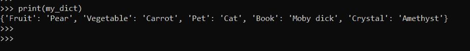
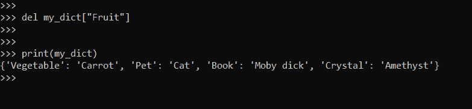
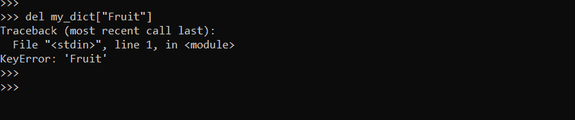
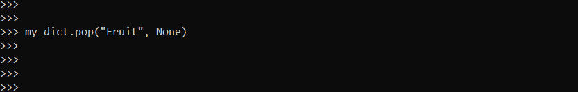
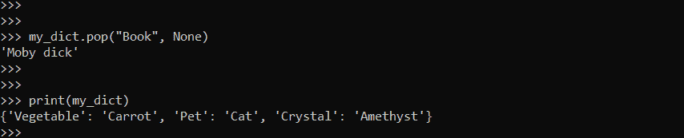
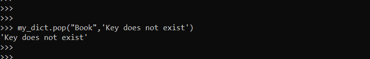
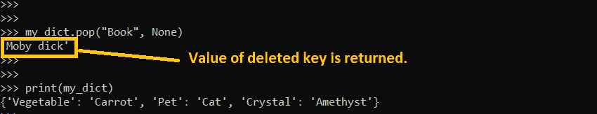

# 如何从 Python 字典中删除键——从字典中删除键

> 原文：<https://www.freecodecamp.org/news/how-to-remove-a-key-from-a-python-dictionary-delete-key-from-dict/>

字典是 Python 中非常强大的数据集合。字典有助于加快数据库操作。

您可以将条目添加到现有词典中，也可以删除它们。

在这篇博文中，我们将学习如何使用两种方法删除“密钥”:

1.  使用`del`删除`key:value`对。
2.  使用`pop()`删除`key:value`对。

## Python 中的字典是什么？

字典是条目的无序集合。这些项目是使用键值对定义的。键映射到列表中相应的项目。每当需要查询一个条目时，我们可以使用它的键来完成。

例如，`"city":"Seoul"`是一个键值对，其中“city”是键，“Seoul”是其值。

以下是用 Python 声明字典的语法:

```
my_dict = {
    <key>: <value>,
    <key>: <value>,
      .
      .
      .
    <key>: <value>
}
```

在我们的例子中，我们将使用下面的字典:

```
>>> # Declare a dictionary
>>> my_dict = {"Fruit":"Pear", "Vegetable":"Carrot", "Pet":"Cat", "Book":"Moby dick", "Crystal":"Amethyst"}
```

Declare a dictionary named my_dict



## 如何用 Python 从字典中移除键

### 使用`del`移除一个键。

您可以使用`del`关键字删除一个键。下面是它的语法:

```
del dict["Key"]
```

让我们删除字典中的一个键`my_dict`。我们将删除关键字:“水果”。

```
# Delete a key - Fruit
del my_dict["Fruit"]
```



在我们删除那个键之后，我们可以看到键`Fruit`不再存在于字典中。

但是，如果您试图删除一个不存在的键，会发生什么呢？

让我们再次尝试删除键`Fruit`。



Delete a key that does not exist.

我们收到一个回溯错误。这是有效的，因为密钥不存在。

`del`的一个缺点是当没有找到`key`时会抛出异常。异常需要在 try catch 块中显式处理。

然而，我们可以使用第二种方法来处理这个异常。

### 使用`pop()`移除钥匙

移除键的第二种方法是使用`pop()`方法。下面是它的语法 *:*

```
data.pop("Key", None)
```

在哪里，

*   `key`是要移除的键。
*   `None`指定如果找到密钥，则删除它。否则，什么都不做。
*   对于找不到密钥的情况，我们还可以指定一个自定义消息来代替“None”。

现在，如果我们再次尝试删除`Fruit`，也不会抛出异常。



现在，让我们尝试用`pop()`删除一个现有的键。



在这里，键:Book 被成功删除。

与`del`相比，`pop()`的一个优势是它允许我们处理异常。它提供了一种在异常发生时返回自定义消息的机制。

### 如何设置自定义消息:

让我们再次尝试删除“图书”。我们预计会有一个错误，所以让我们设置一个返回消息。

这里，`Key does not exist`是键不存在时的返回消息。

```
my_dict.pop("Book", 'Key does not exist')
```



As "Book" was already deleted, we are getting the error message

另一个优点是，除了执行删除操作之外，它还返回键的值。如果你需要知道一个被删除的键的值，那么`pop()`是合适的选项。



## 结论

在本教程中，我们学习了如何用 Python 创建字典。我们还关注了如何删除字典中的键:值对。

我希望这篇教程对你有所帮助。

我们在[推特](https://twitter.com/hira_zaira)上连线吧！

在这里阅读我的其他帖子。

让我们来聊聊不和谐的话题。