# 如何在 Windows 上安装 Python

> 原文：<https://www.freecodecamp.org/news/how-to-install-python-in-windows-operating-system/>

在尝试在 Windows 操作系统中运行任何 Python 程序之前，您需要检查是否安装了 Python 并将其正确添加到了环境的 path 变量中。

在本文中，我将向您展示如何检查您的操作系统中是否成功安装了 Python。如果没有，那么我还会告诉你如何为 Windows 正确安装它。

在这篇文章中，我将使用 Windows 11，因为这是微软 Windows 的最新版本。但是同样的方法也适用于其他版本的 Windows。所以事不宜迟，让我们开始吧。

## 如何检查您的 Windows 操作系统中是否安装了 Python

打开 **CMD** 或 **PowerShell** ，使用该命令检查 Python 的版本:

```
python --version 
```

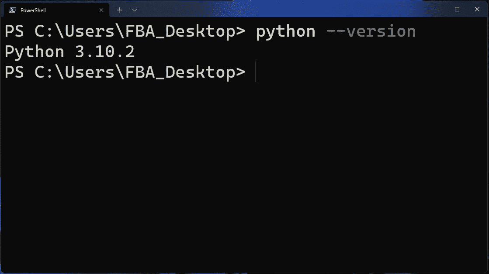

如果您在输出中获得了如上所示的 Python 版本，那么您的计算机完全可以运行任何 Python 程序。在您的情况下，Python 的版本可能会不同。

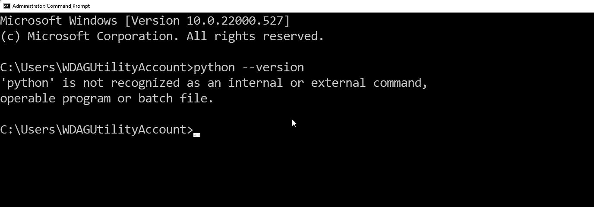

但是，如果您得到上面看到的这种类型的输出，那么它可能意味着以下任何一种情况:

1.  您的计算机上没有安装 Python，或者
2.  Python 的目录没有被添加到**环境变量**的路径中。

现在让我假设您的计算机中没有安装 Python。然后，我还将在本文后面介绍如何将 Python 的目录添加到环境变量的路径中。

## 如何在 Windows 上安装 Python

首先我们需要去 Python 的[官网。](https://www.python.org/)

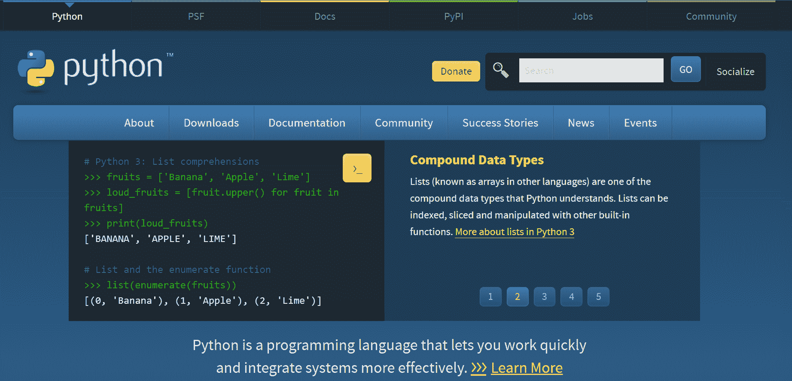

点击**下载**部分。

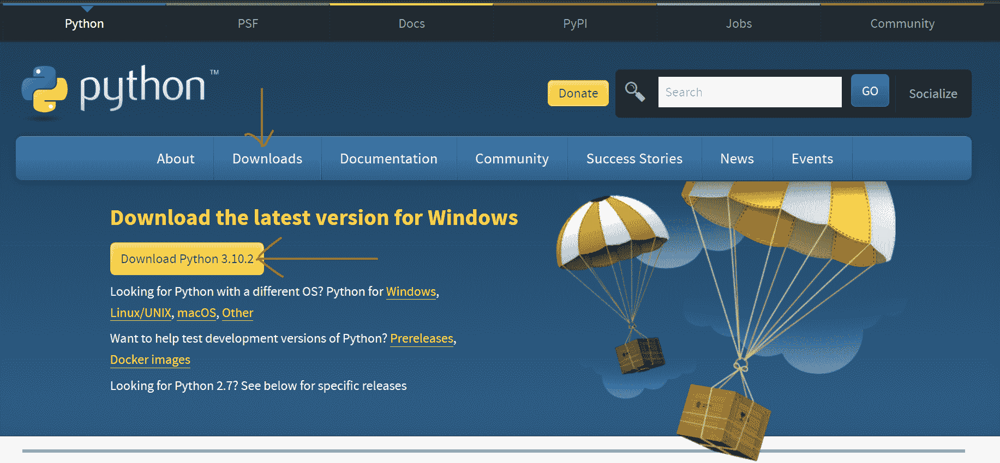

在这里你会得到最新的版本。只需点击下载`Python 3.10.2`。在您阅读本文时，Python 可能已经更新了，在这种情况下，版本会有所不同。只需下载它显示的版本。

请记住，在这里，它将始终在顶部向您显示 Python 的最新版本。

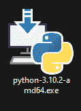

下载完文件后，我们会得到一个这样的可执行文件。只需双击该文件，安装向导就会打开。

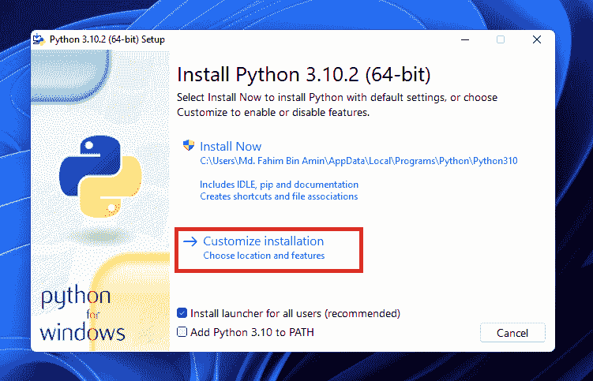

点击`Customize installation`。

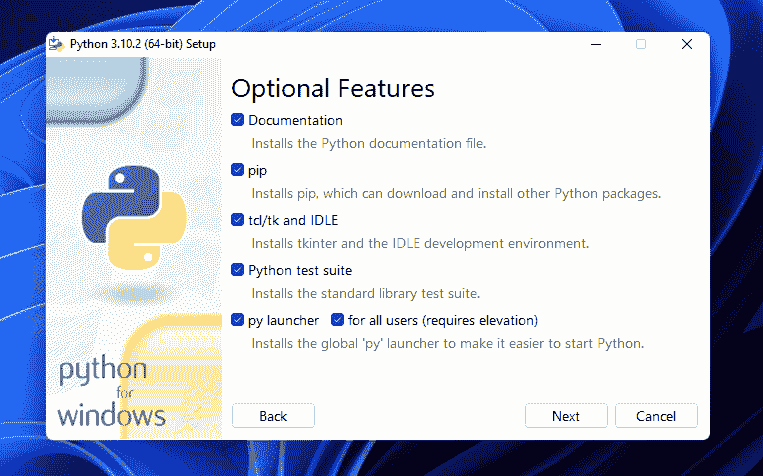

确保选中所有的复选框，如上所示。然后点击`Next`。

然后你会看到下面的屏幕。如果你愿意，你可以选择所有的选项。我不需要调试符号和调试二进制文件。因此，我不会勾选最后两个框。

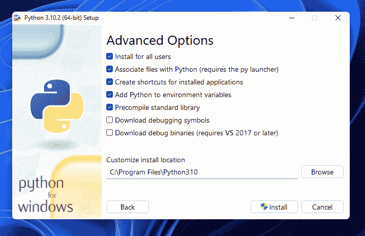

我还建议您不要更改安装位置。记住安装位置，因为您以后可能需要它。我们将 Python 直接添加到这里的环境变量中。

然后点击`Install`。


让安装过程结束...

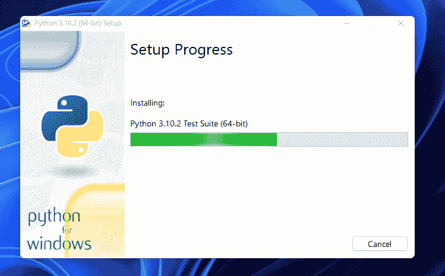

如果您得到这种提示来禁用路径长度限制，那么只需单击那个框。它通过取消对 MAX_PATH 变量的限制来禁用路径长度限制。

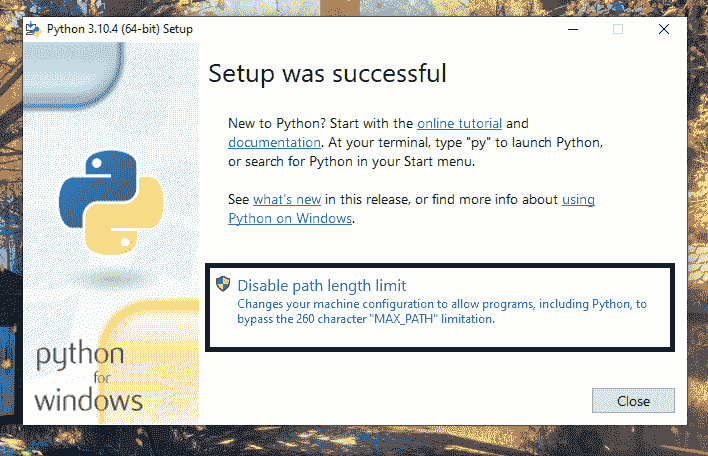

这个改变不会破坏任何东西，也不会产生任何负面的改变。它将只允许 Python 使用长路径名。建议禁用路径长度限制。

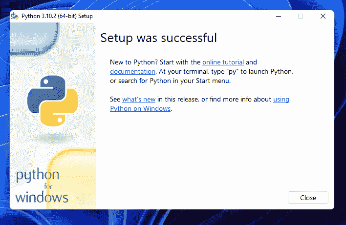

安装已成功完成。

## 如何检查 Python 版本

现在我们需要再次检查 Python 是否已经成功安装并添加到环境变量的路径中。

为了检查这一点，我们需要打开 **CMD** 或 **PowerShell** 。然后，我们需要应用以下命令:

```
python --version 
```

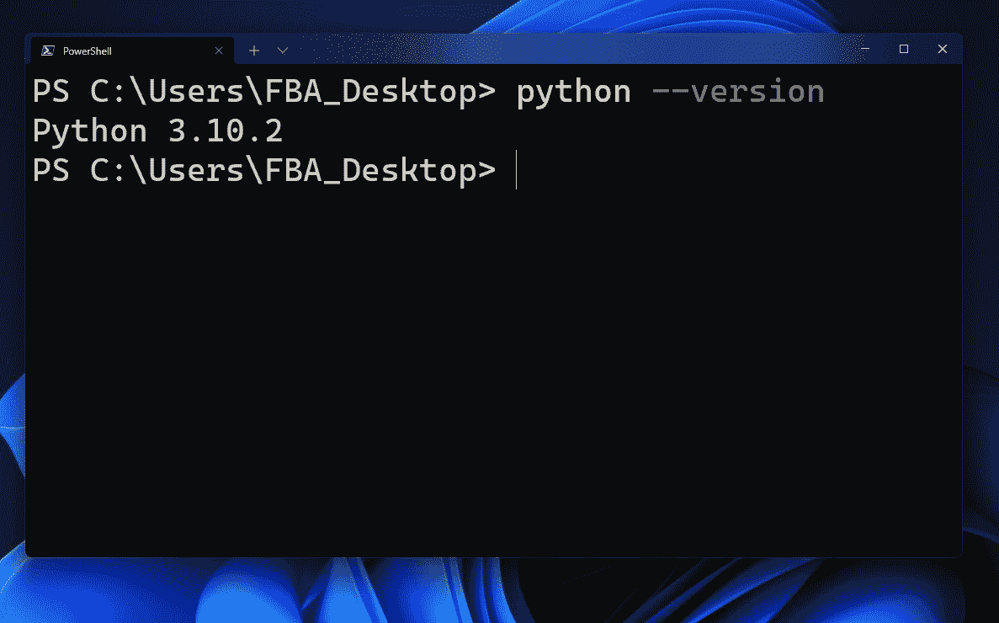

Python 已经安装，路径也已经成功添加到环境变量中！

## 如何检查环境变量的路径

如果你想手动检查路径变量，那么你必须打开`Advanced System Settings`。你可以搜索`Advanced System Settings`，也可以从**控制面板**打开。

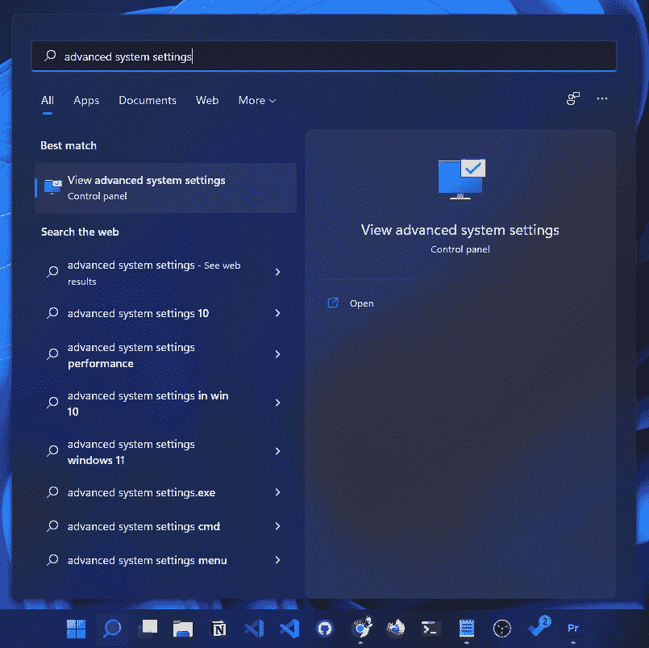

如果你用关键字`Advanced system settings`搜索，你会像这样直接得到。

如果你想从**控制面板打开**，那么，首先，你需要打开控制面板。

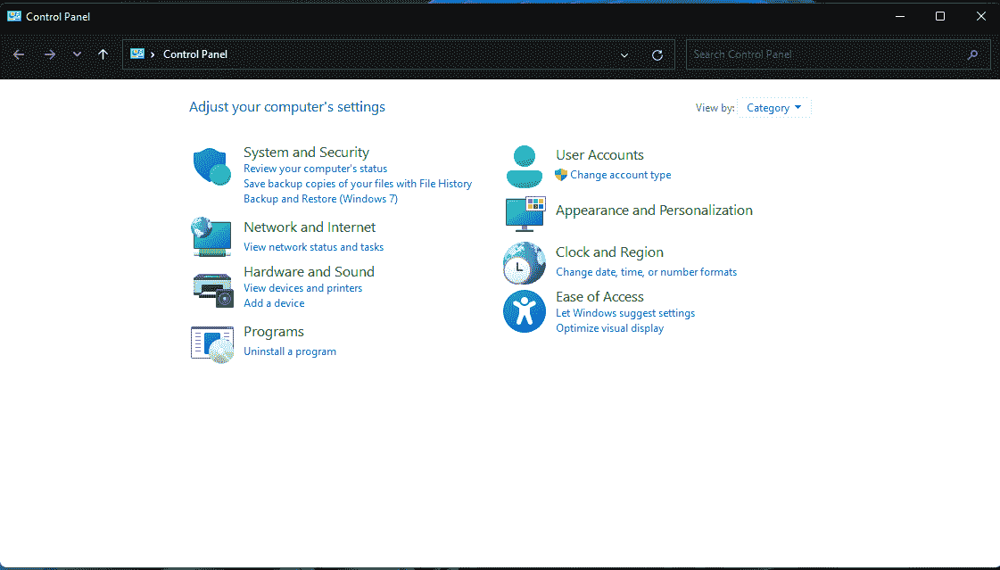

转到`System and Security`。

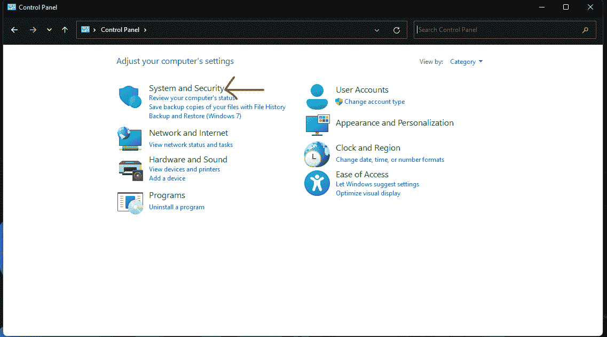

点击`System`。

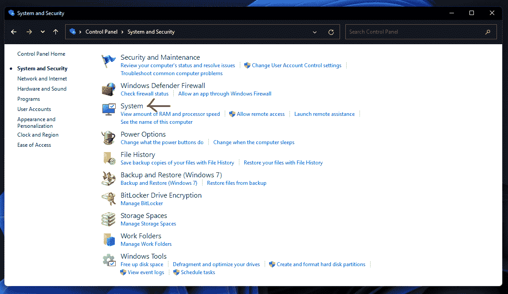

从这里，点击`Advanced System Settings`。

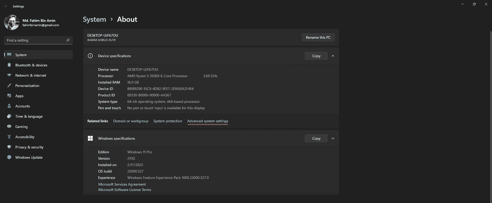

点击`Environment Variables`。

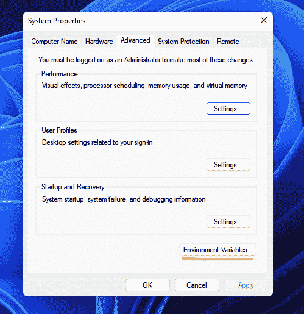

点击`Path`，然后点击`Edit`。

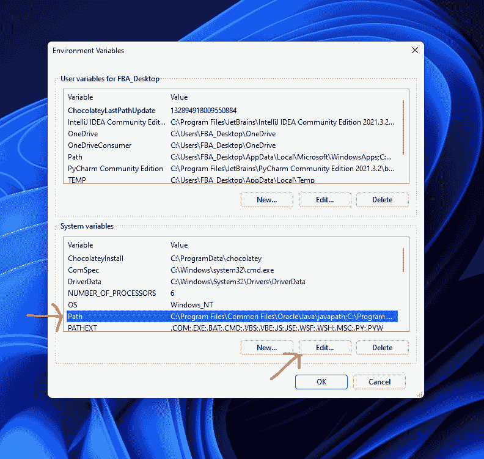

你会看到在安装过程中已经添加了 Python310 的根目录**和 Python310 的**脚本目录**，因为我们在安装过程中勾选了这个复选框。**

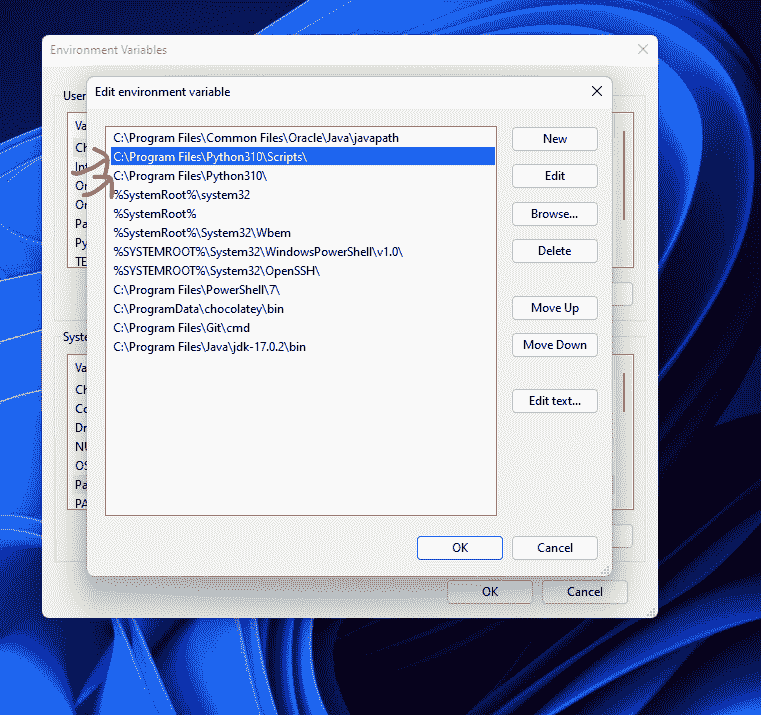

如果您想手动操作，那么您需要复制并粘贴这两个目录，方法是点击`New`并将这两个目录粘贴到两个空白框中(每次点击`New`会出现一个框)。然后简单的点击`OK`到所有打开的框，关闭所有打开的窗口。

我还制作了一个视频，展示了上面提到的所有过程。如果你愿意，那么你可以在这里查看视频。

## 结论

非常感谢你阅读整篇文章。如果你有任何建议，那么你可以通过我的 [twitter](https://twitter.com/Fahim_FBA) 或 [LinkedIn](https://www.linkedin.com/in/fahimfba/) 账户与我联系。

如果你对开源感兴趣，那么你也可以在 [GitHub](https://github.com/FahimFBA) 上关注我，因为我非常积极地为开源项目做贡献。

如果你喜欢编程相关的教程，那么我有两个 YouTube 频道。在一个频道中，我[定期发布孟加拉语内容](https://www.youtube.com/channel/UCEF4lxmpBKV2oYCSFH6ExIQ)、[，而我在另一个频道中定期发布英语内容](https://www.youtube.com/channel/UCG97GCUifMS2Vm28tgXQi0Q)。

祝您愉快！