# 如何为 React 项目设置 VSCode

> 原文：<https://www.freecodecamp.org/news/vscode-react-setup/>

开发项目时，您拥有的最终工具是代码编辑器。这就是为什么正确设置它如此重要。

在本分步指南中，我们将从全新的 VSCode 安装过渡到为您的下一个 React 项目完美准备的代码编辑器。

我们开始吧！

## 如何安装 VSCode

设置 Visual Studio 代码(简称 VSCode)的第一步是为您的计算机安装它。

前往[code.visualstudio.com](https://code.visualstudio.com)下载适合你电脑的版本(100%免费)。

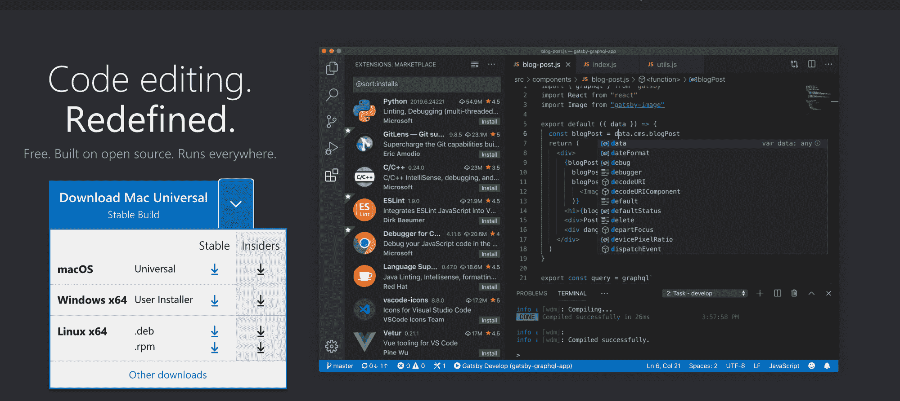

Install the right version for your operating system

安装完成后，打开 VSCode 应用程序，您应该会看到一个类似如下的主屏幕:

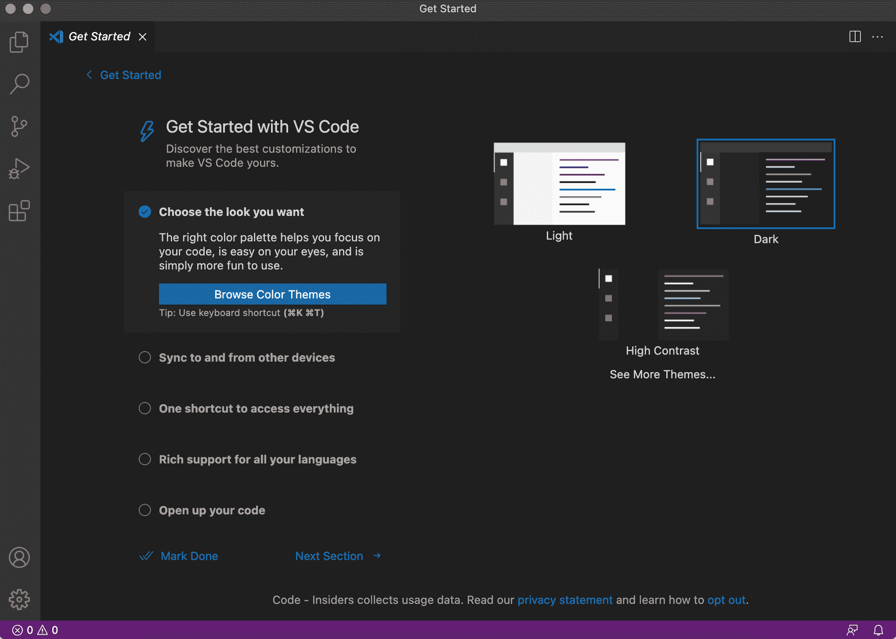

VSCode Home Screen (After Install)

## 选择您喜欢的颜色主题

虽然 VSCode 附带的默认主题非常好，也非常清晰，但我更喜欢使用第三方主题，我觉得这样更好看。

花时间选择一个主题似乎是一件微不足道的事情。但是，由于您将花费数小时在编辑器上阅读文本，您希望选择自己喜欢的颜色，并且不会使您的眼睛疲劳。

我个人使用并强烈推荐我的所有 VSCode 安装的 Material 主题。

要安装材质主题，请转到(屏幕顶部):

**查看** > **扩展**(或者使用快捷键⇧ + ⌘ (Ctrl) + X)

然后在侧边栏中搜索“材料主题”,安装出现的第一个结果。

它应该是这样的:

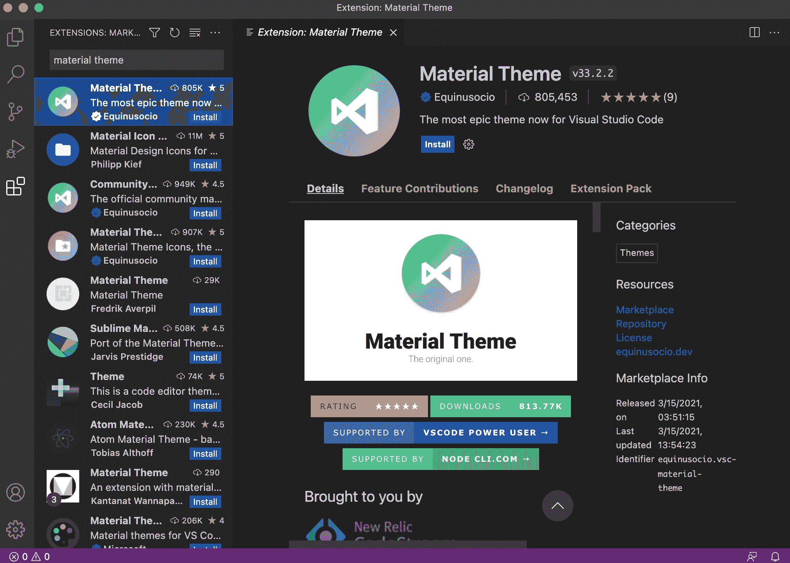

Material Theme Installation

一旦它被安装，它会给你一个下拉菜单来选择一堆不同的变种。

默认选项很棒，但我个人认为“材质主题海洋高对比度”是最好看的。

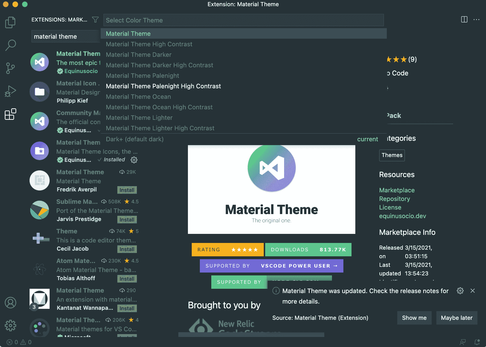

Material Theme for VSCode

## 让你的文本易于阅读

现在是添加一些基本设置的好时机，让您编写的代码读起来更舒服。

提高代码可读性的设置包括字体大小、制表符大小和字体系列。

您可以通过访问(位于屏幕顶部)来更改 VSCode 首选项:

**代码** > **首选项** > **设置**(或使用快捷键:⌘ (Ctrl) +，)

这些年来，我发现对于桌面和笔记本电脑开发来说，最舒适的设置是字体大小为 18，标签大小为 2。

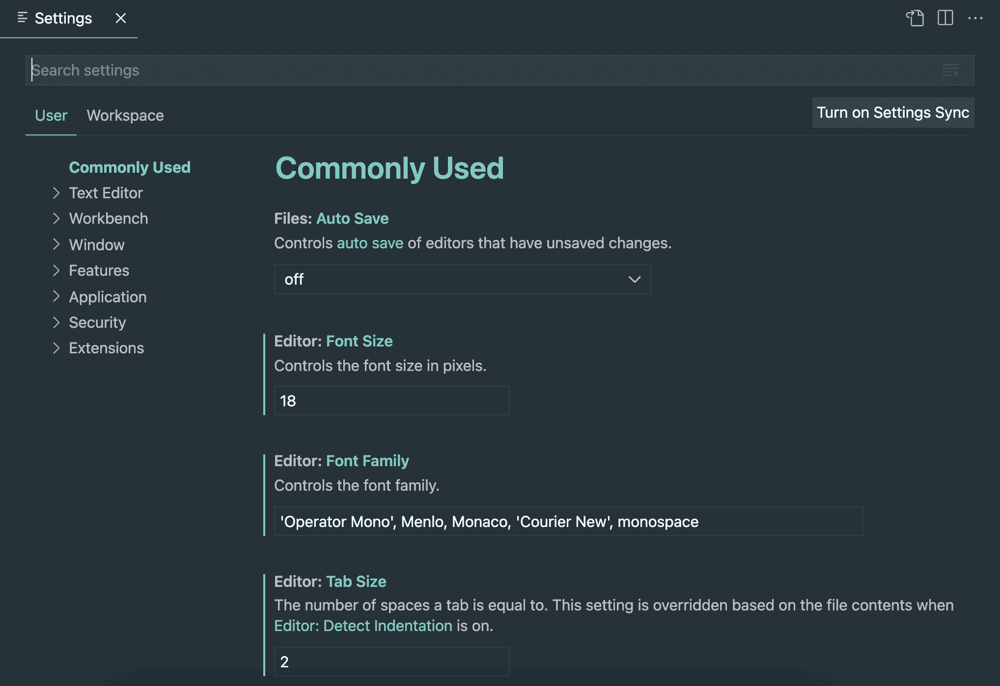

Text Settings for VSCode

此外，为了让你的文本看起来恰到好处，我发现当你增加编辑器的默认缩放级别时，文本看起来会更好。

要提高缩放级别，请转到首选项(⌘ (Ctrl) +，)并输入“**缩放级别**”。

我建议将缩放级别从 0 改为 1。

最后，作为一种偏好，我喜欢删除编辑器顶部的默认面包屑链接。

您可以通过以下方式删除面包屑:

**查看** > **显示面包屑**(并确保未选中)。

下面是我添加到桌面上的示例组件文件的代码编辑器的样子:

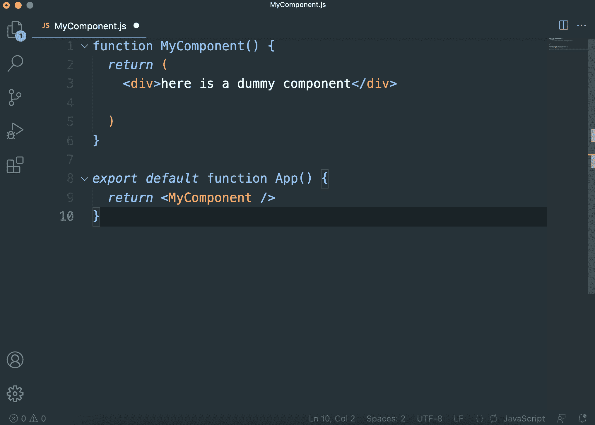

React component appearance in VSCode

## 用更漂亮的扩展格式化你的代码

您可能已经注意到，在上面的例子中，代码的格式不是很好。

幸运的是，您可以自动格式化每个。您使用 VSCode 的漂亮扩展编写的 js 文件。

为了能够在每次保存. js 文件时立即格式化我们的代码，我们可以再次转到扩展选项卡(⇧ + ⌘ (Ctrl) + X)，键入“**更漂亮的**”并安装它:

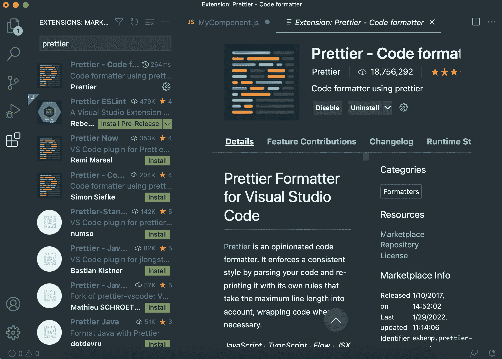

Prettier extension for VSCode

接下来，我们可以返回首选项(⌘ (Ctrl) +，)并在保存时搜索“**格式”并确保它已被选中:**

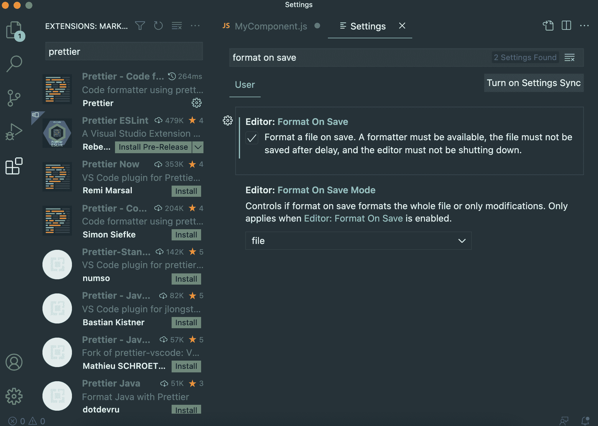

Format on Save setting

再次在首选项中，搜索“**默认格式化程序**”设置，并将其设置为更漂亮。

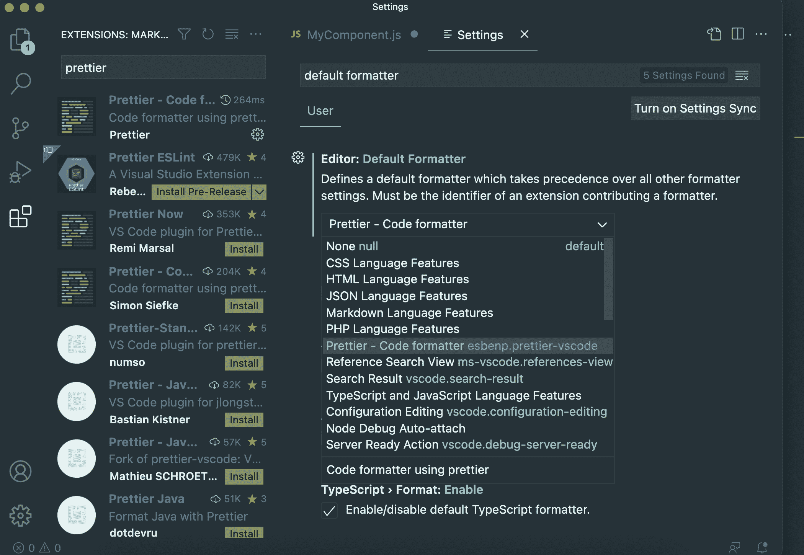

Default formatter setting

现在，如果我们返回到一个未格式化的文件，并点击保存，它会立即为我们格式化！

下面是我们点击 save 后虚拟组件的外观:

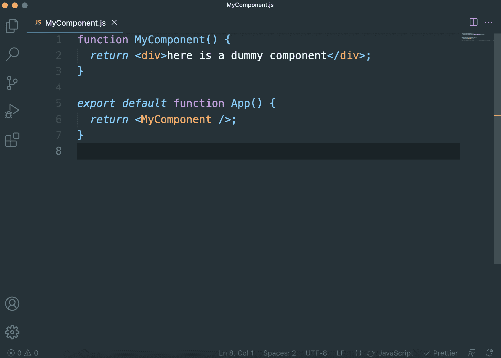

Formatted React component (with Prettier)

查看更漂亮的扩展文档，看看如何根据您的格式偏好进一步配置它。尽管如此，我个人还是建议使用默认选项

## 如何用 Emmet 快速打出 JSX

VSCode 内置了对一个叫 Emmet 的神奇工具的支持，它可以让你非常快速地编写 HTML 标签。

但是，默认情况下，Emmet 没有配置为与 JSX 一起使用，React 使用而不是 HTML。

要更快地编写您的 JSX，您可以将 Emmet 与 React 配合使用，方法是转到:

**代码** > **首选项** > **设置** (⌘ (Ctrl) +，)

然后在搜索栏中键入“ **emmet include languages** ”。

之后，点击“添加项目”按钮，添加以下设置:

项: **javascript** ，值: **javascriptreact** (然后点击 ok)

您添加的设置应该如下所示:

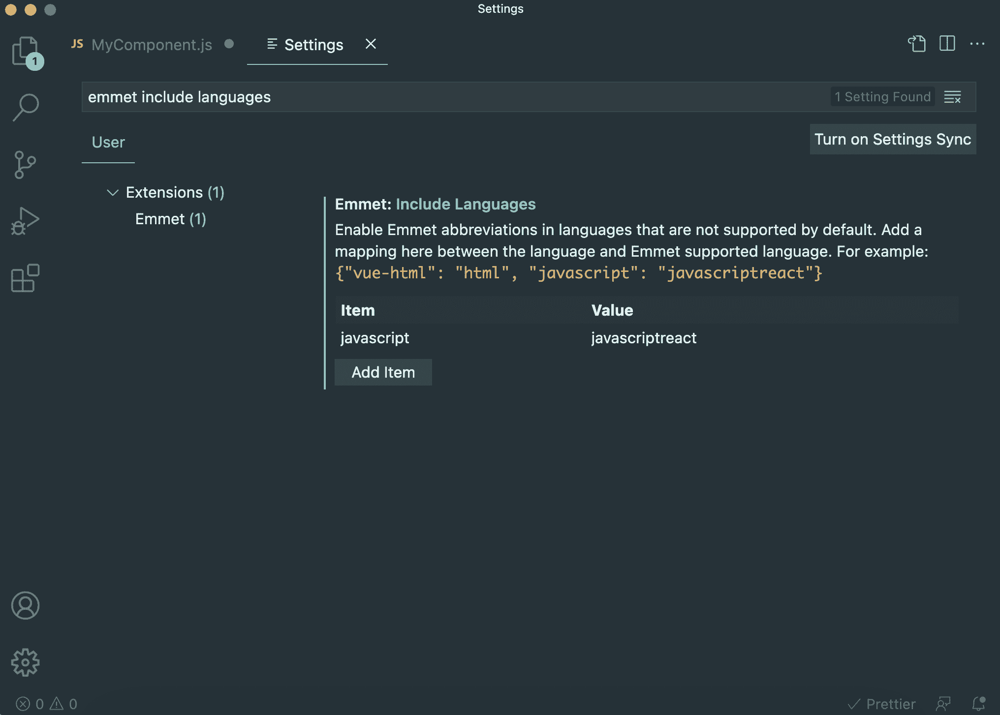

Emmet Include Languages setting

现在我们已经将 React 作为 Emmet 的语言，我们可以更快地开始编写我们的 JSX 了。

以下是 Emmet 的快速演示，展示您的工作效率:

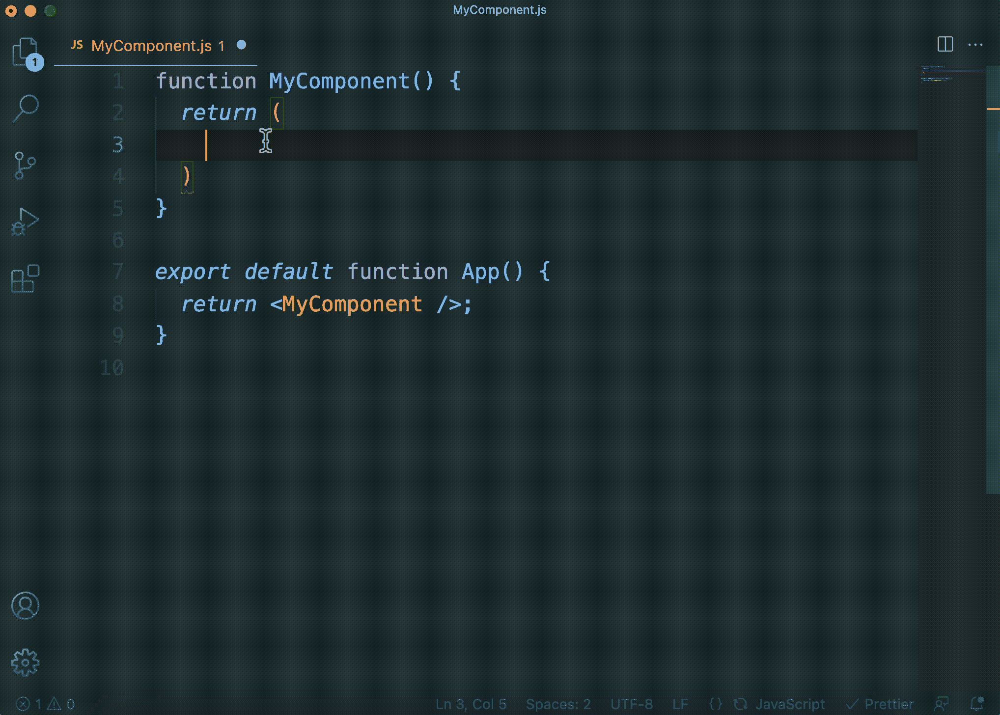

Quick demo of Emmet shortcuts

## 想进行下一步吗？

现在你已经为 React 设置好了代码编辑器，你已经为 React 训练营 做好了准备。

这是学习(和热爱)反应的终极资源，向您展示如何:

*   每天只需 30 分钟，就能从完全的初学者变成专业的反应者
*   从零开始到部署，构建 4 个全栈 React 项目
*   了解构建您喜欢的任何应用程序的强大技术堆栈

 
*点击加入 React 训练营*