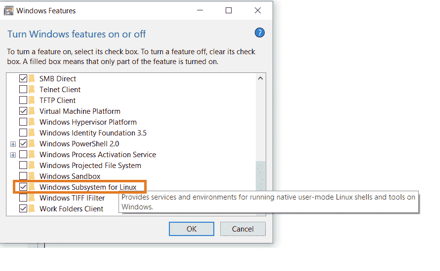
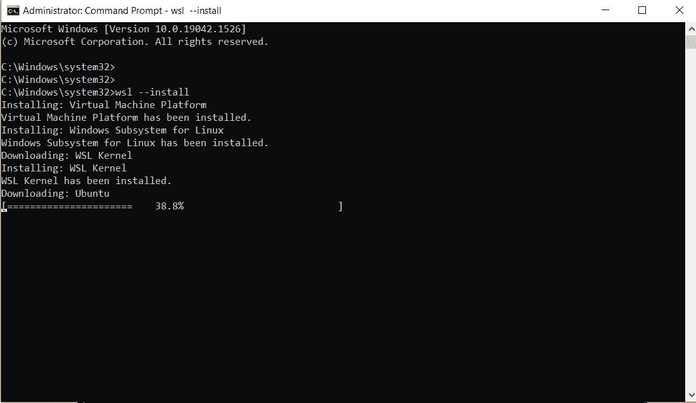
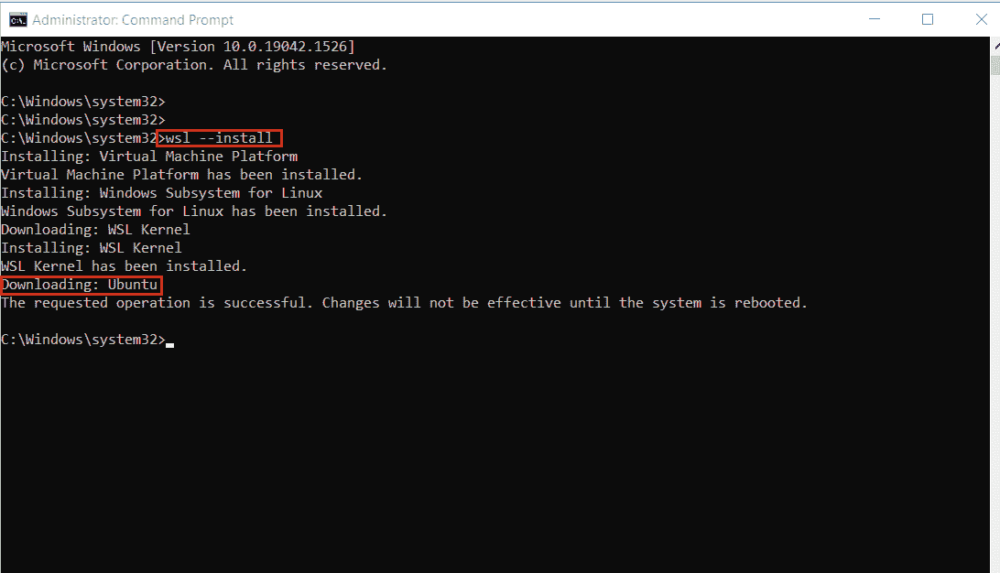
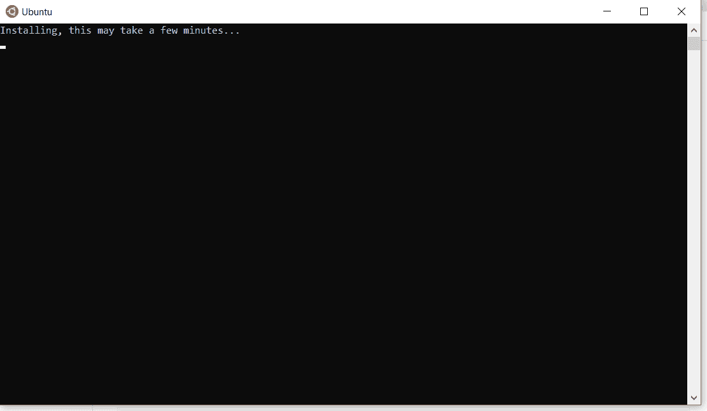
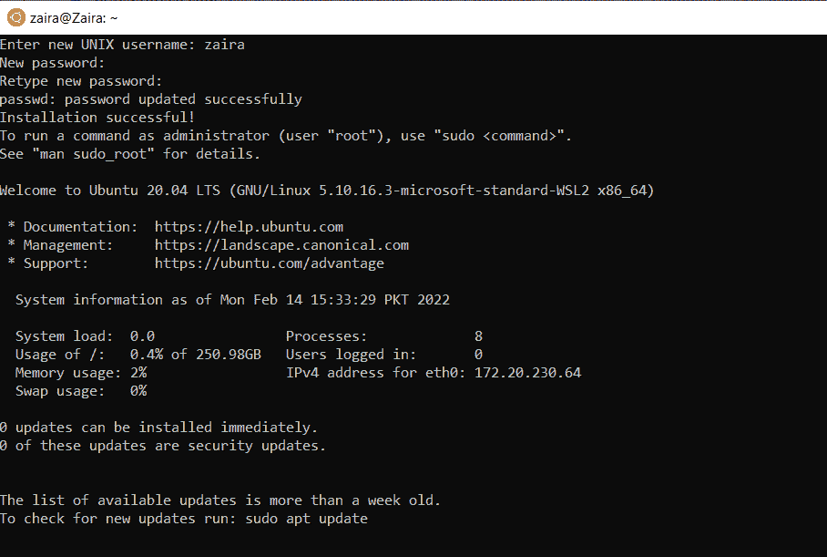
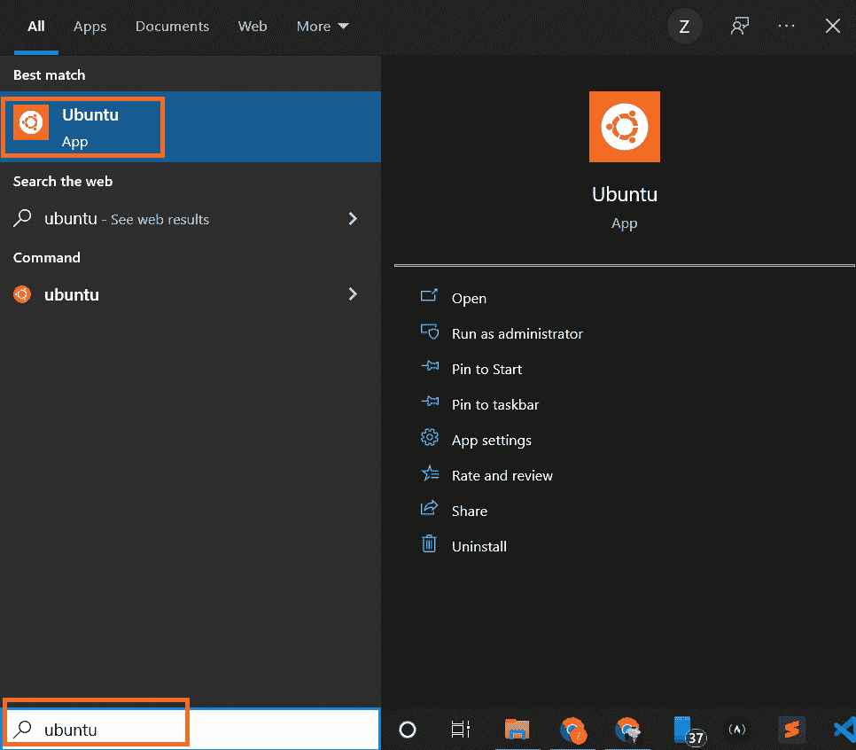
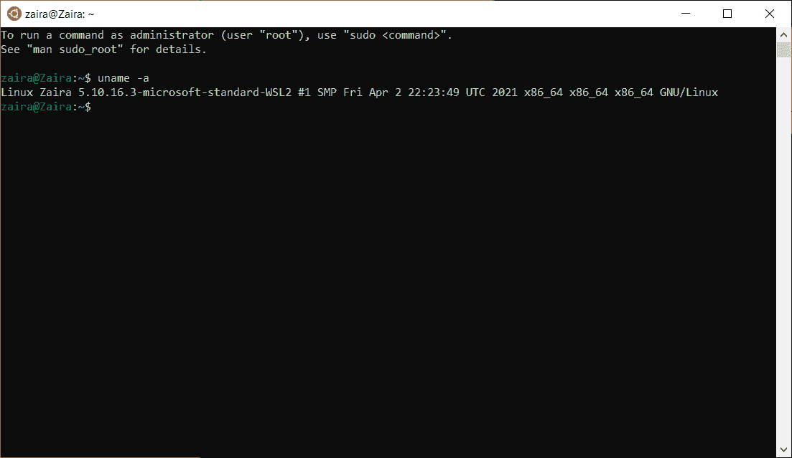
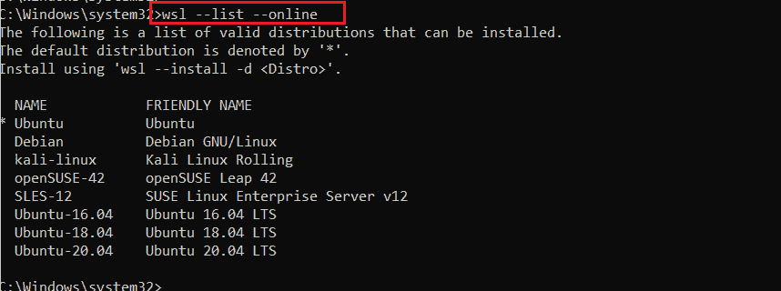
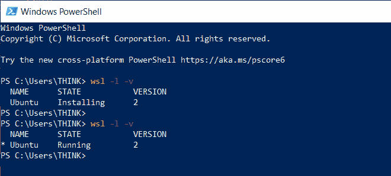

# 如何在 Windows 10 上安装 wsl 2(Linux 2 的 Windows 子系统)

> 原文：<https://www.freecodecamp.org/news/how-to-install-wsl2-windows-subsystem-for-linux-2-on-windows-10/>

Linux 是一个广泛使用的操作系统，对开发者来说相当重要。

有时候你可能需要同时拥有两个操作系统——Windows 和 Linux——无论是为了工作、学习还是仅仅为了实验。

幸运的是，Windows 提供了一个在 Windows 旁边使用 Linux 的便利工具。这个实用程序被称为 WSL(Linux 的 Windows 子系统)。它的最新版本是 WSL2，在本指南中，我们将详细讨论它。

我们将涵盖:

*   什么是 WSL2，它有什么优势？
*   如何用默认设置在 Windows 10 上安装 WSL2？
*   如何在特定的 Linux 发行版中安装 WSL2？

## 什么是 WSL2？

用于 Linux 的 Windows 子系统提供了一个兼容层，允许您在 Windows 上本地运行 Linux 二进制可执行文件。

**WSL 2(Windows Subsystem for Linux version 2)**是 WSL 的最新版本。WSL2 架构通过使用轻量级虚拟机来取代 WSL 的架构。在新版本中，您可以运行一个实际的 Linux 内核，从而提高整体性能。

### 使用 WSL 的优势

与传统的虚拟机设置相比，WSL 有一些优势:

*   WSL 的设置很简单，不耗费时间。
*   与您必须从主机分配资源的虚拟机相比，它是轻量级的。
*   你不需要为 Linux 机器安装任何 ISO 或虚拟磁盘映像，因为它们往往是很重的文件。
*   你可以同时使用 Windows 和 Linux。

## 如何安装 WSL2

首先，启用设置中的`windows subsystem for Linux`选项。

*   转到开始。搜索“打开或关闭 Windows 功能”
*   检查 Linux 的 Windows 子系统选项。



Turn Windows features on or off.

接下来，打开命令提示符并提供安装命令。

*   以管理员身份打开命令提示符。


*   运行下面的命令:

```
wsl --install
```



注意:默认情况下会安装 **Ubuntu** 。但是你可以安装你选择的任何发行版。我们稍后会看到。

一旦安装完成，你需要重新启动你的 Windows 机器。所以，重启你的 Windows 机器。



重新启动后，您可能会看到如下窗口:



Ubuntu 安装完成后，系统会提示您输入用户名和密码。



而且，就是这样！你已经可以使用 Ubuntu 了。

从“开始”菜单搜索，启动 Ubuntu。



这里我们启动了 Ubuntu 实例。



Ubuntu launched via WSL2

## 如何安装特定的 Linux 发行版

如果你使用如上所示的默认方法，Ubuntu 将被安装。通过在 Windows 命令提示符下运行以下命令，可以找到可用的发行版列表:

```
wsl --list --online
```



List the online available Linux distros

要安装特定的发行版，请使用下面的命令:

```
wsl --install -d DISTRO-NAME
```

例如，要安装 Debian，命令应该修改如下:

```
wsl --install -d Debian
```

按照提示操作，将会安装特定的发行版。

**提示**:您也可以查看如下所示的更新:

```
wsl --update
```

Update WSL to the latest version

通过启动 Windows PowerShell 来检查状态。



Check status of WSL

## 包扎

WSL 是在本地 Windows 机器上使用 Linux 的一个很好的工具。它为那些刚刚起步的人提供了学习的空间。我希望这篇文章对你有所帮助。

我们在[推特](https://twitter.com/hira_zaira)上连线吧！

在这里阅读我的其他帖子。

让我们来聊聊不和谐的话题。