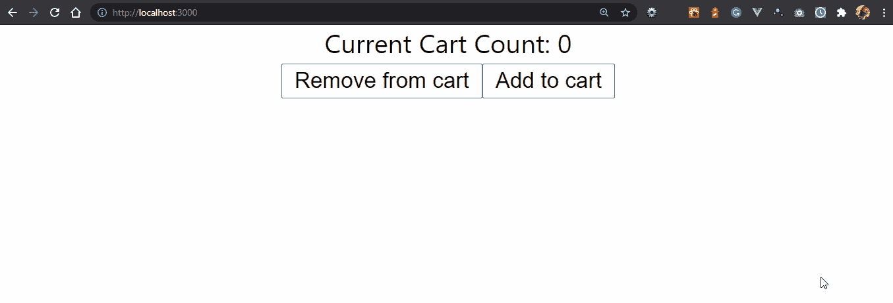
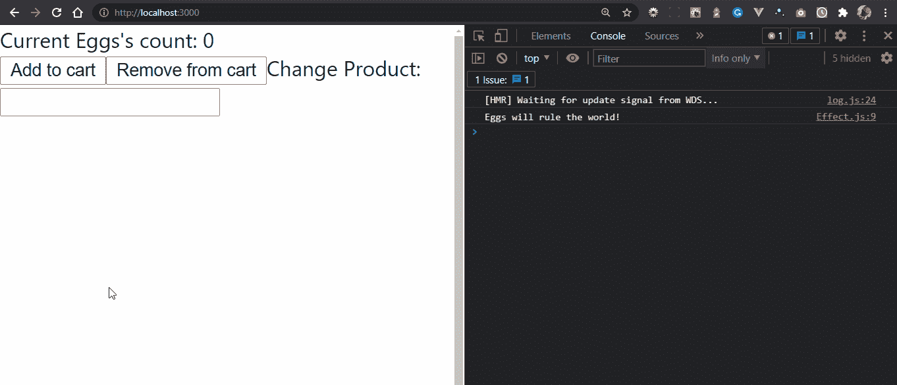
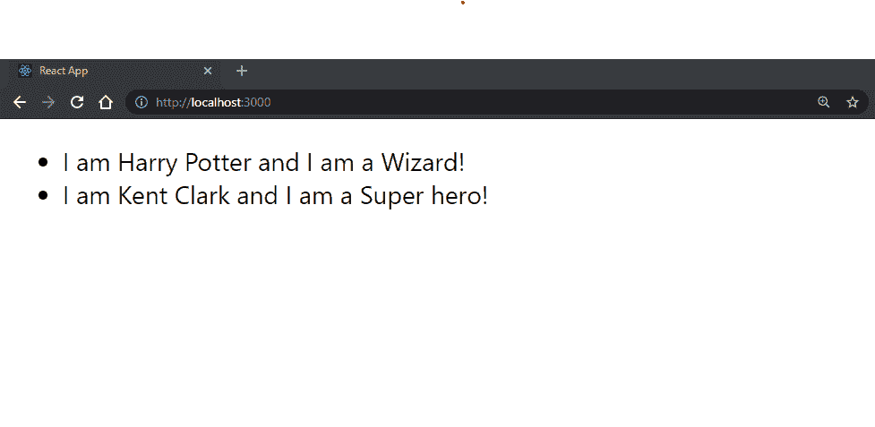

# 学习反应钩子——初学者指南

> 原文：<https://www.freecodecamp.org/news/the-beginners-guide-to-react-hooks/>

功能组件并不总是在 React 中声明组件的首选方法。

在引入 React 版本之前，功能组件被视为二等公民。它们不能处理状态、逻辑和许多其他 React 特性，我们只使用它们向 UI 呈现非常简单的组件。

react 版本 16.8 通过引入 React 挂钩解决了这些问题，React 挂钩允许开发人员在功能组件中使用这些 React 特性。

在本文中，您将了解到:

*   什么是反应钩子
*   四个常见的 React 挂钩，以及如何在应用程序中编写它们的例子
*   最后，我们将看看如何编写自己的自定义反应钩子

## 什么是 React 钩子？

钩子是 React 版本 16.8 中引入的内置 React 函数。它们允许您在功能组件中使用 React 库的特性，如生命周期方法、状态和上下文，而不必担心将其重写为类。

每个 React 钩子名称前面都有单词`"use"`。比如`useState`或者`useEffect`。选择这种格式是因为钩子允许开发人员使用 React 库的特殊特性。所以您正在使用 React 库的那个特殊特性。

## 为什么要用 React 钩子？

许多开发人员对学习 React 钩子持怀疑态度。但你不应该这样。以下是您应该开始使用 React 挂钩的几个原因:

### React 中的类可能会非常混乱

班级是学习的一个障碍。要使用它们，您需要理解`this`关键字是如何工作的。您还需要经常记住绑定事件处理程序，以及在 React 中处理类时遇到的其他冗余方法。

### 类组件很复杂，很难理解

类组件通常很大，并试图执行许多操作。长此以往，它们变得难以理解。

钩子解决了这个问题，它允许你把大的组件分成不同的小函数，而不是把所有的逻辑都放在一个组件里。

### 钩子有更短的组件和更好的可读性

类组件带有许多样板代码。考虑下面的计数器组件:

```
class Counter extends Component {
    constructor(props) {
        super(props)
        this.state = {
        	count: 1,
        }
    }
    render() {
        return (
            <div>
                The Current Count: {this.state.count}
                <div>
                <button onClick={this.setState({ count: this.state.count - 1 })}>
                add
                </button>
                <button onClick={this.setState({ count: this.state.count + 1 })}>
                subtract
                </button>
                </div>
            </div>
    );
    }
}
```

下面是使用功能组件和 React 挂钩的等效代码:

```
function Counter  ()  {
    const [count, setCount] = useState(1);
    return (
        <div>
            The Current Count: {this.state.count}
            <div>
                <button onClick={() => setCount(count + 1)}>add</button>
                <button onClick={() => setCount(count - 1)}>subtract</button>
            </div>
        </div>
    );
};
```

请注意，类组件要复杂得多。你需要一个类来扩展 React，一个构造函数来初始化 state，你需要到处引用`this`关键字。

使用功能组件消除了很多这种情况，所以我们的代码变得更短，更容易阅读和维护。

## 使用 React 挂钩的规则

使用 React 挂钩时，需要遵守一些规则:

*   仅调用组件顶层的钩子:你不应该在循环、条件或嵌套函数中使用钩子。相反，总是在 React 函数的顶层，在任何 return 关键字之前使用钩子。
*   **只调用 React 函数的钩子**:从不调用普通 JavaScript 函数的钩子。你可以:
    从 React 功能组件中调用钩子。
    ✅称钩子来自定制钩子。

## 最常见的反应挂钩

迄今为止，React 已经有 10 个内置挂钩。让我们来看看最常见的四种:

*   `useState`
*   `useEffect`
*   `useContext`
*   `useReducer`

### 使用状态挂钩

useState 挂钩允许您创建、更新和操作功能组件内部的状态。

React 有状态这个概念，状态是保存我们的组件所依赖的数据的变量，并且可能随时间而改变。每当这些变量改变时，React 通过用状态变量的当前值重新呈现 DOM 中的组件来更新 UI。

钩子接受一个可选参数:状态的初始值。然后，它返回一个包含两个值的数组:

*   状态变量
*   更新状态的函数

让我们以计数器组件为例来看看:

要使用挂钩，第一步是在文件顶部导入挂钩:

```
import { useState } from "react";
```

然后，用一个值初始化钩子。由于它返回一个数组，您可以使用数组析构来访问数组中的单个项，如下所示:

```
const [count, setCount] = useState(0);
```

这样，组件的代码将是:

```
import { useState } from "react";

function Counter() {
    // Declare a new state variable, which we'll call "count"
    const [count, setCount] = useState(0);
    return (
        <div>
        Current Cart Count: {count}
            <div>
            <button onClick={() => setCount(count - 1)}>Add to cart</button>
            <button onClick={() => setCount(count + 1)}>Remove from cart</button>
            </div>
        </div>
    );
}
```

这是组件渲染后的样子。



通过点击**添加到购物车**或**从购物车中移除**按钮，状态变量 count 的值将改变，组件将使用更新后的状态值重新呈现。

### useEffect Hook

如果你熟悉 React 类生命周期方法，你可以把`useEffect`钩子看作是组合在一个函数中的`componentDidMount`、`componentDidUpdate`和`componentWillUnmount`生命周期方法。它允许您在功能组件中复制 React 的生命周期方法。

`useEffect`钩子允许你在函数组件中执行副作用。副作用是可以与组件的主要操作一起运行的操作，例如外部 API 交互、修改状态变量和数据获取。

`useEffect`钩子接受两个参数:

*   包含要运行的代码的函数
*   一个数组，包含来自组件范围(props、context 和 state 变量)的值列表，称为依赖数组，它告诉挂钩在每次更新其值时运行。如果没有提供，钩子将在每次渲染后运行。

下面是一个使用钩子的例子:

```
import { useState, useEffect } from "react";
function Counter() {
    // Declare state variables
    const [count, setCount] = useState(0);
    const [product, setProduct] = useState("Eggs");
    useEffect(() => {
    	console.log(`${product} will rule the world!`);
    });
    return (
        <div>
        Current {product}'s count: {count}
            <div>
                <button onClick={() => setCount(count + 1)}>Add to cart</button>
                <button onClick={() => setCount(count - 1)}>Remove from cart</button>
                Change Product:{" "}
                <input type="text" onChange={(e) => setProduct(e.target.value)} />
            </div>
        </div>
    );
}
```

在示例中，效果将在每次状态更新后运行。


#### 如何有条件地激发一个效果

要仅在某些值发生变化时运行挂钩，请将变量作为依赖项传递到数组中:

```
useEffect(() => {
	console.log(`${product} will rule the world!`);
}, [product]); // Only re-run the effect if the value of product changes
```

有了这个改变，钩子将只在第一次渲染时运行，并且当产品的值被改变时。



#### 如何在首次渲染时运行一次

如果您希望效果在第一次渲染时只运行一次，比如在组件第一次渲染时进行 API 调用，您可以传递一个空数组作为它的依赖项，如下所示:

```
useEffect(() => {
	console.log("This runs once on first render");
}, []);
```

通过提供一个空数组，它告诉钩子监听零状态变化，所以它只运行一次。

### 使用上下文挂钩

`useContext`钩子与 React 上下文 API 一起工作。它为您提供了一种方法，使整个应用程序中的所有组件都可以访问特定的数据，而不管它们的嵌套有多深。

React 具有单向数据流，数据只能从父节点传递到子节点。要将数据(如状态)从父组件向下传递到子组件，您需要根据子组件的嵌套深度，手动将数据作为道具向下传递到不同的级别。

对于诸如用户首选语言、主题或经过身份验证的用户属性之类的数据，必须手动将它们传递到组件树中，这是一件很乏味的事情。

React 的上下文 API 和`useContext`钩子使得在应用程序的所有组件之间传递数据变得容易。

它接受使用`React.createContext`创建的上下文对象，并返回当前上下文，如下所示:

```
const value = useContext(SomeContext);
```

让我们看一个钩子如何工作的例子:

首先，创建一个上下文来使用钩子。例如，这里有一个 UserContext 来获取当前用户的值:

```
import React from "react";
// some mock context values
const users = [
{
    name: "Harry Potter",
    occupation: "Wizard",
},
{
    name: "Kent Clark",
    occupation: "Super hero",
},
];

export const UserContext = React.createContext(users);
```

每个上下文都有一个提供者包装器，它允许其子组件订阅上下文中的更改，并通过值属性传递上下文的值。

如果提供者的值属性被更新，它的消费子组件将使用新的上下文值重新呈现。

```
function Users() {
return (
    <UserContext.Provider value={users}>
    <UserProfile />
    </UserContext.Provider>
);
}
```

在本例中，`UserProfile`是上下文的消费组件。

```
import React, { useContext } from "react";
import { UserContext } from "./App";

export function UserProfile() {
    const users = useContext(UserContext);
    return (
        <div>
            {users.map((user) => (
            <li>
            I am {user.name} and I am a {user.occupation}!
            </li>
            ))}
        </div>
    );
}
```

这将显示当前用户的属性:



### useReducer Hook

`useReducer`挂钩是`useState`挂钩的替代产品。不同之处在于，它允许涉及多个子值的更复杂的逻辑和状态更新。

与`useState`类似，`useReducer`允许您创建类似状态的变量，当它们发生变化时，UI 就会更新。

这个钩子接受两个参数:一个 reducer 函数和一个初始状态。

`useReducer(reducer, initialState);`

它返回一个由两个值组成的数组，该数组可以被析构为状态和调度函数的当前值。

```
const [state, dispatch] = useReducer(reducer, initialState);
```

让我们了解一下它的参数和返回值:

*   **state** :这是传递给钩子的 initialState 的当前值。
*   **减速器**:减速器是接受状态和动作的函数。基于这些参数，它确定状态的值将如何改变。
*   **dispatch**:dispatch 函数是我们将一个动作传递给 reducer 函数的方式。它分派用于更新状态的操作。

通常，我们通过 switch 语句迭代应用程序中的操作类型，以确定状态值将如何变化。这就是挂钩更新其状态值的方式。

```
function reducer(state, action) {
    switch (action.type) {
        case "CASE_1":
        return {
        	updatedState,
        };
        case "CASE_2":
        return {
        	updatedState,
        };
        default:
        	return state;
    }
}
```

调度函数通常以如下格式调度对象:

```
dispatch({ type: "ACTION_TYPE", payload: optionalArguments });
```

其中 type 是动作的描述，payload 是要传递给 reducer 的参数。

## 如何创建自定义挂钩

定制钩子的思想是通过利用已经可用的 React 钩子，将常用的组件逻辑从 UI 提取到 JavaScript 函数中。这有助于防止代码重复，并让您可以在多个组件中重用这样的逻辑。

让我们看一个定制钩子的例子，它将从我们传递给它的任何有效的 API URL 返回一个响应。

```
//useFetch.js
import { useState, useEffect } from "react";

export function useFetch(url) {
	//values
    const [data, setData] = useState(null);
    const [error, setError] = useState("");
    useEffect(() => {
        fetch(url)
        .then(res => {
            if (!res.ok) {
            throw Error("something wrong, çould not connect to resource");
        }
        setData(res.json());
        })
        .then(() => {
        	setError("");
        })
        .catch( error => {
            console.warn(`sorry an error occurred, due to ${error.message} `);
            setData(null);
            setError(error.message);
        });
    }, [url]);
    return [data, error];
}
```

现在，您可以在应用程序中的任何地方使用这个逻辑，只需导入函数并传递一个 API 路径作为参数，而不是从头开始编写。

## 包扎

我希望你能看到 React 钩子有多有用。它们允许你动态地创建有效的组件，而不用担心类组件带来的麻烦。

从让您专注于编写主代码到允许您创建自己的定制钩子...React 挂钩太酷了！我很期待你能亲自尝试一下。

如果你觉得这篇文章很有帮助，请分享给你的朋友和网络。此外，请随时在 Twitter 和我的 T2 博客上与我联系，我会在这里分享各种免费的教育文章和资源。

感谢您的阅读，祝您编码愉快！