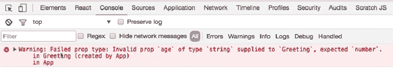
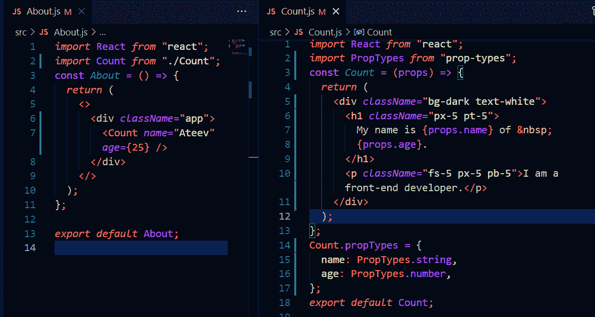

# 如何在 React 中使用属性类型

> 原文：<https://www.freecodecamp.org/news/how-to-use-proptypes-in-react/>

在调试应用程序时，PropTypes 是很好的第一道防线。但是在进入关于 PropTypes 的细节之前，我们必须理解 props 的概念。

Props 是组件之间共享的只读属性，为 React 的单向流提供动态的触觉。它们主要从父组件共享到子组件，但是反过来也是可能的(尽管不推荐)。

在这篇博客中，我们将讨论如何验证或检查我们传递的道具，以避免在稍后阶段进行复杂的调试。

## 什么是 PropTypes？

PropTypes 只是一种确保传递的值具有正确数据类型的机制。这可以确保我们不会在应用程序的最后通过控制台收到错误，这可能不容易处理。

我不建议在短应用程序中使用它们，比如用于自我练习的项目，但这完全取决于你。对于像客户这样的大型项目，使用它们通常是明智的选择和良好的实践。

有许多不同类型的 PropTypes，它们都有我们可以使用的独特的 ES6 类。我们将在本文中讨论每一种类型。

## 如何使用 PropTypes

在 React 15.5.0 发布之前，React 包中提供了 PropTypes，但现在我们必须在项目中添加 prop-types 库。

我们可以通过在终端中运行以下命令来做到这一点:

```
npm install prop-types --save
```

我们可以使用 PropTypes 来验证我们从 props 接收的任何数据。但在使用它之前，我们必须一如既往地将其导入我们的应用程序:

```
import PropTypes from 'prop-types';
```

它们通常在组件结束后使用，并以组件名称开始，如下所示:

```
import React from 'react';
import { PropTypes } from "prop-types";

const Count = (props) => {
  return (
    <>
      .........
    </>
  )
};

Count.propTypes = {
  //// key is the name of the prop and
// value is the PropType
}
export default Count;
```

属性类型也是具有键和值对的对象，其中“键”是属性的名称，而值表示定义它们的类型或类。

由于在组件上定义 PropTypes 并不依赖于组件的实现，所以在下面的所有例子中，我们将省略组件本身的代码。上面的代码可以简化为:

```
Count.propTypes = {
// Put props here
} 
```

在用一个例子来理解 PropTypes 之前，我们先讨论一下有多少种类型。

## PropTypes 的基本类型

我们可以检查道具类型的最基本的方法是检查它是否属于 JavaScript 中的基本类型类别，比如布尔值、字符串、对象等等。

下面是我们可以用来检查道具的所有被认为是原始的或基本的数据类型及其类的列表。

| 类型 | 类 | 例子 |
| 字符串 | PropType.string | “hello” |
| 物体 | PropType.object | {name: "Rohit"} |
| 号 | PropType.number | 10 |
| 布尔型 | PropType.bool | 真/假 |
| 功能 | PropType.func | const say = { console . log(" hello ")} |
| 符号 | PropType.symbol | 符号(" m") |

下面的例子向我们展示了如何在我们的应用程序中使用这些 PropTypes 进行类型检查。正如我们已经讨论过的，它们被定义为具有键和值对的对象，其中键是对象的名称，而值包含将用于类型检查的类。

```
Count.propTypes = {
  name: PropTypes.string,
  age: PropTypes.number,
  address: PropTypes.object,
  friends: PropTypes.array,
};
```

在上面的代码中，name prop 应该有一个字符串值，age 是一个数字，address 是一个对象，friends 是一个数组。如果除此之外的任何值被用于与值相同的属性，它将在控制台中显示如下错误:



Console error for wrong PropTypes

我们可以用`isRequired`链接上面的任何一个来确保如果没有提供道具的话会显示一个警告。

```
Count.propTypes = {
  basicObject: PropTypes.object,
  numbers: PropTypes.objectOf(PropTypes.numbers),
  messages: PropTypes.instanceOf(Message),
  contactList: PropTypes.shape({
    name: PropTypes.string.isRequired,
    phone: PropTypes.string.isRequired,
  }),
}; 
```

## 集体类型

我们已经看到了如何验证或检查基本数据类型属性属于哪一类。但是还有更多方法可以传递和使用道具——比如集合类型，比如数字数组、字符串等等。那么他们呢？

我们也可以为他们检查道具。下面是组合和使用数据类型的各种方法。

### 数组类型

在这里，我们将讨论所有的可能性，可以形成一个数组与他们的例子，就像我们看到的基本类型。

| 类型 | 类 | 例子 |
| 数组 | PropTypes.array 中 | [] |
| 数字数组 | prop types . arrayof([类型]) | 【1，2，3】 |
| 字符串数组 | PropTypes.oneOf([arr]) | [“红色”、“蓝色”] |
| 物体阵列 | prop types . oneoftype([类型]) | PropTypes.string，PropTypes.instanceOf(Title) |

```
Count.propTypes = {
  counts: PropTypes.array,
  users: PropTypes.arrayOf(PropTypes.object),
  alarmColor: PropTypes.oneOf(['red', 'blue']),
  description: PropTypes.oneOfType([
  PropTypes.string,
  PropTypes.instanceOf(Title)
  ]),
  } 
```

### 对象类型

就像数组类型一样，下面是一些集合对象类型:

| 类型 | 类 | 例子 |
| 物体 | PropTypes.object | {姓名:“阿奴”} |
| 数字对象 | PropTypes.objectOf() | {年龄:25} |
| 物体形状 | PropTypes.shape() | {name: PropTypes.string,电话:PropTypes.string} |
| 实例 | PropTypes.objectOf() | 新消息() |

```
Count.propTypes = {
  basicObject: PropTypes.object,
  numbers: PropTypes.objectOf(PropTypes.numbers),
  messages: PropTypes.instanceOf(Message),
  contactList: PropTypes.shape({
    name: PropTypes.string,
    phone: PropTypes.string,
  }),
}; 
```

## 高级类型检查

除了基本的类型检查之外，还有很多方法可以用来检查我们的道具。这种方法主要关注 React 代码，而不是数据类型。

### 如何检查反应组件

如果您只想检查一个道具是否是 React 组件，您可以使用 **PropTypes.element** 。这对于确保一个组件只有一个子组件很有用。

| 类型 | 类 | 例子 |
| 元素 | PropTypes.element | <标题/ > |

```
Count.propTypes = {
  displayEle: PropTypes.element,
};
```

### 如何检查 React 组件名称

最后，我们可以通过使用 **PropTypes.elementType** 来检查 prop 是否是 React 组件的名称。

```
Component.propTypes = {
  as: PropTypes.elementType
}
```

```
<AnotherComponent as={Component} />
```

## 自定义类型

我们也可以有一个自定义的验证器或者对 props 进行类型检查，但是如果验证失败，它需要一个错误对象。

您可以将它用于数组和对象，但是将为数组或对象中的每个键调用 error 对象。验证器的前两个参数是数组或对象本身以及当前项的键。

| 类型 | 类 | 例子 |
| 自定义 | 函数(道具，道具名，组件名){} | 【你好】 |
| 自定义数组 | prop types . array of(function(props，propName，componentName) {}) | [“你好”] |

```
Count.propTypes = {  // normal functionn
  customProp: function (props, propName, componentName) {
    if (!/matchme/.test(props[propName])) {
      return new Error(
        "Invalid prop `" +
          propName +
          "` supplied to" +
          " `" +
          componentName +
          "`. Validation failed."
      );
    }
  },
}; 
```

```
Count.propTypes = { // array function
  customArrayProp: PropTypes.arrayOf(function (
    propValue,
    key,
    componentName,
    location,
    propFullName
  ) {
    if (!/matchme/.test(propValue[key])) {
      return new Error(
        "Invalid prop `" +
          propFullName +
          "` supplied to" +
          " `" +
          componentName +
          "`. Validation failed."
      );
    }
  }),
}; 
```

## 默认属性类型

有时候，我们希望能够为一个道具设置一个默认值。例如，我们的父组件可能不需要传递标题。但是我们仍然希望呈现一个标题。

在这种情况下，我们可以为我们的标题设置一个默认值，如果标题没有作为道具从父组件传递过来，这个值将自动呈现。

```
Header.defaultProp = {
  title: "GitHub Users",
};
```

我们可以在[官方文档](https://reactjs.org/docs/typechecking-with-proptypes.html)中读到更多相关内容。

## 示例时间

让我们用一些简单的 React 代码来理解这一切是如何工作的。

我们会做两个可复用的组件， **About.js** 和 **Count.js** 。关于组件的**是父组件，**计数**组件是子组件，如下图所示:**



如果我们将 age prop 的值从数字改为字符串，而不改变其类型(PropTypes)会怎么样？

```
import React from "react";
import Count from "./Count";
const About = () => {
  return (
    <>
      <div className="app">
        <Count name="Ateev" age="25" />
      </div>
    </>
  );
};

export default About; 
```

我们将在控制台中收到一条错误消息，内容如下:


它清楚地表明传递的 age prop 值与预期值(PropTypes)不匹配。

从上面的例子中，我们可以清楚地知道如何使用 PropTypes。您还可以看到，当应用程序太大而无法用常规方法找到 bug 时，它们对于调试您的应用程序是多么有用。

## 结论

PropTypes 是在运行时捕捉错误的好方法，它是应用程序的第一道防线。它们不像 TypeScript 那样是类型安全的，但是它们更容易设置和使用。

你也可以看看我的其他博客:

1.  [你所说的术语**虚拟世界**在反应](https://tekolio.com/react-virtual-dom-explained-in-simple-words/)中是什么意思
2.  [React 中的钩子是什么？](https://tekolio.com/what-are-hooks-in-react/)
3.  [如何让投资组合做出反应](https://tekolio.com/how-i-made-my-portfolio-in-react/)