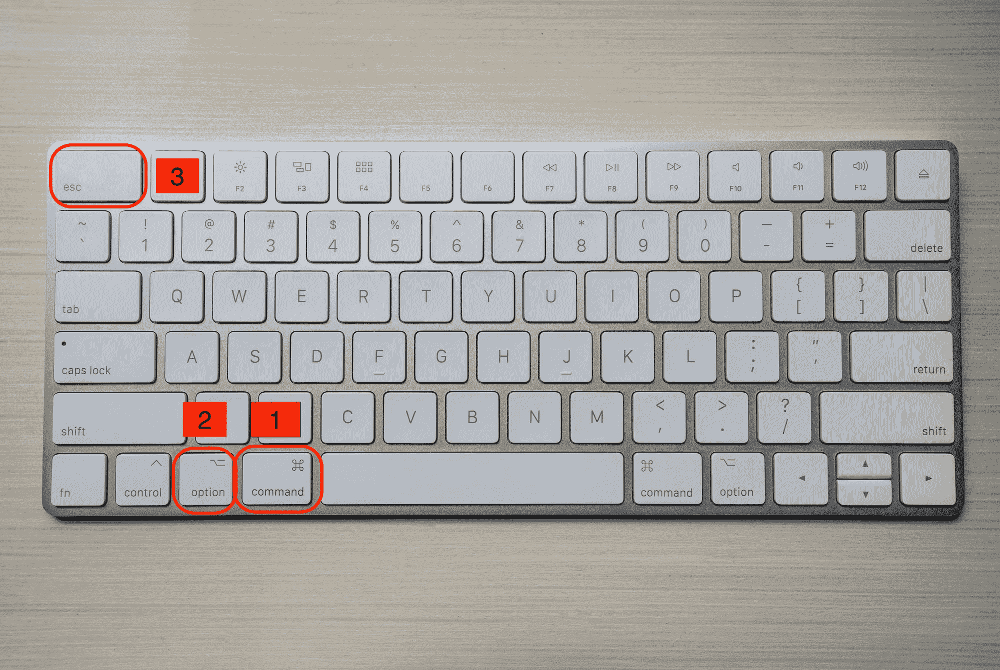
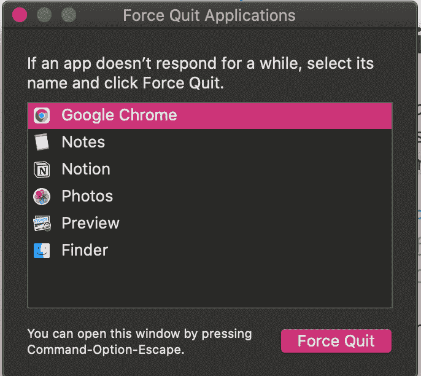
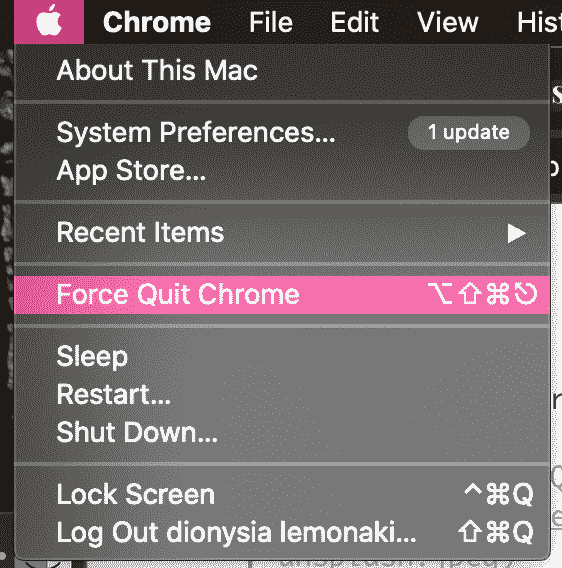
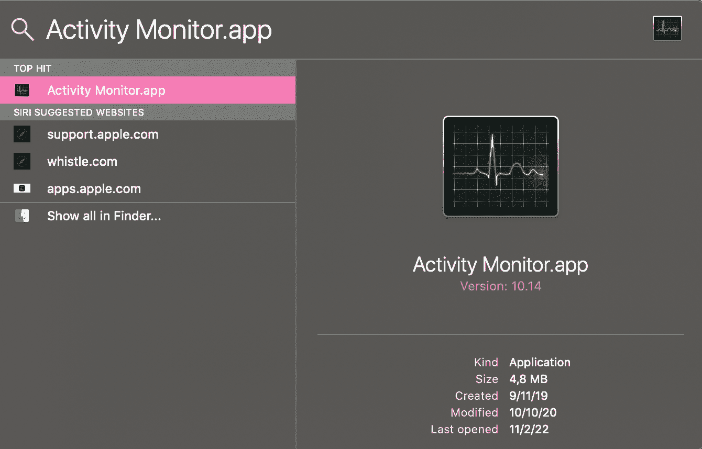
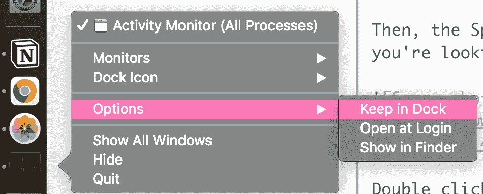
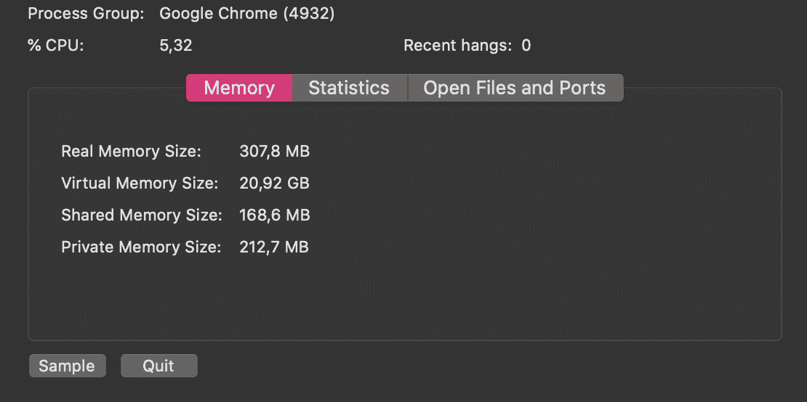
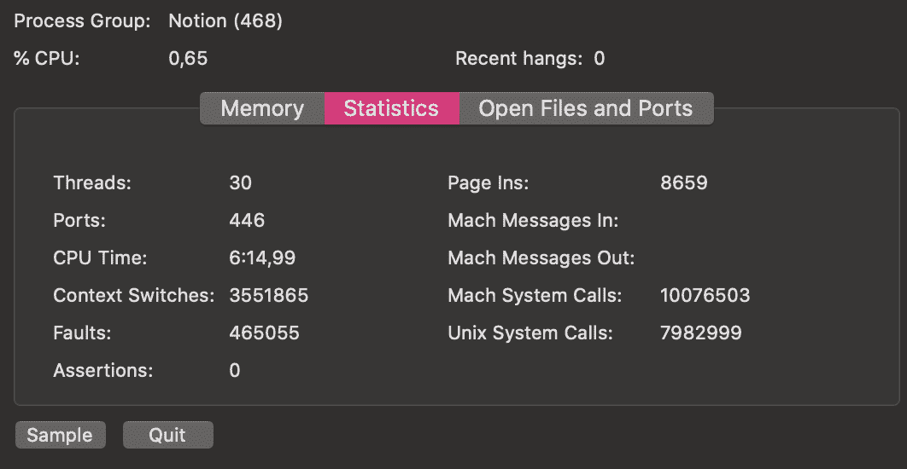
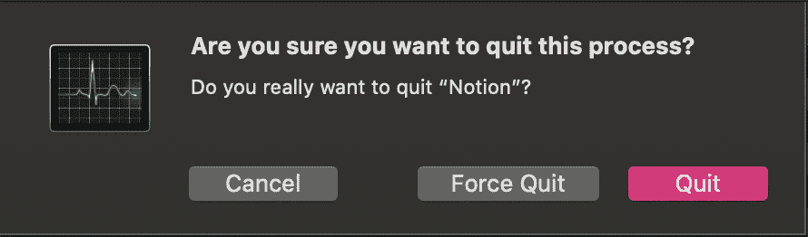
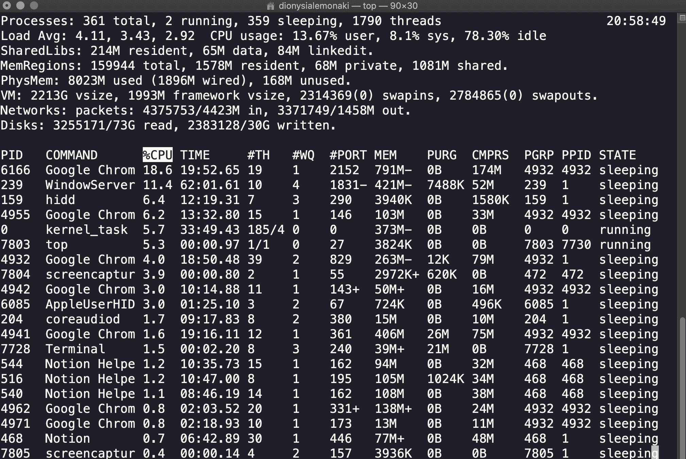

# 如何在 Mac 上打开任务管理器–苹果快捷方式教程

> 原文：<https://www.freecodecamp.org/news/how-to-open-task-manager-on-mac-apple-shortcut-tutorial/>

我们的电脑出问题从来都不好玩。

通常比问题本身更糟糕的是，当我们正在完成一项重要的任务时，问题就出现了。

电脑开始明显变慢，我们正在使用的应用程序可能会冻结一段时间。然后电脑的风扇开始变得越来越响，那个可怕的——但色彩斑斓的——旋转的轮子甚至可能会出现。

幸运的是，您可以采取某些步骤来解决不同的问题，找到问题的根源，并找出问题的根源。

在本文中，您将了解 MacOS 上的基本任务管理器工具。您将看到如何使用它来帮助您诊断和解决问题。

## 故障排除的第一步

当您正在使用的应用程序或程序冻结并且不再响应时，首先要做的是使用以下键盘快捷键:`Command Option Esc`。

同时按住这三个键。

这将启动强制退出应用程序管理器窗口:

此窗口显示您电脑上当前打开的所有应用程序的列表。

按照有用的说明，选择已冻结且不再响应的应用程序。然后下一步点击`Force Quit`按钮。

💡另一种访问该窗口的方法是点击屏幕左上角的苹果图标。将出现一个下拉菜单，从那里选择“强制退出”。

您选择的应用程序将被立即关闭和终止。

这是一个方便快捷的解决方案，用于关闭一个不工作并且不能正常停止的程序。

但是这种方法并没有给出太多关于问题原因的信息。这对于强制退出应用程序很有用。

## MacOS 活动监视器

如果您过去是 Windows 用户，您可能熟悉用于故障排除问题的任务管理器。

Activity Monitor 是在 Mac 操作系统上测量电脑活动的等效系统，只是名称不同。

它与窗口的对应物有很多相似之处。它定位并显示当前正在运行的所有进程，以及不同的应用程序如何影响计算机的性能。

因此，为了更深入地挖掘并收集更多关于已冻结的程序如何影响您的计算机的信息，启动活动监视器是有帮助的。

在那里，你可以关闭或强制退出程序，默认情况下不打开和不可见的后台进程，或者冻结、无响应和挂起的应用程序。

### 如何打开活动监视器

打开活动监视器最简单直接的方法是使用 Spotlight 按钮。

Spotlight 按钮位于 Mac 屏幕右上角的菜单栏中，看起来像一个放大镜。

要访问 Spotlight 按钮，您只需点击它:

💡另一种访问 Spotlight 的方法是使用`Command Spacebar`键盘快捷键。

然后，将出现聚光灯搜索。开始输入你要找的东西——在这种情况下，输入单词 Activity Monitor，它应该会出现。

点击返回并双击出现的第一个选项。

完成这些步骤并打开“活动监视器”后，您可以选择将它放在 Dock 中，以便将来方便快捷地访问。

单击并按住应用程序的图标。从那里，一旦下拉菜单出现，选择`Option`，然后选择`Keep in Dock`。

现在，应用程序被固定在您的 Dock 中。

## 如何使用活动监视器

### 活动监视器中五个标签的概述

“活动监视器”窗口打开后，您可以更深入地查看电脑上正在运行的当前进程。

窗口顶部有五个选项卡:

在默认打开的第一个**“CPU”**选项卡中，可以看到 CPU 使用情况的信息。

例如，在这里您可以看到活动如何影响处理器的性能，以及使用了多少处理器资源。它显示了哪些应用程序正在做最繁重的工作。

这是两个最有用的选项卡之一，用于在出现问题时进行检查。当风扇开始变大时，电脑变热，电池电量开始快速下降。检查此选项卡以查看哪个应用程序消耗了大部分 CPU 资源。

退出该应用程序可能会解决问题。

在**“内存”**选项卡中，您可以检查内存使用情况和负载。您可以看到不同应用程序当时消耗了多少 RAM(随机存取存储器)的统计数据和信息。

这是检查应用程序何时冻结的第二个最重要的选项卡。当一个应用程序冻结，你的电脑真的变慢了，这可能是一个迹象，内存正在被过度使用和最大化。这也可能表明您的计算机内存不足，这就是它没有发挥最大能力的原因。

**“Energy”**选项卡显示每个正在运行的进程的每个应用程序使用了多少能量和功率。此选项卡显示哪些应用程序消耗的能量最多，消耗的电池寿命也最长。

**“磁盘标签”**显示磁盘使用情况。它表示从磁盘存储设备中读取和写入了多少数据。这里也是检测潜在恶意软件的好地方。

最后，**“网络”**选项卡显示 Mac 上的哪些应用程序从网络发送和接收的数据最多。

您可以选择这些选项卡中的任何一个来进一步调查您遇到的问题。

### 如何在活动监视器中搜索应用程序

可能有一长串正在运行的进程。

要缩小范围并搜索特定的应用程序，请使用位于窗口右上角的搜索栏。

键入您要查找的应用程序的名称，如果该应用程序当前已启动并正在运行，结果将会显示该应用程序。

### 如何在活动监视器中查看有关应用程序的更多信息

首先，从当前正在运行的进程列表中选择一个特定的应用程序，您有兴趣通过单击它来了解更多信息。

一旦你选择了它，那一行将被高亮显示。

然后，点击左上角的`i`按钮(用于检查)。

将出现一个弹出窗口，显示有关应用程序的附加信息。

该窗口将有三个不同的选项卡:“内存”、“统计”和“打开的文件和端口”。

在内存中，你会看到有多少内存在运行。

在 Statistis 选项卡中，您可以看到线程数量、CPU 时间以及更多技术信息。

“打开文件和端口”选项卡将显示当前正在运行的所有文件的名称。

### 如何在活动监视器中强制退出应用程序

要退出或强制退出“活动监视器”中列出的任何进程，请选择您想要停止运行的应用程序。

然后选择左上角的`x`按钮，作为停止按钮。

您将看到一个弹出窗口，要求您确认是否要终止该过程。它会用双引号提到你想停止运行的应用程序的名字。

选择“退出”，如果无法关闭应用程序，选择“强制退出”，应用程序将立即关闭。

请记住，如果应用程序冻结，并且您未能保存任何进度或正在使用的文件，您可能会丢失数据。

## 活动监控的替代方案

如果您是开发人员，您可能更喜欢使用终端。

只需使用一个命令，您就可以看到当前正在运行的进程的列表。

再次导航到 spotlight，这次输入“终端”。MacOS 的内置终端应用程序将会启动。

你会看到命令提示符就在你的电脑的用户名后面。

默认情况下，如果您没有为 Zsh shell 应用任何定制样式，命令提示符是一个`%`符号。

外壳是一种计算机程序，它通过作为输入接收的基于文本的命令与底层操作系统进行交互。

Zsh 是许多不同的可用 Unix shell 类型之一。Zsh shell 是 MacOS Catalina 和更高版本的默认 shell。

在命令提示符后，输入命令`top`并按回车键。

您将看到当前正在运行的所有进程的列表:

要停止这种情况，输入`Control C`，向命令发送信号以终止。您将立即返回到命令提示符。

当执行`top`命令时，您可能会看到一个进程使用了太多的资源。杀死它可能是个好主意，这是终止一个进程的另一种说法。

为此，首先定位`PID`(进程 ID)。当执行`top`命令时，该数字位于左上角的第一列。

若要继续，请确保您处于命令提示符下。

然后，键入`kill -9 PID`，其中`PID`是您想要终止的进程的编号。

例如，如果我想强制退出我当前正在使用的终端应用程序，它的`PID`为 7728，我将编写如下代码:`kill -9 7728`。

然后应用程序将立即关闭。

## 结论

谢谢你坚持到最后。希望您发现这很有帮助，并且能够解决您在 Mac 电脑上遇到的任何问题。

您了解了活动监视器，它相当于 Windows PCs 上的任务管理器。您还学习了如何使用命令行来终止占用过多计算机资源的进程。

感谢阅读！