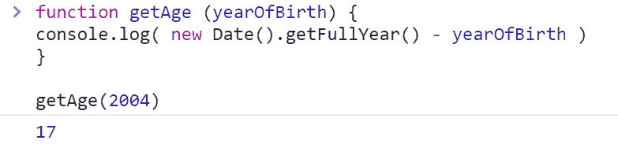
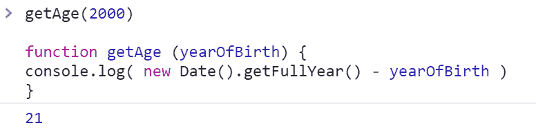
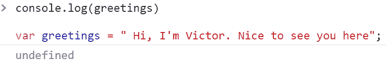
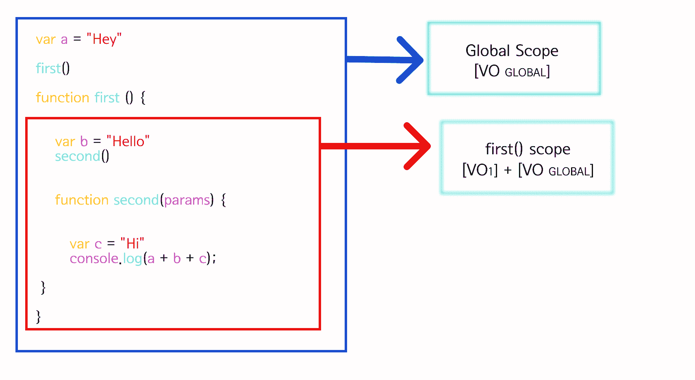
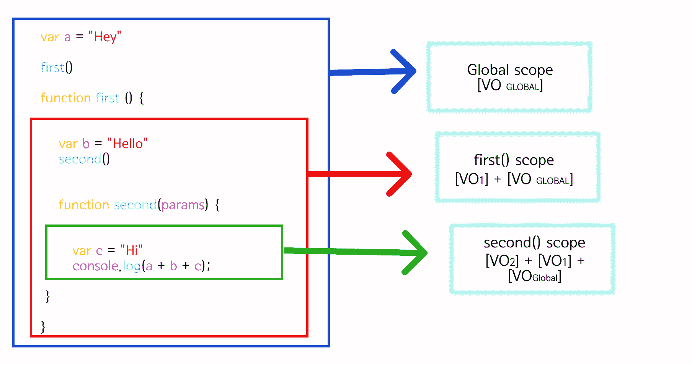
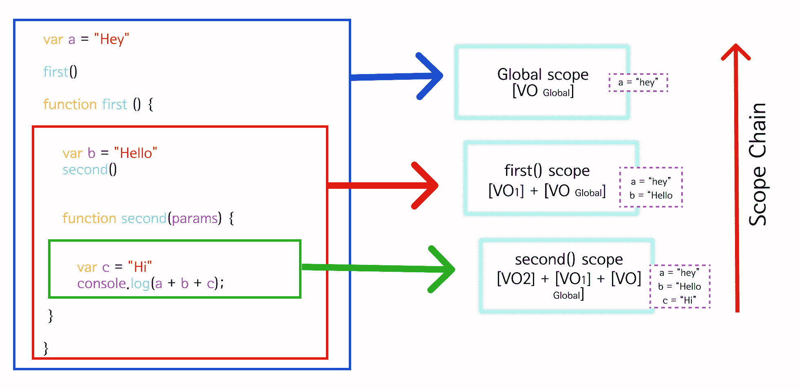
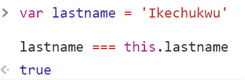
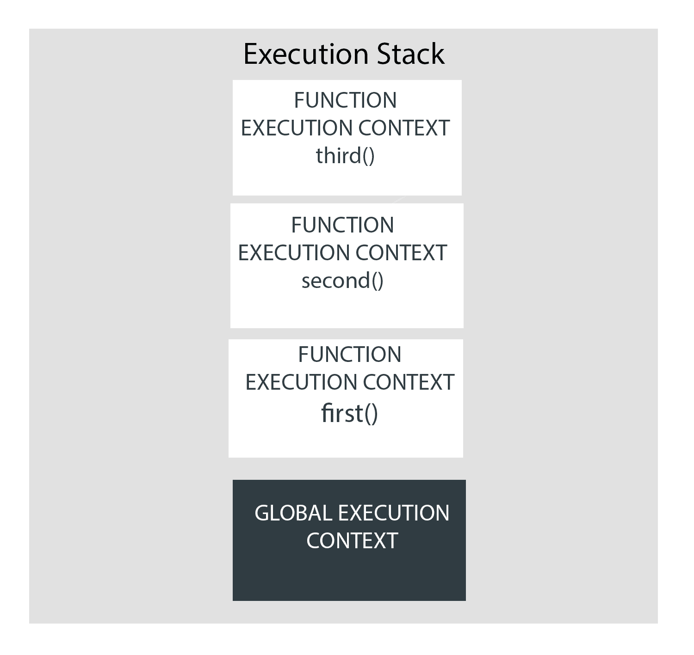
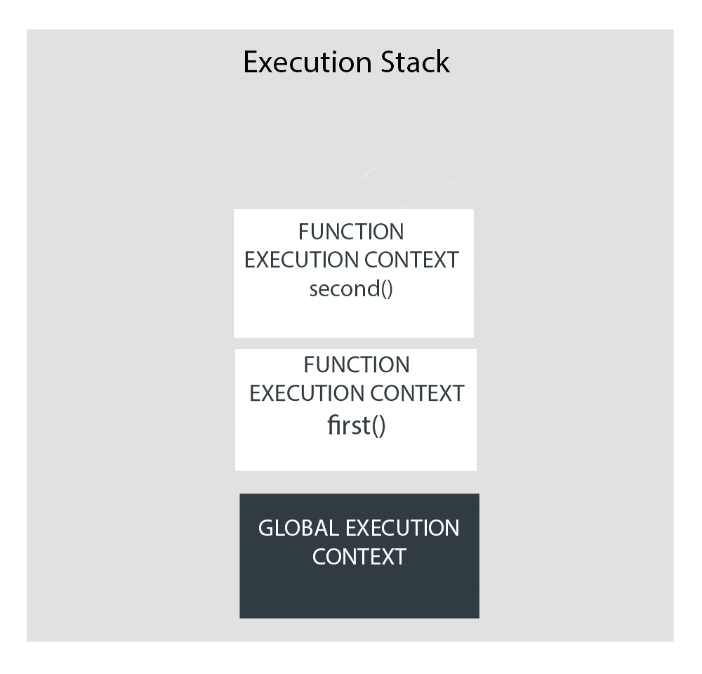
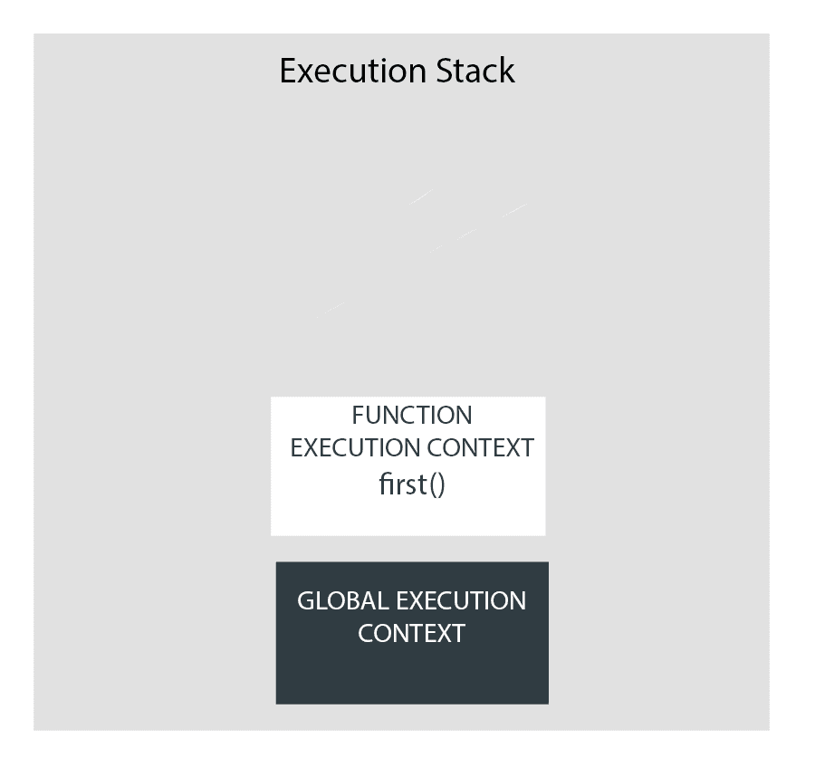

# JavaScript 执行上下文——JS 如何在幕后工作

> 原文：<https://www.freecodecamp.org/news/execution-context-how-javascript-works-behind-the-scenes/>

所有 JavaScript 代码都需要在某种环境中托管和运行。在大多数情况下，这个环境是一个网络浏览器。

对于要在 web 浏览器中执行的任何一段 JavaScript 代码来说，很多过程都是在幕后进行的。在本文中，我们将看看 JavaScript 代码在 web 浏览器中运行的幕后发生的一切。

在我们开始之前，需要熟悉一些先决条件，因为在本文中我们会经常用到它们。

*   ****解析器**** :解析器或语法解析器是一个逐行读取你的代码的程序。它理解代码如何符合编程语言定义的语法，以及它(代码)被期望做什么。
*   ****JavaScript 引擎****:JavaScript 引擎简单来说就是一个计算机程序，它接收 JavaScript 源代码，并将其编译成 CPU 可以理解的二进制指令(机器码)。JavaScript 引擎通常由 web 浏览器供应商开发，每个主流浏览器都有一个。例子包括谷歌 chrome 的 [V8 引擎](https://v8.dev/)，Firefox 的 [SpiderMonkey](https://firefox-source-docs.mozilla.org/js/index.html) ，以及 Internet Explorer 的 [Chakra](https://en.wikipedia.org/wiki/Chakra_(JScript_engine)) 。
*   ****函数声明**** :这些是被赋予名称的函数。

```
function doSomething() { //here "doSomething" is the function's name
statements; 
} 
```

*   ****函数表达式**** :这些是匿名函数，也就是像`js function () { statements }`一样没有函数名的函数。它们通常用在语句中，比如将函数赋给变量。`let someValue = function () { statements }`。

现在，我们已经解决了这些问题，让我们开始吧。

## 【JavaScript 代码如何执行

对于不知道的人来说，浏览器本身并不理解我们在应用程序中编写的高级 JavaScript 代码。它需要被转换成浏览器和我们的计算机能够理解的格式——机器码。

在读取 HTML 时，如果浏览器遇到要通过`<script>`标签或包含 JavaScript 代码的属性(如`onClick`)运行的 JavaScript 代码，它会将其发送到其 JavaScript 引擎。

浏览器的 JavaScript 引擎然后创建一个特殊的环境来处理这个 JavaScript 代码的转换和执行。这种环境被称为 ****`Execution Context`**** 。

执行上下文包含当前正在运行的代码，以及有助于其执行的所有内容。

在执行上下文运行时，解析器解析特定的代码，变量和函数存储在内存中，生成可执行字节码，然后执行代码。

JavaScript 中有两种执行上下文:

*   全球执行环境(GEC)
*   函数执行上下文(FEC)

让我们详细看看这两者。

### **全球执行环境(GEC)**

每当 JavaScript 引擎接收到一个脚本文件时，它首先创建一个默认的执行上下文，称为 ****`Global Execution Context (GEC)`**** 。

GEC 是基本/默认的执行上下文，所有不在函数 内部的****JavaScript 代码都在这里执行。****

> 对于每个 JavaScript 文件，只能有一个 GEC。

### **函数执行上下文(FEC)**

每当调用一个函数时，JavaScript 引擎都会在 GEC 中创建一种不同类型的执行上下文，称为函数执行上下文(FEC ),以评估和执行该函数中的代码。

因为每个函数调用都有自己的 FEC，所以在一个脚本的运行时可以有不止一个 FEC。

## 如何创建执行上下文？

现在我们知道了什么是执行上下文，以及不同的可用类型，让我们看看如何创建。

执行上下文(GEC 或 FEC)的创建分两个阶段进行:

1.  创建阶段
2.  执行阶段

### 创建阶段

在创建阶段，执行上下文首先与执行上下文对象(ECO)相关联。执行上下文对象存储了执行上下文中的代码在运行时使用的大量重要数据。

创建阶段分为 3 个阶段，在此期间定义和设置执行上下文对象的属性。这些阶段是:

1.  创建可变对象(VO)
2.  范围链的创建
3.  设置`this`关键字的值

让我们详细检查一下每个阶段。

### **创建阶段:创建变量对象(VO)**

变量对象(VO)是在执行上下文中创建的类似对象的容器。它存储在执行上下文中定义的变量和函数声明。

在 GEC 中，对于用`var`关键字声明的每个变量，一个属性被添加到指向该变量的 VO 中，并被设置为‘undefined’。

此外，对于每个函数声明，都会向 VO 添加一个属性，指向该函数，并且该属性存储在内存中。这意味着即使在代码开始运行之前，所有的函数声明都将被存储在 VO 中并可在 VO 中访问。

另一方面，FEC 不构建 VO。相反，它生成一个类似数组的对象，称为“argument”对象，其中包括提供给函数的所有参数。点击了解更多关于参数对象[的信息。](https://developer.mozilla.org/en-US/docs/Web/JavaScript/Reference/Functions/arguments)

这个在代码执行前将变量和函数声明存储在内存中的过程被称为 ****提升**** 。由于这是一个重要的概念，在进入下一阶段之前，我们将简单地讨论一下。

### **在 JavaScript 中提升**

函数和变量声明在 JavaScript 中被挂起。这意味着它们存储在当前执行上下文的 VO 的内存中，甚至在代码开始执行之前就可以在执行上下文中使用。

#### **功能提升**

在构建应用程序的大多数情况下，开发人员可以选择在脚本的顶部定义函数，然后在代码中调用它们，如下所示:



但是，由于吊装，相反的仍然会工作。我们可以先调用函数，然后在脚本中定义它们。



在上面的代码中，`getAge`函数声明将被存储在 VO 的内存中，使得它甚至在被定义之前就可以使用。

#### **可变吊装**

用`var`关键字初始化的变量作为属性存储在当前执行上下文 VO 的内存中，并用值`undefined`初始化。这意味着，与函数不同，试图在定义变量之前访问变量的值将导致`undefined`。



#### **吊装的基本规则**

提升只适用于函数声明，不适用于表达式。下面是一个函数表达式的例子，其中代码执行将会中断。

```
getAge(1990); 
var getAge = function (yearOfBirth) {
console.log(new Date().getFullYear - yearOfBirth) 
};
```

代码执行中断，因为对于函数表达式，`getAge`将被提升为变量而不是函数。对于可变提升，其值将被设置为`undefined`。这就是我们得到错误的原因:


同样，变量提升对于用关键字`let`或`const`初始化的变量不起作用。试图在声明之前访问一个变量，然后使用`let`和`const`关键字来声明它，将会导致一个`ReferenceError`。

在这种情况下，它们将被提升，但不会被赋予默认值`undefined`。`js console.log(name); let name = "Victor";` 将抛出错误:


### **创建阶段:创建范围链**

在创建变量对象(VO)之后，创建范围链，这是执行上下文创建阶段的下一个阶段。

JavaScript 中的作用域是一种机制，它决定了一段代码对代码库的其他部分的可访问性。作用域回答了以下问题:从哪里可以访问一段代码？从哪里无法访问？什么能访问它，什么不能？

每个函数执行上下文创建其作用域:它定义的变量和函数可以通过称为作用域的过程访问的空间/环境。

这意味着某个东西在代码库中的位置，也就是一段代码所在的位置。

当一个函数在另一个函数中定义时，内部函数可以访问外部函数及其父函数中定义的代码。这种行为叫做**。**

**但是，外部函数不能访问内部函数中的代码。**

**这个范围的概念带来了 JavaScript 中的一个相关现象，叫做闭包。这种情况下，内部函数总是能够访问与外部函数相关联的代码，即使在外部函数执行完成之后。你可以在这里了解更多闭包[。](https://www.freecodecamp.org/news/scope-and-closures-in-javascript/)**

**让我们来看一些例子，以便更好地理解:**

****

*   **右边是全局范围。这是在加载一个`.js`脚本时创建的默认作用域，可以通过代码中的所有函数访问。**
*   **红框是`first`函数的范围，定义了变量`b = 'Hello!'`和`second`函数。**

****

*   **绿色部分是`second`功能的范围。有一个`console.log`语句是打印变量`a`、`b`和`c`。**

**现在`second`函数中没有定义变量`a`和`b`，只有`c`。然而，由于词法范围，它可以访问它所在的函数的范围和它的父函数的范围。**

**在运行代码时，JS 引擎不会在`second`函数的范围内找到变量`b`。所以，它从`first`函数开始，查找其父函数的范围。在那里它找到了变量`b = 'Hello'`。它返回到`second`函数，用它来解析`b`变量。**

**对于`a`变量，过程相同。JS 引擎通过其所有父级的范围一直查找到 GEC 的范围，在`second`函数中解析它的值。**

**JavaScript 引擎遍历定义函数的执行上下文的作用域，以解析其中调用的变量和函数，这种想法被称为 ****作用域链**** 。**

****

**只有当 JS 引擎无法解析作用域链中的变量时，它才会停止执行并抛出错误。**

**然而，这并不向后起作用。也就是说，全局范围永远不会访问内部函数的变量，除非它们来自函数的`returned`。**

**示波器链条就像一个单向玻璃。你可以看到外面，但是外面的人看不到你。**

**这就是为什么上图中的红色箭头指向上方，因为这是范围链的唯一方向。**

### **创建阶段:设置“this”关键字的值**

**在执行上下文的创建阶段，作用域之后的下一个也是最后一个阶段是设置关键字`this`的值。**

**JavaScript `this`关键字指的是执行上下文所属的范围。**

**一旦创建了作用域链，JS 引擎就会初始化`'this'`的值。**

##### ****`"this"`全球背景下的****

**在 GEC 中(任何函数和对象之外)，`this`指的是全局对象——也就是`window`对象。**

**因此，用`var`关键字初始化的函数声明和变量作为属性和方法被分配给全局对象–`window`对象。**

**这意味着在任何函数之外声明变量和函数，就像这样:**

```
`var occupation = "Frontend Developer"; 

function addOne(x) { 
    console.log(x + 1) 
}`
```

**与以下内容完全相同:**

```
`window.occupation = "Frontend Developer"; 
window.addOne = (x) => { 
console.log(x + 1)
};`
```

**GEC 中的函数和变量作为方法和属性附加到窗口对象上。这就是为什么下面的代码片段将返回 true。**

****

##### **功能中的 **`"this"`****

**在 FEC 的情况下，它不创建`this`对象。更确切地说，它获得了对定义它的环境的访问权。**

**这里将是`window`对象，因为函数是在 GEC 中定义的:**

```
`var msg = "I will rule the world!"; 

function printMsg() { 
    console.log(this.msg); 
} 

printMsg(); // logs "I will rule the world!" to the console.`
```

**在 objects 中，`this`关键字并不指向 GEC，而是指向对象本身。在对象内引用`this`将与:**

**`theObject.thePropertyOrMethodDefinedInIt;`**

**考虑下面的代码示例:**

```
`var msg = "I will rule the world!"; 
const Victor = {
    msg: "Victor will rule the world!", 
    printMsg() { console.log(this.msg) }, 
}; 

Victor.printMsg(); // logs "Victor will rule the world!" to the console.`
```

**代码将`"Victor will rule the world!"`记录到控制台，而不是`"I will rule the world!"`，因为在这种情况下，函数可以访问的`this`关键字的值是定义它的对象的值，而不是全局对象的值。**

**设置了`this`关键字的值后，执行上下文对象的所有属性都已被定义。导致创建阶段的结束，现在 JS 引擎进入执行阶段。**

### ****执行阶段****

**最后，在执行上下文的创建阶段之后就是执行阶段。这是实际代码执行开始的阶段。**

**到目前为止，VO 包含值为`undefined`的变量。如果代码在此时运行，它肯定会返回错误，因为我们不能处理未定义的值。**

**在这个阶段，JavaScript 引擎再次读取当前执行上下文中的代码，然后用这些变量的实际值更新 VO。然后代码被解析器解析，变成可执行的字节码，最后被执行。**

## ****JavaScript 执行堆栈****

**执行堆栈，也称为 ****调用堆栈**** ，跟踪脚本生命周期中创建的所有执行上下文。**

**JavaScript 是单线程语言，这意味着它一次只能执行一个任务。因此，当其他动作、功能和事件发生时，为这些事件中的每一个创建执行上下文。由于 JavaScript 的单线程特性，要执行的一堆堆积的执行上下文被创建，称为`Execution Stack`。**

**当脚本加载到浏览器中时，全局上下文被创建为 JS 引擎开始执行代码的默认上下文，并被放置在执行堆栈的底部。**

**JS 引擎然后在代码中搜索函数调用。对于每个函数调用，都会为该函数创建一个新的 FEC，并将其置于当前正在执行的执行上下文之上。**

**执行堆栈顶部的执行上下文成为活动的执行上下文，并且总是由 JS 引擎首先执行。**

**一旦执行完活动执行上下文中的所有代码，JS 引擎就会弹出执行堆栈中特定函数的执行上下文，并移动到它下面的下一个上下文，依此类推。**

**为了理解执行堆栈的工作过程，请考虑下面的代码示例:**

```
`var name = "Victor";

function first() {
  var a = "Hi!";
  second();
  console.log(`${a} ${name}`);
}

function second() {
  var b = "Hey!";
  third();
  console.log(`${b} ${name}`);
}

function third() {
  var c = "Hello!";
  console.log(`${c} ${name}`);
}

first();`
```

**首先，脚本被加载到 JS 引擎中。**

**之后，JS 引擎创建 GEC，并将其放在执行堆栈的底部。**

****

**`name`变量是在任何函数之外定义的，所以它在 GEC 中并存储在它的 VO 中。**

**对于`first`、`second`和`third`功能，也发生同样的过程。**

**不要搞不清楚为什么他们的功能仍然在 GEC。记住，GEC 只适用于不在任何函数 内部的****JavaScript 代码(变量和函数)。因为它们没有在任何函数中定义，所以函数声明在 GEC 中。现在有意义了😃？******

**当 JS 引擎遇到`first`函数调用时，会为它创建一个新的 FEC。这个新的上下文被放在当前上下文之上，形成了所谓的`Execution Stack`。**

****

**在`first`函数调用期间，它的执行上下文成为 JavaScript 代码首次执行的活动上下文。**

**在`first`函数中，变量`a = 'Hi!'`存储在其 FEC 中，而不是 GEC 中。**

**接下来，在`first`函数中调用`second`函数。**

**由于 JavaScript 的单线程特性，`first`函数的执行将被暂停。它必须等到它的执行，即`second`函数完成。**

**JS 引擎再次为`second`函数设置一个新的 FEC，并将其放在堆栈的顶部，使其成为活动上下文。**

****

**`second`函数成为活动上下文，变量`b = 'Hey!';`存储在其 FEC 中，而`third`函数在`second`函数中被调用。它的 FEC 被创建并放在执行堆栈的顶部。**

****

**在`third`函数内部，变量`c = 'Hello!'`存储在 FEC 中，消息`Hello! Victor`记录到控制台。**

**因此这个函数已经完成了它所有的任务，我们称它为`returns`。它的 FEC 从栈顶移除，调用了`third`函数的`second`函数的 FEC 回到活动上下文。**

****

**回到`second`函数，消息`Hey! Victor`被记录到控制台。该函数完成了它的任务`returns`，它的执行上下文从调用堆栈中弹出。**

****

**当第一个函数执行完成时，第一个函数的执行堆栈从堆栈中弹出。因此，控制返回到代码的 GEC。**

****

**最后，当整个代码的执行完成时，JS 引擎从当前堆栈中移除 GEC。**

## ****JavaScript 中的全局执行上下文与函数执行上下文****

**既然您一直读到这一节，让我们用下表总结一下 GEC 和 FEC 之间的要点。**

| 全局执行上下文 | 函数执行上下文 |
| --- | --- |
| 创建存储函数和变量声明的全局变量对象。 | 不创建全局变量对象。相反，它创建一个 argument 对象来存储传递给函数的所有参数。 |
| 创建“this”对象，将全局范围内的所有变量和函数存储为方法和属性。 | 不创建“this”对象，但可以访问定义它的环境的对象。通常是“窗口”对象。 |
| 无法访问其中定义的函数上下文的代码 | 由于作用域的原因，可以访问定义它的上下文及其父上下文中的代码(变量和函数) |
| 为全局定义的变量和函数设置内存空间 | 仅为函数中定义的变量和函数设置内存空间。 |

## ****结论****

**JavaScript 的执行上下文是正确理解许多其他基本概念的基础。**

**执行上下文(GEC 和 FEC)和调用堆栈是由 JS 引擎在幕后执行的过程，让我们的代码运行。**

**希望现在您对函数/代码的运行顺序以及 JavaScript 引擎如何处理它们有了更好的理解。**

**作为开发人员，很好地理解这些概念有助于您:**

*   **对这种语言的来龙去脉有一个相当好的理解。**
*   **很好地掌握一门语言的基础/核心概念。**
*   **编写干净的、可维护的、结构良好的代码，将更少的错误引入到产品中。**

**所有这些都会让你成为一个更好的开发人员。**

**希望这篇文章对你有所帮助。请与你的朋友和网络分享，并随时与我联系，在我的推特和 T2 博客上，我会分享各种免费的教育文章和资源。这真的激励我发表更多。**

**感谢您的阅读，祝您编码愉快！**