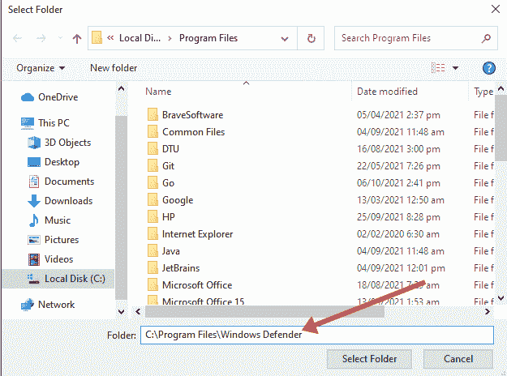
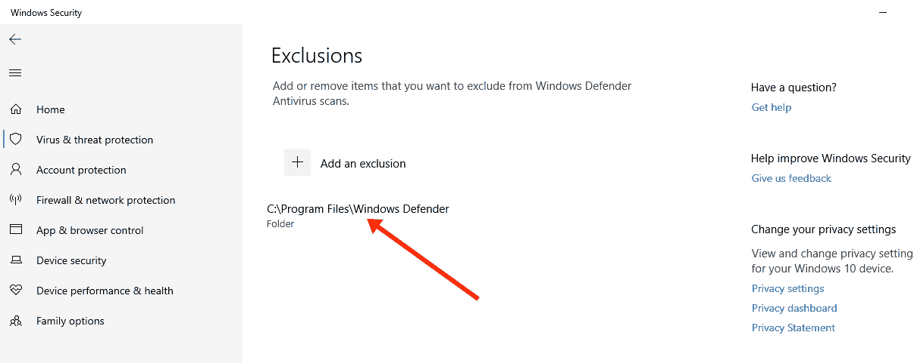

# 什么是反恶意软件服务可执行文件？为什么是 CPU 磁盘使用率高？

> 原文：<https://www.freecodecamp.org/news/what-is-antimalware-service-executable-why-is-it-high-cpu-disk-usage/>

反恶意软件服务可执行文件是在后台运行的 Windows 安全组件。

但有时反恶意软件服务可执行文件会因使用过多 CPU 而对 Windows 10 计算机产生负面影响。

在本指南中，我将向您展示什么是反恶意软件服务可执行文件，为什么它会使用如此多的 CPU，以及如何优化您的 Windows 10 计算机以确保它不会使用过多的 CPU。

## 什么是反恶意软件服务可执行文件？

反恶意软件服务可执行文件是一个 Windows 安全进程，可针对恶意软件执行实时防护。

也称为 msmpeng.exe，反恶意软件服务可执行文件在后台运行，因此它可以不时地扫描文件和程序。

当反恶意软件服务可执行文件检测到病毒或其他恶意攻击时，它会将其删除或隔离。

## 为什么反恶意软件服务可执行文件会占用大量 CPU？

反恶意软件服务可执行文件使用太多 CPU 的主要原因是它在后台不断运行。

在后台运行时，它会主动扫描程序和文件，并在检测到任何恶意内容时执行适当的操作。

此外，反恶意软件服务可执行文件使用了太多的 CPU，因为它扫描自己的文件夹- `C:\Program Files\Windows Defender`。

因此，停止反恶意软件服务可执行文件扫描自己的文件夹是一种方法，您可以使它使用更少的 CPU。

## 如何阻止反恶意软件服务可执行文件使用过多的 CPU

阻止反恶意软件服务可执行文件使用过多 CPU 的两种主要方法是重新计划 Windows 安全扫描，并阻止它扫描自己的文件夹。

重新计划扫描不会使扫描一直发生，阻止可执行文件扫描自己的文件夹将禁用实时保护。

## 解决方案 1:防止反恶意软件服务可执行文件扫描自己的文件夹

**第一步**:按键盘上的 WIN 键，选择齿轮图标，打开设置 app。

**步骤 2** :点击菜单块中的“更新和安全”。

**第三步**:选择“Windows 安全”，然后点击“病毒和威胁防护”。

**第四步**:Windows 安全应用将会打开。在“病毒&威胁防护设置”下，点击“管理设置”链接。

**第 5 步**:向下滚动到“排除”并选择“添加或删除排除”链接。

**第 6 步**:在下一页，点击“添加排除”，然后选择“文件夹”。

**第七步**:将`C:\Program Files\Windows Defender` 粘贴到编辑器中，点击“选择文件夹”。

**第 8 步**:点击“选择文件夹”后，会立即出现一个巨大的模态——确保你点击“是”。

所选文件夹现在将被添加到排除项中，不会被扫描。

## 解决方案 2:禁用实时防护并重新计划扫描

**第一步**:按`WIN` (Windows 键)打开跑步对话框。

**第二步**:输入“taskschd.msc”，点击“确定”。这将打开任务计划应用程序。

**第三步**:展开“任务调度器标签”、“微软”、“视窗”。

**第四步**:向下滚动，选择“Windows Defender”。

**第五步**:右键点击“Windows Defender 预设扫描”，选择“属性”。

**第 6 步**:取消选中常规选项卡中的“以最高权限运行”。

**步骤 7** :转到条件选项卡，取消选中那里的所有选项。

**第 8 步**:切换到触发器选项卡，点击“新建”。

**步骤 9** :安排您希望 Windows Defender 运行扫描的时间。选择频率、日期和时间，然后单击“确定”。再次单击“确定”。

第十步:重启电脑。这样，反恶意软件服务可执行文件就不会再消耗太多 CPU 了。

## 最后的想法

反恶意软件服务可执行文件提供的保护无可否认是相关的。这种保护可以防止恶意软件攻击，因此您可以在使用 Windows 10 电脑时感到安全。

如果您尝试使用本文中介绍的两种方法使反恶意软件服务可执行文件消耗更少的 CPU，并且似乎没有进展，您应该尝试永久禁用您的 Windows 安全程序。

但是要确保你有另一个防病毒程序，这样你的电脑就不会受到攻击。

感谢您的阅读。