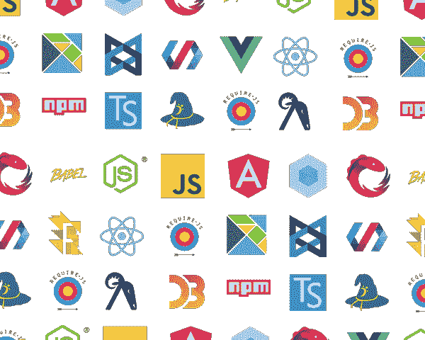
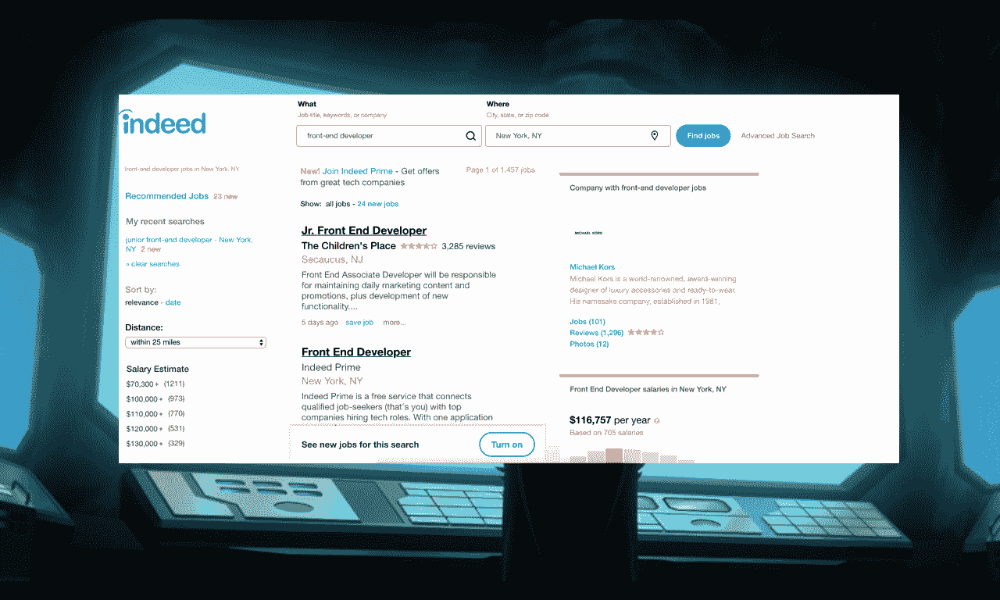
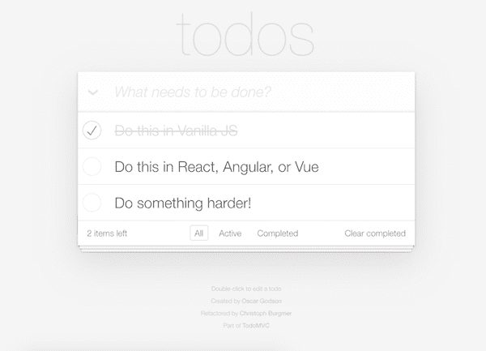
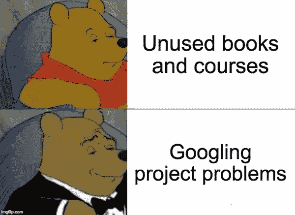

# 如何通过创建流程将生产力提高 10 倍

> 原文：<https://www.freecodecamp.org/news/10x-your-productivity-by-creating-a-process/>

## 谢谢你

我上一篇关于消灭拖延症的文章比我预期的要好很多。看到像我一样的其他人打这场艰苦的战斗令人欣慰，听到你们都喜欢我这不起眼的作品令人温暖！谢谢你，❤️

为了保持这种势头，我们来谈谈创建过程。

## 我要去一个地方！

你在手机上滚动，YouTube 推荐了另一个激励视频，因为它知道你有多爱它们，比如 ***我如何让自己的净资产翻了三倍*** 等等。你听到一个家伙声称深呼吸和不吃蔬菜把他变成了 CEO。

> 不吃西兰花，男人的身家翻了三倍

像所有其他的一样，它足够响亮和大胆，足以激起你内心熟悉的感觉，当视频结束时，突然的安培和发烧的瘙痒让事情一清二楚——你又被灵感虫咬了。

接下来会发生什么？和往常一样...

> “我要成为一名网页开发者！”

> “我明天开始健身！”

> “我要升职了！”

你的战斗口号可能不同，但你的里程数不会。你仍然无处可去。

## 介意说得具体点吗？

“我将成为一名 web 开发人员”是什么意思？我们如何才能追踪这些你在灵感迸发时喊出的模糊短语的进展呢？

我不是说不要有远大的目标。受到启发。充满活力！但是请把精力用在更具体的事情上。交谈感觉很好，我们已经讨论过这个问题，但是当你不可避免地从那种鼓舞人心的高潮中回来时，你的具体行动会是什么？

不要只是说，“我要学习 web 开发”，你知道这是一个多么艰巨的任务吗？！

*   HTML，CSS，JavaScript
*   框架/库
*   测试
*   易接近
*   构建工具
*   超文本传送协议
*   搜索引擎优化
*   动画片
*   REST APIs
*   模板引擎
*   状态管理
*   命令行
*   累了吗？

> 这是 2016 年的 JS 生态系统...*三年前！*

我在 2013 年左右遭受了这种痛苦，在几年后 JavaScript *真正*引爆之前。如果我们按照这个定义去做，那么即使有将近 5 年的经验，我仍然没有“学会”web 开发，而且我永远也不会。

每一次努力都有一大堆路径，我们大多数人浪费宝贵的时间考虑所有可能的路径，而不是只致力于一个并蓬勃发展。

你会再次失去动力，因为没有设定具体的目标。

## 告诉我你想要什么

你想成为一名网络开发人员，很好。

哪种？为什么？

你想要一份工作吗？什么样的工作？你想做生意吗？什么样的生意？告诉我你到底想要什么！一旦我们确定了你的目标，我们就可以准备狩猎了。

这里有一个蝙蝠侠引导小丑通过它的例子。

> **小丑**:好吧！我抛硬币，认为 ui 很酷，让我们专注于前端开发(目前)。我想成为一名*前端*网站开发者。

> **蝙蝠侠**:好，哪里？

> 小丑:我有孩子，所以离房子不超过一小时。一个偏僻的位置将是理想的。

> 蝙蝠侠:这是一份基于无数 Indeed.com 帖子的工作描述。

### 工作说明

*   精通 HTML，CSS，JavaScript

*   了解现代移动/响应设计技术

*   Git/GitHub

*   出色的口头和书面沟通能力

*   React、Angular、Vue、Node.js 的加分

> 小丑:成功的最快方法是什么？

> **蝙蝠侠**:把自己变成这个候选人。我们将通过创建一个流程来实现这一目标。

## 创建流程

这需要你批判性地思考目标。我们必须采取什么步骤才能进步？

一个包含我们刚刚找到的工作描述的项目怎么样？我总是建议初学者克隆 todomvc.com。为了获得最佳效果，请尽可能符合职位描述。

*   使用 HTML、CSS 和 JavaScript
*   确保应用程序在所有屏幕尺寸上看起来都很壮观
*   放到 GitHub 上
*   不是每个人都同意这一点，但是我认为在你精通 JavaScript 之前不要使用框架。这意味着你可以轻松地编写基本的应用程序，而不需要框架，并且你知道在一个更复杂的应用程序中各部分是如何连接的。
*   一旦你变得更高级了，你可以在反应，角度，Vue 等方面随意重做。

## 少购物，多搜索

这里重要的是选择一个项目。在完成之前，不要购买其他课程或书籍。通过谷歌搜索你遇到的问题，你会了解到一切。

之后，选择一个不同的或稍微硬一点的版本，冲洗并重复。这样做几次，你就有了一个从头开始构建的应用组合。

这就是你的流程——祝贺你，你现在和那份工作描述中的候选人一模一样。或许更好，取决于你完成的应用程序。

## 这在任何地方都有效

我是普遍原则的超级粉丝，而**创建过程**是其中之一。

无论你在做什么——编程、演讲、举重、运动、象棋、中文，你都是通过遵循一个可信的过程来学习的。要么花钱请人(学校、训练营、课程、导师)来创造这个过程，要么自己动手。

底线是过程*必须*被创建，否则你会不断得到灵感，做出模糊的改变声明，并保持不变。

这就是动力，我的朋友们。这让我崩溃了好几次，现在我知道你们中的一些人也感受到了这种痛苦。它会把我们推下悬崖，除非我们猛踩刹车，调头。

但是记住下次，在你开始去另一个方向之前，用一张地图。

下次见！

更多类似的内容，请查看[https://yazeedb.com](https://yazeedb.com)！