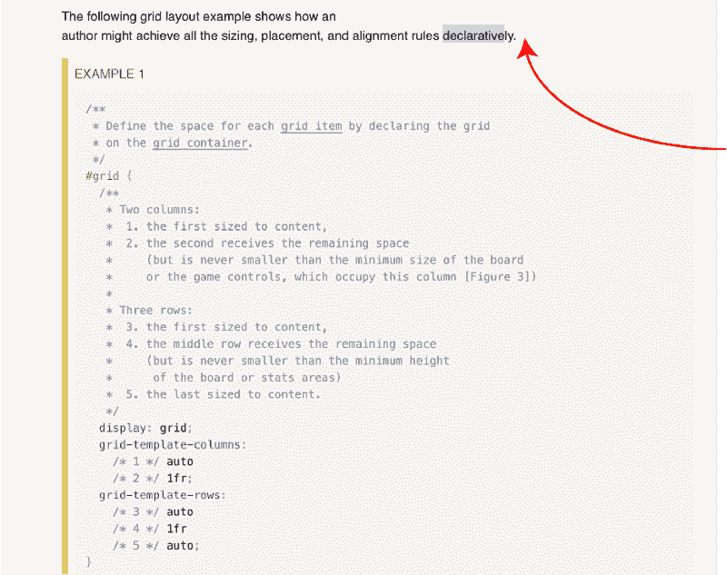
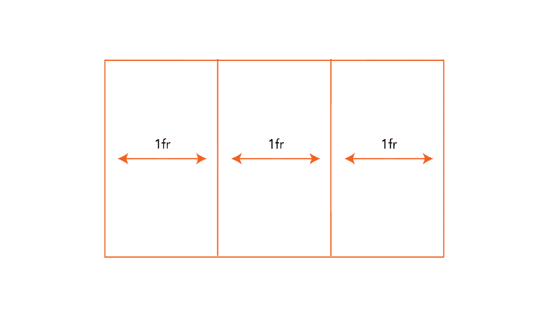

# 我从阅读 CSS 网格规范中学到的 11 件事

> 原文：<https://www.freecodecamp.org/news/11-things-i-learned-reading-the-css-grid-specification-fb3983aa5e0/>

2017 . 6 . 11 我决定去读 CSS 网格规范。

该规范有一点技术性，但它是迄今为止我读过的最受欢迎的规范。如果你是一个更高级的开发人员，[将它加入书签](https://www.w3.org/TR/css-grid-1/)以备将来参考。

### 那么，这会有帮助吗？

我相信优秀的工程师和伟大的工程师之间的区别在于，后者花时间去理解在引擎盖下到底发生了什么。他们学习事物如何工作，而不是通过“复制和粘贴”来学习。

那么，你想成为一名伟大的开发者吗？

当然了。否则，你不会读到这篇文章。

### 你会学到什么

在阅读说明书时，我了解到一些非常微妙但却深刻的细节。

在这篇文章中，我将与你分享它们。

### 1.CSS 网格是声明性的

使用声明式 API 是如此美妙。想 [ReactJS](http://reactjs.org) ？

随着网站从简单的文档演变成复杂的交互式应用程序，网页布局变得很难组合。太难了，它们是我的噩梦。

这正是 CSS Grid 今天要解决的问题。



From the spec.

CSS 网格消除了制作智能布局的痛苦过程，代之以一组漂亮的声明性规则，使得这个过程几乎毫不费力。

这是 CSS 历史上的好时光。

### 2.分数单位并不总是产生等间距的行和列

关于 CSS 网格，每个人首先学习并爱上的一件事是[小数单元](https://medium.com/flexbox-and-grids/the-css-fractional-unit-fr-in-approachable-plain-language-fdc47bd387f7)。即使是鸭子也能逃脱。

小数单位消除了计算百分比的痛苦。一起工作是一种享受。

大多数人认为分数单位(fr)产生等间距的列或行。

例如，像`1fr 1fr 1fr`这样的声明应该给你等间距的列或行。请参见下图:



Equally spaced columns created by the fractional unit.

可悲的是，事实并非总是如此。可怜的鸭子。

以下是从规格:

> `fr`单元填满了可用空间，但它永远不会小于网格容器的最小尺寸或行或列的内容。

本质上，如果你有一个图像，`img`或者任何网格项，带有一个`min-width`或者`min-height`声明，你可以用小数单元得到意想不到的结果。

在像一只被吓湿的鸭子一样呱呱乱叫之后，我花了很多时间实验分数单位。我写了一篇关于我的发现的文章。

### 3.你并不真正了解网格的大小。或者，你呢？

CSS 网格定义总是从以下几行开始:

```
display: grid
```

通常，它后面是`row`和`column`定义。大概是这样的:

```
grid-template-rows: 10px 1fr 3fr
grid-template-columns: 1fr
```

最后，您可能会使用任何适合您的技术来放置网格项目。

由于有很多方法可以放置网格项，为了简洁起见，我将跳过所需的代码。

所以，问题来了。

在这种情况下，您必须假设在放置项目之前，首先计算网格行和列的大小。对吗？

嗯，事实似乎是完全相反的。

真奇怪。

以下是从规格:

> *2.3。调整网格的大小*
> 
> ***一旦网格项目被放置*** *，网格轨道(行和列)的大小被计算，说明其内容的大小和/或网格定义中指定的可用空间。*

注意进程。

1.  放置网格项目。
2.  计算网格轨迹的大小

你可能对此有疑问。所以，我会试着解决你的那些顾虑。

首先，注意每个网格项都被分配了一个`grid-area`。然后在此区域内调整网格项目的大小。那么，在没有计算出轨道大小的情况下，如何准确地放置网格项呢？

如果你看一下规范的[放置网格项目](https://www.w3.org/TR/css-grid-1/#placement)部分，你会发现一个线索。

在调整网格大小时，需要考虑很多因素，其中很大一部分包括网格项目的大小。

网格尺寸可基于以下内容:

*   固定尺寸功能(`[length](https://www.w3.org/TR/css3-values/#length-value)`或可解析的`[percentage](https://www.w3.org/TR/css3-values/#percentage-value)`)。
*   一个内在的尺寸功能(`[min-content](https://www.w3.org/TR/css-grid-1/#valdef-grid-template-columns-min-content)`、`[max-content](https://www.w3.org/TR/css-grid-1/#valdef-grid-template-columns-max-content)`、`[auto](https://www.w3.org/TR/css-grid-1/#valdef-grid-template-columns-auto)`、`[fit-content()](https://www.w3.org/TR/css-grid-1/#valdef-grid-template-columns-fit-content)`，或者
*   灵活的尺寸功能(`[flex](https://www.w3.org/TR/css-grid-1/#typedef-flex)`)。

我相信引擎盖下发生的是，网格项目被放置。

也就是说，确定了该项目的包含块，然后确定该项目的大小调整函数。这反过来会影响栅格轨迹的大小。

你看到了吗？

不是你最初想的那样。

### 4.默认情况下，网格项目会被拉伸以适合其网格区域，但某些情况下除外

如果没有您的干预，网格项目将始终伸展以适合它们的网格区域。

所以，如果你有这样一个声明:

```
grid-template-areas: 'header header header'
                     'sidebar main  main'
                     'sidebar footer footer'
```

你将`divs`分配到特定的网格区域，就像这样:

```
.div1 {
   grid-area: header
}
.div2 {
   grid-area: sidebar
}
.div3 {
   grid-area: main
}
.div4 {
   grid-area: footer
}
```

不需要将上面`divs`的`width`和`height`声明为`100%`

它们会自动拉伸以填充各自的区域。

现在，有个问题。

这种行为与图像不一致。

> 在第 3.3 节的示例 8 中，规范说“默认情况下，网格项目被拉伸以适合它们的网格区域”
> 
> 虽然这对于“div”等是正确的，但是这种行为对于图像是不一致的，即图像作为直接子对象(网格项目)
> 
> 这值得关注吗？？【pic.twitter.com/EI9s2wAEhl 
> 
> — Ohans Emmanuel (@OhansEmmanuel) [December 5, 2017](https://twitter.com/OhansEmmanuel/status/937989769199538177?ref_src=twsrc%5Etfw)