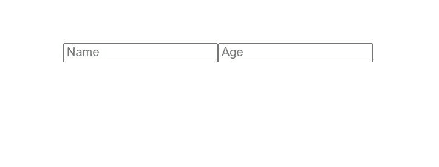
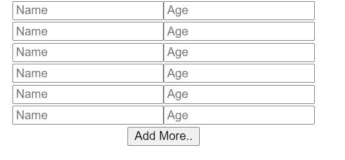
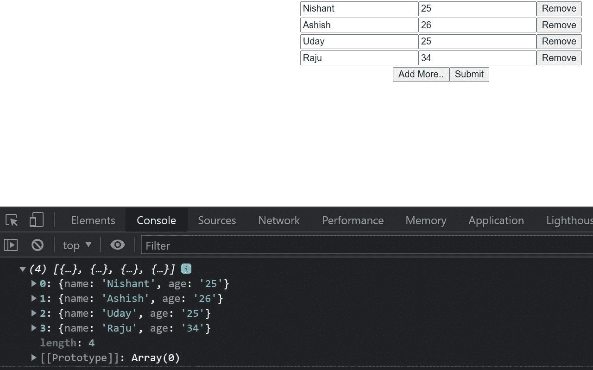
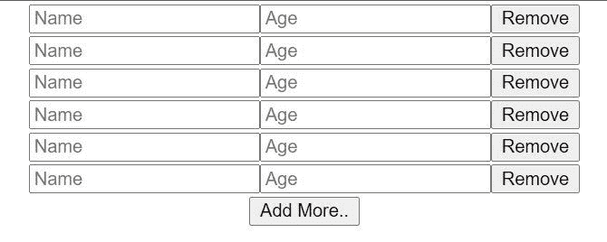
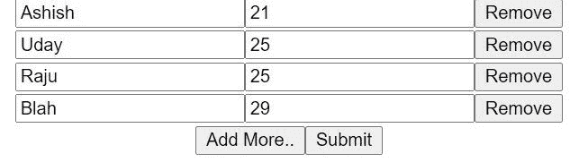
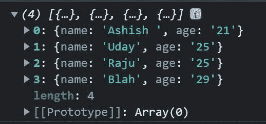

# 如何在 React 中构建动态表单

> 原文：<https://www.freecodecamp.org/news/build-dynamic-forms-in-react/>

在本教程中，让我们学习如何在 React 中构建动态表单。使用动态表单，我们可以根据需要添加或删除字段。

那么，我们开始吧。

## 如何在 React 中创建表单

让我们首先创建一个简单的表单。语法很简单:

```
import './App.css';

function App() {
  return (
    <div className="App">
      <form>
        <div>
          <input
            name='name'
            placeholder='Name'
          />
          <input
            name='age'
            placeholder='Age'
          />
        </div>
      </form>
    </div>
  );
}

export default App; 
```

下面是它的样子:



我们有两个输入字段，分别是姓名和年龄。但是这些字段是静态的。所以，让我们用反应状态使它们动态化。

### 如何在 React 中使窗体动态化

创建一个名为 InputFields 的状态。它将有一个对象，具有**名称**和**年龄**属性。

```
const [inputFields, setInputFields] = useState([
    {name: '', age: ''}
])
```

现在，让我们从表单字段的**输入字段**状态映射表单字段。

```
import { useState } from 'react';
import './App.css';

function App() {
  const [inputFields, setInputFields] = useState([
    { name: '', age: '' }
  ])
  return (
    <div className="App">
      <form>
        {inputFields.map((input, index) => {
          return (
            <div key={index}>
              <input
                name='name'
                placeholder='Name'
              />
              <input
                name='age'
                placeholder='Age'
              />
            </div>
          )
        })}
      </form>
    </div>
  );
}

export default App; 
```

现在，我们将只看到一组输入字段，因为我们只有一个对象处于 **inputFields** 状态。如果我们添加更多的对象，我们将看到多个输入字段。

## 如何将输入字段状态中的值相加

现在，让我们将来自**输入字段**状态的值添加到输入字段中。

```
import { useState } from 'react';
import './App.css';

function App() {
  const [inputFields, setInputFields] = useState([
    { name: '', age: '' }
  ])
  return (
    <div className="App">
      <form>
        {inputFields.map((input, index) => {
          return (
            <div key={index}>
              <input
                name='name'
                placeholder='Name'
                value={input.name}
              />
              <input
                name='age'
                placeholder='Age'
                value={input.age}
              />
            </div>
          )
        })}
      </form>
    </div>
  );
}

export default App; 
```

这些值将是**输入名称**和**输入年龄**

让我们添加一个 onChange 事件，当我们在输入字段中输入内容时，它将运行。

创建一个名为 **handleFormChange** 的函数。

```
const handleFormChange = () => {

}
```

将该函数作为 onChange 事件分配给输入字段。

```
<div key={index}>
              <input
                name='name'
                placeholder='Name'
                value={input.name}
                onChange={event => handleFormChange(index, event)}
              />
              <input
                name='age'
                placeholder='Age'
                value={input.age}
                onChange={event => handleFormChange(index, event)}
              />
            </div>
```

这个 onChange 事件有两个参数，**索引**和**事件**。Index 是数组的索引，event 是我们在输入字段中输入的数据。我们将这些传递给 **handleFormChange** 函数。

```
const handleFormChange = (index, event) => {

}
```

但问题是，如果我们试图在输入字段中键入一些东西，我们将无法做到。因为我们还没有在**表单域**状态中设置状态。所以，让我们开始吧。

```
 const handleFormChange = (index, event) => {
    let data = [...inputFields];
 }
```

让我们使用扩展操作符(三个点`...`)将我们的**输入字段**状态存储到一个名为**数据**的变量中。

然后，我们将使用 index 参数定位数据变量的索引，以及属性的名称。

```
const handleFormChange = (index, event) => {
    let data = [...inputFields];
    data[index][event.target.name] = event.target.value;
}
```

例如，假设我们在输入字段中键入索引为 0 的内容。因此，我们使用 **event.target.name.** 指定数据中的索引和属性名称，并且在这个数据索引中，我们使用 **event.target.value.** 存储来自输入字段的值

现在，我们需要使用 **setInputFields** 方法将这些数据存储回 **inputFields** 数组中。

```
const handleFormChange = (index, event) => {
   let data = [...inputFields];
   data[index][event.target.name] = event.target.value;
   setInputFields(data);
}
```

现在，如果我们在输入字段中键入一些内容，它会显示在输入字段中。

## 如何添加更多的表单域

让我们创建一个按钮来添加更多的表单字段。

```
<button>Add More..</button>
```

还有一个功能，当这个按钮被点击时会被触发。

```
const addFields = () => {

}
```

让我们通过 onClick 事件向按钮添加函数。

```
<button onClick={addFields}>Add More..</button>
```

现在，在 addFields 函数中，我们需要创建一个对象。而我们每次点击按钮，它都会被推到 **inputFields** 状态，从而创建一个新的输入字段。

```
const addFields = () => {
    let newfield = { name: '', age: '' }
}
```

然后在**输入字段**状态中设置这个新字段。

```
const addFields = () => {
    let newfield = { name: '', age: '' }

    setInputFields([...inputFields, newfield])
}
```

这里，我们还使用 spread 操作符，结合 newfield，设置现有的 **inputFields** 。

如果我们现在单击 Add Field 按钮，将会创建一个新的输入字段。



## 如何创建提交按钮

让我们创建一个提交按钮和一个在提交表单时查看数据的函数。

```
<button>Submit</button>
```

我们还需要一个功能，当我们点击这个按钮时将被触发。它将在控制台中记录来自输入字段的数据。它还有一个名为 **e.preventDefault()** 的方法，可以防止页面被刷新。

```
const submit = (e) => {
    e.preventDefault();
    console.log(inputFields)
}
```

将此功能添加到提交按钮:

```
<button onClick={submit}>Submit</button>
```

也在表单标签中:

```
<form onSubmit={submit}>
```

如果我们提交，我们将在控制台中看到我们的数据:



## 如何使用移除按钮移除字段

现在，让我们创建一个按钮，如果我们不想要这些字段，就删除它们。

```
<form>
        {inputFields.map((input, index) => {
          return (
            <div key={index}>
              <input
                name='name'
                placeholder='Name'
                value={input.name}
                onChange={event => handleFormChange(index, event)}
              />
              <input
                name='age'
                placeholder='Age'
                value={input.age}
                onChange={event => handleFormChange(index, event)}
              />
              <button>Remove</button>
            </div>
          )
        })}
      </form>
```



我们也需要一个函数。

```
const removeFields = () => {

}
```

因此，将此功能分配给 Remove 按钮。

```
<button onClick={() => removeFields(index)}>Remove</button>
```

我们将索引作为参数传递，它是输入字段的索引。

然后，在函数中接收这个索引。

```
const removeFields = (index) => {

}
```

就像之前一样，我们需要创建一个新变量，并将 **inputFields** 状态存储在这个新变量中。

```
const removeFields = (index) => {
    let data = [...inputFields];
}
```

然后，我们需要通过索引拼接这个数据变量。然后我们需要使用 setInputFields 将其存储在 **inputFields** 状态中。

```
const removeFields = (index) => {
    let data = [...inputFields];
    data.splice(index, 1)
    setInputFields(data)
}
```

现在，如果我们单击删除，它将删除表单字段。


这里有五个输入字段，有五个不同的名称。让我们去掉 Nishant 的输入。



你看它已经被移除了。如果我们提交，我们将在控制台中看到更新的数据。



## 包扎

现在您知道如何在 React 中创建动态表单。恭喜你。

也可以看我的同主题视频[动态表单——如何在 React](https://youtu.be/LcAyJRlvh8Y) 中添加动态表单。

试试这里的代码—[https://github.com/nishant-666/Dynamic-Forms](https://github.com/nishant-666/Dynamic-Forms)。

快乐学习:)