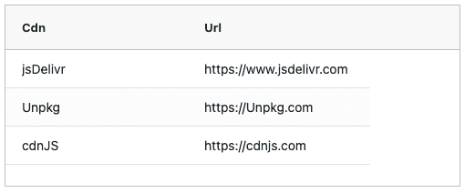

# 如何从公共 CDN 导入 JavaScript 和 CSS

> 原文：<https://www.freecodecamp.org/news/import-javascript-and-css-from-a-public-cdn/>

当你编写一个普通的 JavaScript 应用程序时，你不需要在你自己的站点上存放所有的代码。

大多数流行的 JavaScript 库都可以从公共内容交付网络(CDN)获得。

这可以简化应用程序的部署，并使依赖关系保持最新。事实上，如果你遵循了某个库的 JavaScript 教程，那么你可能已经使用了一个公共 CDN，但可能没有意识到。

## 什么是 CDN？

CDN 是一个内容交付网络。这些是为多个版本的公共库提供的文件托管服务。它们通常是高性能的，并提供位置缓存文件，因此无论您的用户在哪里，他们都可以从靠近他们的地理位置接收文件。这可以使你的应用程序比你自己托管文件更快。

CDN 的另一个优势是，如果你使用多个站点的公共库，那么你的用户可能已经在他们的浏览器中缓存了这个文件。这加快了你的网站，因为浏览器不需要再次下载库。

比如 JQuery 有一个[官方 JQuery CDN](https://releases.jquery.com/) 。如果大多数 JQuery 应用程序从这个 CDN 导入 JQuery 库，那么用户很可能已经在缓存中有 JQuery 了。

## `npm`-驱动的 cdn

不是每个图书馆都有自己的 CDN。大多数库部署到 npmjs.com 的 T2，并依赖程序员在构建时通过 T0 将库添加到他们的项目中。`npm`从 CDN 下载库，并将其添加到本地项目中。

我们不必使用`npm`和 JavaScript 构建过程来利用`npm`生态系统。我们可以使用“npm 驱动的 CDN”作为库的主机，而不必使用`npm`。

“npm 驱动的 CDN”是托管部署到`npm`的库的分发代码的 CDN。

例如， [AG Grid](https://ag-grid.com) ，我在我的文章《[如何将静态 HTML 表格转换为动态 JavaScript 数据网格](https://www.freecodecamp.org/news/convert-html-table-to-dynamic-javascript-data-grid/)》中演示过，部署到`npm`，但是没有自己的 CDN。相反，程序员可以从类似[unpkg.com](https://unpkg.com/)的 CDN 中添加对 AG Grid 的直接引用。

```
<script src=
"https://unpkg.com/ag-grid-community/dist/ag-grid-community.min.nostyle.js">
</script> 
```

`npm`驱动的 cdn 监控通过`npm`分发的发布，并在自己的站点上托管发布。

在我早先的 freeCodeCamp 帖子的源代码中，我使用了 unpkg.com CDN，在我的代码中用一个`script`元素导入 AG Grid。

与我们复制和粘贴的所有代码一样，理解它的作用是值得的，这样我们就可以处理任何问题。

## 有哪些 cdn？

我只用过三个 cdn:

*   [Unpkg.com](https://unpkg.com)
*   jsdelivr . com
*   [cdnjs.com](https://cdnjs.com)

这些都是专业且运营良好的网站。我选择其中一个的主要原因是我第一次学习的关于库的教程在代码中使用了那个特定的 CDN。

知道有多个 cdn 可用非常有用，因为:

*   您想要使用的特定版本的库可能不在每个 CDN 上
*   如果一个 CDN 开始有问题，那么你可以修改你的代码来使用另一个
*   一些库在一个 CDN 上可能比另一个更受欢迎，您可能希望使用最受欢迎的 CDN 来增加 JavaScript 库代码在用户浏览器上缓存的机会。

## cdn 分发的不仅仅是 JavaScript

cdn 提供的不仅仅是 JavaScript。例如，AG Grid 部署 CSS 文件以及 JavaScript。

这些通常使用`link`元素从 CDN 中引用。

例如，AG Grid 使用两个样式表。

结构化样式表提供了将数据布局为网格的 CSS。

```
<link 
 rel="stylesheet"
 href="https://unpkg.com/ag-grid-community/dist/styles/ag-grid.css"
> 
```

主题样式表为网格提供了视觉美感。

```
<link 
 rel="stylesheet" 
 href="https://unpkg.com/ag-grid-community/dist/styles/ag-theme-alpine.css"
> 
```

这两个 CSS 文件也部署到 npmjs.com，可以从 CDN 包含到我们的项目中。

## 如何(以及为什么)控制库的版本

在我的[开源表格编辑工具](https://eviltester.github.io/grid-table-editor/#)中，我使用了三个库:AG Grid、PapaParse 和 Faker。

Faker 最近有一个问题，部署到 npm 的最新版本有问题。因此，如果我的代码默认为最新版本，那么我的应用程序就会失败。

幸运的是，我从 unpkg 导入了 faker 的特定版本。正如你从下面的`src` URL 中看到的，我包含了版本`5.5.3`:

```
<script src=
    "https://unpkg.com/faker@5.5.3/dist/faker.min.js">
</script> 
```

控制版本有许多好处:

*   您将在特定版本上测试您的应用程序。如果您将应用程序部署到生产环境中，并允许版本随每个新版本而变化，那么随着时间的推移，您的应用程序可能会逐渐出现错误或不兼容，因为您还没有针对新版本的库测试您的应用程序。
*   当使用多个版本的库时，将来的版本可能会相互冲突，再次导致您的应用程序在生产中失败，而您可能没有注意到。

我导入了我在特定版本中使用的三个库:

```
<script src="https://unpkg.com/ag-grid-community@26.2.1/dist/ag-grid-community.min.js"></script>
<script src="https://unpkg.com/papaparse@5.3.0/papaparse.min.js"></script>
<script src="https://unpkg.com/faker@5.5.3/dist/faker.min.js"></script> 
```

这使我能够控制测试，并且我更加确信应用程序中的任何错误都是我编码的结果，而不是项目中使用的库的更新。

不同的 cdn 可以具有不同的语法来控制版本号。但是通过搜索 CDN 上的库并遵循每个 CDN 提供的文档，您将能够看到要使用的格式。

以下是每个 CDN 站点上的 AG Grid 列表:

*   [Unpkg.com-AG 电网](https://unpkg.com/ag-grid-community/)
*   [jsDelivr.com-AG 电网](https://www.jsdelivr.com/package/npm/ag-grid-community)
*   [cdnjs.com-AG 电网](https://cdnjs.com/libraries/ag-grid)

如果你点击 AG Grid 包的链接，你会发现每个站点的界面都略有不同。但它们都允许选择特定版本的 AG Grid，并允许您复制和粘贴 URL 以添加到 HTML 文件中。

## 实践中的 CDN

下面是一个简单的 HTML 文件，它将在屏幕上呈现一个数据网格。

我只需要部署 HTML 文件，因为 AG 网格库是从 CDN 加载到浏览器中的。

在下面的例子中，我正在加载 AG Grid 的 26.2.1 版本和来自**unpkg.com CDN**的 CSS 文件。

```
<!DOCTYPE html>
<html lang="en">
<head>
    <title>CDN Added AG Grid Example</title>
    <script src="https://unpkg.com/ag-grid-community@26.2.1/dist/ag-grid-community.min.nostyle.js"></script>
    <link rel="stylesheet" href="https://unpkg.com/ag-grid-community@26.2.1/dist/styles/ag-grid.css">
    <link rel="stylesheet" href="https://unpkg.com/ag-grid-community@26.2.1/dist/styles/ag-theme-alpine.css">
</head>
<body>

    <div id="myGrid" style="height: 200px; width:500px;" class="ag-theme-alpine"></div>

<script>
document.addEventListener('DOMContentLoaded', () => {

    const columnDefs = [
        { field: "cdn" },
        { field: "url" },
    ];

    const rowData = [
        { cdn: "jsDelivr", url: "https://www.jsdelivr.com"},
        { cdn: "Unpkg", url: "https://Unpkg.com" },
        { cdn: "cdnJS", url: "https://cdnjs.com" }
    ];

    const gridOptions = {
        columnDefs: columnDefs,
        rowData: rowData,
        /* allow manual copy and paste */
        enableCellTextSelection:true,
        ensureDomOrder:true
    };

    const gridDiv = document.querySelector('#myGrid');
    new agGrid.Grid(gridDiv, gridOptions);
});
</script>
</body>
</html> 
```

在这个部署的 html 页面中演示了 Unpkg 导入。



通过改变我的`html`文件的`head`部分中的`script`和`link`元素，我可以很容易地使用其他 cdn。

使用版本 26.2.1 的 JSDelivr

*   [https://cdn . jsdelivr . net/NPM/ag-grid-community @ 26 . 2 . 1/dist/ag-grid-community . min . no style . js](https://cdn.jsdelivr.net/npm/ag-grid-community@26.2.1/dist/ag-grid-community.min.noStyle.js)
*   [https://cdn . jsdelivr . net/NPM/ag-grid-community @ 26 . 2 . 1/dist/styles/ag-grid . CSS](https://cdn.jsdelivr.net/npm/ag-grid-community@26.2.1/dist/styles/ag-grid.css)
*   [https://cdn . jsdelivr . net/NPM/ag-grid-community @ 26 . 2 . 1/dist/styles/ag-theme-alpine . CSS](https://cdn.jsdelivr.net/npm/ag-grid-community@26.2.1/dist/styles/ag-theme-alpine.css)

在这个部署的 html 页面中演示了 JSDelivr 导入。

使用版本 26.2.1 的 CdnJS 。CdnJS 采用了一种略微不同的版本命名方法，因此值得查看一下 [cdnJS AG 网格列表](https://cdnjs.com/libraries/ag-grid)上的版本下拉列表

*   [https://cdnjs . cloud flare . com/Ajax/libs/ag-grid/Docs-26 . 2 . 0-2021 11 17/ag-grid-community . min . no style . min . js](https://cdnjs.cloudflare.com/ajax/libs/ag-grid/Docs-26.2.0-20211117/ag-grid-community.min.noStyle.min.js)
*   [https://cdnjs . cloud flare . com/Ajax/libs/ag-grid/Docs-26 . 2 . 0-2021 11 17/styles/ag-grid . min . CSS](https://cdnjs.cloudflare.com/ajax/libs/ag-grid/Docs-26.2.0-20211117/styles/ag-grid.min.css)
*   [https://cdnjs . cloud flare . com/Ajax/libs/ag-grid/Docs-26 . 2 . 0-2021 11 17/styles/ag-theme-alpine . min . CSS](https://cdnjs.cloudflare.com/ajax/libs/ag-grid/Docs-26.2.0-20211117/styles/ag-theme-alpine.min.css)

在这个部署的 html 页面中演示了 CdnJS 导入。

## 摘要

我们不必总是将 JavaScript 库和 HTML 文件一起部署到我们的站点。相反，我们可以将它们包含在内，以便通过内容交付网络进行交付。

我们后面的许多教程将展示这样做的例子。

如果我们从 CDN 导入 JavaScript 或 CSS，我们应该添加库的版本号，以保护我们部署的示例在将来库更新时不会出现问题。

一个需要养成的好习惯是，当我们遵循一个教程时，添加版本。如果我们注意到 CDN 包含的文件没有版本，那么有必要访问 CDN 以了解该库的当前版本。然后您可以将该版本号添加到您的源代码中。

像这样的小调整会让你在 Github 上创建的任何投资组合项目变得更加专业。