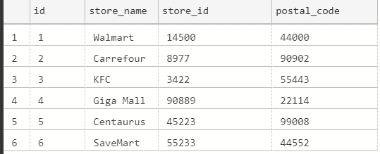
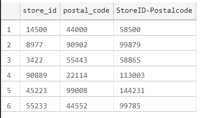
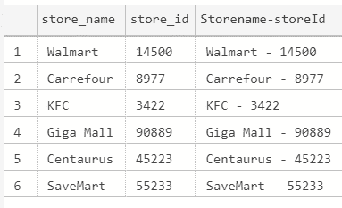

# 在 SQL 中转换函数–将 Char 转换为 Int SQL Server 示例

> 原文：<https://www.freecodecamp.org/news/cast-a-function-in-sql-convert-char-to-int-sql-server-example/>

从一种数据类型转换到另一种数据类型是在数据库中工作时要执行的常见操作。

SQL 提供了一个称为 CAST 的实用工具来实现这一点。我们将在本文中看到它是如何工作的。

## SQL 中的 CAST 函数是什么？

CAST 使我们能够从一种数据类型转换到另一种数据类型。这对于连接不同数据类型的结果非常有帮助。它还帮助我们对两种不同的数据类型进行计算。

强制转换不会改变数据库中的数据。该转换仅在查询有效期内有效。但是可以转换并插入新的列或表格。

### SQL 中强制转换的语法

下面是 CAST 函数的语法:

```
CAST ( expression AS data_type [ ( length ) ])
```

在哪里，

*   `expression`是这样的查询:`id as VARCHAR`
*   `data_type`是目标数据类型。
*   `length`确定目标数据类型的长度。这部分是可选的。

## 如何在 SQL 中使用 CAST 函数

### 样本表

让我们创建一个表格`store_locations`，如下所示:

```
-- create a table named store_locations

CREATE TABLE store_locations (
  id INTEGER PRIMARY KEY,
  store_name VARCHAR(10) NOT NULL,
  store_id INTEGER NOT NULL,
  postal_code VARCHAR(10)
); 
```

在哪里，

*   `id`是主键。
*   `store_name`是数据类型为`VARCHAR`的商店名称。
*   `store_id`是店铺的 ID 和一个`INTEGER`。
*   `postal_code`是商店的邮政地址，类型为`VARCHAR`。

插入一些值后，我们的表如下所示:



store_locations table

### 如何在 SQL 中将`char`转换为`int`

让我们看一个如何将 char (VARCHAR)数据类型转换成 int 的例子。

在我们的例子中，我们的任务是生成一个新的列，它将`store_id`和`postal_code`相加，生成另一个惟一的 ID。

记住，`store_id`是一个`INTEGER`，而`postal_code`是`VARCHAR`。要将`postal_code`转换成整数，我们可以这样使用 CAST:

```
-- convert char to int
-- generate a new id by adding store id and postal code

select store_id, postal_code, store_id + cast(postal_code AS INTEGER) AS [StoreID-Postalcode] from store_locations 
```

**输出**:



Combining the columns store_id and postal_code

### 如何在 SQL 中将`int`转换成`char`

在这个例子中，我们的目标是合并两列——`store_name`和`store_id`——生成一个新列。

记住，`store_name`是一个`VARCHAR`，而`store_id`是一个`INTEGER`。

如果我们尝试在不强制转换的情况下添加`int`和`char`，会有什么结果？

我们将得到如下所示的异常:


Type conversion exception

让我们来看看结果。

```
-- conversion from int to char
-- storename + store ID

select store_name, store_id, store_name + ' - ' + cast(store_id AS VARCHAR) AS [Storename-storeId]
from store_locations
```

**输出:**

我们可以看到我们的输出已经被正确地连接起来。



## 包扎

CAST 函数对于转换数据类型和执行复杂计算非常有用。

请尝试这些命令，并尝试不同的数据类型，如“date”。