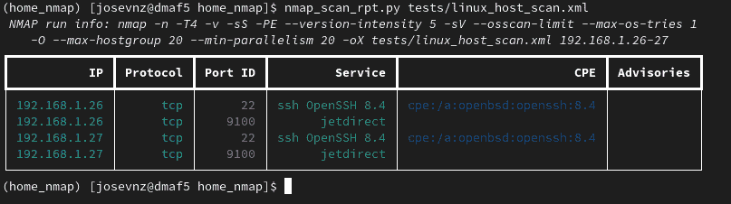
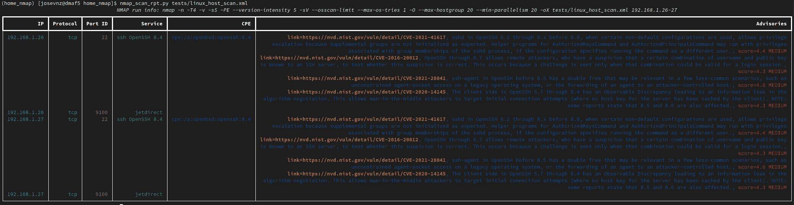
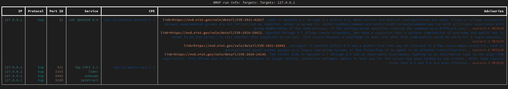
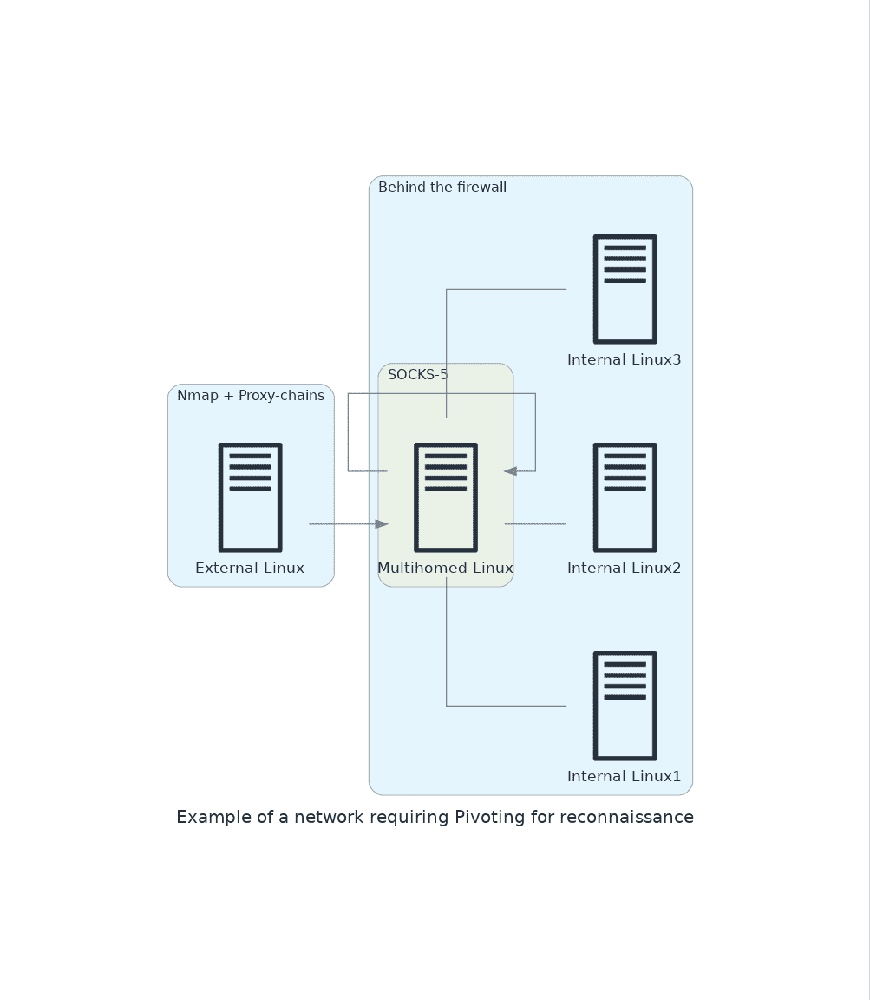
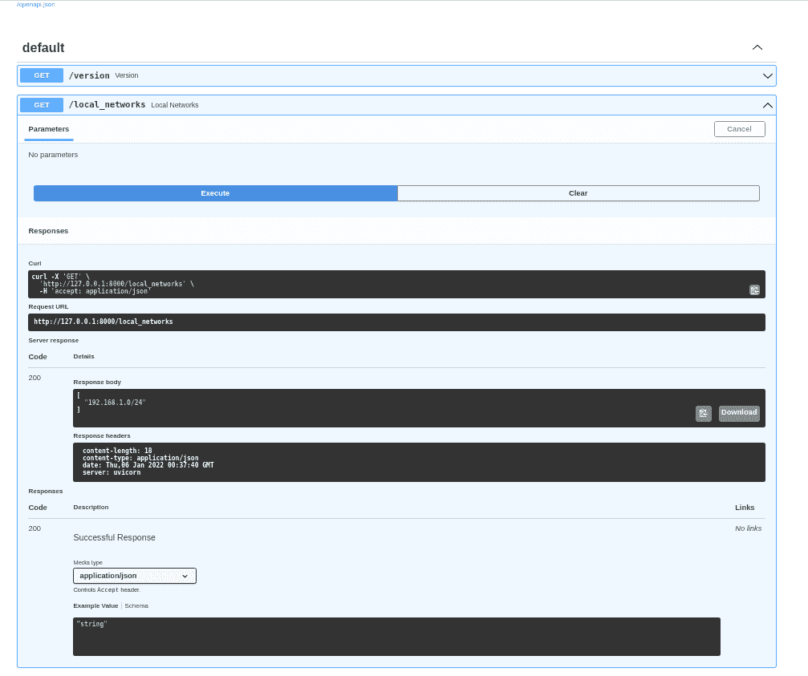
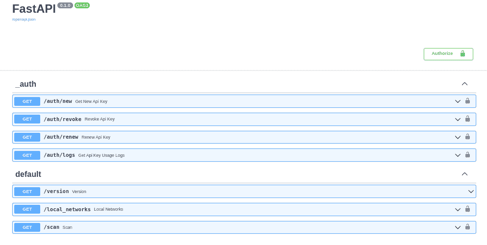

# 如何用 Python 增强 Nmap

> 原文：<https://www.freecodecamp.org/news/enhance-nmap-with-python/>

很少有开源软件像 T2 Nmap T3 一样引起如此多的关注。它是一种包含了如此多有用特性的工具，只需运行几个标志，它就能帮助你使你的系统更加安全。

Nmap(“网络映射器”)是一个用于网络发现和安全审计的免费开源工具。

许多系统和网络管理员也发现它对于诸如网络库存、管理服务升级计划以及监控主机或服务正常运行时间等任务非常有用。

您还可以使用它来绕过薄弱的保护，找到隐藏或错误配置的服务，或者只是让您更好地了解网络是如何工作的。

## 目录:

*   [你将从这篇文章中学到什么](#what-you-will-learn-from-this-article)
*   [Nmap 101:识别我们网络中的所有公共服务](#nmap-101-identify-all-the-public-services-in-our-network)
*   [如何编写一个使用 Nmap 的“简易按钮”网络扫描仪](#how-to-write-an-easy-button-network-ccanner-that-uses-nmap)
*   [如何使家庭网络扫描仪成为网络服务](#how-to-make-a-home-network-scanner-a-web-service)
*   我们学到了什么？

## 你将从这篇文章中学到什么

我们将介绍以下内容，以说明如何使用 Python 增强 Nmap:

*   编写一个可以扫描本地网络上所有主机的小脚本，确保它以正确的权限运行。
*   通过将服务与安全建议相关联来增强 Nmap。
*   将我们的脚本转换成网络服务。将增加基本的安全性(授权和加密)。

### 开始前你应该知道和做的事情

不要太担心，我会指导你完成这些步骤。这将是一次有趣的体验，并且您将拥有所有的源代码:

*   熟悉基本的网络概念，如[无类域间路由(CIDR)](https://en.wikipedia.org/wiki/Classless_Inter-Domain_Routing)
*   能够用类似 [Python](https://www.python.org/) 的脚本语言编写程序。
*   可以使用虚拟环境安装中的代码。如果不熟悉虚拟环境，可以阅读以下:[用 Python](https://www.redhat.com/sysadmin/packaging-applications-python) 打包应用程序安装在其他机器上。

### 本教程需要什么工具？

我不会介绍这些工具的安装，但是有大量的文档可以帮助您入门。

*   按照我的 GitHub [官方库站点](https://github.com/josevnz/home_nmap)上的主[自述文件](http://README.md)中的说明安装本教程的全部代码。你需要[安装](https://git-scm.com/book/en/v2/Getting-Started-Installing-Git) [Git](https://git-scm.com/docs/gittutorial) 来克隆代码。
*   Linux 发行版。Fedora，Ubuntu，Kali，随便用你觉得最舒服的(我用的是 [Fedora](https://docs.fedoraproject.org/en-US/fedora/rawhide/install-guide/) 35。)
*   [Python 解释器](https://developer.fedoraproject.org/tech/languages/python/python-installation.html)。一个好的 Linux 发行版会预装 Python，或者至少会让你更容易安装。我这里用的是 Python 3.9。

最后*两件事*:

*   我跳过了代码片段中的一些导入，因为它们不会增强代码演示。为了获得最准确的代码，请克隆本教程的公共 Git 库并开放源代码。
*   *仅针对您的本地网络*运行此示例。你可以好奇，可以开心，可以在不影响他人的情况下学习现有工具的新东西。

黑客是要学习的！

# Nmap 101:识别我们网络中的所有公共服务

### 提醒:谚语“最好请求原谅而不是允许”在这里并不适用

由于我们的端口扫描活动，我们并不关心“隐身”或触发[入侵检测系统(IDS)](https://en.wikipedia.org/wiki/Intrusion_detection_system) 。IDS 通常会寻找异常的网络模式，如果它发现一台机器在许多主机上快速连续地打开和关闭端口，就会被认为是端口扫描攻击。同样，在我们的家庭网络中不会出现这种情况，因为我们知道是我们在运行这样的扫描。

出于同样的原因，您不应该在您不拥有的网络上启动端口扫描，因为 Nmap 不是 100%隐形的(您可以随时使用随机频率、TCP 握手类型、打开的端口数量、使用代理等等，但您很可能会错过一些东西)。

所以表现好点，好吗？:-)

### 运行 Nmap 和操作系统指纹需要什么？

这里的目标是使用命令行界面(CLI)脚本来查看我们的网络中正在运行哪些服务。

Nmap 需要提升权限才能使用原始套接字进行操作系统指纹识别和扫描。您将需要以 root 或[su“do”(SUDO)](https://www.sudo.ws/)身份运行这些命令来提升您的权限。这样做的一个 SUDO 规则与此类似(file /etc/sudoers):

```
## Same thing without a password
%wheel	ALL=(ALL)	NOPASSWD: ALL 
```

这意味着“wheel”UNIX 组中的任何人都可以以 root 用户身份运行命令:

```
(2600) [josevnz@dmaf5 2600]$ grep wheel /etc/group
wheel:x:10:josevnz,services

# To confirm we can run commands as root
(2600) [josevnz@dmaf5 2600]$ sudo -l
Matching Defaults entries for josevnz on dmaf5:
    !visiblepw, always_set_home, match_group_by_gid, always_query_group_plugin, env_reset, env_keep="COLORS DISPLAY HOSTNAME HISTSIZE KDEDIR LS_COLORS",
    env_keep+="MAIL QTDIR USERNAME LANG LC_ADDRESS LC_CTYPE", env_keep+="LC_COLLATE LC_IDENTIFICATION LC_MEASUREMENT LC_MESSAGES", env_keep+="LC_MONETARY
    LC_NAME LC_NUMERIC LC_PAPER LC_TELEPHONE", env_keep+="LC_TIME LC_ALL LANGUAGE LINGUAS _XKB_CHARSET XAUTHORITY",
    secure_path=/usr/local/sbin\:/usr/local/bin\:/usr/sbin\:/usr/bin\:/sbin\:/bin\:/var/lib/snapd/snap/bin

User josevnz may run the following commands on dmaf5:
    (ALL) NOPASSWD: ALL 
```

接下来，我们将快速扫描一下我们的本地网络(在本例中是 192.168.1.0/24)。我使用了-v (verbose)标志来获得一些进度反馈，同时扫描所有端口并进行操作系统指纹识别(-O)。

我将 Nmap 运行的执行保存到一个 XML 文件(-oX)，如果它被中断，Nmap 可以使用它来恢复执行(- resume):

```
# In case the scan is interrupted: nmap --resume $HOME/home_scan.xml
[josevnz@dmaf5 docs]$ sudo nmap -v -n -p- -sT -sV -O --osscan-limit --max-os-tries 1 -oX $HOME/home_scan.xml 192.168.1.0/24
Starting Nmap 7.80 ( https://nmap.org ) at 2021-12-30 16:35 EST
NSE: Loaded 45 scripts for scanning.
Initiating ARP Ping Scan at 16:35
Scanning 254 hosts [1 port/host]
...
# After a while and several cups of Venezuelan coffee...
Network Distance: 1 hop
TCP Sequence Prediction: Difficulty=265 (Good luck!)
IP ID Sequence Generation: All zeros

Nmap scan report for 192.168.1.20
Host is up (0.0097s latency).
Not shown: 65530 closed ports
PORT      STATE    SERVICE      VERSION
36184/tcp filtered unknown
37309/tcp filtered unknown
49323/tcp open     unknown
49376/tcp filtered unknown
62078/tcp open     iphone-sync?
MAC Address: 9E:90:75:3A:D7:XX (Unknown)
... 
```

产生的 [XML 格式文件](https://nmap.org/book/output-formats-xml-output.html)非常冗长:

```
<host starttime="1640901327" endtime="1640902555"><status state="up" reason="arp-response" reason_ttl="0"/>
<address addr="192.168.1.1" addrtype="ipv4"/>
<address addr="38:5B:5E:1D:52:99" addrtype="mac"/>
<hostnames>
</hostnames>
<ports><extraports state="closed" count="65523">
<extrareasons reason="conn-refused" count="65523"/>
</extraports>
<port protocol="tcp" portid="139"><state state="open" reason="syn-ack" reason_ttl="0"/><service name="netbios-ssn" product="Samba smbd" version="3.X - 4.X" extrainfo="workgroup: ZZZ" method="probed" conf="10"><cpe>cpe:/a:samba:samba</cpe></service></port>
    ... 
```

是时候做一些编码了。解析多种格式的数据是 Python 的优势之一。使用 [lxml](https://github.com/lxml/lxml) 为所有未“关闭”的端口提取数据并进行规范化:

```
class OutputParser:
    """
    Parse Nmap raw XML output
    """

    @staticmethod
    def parse_nmap_xml(xml: str) -> (str, Any):
        """
        Parse XML and return details for the scanned ports
        @param xml:
        @return: tuple nmaps arguments, port details
        """
        parsed_data = []
        root = ElementTree.fromstring(xml)
        nmap_args = root.attrib['args']
        for host in root.findall('host'):
            for address in host.findall('address'):
                curr_address = address.attrib['addr']
                data = {
                    'address': curr_address,
                    'ports': []
                }
                states = host.findall('ports/port/state')
                ports = host.findall('ports/port')
                for i in range(len(ports)):
                    if states[i].attrib['state'] == 'closed':
                        continue  # Skip closed ports
                    port_id = ports[i].attrib['portid']
                    protocol = ports[i].attrib['protocol']
                    services = ports[i].findall('service')
                    cpe_list = []
                    service_name = ""
                    service_product = ""
                    service_version = ""
                    for service in services:
                        for key in ['name', 'product', 'version']:
                            if key in service.attrib:
                                if key == 'name':
                                    service_name = service.attrib['name']
                                elif key == 'product':
                                    service_product = service.attrib['product']
                                elif key == 'version':
                                    service_version = service.attrib['version']
                        cpes = service.findall('cpe')
                        for cpe in cpes:
                            cpe_list.append(cpe.text)
                        data['ports'].append({
                            'port_id': port_id,
                            'protocol': protocol,
                            'service_name': service_name,
                            'service_product': service_product,
                            'service_version': service_version,
                            'cpes': cpe_list
                        })
                        parsed_data.append(data)
        return nmap_args, parsed_data 
```

一旦收集了数据，我们就可以借助于 [Rich](https://github.com/Textualize/rich) 在终端中创建一个漂亮的表格。

该表包含以下列:

*   互联网协议(IP)地址
*   协议:在这个脚本中，它总是传输控制协议(TCP)
*   端口 ID:服务运行的端口号
*   服务:类似安全外壳(SSH)的网络服务
*   公共平台枚举( [CPE](https://nvd.nist.gov/products/cpe) ):是信息技术系统、软件和软件包的结构化命名方案。
*   咨询:与 Nmap 识别的 CPE 相关的任何漏洞。我们需要把这些联系起来。

```
def create_scan_table(*, cli: str) -> Table:
    """
    Create a table for the CLI UI
    :param cli: Full Nmap arguments used on the run
    :return: Skeleton table, no data
    """
    nmap_table = Table(title=f"NMAP run info: {cli}")
    nmap_table.add_column("IP", justify="right", style="cyan", no_wrap=True)
    nmap_table.add_column("Protocol", justify="right", style="cyan", no_wrap=True)
    nmap_table.add_column("Port ID", justify="right", style="magenta", no_wrap=True)
    nmap_table.add_column("Service", justify="right", style="green")
    nmap_table.add_column("CPE", justify="right", style="blue")
    nmap_table.add_column("Advisories", justify="right", style="blue")
    return nmap_table
...
def fill_simple_table(*, exec_data: str, parsed_xml: Dict[Any, Any]) -> Table:
    """
    Convenience method to create a simple UI table with Nmap XML output
    :param exec_data: Arguments and options used to run Nmap
    :param parsed_xml: Nmap data as a dictionary
    :return: Populated tabled
    """
    nmap_table = create_scan_table(cli=exec_data)
    for row_data in parsed_xml:
        address = row_data['address']
        ports = row_data['ports']
        for port_data in ports:
            nmap_table.add_row(
                address,
                port_data['protocol'],
                port_data['port_id'],
                f"{port_data['service_name']} {port_data['service_product']} {port_data['service_version']}",
                "\n".join(port_data['cpes']),
                ""
            )
    return nmap_table 
```

生成的脚本使用上面的代码向用户展示本地网络扫描的全貌:

```
#!/usr/bin/env python
import sys
from rich.console import Console
from home_nmap.query import OutputParser
from home_nmap.ui import fill_simple_table

if __name__ == "__main__":
    console = Console()
    for nmap_xml in sys.argv[1:]:
        with open(nmap_xml, 'r') as xml:
            xml_data = xml.read()
            rundata, parsed = OutputParser.parse_nmap_xml(xml_data)
            nmap_table = fill_simple_table(exec_data=rundata, parsed_xml=parsed)
            console.print(nmap_table) 
```



Scan for local network. Advisories column is empty

如果你注意到,“咨询”栏完全是空的。我们将使用 [NIST 网络安全网站搜索引擎](https://www.nist.gov/cybersecurity)来填充缺失的建议，绕过拥有*版本信息*的 CPE 以避免误报。

我们使用[请求](https://github.com/psf/requests)来帮助我们进行 HTTP 通信:

```
from dataclasses import dataclass
import requests
IGNORED_CPES = {"cpe:/o:linux:linux_kernel"}
from cpe import CPE
from lxml import html

@dataclass
class NIDS:
    summary: str
    link: str
    score: str

class NDISHtml:

    def __init__(self):
        """
        Some CPE return too many false positives,
        so they are ignored right out the bat
        """
        self.raw_html = None
        self.parsed_results = []
        self.url = "https://nvd.nist.gov/vuln/search/results"
        self.ignored_cpes = IGNORED_CPES

    def get(self, cpe: str) -> str:
        """
        Run a CPE search on the NDIS website. If the CPE has no version then skip the search
        as it will return too many false positives
        @param cpe: CPE identifier coming from Nmap, like cpe:/a:openbsd:openssh:8.0
        @return:
        """
        params = {
            'form_type': 'Basic',
            'results_type': 'overview',
            'search_type': 'all',
            'isCpeNameSearch': 'false',
            'query': cpe
        }
        if cpe in self.ignored_cpes:
            return ""
        valid_cpe = CPE(cpe)
        if not valid_cpe.get_version()[0]:
            return ""
        response = requests.get(
            url=self.url,
            params=params
        )
        response.raise_for_status()
        return response.text

    def parse(self, html_data: str) -> list[NIDS]:
        """
        Parse NDIS web search. Not aware that they offer a REST API that doesn't require parsing.
        It is assumed that this method is never called directly by end users, so no further checks are done on the
        HTML file contents.
        @param html_data: RAW HTML used for scrapping
        @return: List of NDIS, if any
        """
        self.parsed_results = []
        if html_data:
            ndis_html = html.fromstring(html_data)
            # 1:1 match between 3 elements, use parallel array
            summary = ndis_html.xpath("//*[contains(@data-testid, 'vuln-summary')]")
            cve = ndis_html.xpath("//*[contains(@data-testid, 'vuln-detail-link')]")
            score = ndis_html.xpath("//*[contains(@data-testid, 'vuln-cvss2-link')]")
            for i in range(len(summary)):
                ndis = NIDS(
                    summary=summary[i].text,
                    link="https://nvd.nist.gov/vuln/detail/" + cve[i].text,
                    score=score[i].text
                )
                self.parsed_results.append(ndis)
        return self.parsed_results 
```

然后，我们将结果中的 Nmap CPES 与每个咨询(如果有)相关联:

```
from typing import Any
from dataclasses import dataclass
@dataclass
class NIDS:
    summary: str
    link: str
    score: str
class NDISHtml:
    def correlate_nmap_with_nids(self, parsed_xml: Any) -> dict[str, list[NIDS]]:
        correlated_cpe = {}
        for row_data in parsed_xml:
            ports = row_data['ports']
            for port_data in ports:
                for cpe in port_data['cpes']:
                    raw_ndis = self.get(cpe)
                    cpes = self.parse(raw_ndis)
                    correlated_cpe[cpe] = cpes
        return correlated_cpe 
```

新桌子不言自明:



Nmap scan results on a nice table

更完整，我们现在可以看到我们的一些本地服务可能有一个漏洞！

我们能做得更好吗？例如，如果能够直接从 Python 运行 Nmap 而不是解析运行结果，那就太好了，所以让我们编写代码。

# 如何编写一个使用 Nmap 的“简单按钮”网络扫描器

## 如何用 Python 包装 Nmap(subprocess . run)

Nmap 不提供正式的 API 来与外部程序交互。因此，我们将从 Python 中运行它，并将结果保存到 XML 文件中。然后，我们可以以任何我们想要的方式使用数据(参见我们的类 NmapRunner 的方法“scan”中的“subprocess.run”调用):

```
class NMapRunner:

    def __init__(self):
        """
        Create a Nmap executor
        """
        self.nmap_report_file = None
        found_sudo = shutil.which('sudo', mode=os.F_OK | os.X_OK)
        if not found_sudo:
            raise ValueError(f"SUDO is missing")
        self.sudo = found_sudo
        found_nmap = shutil.which('nmap', mode=os.F_OK | os.X_OK)
        if not found_nmap:
            raise ValueError(f"NMAP is missing")
        self.nmap = found_nmap

    def scan(
            self,
            *,
            hosts: str,
            sudo: bool = True
    ):
        command = []
        if sudo:
            command.append(self.sudo)
        command.append(self.nmap)
        command.extend(__NMAP__FLAGS__)
        command.append(hosts)
        completed = subprocess.run(
            command,
            capture_output=True,
            shell=False,
            check=True
        )
        completed.check_returncode()
        args, data = OutputParser.parse_nmap_xml(completed.stdout.decode('utf-8'))
        return args, data, completed.stderr 
```

*安全说明*:命名参数‘shell = False’告诉我们，在运行我们的进程时，我们不想创建一个新的 shell。这将提供保护，抵御[炮弹射出](https://en.wikipedia.org/wiki/Code_injection#Shell_injection)的攻击。

## 如何加速 Nmap(在一个地方记住所有这些标志)

您的本地网络比互联网有更少的延迟。扫描开放端口和操作系统指纹也很可能更容易，因为在您和主机之间没有防火墙。

此外，我们不关心 IDS 检测的触发，因此您可以使用以下方法来减少完成端口扫描所需的时间(软件包系统中的变量**NMAP _ _ 标志**):

```
import shlex
# Convert the args for proper usage on the CLI
NMAP_HOME_NETWORK_DEFAULT_FLAGS = {
    '-n': 'Never do DNS resolution',
    '-sS': 'TCP SYN scan, recommended',
    '-p-': 'All ports',
    '-sV': 'Probe open ports to determine service/version info',
    '-O': 'OS Probe. Requires sudo/ root',
    '-T4': 'Aggressive timing template',
    '-PE': 'Enable this echo request behavior. Good for internal networks',
    '--version-intensity 5': 'Set version scan intensity. Default is 7',
    '--disable-arp-ping': 'No ARP or ND Ping',
    '--max-hostgroup 20': 'Hostgroup (batch of hosts scanned concurrently) size',
    '--min-parallelism 10': 'Number of probes that may be outstanding for a host group',
    '--osscan-limit': 'Limit OS detection to promising targets',
    '--max-os-tries 1': 'Maximum number of OS detection tries against a target',
    '-oX -': 'Send XML output to STDOUT, avoid creating a temp file'
}
__NMAP__FLAGS__ = shlex.split(" ".join(NMAP_HOME_NETWORK_DEFAULT_FLAGS.keys())) 
```

Nmap 文档还建议您将总主机列表拆分为几个 Nmap 实例(不能大于运行该工具的服务器中的 CPU 数量)，以提高并行度。但这不是免费的。您需要担心运行 Nmap 的并发线程中的竞争条件和同步等问题。

现在，我们将保持简单，让 Nmap 通过提供上面显示的标志来处理任何优化。

## 如何在运行 Nmap 的机器上找出本地网络？

我们的 Python 脚本还可以检查启动的接口，跳过虚拟接口，并跳过特殊的环回接口。幸运的是，内核在/proc/net/dev 文件中发布了我们需要的所有信息:

```
(2600) [josevnz@dmaf5 2600]$ cat /proc/net/dev
Inter-|   Receive                                                |  Transmit
 face |bytes    packets errs drop fifo frame compressed multicast|bytes    packets errs drop fifo colls carrier compressed
    lo: 18303833  303389    0    0    0     0          0         0 18303833  303389    0    0    0     0       0          0
enp2s0:       0       0    0    0    0     0          0         0        0       0    0    0    0     0       0          0
  eno1: 1931173135 3908073    0    1    0     0          0    407486 274206691 3289566    0    0    0     0       0          0 
```

我们可以这样解析它(类 HostIface，方法 **refresh_interfaces** ):

```
class HostIface:    
    ...

    def __refresh_interfaces__(self, *, skip_loopback: bool = True, only_alive: bool = True) -> Set[str]:
        """
        Alive means an interface that has shown any byte activity since the server is up
        Skips the loopback interface by default
        :param only_alive: Skip interfaces with zero bytes activity
        :param skip_loopback
        :return: Set with interface names
        """
        with open('/proc/net/dev', 'r') as dev:
            for line in dev:
                tokens = line.split()
                if tokens[0].find(":") != -1:
                    name = tokens[0].split(':')[0]
                    if re.search('virbr\\d+|docker', name):
                        continue  # Skip virtual interfaces
                    if only_alive and int(tokens[1].strip()) == 0:
                        continue
                    if skip_loopback and name == 'lo':
                        continue
                    self.interfaces.add(name)
        return self.interfaces 
```

HostIface 类使用[套接字编程](https://docs.python.org/3/howto/sockets.html)获得每个本地接口的 IP 地址和网络掩码。然后，它为这些 ip 地址+网络掩码组合映射每个网络列表:

```
SIOCGIFADDR = 0x8915
SIOCGIFNETMASK = 0x891B

class HostIface:
    @staticmethod
    def get_iface_details(iface: str):
        """
        Get network interface IP using the network interface name
        :return: IP address and network mask
        :param iface: Interface name (like eth0, enp2s0, etc.)
        """
        with socket.socket(socket.AF_INET, socket.SOCK_DGRAM) as s:
            iface_pack = struct.pack('256s', bytes(iface, 'ascii'))
            packed_ip = fcntl.ioctl(s.fileno(), SIOCGIFADDR, iface_pack)[20:24]
            packed_netmask = fcntl.ioctl(s.fileno(), SIOCGIFNETMASK, iface_pack)[20:24]
        return socket.inet_ntoa(packed_ip), socket.inet_ntoa(packed_netmask)

    def get_local_networks(self, *, refresh: bool = False) -> List[ipaddress.IPv4Network]:
        """
        Get the list of local networks, using all the local IP addresses
        :param refresh: If true, re-read /proc to get list of interfaces
        :return: List of IPv4Network addresses
        """
        local_networks: List[ipaddress.IPv4Network] = []
        for iface in self.get_alive_interfaces(refresh=refresh):
            ip, netmask = self.get_iface_details(iface)
            network: ipaddress.IPv4Network = ipaddress.ip_network(f"{ip}/{netmask}", strict=False)
            if network not in local_networks:
                local_networks.append(network)
        return local_networks 
```

注意，这不能跨其他操作系统移植，比如 BSD，特别是 Windows。

## 如何组装新的 Nmap CLI 前端

现在，为 Nmap 创建新的 CLI 非常简单。另外，新的前端还允许您将扫描结果保存为 json 文件(- report 可选参数):

```
#!/usr/bin/env python
"""
# home_scan.py - A simple host discovery script
This script can scan your home network to show information from all the connected devices.

## References:
* [Nmap reference](https://nmap.org/book/man.html)

# Author
Jose Vicente Nunez Zuleta (kodegeek.com@protonmail.com)
"""
import json
import logging
import re
import sys

from rich.layout import Layout
from rich.live import Live
from rich.console import Console
from rich.logging import RichHandler
from rich.text import Text
from rich.traceback import install
from rich.progress import TimeElapsedColumn, Progress, TextColumn
from typing import List
import argparse

from home_nmap.nmap import Scanner
from home_nmap.system import HostIface
from home_nmap.ui import create_scan_table, update_scan_table

def get_targets(target_list: List[str], cli_args: argparse.Namespace) -> str:
    if cli_args.target:
        for target in target_list:
            """
            This should not happen as the script has an alias for -oX
            """
            if re.search("-oX", target):
                raise ValueError(f"Cannot redirect the output to a file by passing -oX. Run this script with --help")
        return ','.join(target_list)
    return ','.join(HostIface().get_prefixed_local_networks())

if __name__ == '__main__':

    install()
    logging.basicConfig(
        level="NOTSET",
        format="%(message)s",
        datefmt="[%X]",
        handlers=[RichHandler(rich_tracebacks=True)]
    )

    console = Console()
    arg_parser = argparse.ArgumentParser(
        description="Identify my local networked devices, with open ports",
        prog=__file__
    )
    arg_parser.add_argument(
        '--debug',
        action='store_true',
        default=False,
        help="Enable debug mode"
    )
    arg_parser.add_argument(
        '--results',
        '-xO',
        action='store',
        help=f"If defined, save scan results into this file."
    )
    arg_parser.add_argument(
        'target',
        action='store',
        nargs='*',
        help=(f"One or more targets, in Nmap format (scanme.homenmap.org, microsoft.com/24, 192.168.0.1; "
              f"10.0.0-255.1-254). If not provided, then scan local networks")
    )
    args = arg_parser.parse_args()

    current_app_progress = Progress(
        TimeElapsedColumn(),
        TextColumn("{task.description}"),
    )
    scanning_task = current_app_progress.add_task("[yellow]Waiting[/yellow] for scan results... :hourglass:")

    try:
        scanner = Scanner()
        scan_targets = get_targets(args.target, args)
        if args.results:
            table_title = f"Targets: {scan_targets}, results file={args.results}"
        else:
            table_title = f"Targets: {scan_targets}"
        results_table = create_scan_table(cli=f"Targets: {table_title}")
        layout = Layout()
        layout.split(
            Layout(name="Scan status", size=1),
            Layout(name="Scan results"),
        )
        with Live(
                layout,
                console=console,
                screen=False,
                redirect_stderr=False,
        ) as live:
            layout['Scan results'].update(Text(
                text=f"No results yet ({scan_targets})", style="green", justify="center")),
            layout['Scan status'].update(current_app_progress)
            nmap_args, data, stderr = scanner.scan(hosts=scan_targets)
            update_scan_table(scan_result=data,
                              results_table=results_table,
                              main_layout=layout,
                              progress=current_app_progress,
                              task_id=scanning_task
                              )
        if args.results:
            report_data = {
                'args': nmap_args,
                'scan': data
            }
            with open(args.results, 'w') as report_file:
                json.dump(report_data, report_file, indent=True)

    except ValueError:
        logging.exception("There was an error")
        sys.exit(100)
    except KeyboardInterrupt:
        console.log("Scan interrupted, exiting...")
        pass
    sys.exit(0) 
```

由于参数解析和用户界面更新处理，代码变得更加冗长，但不会太多。

我们来看一个针对 127.0.0.1 的例子:



Results of a live Nmap run, enriched with CVE advisories

如果您想知道传递- report 标志时生成的 JSON 报告是什么样子:

```
{
 "args": "/usr/bin/nmap -n -sS -p- -sV -O -T4 -PE --version-intensity 5 --disable-arp-ping --max-hostgroup 20 --min-parallelism 10 --osscan-limit --max-os-tries 1 -oX - 127.0.0.1",
 "scan": [
  {
   "addresses": [
    {   
     "ip": "127.0.0.1"
    }   
   ],  
   "ports": [
    {   
     "protocol": "tcp",
     "port_id": "22",
     "service_name": "ssh",
     "service_product": "OpenSSH",
     "service_version": "8.4",
     "cpe": "cpe:/o:linux:linux_kernel:2.6.32"
    },  
    {   
     "protocol": "tcp",
     "port_id": "631",
     "service_name": "ipp",
     "service_product": "CUPS",
     "service_version": "2.3",
     "cpe": "cpe:/o:linux:linux_kernel:2.6.32"
    },  
...]
} 
```

## GUI 怎么样？

Nmap 有一个非常完整的 GUI，叫做 [Zenmap](https://nmap.org/zenmap/) ，但是它的主要目的是向您展示，您也可以用 Python 编写一个漂亮的文本 UI 来显示结果。

你可以通过使用其他流行的框架来达到同样的效果，比如 [Tkinter](https://docs.python.org/3/library/tkinter.html) ，它有非常详细的[文档](https://tkdocs.com/tutorial/)。因此，我们不会进一步展开这个话题。

相反，让我向您展示如何为 Nmap 构建一个自文档化的 REST-API

# 如何使家庭网络扫描仪成为 Web 服务

有时，您无法安装 Nmap，因为您缺少执行此操作的提升权限，或者服务器有安装限制(如空间或内存)。

或者，您可能希望在能够连接到无法从您当前登录的服务器直接访问的网络的计算机上运行端口扫描程序(绕过防火墙实施的网络隔离)。在这种情况下，webservice 将像代理一样运行我们的 Nmap 命令。

这也被称为“**旋转**”，这是一种用于绕过防火墙和代理服务器的常用技术。

让我们绕一小段路来讨论更多关于 Nmap 旋转的内容

### 可以通过代理运行 Nmap 吗？

是的，您可以使用[代理链](https://github.com/haad/proxychains)通过具有更好连接性的主机运行 Nmap，或者绕过防火墙限制:



Using pivoting with Nmap and Proxy-chains

为了便于讨论，假设主机“外部 Linux”没有到网络 192.168.1.0/24 的直接连接，但是“多宿主 Linux”有，并且它可以运行 SOCKS-5 代理。

为了访问内部网络，我们在用户“josevnz”下运行 [SSH](https://en.wikipedia.org/wiki/Secure_Shell) 转发端口 9050(作为 SOCKS-5 代理):

```
josevnz@multihomed:~$ ssh  -N -D 9050 josevnz@192.168.1.11
The authenticity of host '192.168.1.11 (192.168.1.11)' can't be established.
ECDSA key fingerprint is SHA256:VIZCaCMb5rN2oL/xuv6CPrG1II+huW44x4TWhyKv8QM.
Are you sure you want to continue connecting (yes/no/[fingerprint])? yes
Warning: Permanently added '192.168.1.11' (ECDSA) to the list of known hosts. 
```

然后我们在“外部 Linux”上安装 proxychains(如果还没有):

```
# You either install proxychains first with 
# RedHat: 'sudo dnf -y install proxychains'
# Debian: 'sudo apt-get install proxychains4' 
```

并创建一个指向 SSH SOCKS-5 代理服务器的 proxychains.conf 文件:

```
cat<<CFG>$HOME/proxychains.conf
strict_chain
proxy_dns
remote_dns_subnet 224
tcp_read_time_out 15000
tcp_connect_time_out 8000
[ProxyList]
socks5 192.168.1.11 9050
CFG 
```

最后，使用 TCP 扫描运行 Nmap:

```
[josevnz@external docs]$ proxychains -q -f $HOME/proxychains.conf sudo Nmap -sT 192.168.1.0/24
Starting Nmap 7.80 ( https://nmap.org ) at 2021-12-30 16:06 EST 
```

或者只告诉 Nmap 自己使用我们新的 SOCKS-5 代理(文档[说这仍在开发中](https://nmap.org/book/man-bypass-firewalls-ids.html)):

```
[josevnz@external docs]$ sudo nmap -v -sT --proxies socks4://192.168.1.11:9050 192.168.1.0/24
Starting Nmap 7.80 ( https://nmap.org ) at 2021-12-31 09:03 EST 
```

现在让我们回去编写我们的 [web 服务](https://en.wikipedia.org/wiki/Web_service)。

## 如何将 Nmap 作为 web 服务运行

无论如何，将 Nmap 作为服务运行并不是什么新鲜事( [Nmap-cgi](http://nmap-cgi.tuxfamily.org/) )。我们将使用 [FastAPI](https://fastapi.tiangolo.com/) 来制作我们的。

我创建了一个 web 服务，它显示了当前版本以及可用的网络接口(home_nmap/main.py):

```
"""
# Web service for home_nmap
# Author
Jose Vicente Nunez Zuleta (kodegeek.com@protonmail.com)
"""
from home_nmap import __version__
from fastapi import FastAPI

from home_nmap.system import HostIface

app = FastAPI()

@app.get("/version")
async def version():
    return {"version": __version__}

@app.get("/local_networks")
async def local_networks():
    hi = HostIface()
    return hi.get_local_networks() 
```

在 FastApi 中，我们用注释定义 web 服务端点，它负责将我们的响应序列化回客户端。

下面是如何使用带有'- reload '标志的[uvicon](https://www.uvicorn.org/)web 服务器启动服务，以自动检测我们代码中的变化:

```
(home_nmap) [josevnz@dmaf5 home_nmap]$ uvicorn home_nmap.main:app --reload
INFO:     Will watch for changes in these directories: ['/home/josevnz/Documents/home_nmap']
INFO:     Uvicorn running on http://127.0.0.1:8000 (Press CTRL+C to quit)
INFO:     Started reloader process [122202] using watchgod
INFO:     Started server process [122204]
INFO:     Waiting for application startup.
INFO:     Application startup complete. 
```

用 [curl](https://curl.se/) 获取 home_nmap API 版本，用[jq](https://stedolan.github.io/jq/)JSON 响应 pretty print:

```
(home_nmap) [josevnz@dmaf5 rich]$ curl --fail --silent http://127.0.0.1:8000/version| jq '.'
{
  "version": "0.0.1"
} 
```

现在获取调用“/local_networks”端点的本地网络列表:

```
(home_nmap) [josevnz@dmaf5 rich]$ curl --fail --silent http://127.0.0.1:8000/local_networks| jq '.'
[
  "192.168.1.0/24"
] 
```

关于 FastApi 的一个好处是，您可以获得 REST 端点的自动文档([http://127 . 0 . 0 . 1:8000/docs #/](http://127.0.0.1:8000/docs#/)):



Nmap self documenting REST API

如果你问我，几行代码就不错了。

## 如何实现扫描仪服务

在“main.py”文件中，我们实现了端点来扫描本地网络，并将 CPE 与任何可能的咨询相关联:

```
from typing import Optional
from home_nmap.system import NMapRunner
from home_nmap.query import NDISHtml, target_validator
from fastapi import FastAPI, HTTPException
app: FastAPI = FastAPI()

@app.get("/scan")
def scan(
        target: Optional[str] = None,
        full_advisories=True
):
    """
    Scan a target to get service information.
    Note, FastAPI has a query validator, but I decided to use my own as I look for bad targets:
    Query(None, min_length=MIN_LEN_TARGET, max_length=MAX_LEN_TARGET)
    @param target: Override local network with custom targets, in Nmap format.
    @param full_advisories: If false, skip the summary information from the advisories
    @return: JSON containing the results of the scan
    """
    try:
        scanner = NMapRunner()
        args, scan_results, stderr = scanner.scan(hosts=target_validator(target))
        enriched_results = {
            'args': args,
            'hosts': []
        }
        if not scan_results:
            raise HTTPException(status_code=404, detail=f"Got no results from scanning target={target}")
        cpe_details = NDISHtml().correlate_nmap_with_nids(scan_results)
        for host_data in scan_results:
            enriched_host_data = {
                'address': host_data['address'],
                'ports': []
            }
            ports = host_data['ports']
            for port_data in ports:
                advisories = []
                # Unroll the advisories, if any ...
                for cpe in port_data['cpes']:
                    if cpe in cpe_details:  # Service may not have an advisory
                        for nids in cpe_details[cpe]:
                            if full_advisories:
                                advisories.append({
                                    'link': nids.link,
                                    'summary': nids.summary,
                                    'score': nids.score
                                })
                            else:
                                advisories.append({
                                    'link': nids.link,
                                    'summary': '',  # For consistency
                                    'score': nids.score
                                })
                enriched_host_data['ports'].append(
                    {
                        'cpes': port_data['cpes'],
                        'advisories': advisories,
                        'protocol': port_data['protocol'],
                        'port_id': port_data['port_id'],
                        'service': [
                            f"{port_data['service_name']},"
                            f"{port_data['service_product']},"
                            f"{port_data['service_version']}"
                        ]
                    }
                )
            enriched_results['hosts'].append(enriched_host_data)
        return enriched_results
    except (TypeError, ValueError) as exp:
        raise HTTPException(status_code=500, detail=str(exp)) 
```

“target_validator”函数对目标进行一些检查，以确保只通过有效的扫描目标(这与我们为 CLI 程序编写的函数相同):

```
import re
MIN_LEN_TARGET = 9
MAX_LEN_TARGET = 50
from typing import Optional
import shlex
def target_validator(target: Optional[str]) -> str:
    """
    Simple validator for Nmap target expressions
    @param target: (scanme.homenmap.org, microsoft.com/24, 192.168.0.1; 10.0.0-255.1-254). None or empty are valid
    @return:
    """
    if target:
        regexp_list = [
            '-[a-z-A-Z][A-Z]*',
            '-[a-zA-Z]\\d*',
            '--[a-z-]+'
        ]
        if len(target) < MIN_LEN_TARGET:
            raise ValueError(f"Provided length for target is too small < {MIN_LEN_TARGET}")
        if len(target) > MAX_LEN_TARGET:
            raise ValueError(f"Provided length for target is too big < {MAX_LEN_TARGET}")
        for arg in shlex.split(target):
            for regexp in regexp_list:
                if re.search(regexp, arg):
                    raise ValueError(f"You cannot override Nmap arguments: {arg}")
    return target 
```

是时候把所有东西放在一起了。

### 扫描运行看起来像什么(非常详细的 JSON)？

以下是我的本地网络中 2 台机器的扫描结果(web 服务在端口 8000 上的 dmaf5.home 上运行):

```
[josevnz@dmaf5 ~]$ curl http://dmaf5.home:8000/scan?target=192.168.1.10,23
{"args":"/usr/bin/nmap -n -sS -p- -sV -O -T4 -PE --version-intensity 5 --disable-arp-ping --max-hostgroup 20 --min-parallelism 10 --osscan-limit --max-os-tries 1 -oX - 192.168.1.10,23","hosts":[{"address":"192.168.1.10","ports":[{"cpes":["cpe:/a:openbsd:openssh:8.2p1"],"advisories":[{"link":"https://nvd.nist.gov/vuln/detail/CVE-2021-41617","summary":"sshd in OpenSSH 6.2 through 8.x before 8.8, when certain non-default configurations are used, allows privilege escalation because supplemental groups are not initialized as expected. Helper programs for AuthorizedKeysCommand and AuthorizedPrincipalsCommand may run with privileges associated with group memberships of the sshd process, if the configuration specifies running the command as a different user.","score":"4.4 MEDIUM"},{"link":"https://nvd.nist.gov/vuln/detail/CVE-2016-20012","summary":"OpenSSH through 8.7 allows remote attackers, who have a suspicion that a certain combination of username and public key is known to an SSH server, to test whether this suspicion is correct. This occurs because a challenge is sent only when that combination could be valid for a login session.","score":"4.3 MEDIUM"},{"link":"https://nvd.nist.gov/vuln/detail/CVE-2021-28041","summary":"ssh-agent in OpenSSH before 8.5 has a double free that may be relevant in a few less-common scenarios, such as unconstrained agent-socket access on a legacy operating system, or the forwarding of an agent to an attacker-controlled host.","score":"4.6 MEDIUM"},{"link":"https://nvd.nist.gov/vuln/detail/CVE-2020-15778","summary":"** DISPUTED ** scp in OpenSSH through 8.3p1 allows command injection in the scp.c toremote function, as demonstrated by backtick characters in the destination argument. NOTE: the vendor reportedly has stated that they intentionally omit validation of \"anomalous argument transfers\" because that could \"stand a great chance of breaking existing workflows.\"","score":"6.8 MEDIUM"},{"link":"https://nvd.nist.gov/vuln/detail/CVE-2020-14145","summary":"The client side in OpenSSH 5.7 through 8.4 has an Observable Discrepancy leading to an information leak in the algorithm negotiation. This allows man-in-the-middle attackers to target initial connection attempts (where no host key for the server has been cached by the client). NOTE: some reports state that 8.5 and 8.6 are also affected.","score":"4.3 MEDIUM"}],"protocol":"tcp","port_id":"22","service":[["ssh"],["OpenSSH"],["8.2p1 Ubuntu 4ubuntu0.3"]]},{"cpes":[],"advisories":[],"protocol":"tcp","port_id":"2377","service":[["swarm"],[""],[""]]},{"cpes":[],"advisories":[],"protocol":"tcp","port_id":"7946","service":[["unknown"],[""],[""]]},{"cpes":["cpe:/a:influxdata:influxdb:2.1.1"],"advisories":[],"protocol":"tcp","port_id":"8086","service":[["http"],["InfluxDB http admin"],["2.1.1"]]},{"cpes":[],"advisories":[],"protocol":"tcp","port_id":"9100","service":[["jetdirect"],[""],[""]]},{"cpes":["cpe:/a:protocol_labs:go-ipfs"],"advisories":[],"protocol":"tcp","port_id":"9323","service":[["http"],["Golang net/http server"],[""]]}]},{"address":"DC:A6:32:F9:47:48","ports":[{"cpes":["cpe:/a:openbsd:openssh:8.2p1"],"advisories":[{"link":"https://nvd.nist.gov/vuln/detail/CVE-2021-41617","summary":"sshd in OpenSSH 6.2 through 8.x before 8.8, when certain non-default configurations are used, allows privilege escalation because supplemental groups are not initialized as expected. Helper programs for AuthorizedKeysCommand and AuthorizedPrincipalsCommand may run with privileges associated with group memberships of the sshd process, if the configuration specifies running the command as a different user.","score":"4.4 MEDIUM"},{"link":"https://nvd.nist.gov/vuln/detail/CVE-2016-20012","summary":"OpenSSH through 8.7 allows remote attackers, who have a suspicion that a certain combination of username and public key is known to an SSH server, to test whether this suspicion is correct. This occurs because a challenge is sent only when that combination could be valid for a login session.","score":"4.3 MEDIUM"},{"link":"https://nvd.nist.gov/vuln/detail/CVE-2021-28041","summary":"ssh-agent in OpenSSH before 8.5 has a double free that may be relevant in a few less-common scenarios, such as unconstrained agent-socket access on a legacy operating system, or the forwarding of an agent to an attacker-controlled host.","score":"4.6 MEDIUM"},{"link":"https://nvd.nist.gov/vuln/detail/CVE-2020-15778","summary":"** DISPUTED ** scp in OpenSSH through 8.3p1 allows command injection in the scp.c toremote function, as demonstrated by backtick characters in the destination argument. NOTE: the vendor reportedly has stated that they intentionally omit validation of \"anomalous argument transfers\" because that could \"stand a great chance of breaking existing workflows.\"","score":"6.8 MEDIUM"},{"link":"https://nvd.nist.gov/vuln/detail/CVE-2020-14145","summary":"The client side in OpenSSH 5.7 through 8.4 has an Observable Discrepancy leading to an information leak in the algorithm negotiation. This allows man-in-the-middle attackers to target initial connection attempts (where no host key for the server has been cached by the client). NOTE: some reports state that 8.5 and 8.6 are also affected.","score":"4.3 MEDIUM"}],"protocol":"tcp","port_id":"22","service":[["ssh"],["OpenSSH"],["8.2p1 Ubuntu 4ubuntu0.3"]]},{"cpes":[],"advisories":[],"protocol":"tcp","port_id":"2377","service":[["swarm"],[""],[""]]},{"cpes":[],"advisories":[],"protocol":"tcp","port_id":"7946","service":[["unknown"],[""],[""]]},{"cpes":["cpe:/a:influxdata:influxdb:2.1.1"],"advisories":[],"protocol":"tcp","port_id":"8086","service":[["http"],["InfluxDB http admin"],["2.1.1"]]},{"cpes":[],"advisories":[],"protocol":"tcp","port_id":"9100","service":[["jetdirect"],[""],[""]]},{"cpes":["cpe:/a:protocol_labs:go-ipfs"],"advisories":[],"protocol":"tcp","port_id":"9323","service":[["http"],["Golang net/http server"],[""]]}]},{"address":"192.168.1.23","ports":[{"cpes":["cpe:/a:openbsd:openssh:8.4"],"advisories":[{"link":"https://nvd.nist.gov/vuln/detail/CVE-2021-41617","summary":"sshd in OpenSSH 6.2 through 8.x before 8.8, when certain non-default configurations are used, allows privilege escalation because supplemental groups are not initialized as expected. Helper programs for AuthorizedKeysCommand and AuthorizedPrincipalsCommand may run with privileges associated with group memberships of the sshd process, if the configuration specifies running the command as a different user.","score":"4.4 MEDIUM"},{"link":"https://nvd.nist.gov/vuln/detail/CVE-2016-20012","summary":"OpenSSH through 8.7 allows remote attackers, who have a suspicion that a certain combination of username and public key is known to an SSH server, to test whether this suspicion is correct. This occurs because a challenge is sent only when that combination could be valid for a login session.","score":"4.3 MEDIUM"},{"link":"https://nvd.nist.gov/vuln/detail/CVE-2021-28041","summary":"ssh-agent in OpenSSH before 8.5 has a double free that may be relevant in a few less-common scenarios, such as unconstrained agent-socket access on a legacy operating system, or the forwarding of an agent to an attacker-controlled host.","score":"4.6 MEDIUM"},{"link":"https://nvd.nist.gov/vuln/detail/CVE-2020-14145","summary":"The client side in OpenSSH 5.7 through 8.4 has an Observable Discrepancy leading to an information leak in the algorithm negotiation. This allows man-in-the-middle attackers to target initial connection attempts (where no host key for the server has been cached by the client). NOTE: some reports state that 8.5 and 8.6 are also affected.","score":"4.3 MEDIUM"}],"protocol":"tcp","port_id":"22","service":[["ssh"],["OpenSSH"],["8.4"]]},{"cpes":[],"advisories":[],"protocol":"tcp","port_id":"5355","service":[["llmnr"],[""],[""]]},{"cpes":[],"advisories":[],"protocol":"tcp","port_id":"8443","service":[["https-alt"],[""],[""]]},{"cpes":[],"advisories":[],"protocol":"tcp","port_id":"9100","service":[["jetdirect"],[""],[""]]}]}]}[josevnz@dmaf5 ~]$ 
```

## 这个网络服务安全吗？

我们在没有授权的情况下公开了我们的 Nmap 扫描器*，这意味着任何知道服务在哪里运行的人都可以使用它。在本地网络上，这可能不是一个大问题，但控制谁使用我们宝贵的资源将是一件好事。*

### 如何添加身份验证和授权

现在任何人都可以拨打我们的服务电话。控制谁可以对我们的家庭网络运行 Nmap 是一个好主意

有几种方法可以确保我们的网络服务只能被授权的客户使用。一种方法是请求客户端提供一个服务器也知道的密钥。这是我们将遵循的方法。

注意:正如您可能已经猜到的，如果有人发现了密钥，那么您的服务就会受到威胁。为了提高安全性，您应该:

*   将密钥存储在安全的地方，加密
*   有一个截止日期，清除陈旧的
*   这些密钥的传输应该通过加密通道，比如 HTTPS(我们很快就会看到)

我们将利用 [fastapi_simple_security](https://github.com/mrtolkien/fastapi_simple_security) 来实现对我们的 web 应用程序的 api 安全访问。它只需要一些新的导入，并且我们声明了对 REST API 端点的依赖:

```
from fastapi import FastAPI, Depends
from fastapi_simple_security import api_key_router, api_key_security
from fastapi.responses import JSONResponse
from fastapi.encoders import jsonable_encoder
import typing
from home_nmap.system import HostIface
...
app: typing.Union[FastAPI] = FastAPI()
app.include_router(api_key_router, prefix="/auth", tags=["_auth"])

# Then add a 'dependencies' to each of the endpoints we want to secure
@app.get("/local_networks", dependencies=[Depends(api_key_security)])
def local_networks():
    """
    Get the available local networks where home_nmap runs
    @return: List with local networks in CIDR format
    """
    response = JSONResponse(jsonable_encoder(HostIface().get_local_networks()))
    return response
... 
```

如果我们没有定义一个秘密的 API 密匙，框架会在启动时为我们提供一个(但是你可以稍后通过文档页面覆盖):

```
(home_nmap) [josevnz@dmaf5 home_nmap]$ uuidgen 
23eb5572-1e63-4404-a64b-bcc18b62d4eb
(home_nmap) [josevnz@dmaf5 home_nmap]$ export FASTAPI_SIMPLE_SECURITY_SECRET="23eb5572-1e63-4404-a64b-bcc18b62d4eb"; uvicorn home_nmap.main:app --host 0.0.0.0 --port 8000 --reloadINFO:     Will watch for changes in these directories: ['/home/josevnz/Documents/home_nmap']
INFO:     Uvicorn running on http://0.0.0.0:8000 (Press CTRL+C to quit)
INFO:     Started reloader process [134702] using watchgod
INFO:     Started server process [134704]
INFO:     Waiting for application startup.
INFO:     Application startup complete. 
```

现在，所有受密钥保护的 API 在文档中都有了不同的修饰(每个端点旁边都有一把锁):



Now documentation shows secured end points

如果我们在没有密钥的情况下尝试获取本地网络列表，会发生什么情况？

```
josevnz@dmaf5 ~]$ curl 'http://127.0.0.1:8000/local_networks' --header 'accept: application/json'
{"detail":"An API key must be passed as query or header"} 
```

为了完成设置，您需要在“文档”认证页面中输入您的“密钥”(`23eb5572-1e63-4404-a64b-bcc18b62d4eb`)。然后转到 */auth/new 来获取 api-key* ，这是您的客户端将使用的 API-key(header、cookie 或 get 请求的一部分)。我的情况是这样的:

```
curl 'http://127.0.0.1:8000/auth/new?never_expires=false' \
  --header 'accept: application/json' \
  --header 'secret-key: 23eb5572-1e63-4404-a64b-bcc18b62d4eb'
"e4c03730-02a1-4cb9-8e00-36a63930c064" 
```

现在让我们再试一次，但是传递我们的秘密 API 密钥:

```
[josevnz@dmaf5 home_nmap]$ curl 'http://127.0.0.1:8000/local_networks'  --header 'accept: application/json' --header 'api-key: e4c03730-02a1-4cb9-8e00-36a63930c064'
["192.168.1.0/24"][josevnz@dmaf5 home_nmap]$ 
```

然而，我们还没有完成。假设有人设法在您的网络上运行嗅探器，并捕获您的所有 HTTP 流量:

```
[josevnz@dmaf5 home_nmap]$ tshark -i eno1 -Px -Y http
Capturing on 'eno1'
   72 5.107984320 192.168.1.11 → 192.168.1.25 HTTP 219 GET /local_networks HTTP/1.1 

0000  1c 83 41 28 44 21 dc a6 32 f9 47 48 08 00 45 00   ..A(D!..2.GH..E.
0010  00 cd 7b ca 40 00 40 06 3a ec c0 a8 01 0b c0 a8   ..{.@.@.:.......
0020  01 19 b1 a6 1f 40 ce 1b 2a 22 ab b5 24 3c 80 18   .....@..*"..$<..
0030  01 f6 d0 3d 00 00 01 01 08 0a f3 07 ee 27 9d 96   ...=.........'..
0040  87 76 47 45 54 20 2f 6c 6f 63 61 6c 5f 6e 65 74   .vGET /local_net
0050  77 6f 72 6b 73 20 48 54 54 50 2f 31 2e 31 0d 0a   works HTTP/1.1..
0060  48 6f 73 74 3a 20 64 6d 61 66 35 2e 68 6f 6d 65   Host: dmaf5.home
0070  3a 38 30 30 30 0d 0a 55 73 65 72 2d 41 67 65 6e   :8000..User-Agen
0080  74 3a 20 63 75 72 6c 2f 37 2e 36 38 2e 30 0d 0a   t: curl/7.68.0..
0090  61 63 63 65 70 74 3a 20 61 70 70 6c 69 63 61 74   accept: applicat
00a0  69 6f 6e 2f 6a 73 6f 6e 0d 0a 61 70 69 2d 6b 65   ion/json..api-ke
00b0  79 3a 20 65 34 63 30 33 37 33 30 2d 30 32 61 31   y: e4c03730-02a1
00c0  2d 34 63 62 39 2d 38 65 30 30 2d 33 36 61 36 33   -4cb9-8e00-36a63
00d0  39 33 30 63 30 36 34 0d 0a 0d 0a                  930c064.... 
```

你可以清楚地看到我们不再那么秘密的 API 密匙。是时候添加下一层保护了。

### 我们需要加密

HTTP 协议没有加密。这意味着有人使用嗅探器(如 tcpdump 或 wireshark)可以捕获流量。例如，如果我们使用 curl 请求 home_nmap 版本:

```
curl http://dmaf5.home:8000/version 
```

运行 [tshark](https://tshark.dev/setup/install/) 的其他人有可能看到所有流量(查看内容类型:应用程序/ Json 有效负载):

```
root@dmaf5 ~]# tshark -i eno1 -Px -Y http
Running as user "root" and group "root". This could be dangerous.
Capturing on 'eno1'
  127 4.342379691 192.168.1.11 → 192.168.1.23 HTTP 152 GET /version HTTP/1.1 

0000  1c 83 41 28 44 21 dc a6 32 f9 47 48 08 00 45 00   ..A(D!..2.GH..E.
0010  00 8a c3 8a 40 00 40 06 f3 70 c0 a8 01 0b c0 a8   ....@.@..p......
0020  01 17 c7 68 1f 40 dc af 3c 37 c1 12 e6 69 80 18   ...h.@..<7...i..
0030  01 f6 ff a7 00 00 01 01 08 0a 08 94 d3 55 a8 7c   .............U.|
0040  ec df 47 45 54 20 2f 76 65 72 73 69 6f 6e 20 48   ..GET /version H
0050  54 54 50 2f 31 2e 31 0d 0a 48 6f 73 74 3a 20 64   TTP/1.1..Host: d
0060  6d 61 66 35 2e 68 6f 6d 65 3a 38 30 30 30 0d 0a   maf5.home:8000..
0070  55 73 65 72 2d 41 67 65 6e 74 3a 20 63 75 72 6c   User-Agent: curl
0080  2f 37 2e 36 38 2e 30 0d 0a 41 63 63 65 70 74 3a   /7.68.0..Accept:
0090  20 2a 2f 2a 0d 0a 0d 0a                            */*....

  129 4.344312849 192.168.1.23 → 192.168.1.11 HTTP/JSON 210 HTTP/1.1 200 OK , JavaScript Object Notation (application/json)

0000  dc a6 32 f9 47 48 1c 83 41 28 44 21 08 00 45 00   ..2.GH..A(D!..E.
0010  00 c4 36 78 40 00 40 06 80 49 c0 a8 01 17 c0 a8   ..6x@.@..I......
0020  01 0b 1f 40 c7 68 c1 12 e6 69 dc af 3c 8d 80 18   ...@.h...i..<...
0030  01 fd 84 29 00 00 01 01 08 0a a8 7c ec e1 08 94   ...).......|....
0040  d3 55 48 54 54 50 2f 31 2e 31 20 32 30 30 20 4f   .UHTTP/1.1 200 O
0050  4b 0d 0a 64 61 74 65 3a 20 4d 6f 6e 2c 20 31 37   K..date: Mon, 17
0060  20 4a 61 6e 20 32 30 32 32 20 32 30 3a 31 36 3a    Jan 2022 20:16:
0070  32 39 20 47 4d 54 0d 0a 73 65 72 76 65 72 3a 20   29 GMT..server: 
0080  75 76 69 63 6f 72 6e 0d 0a 63 6f 6e 74 65 6e 74   uvicorn..content
0090  2d 6c 65 6e 67 74 68 3a 20 31 39 0d 0a 63 6f 6e   -length: 19..con
00a0  74 65 6e 74 2d 74 79 70 65 3a 20 61 70 70 6c 69   tent-type: appli
00b0  63 61 74 69 6f 6e 2f 6a 73 6f 6e 0d 0a 0d 0a 7b   cation/json....{
00c0  22 76 65 72 73 69 6f 6e 22 3a 22 30 2e 30 2e 31   "version":"0.0.1
00d0  22 7d                                             "} 
```

我们可以通过使用[超文本传输协议安全(HTTPS)](https://en.wikipedia.org/wiki/HTTPS) 对流量进行加密来保护流量。

#### 如何创建安全套接字层(SSL)证书

让我快速向您展示如何使用 [Cloudflare cfssl](https://github.com/cloudflare/cfssl) 在 Fedora 上安装自签名服务器证书。首先让我们安装工具:

```
# On Fedora just do 
sudo dnf install -y golang-github-cloudflare-cfssl
# Or go get github.com/cloudflare/cfssl/cmd/... 
```

下一步是创建一个认证机构(CA)。我们将使用它来签署其他证书。为此，让我们创建一个 JSON 格式的定义:

```
{
  "CN": "Nunez Barrios family Root CA",
  "key": {
    "algo": "rsa",
    "size": 2048
  },
  "names": [
  {
    "C": "US",
    "L": "CT",
    "O": "Nunez Barrios",
    "OU": "Nunez Barrios Root CA",
    "ST": "United States"
  }
 ]
} 
```

创建证书:

```
cfssl gencert -initca ca.json | cfssljson -bare ca 
```

接下来，我们需要创建一个概要文件(cfssl.json ),它将指定证书的某些特性，比如两年后到期:

```
{
  "signing": {
    "default": {
      "expiry": "17532h"
    },
    "profiles": {
      "intermediate_ca": {
        "usages": [
            "signing",
            "digital signature",
            "key encipherment",
            "cert sign",
            "crl sign",
            "server auth",
            "client auth"
        ],
        "expiry": "17532h",
        "ca_constraint": {
            "is_ca": true,
            "max_path_len": 0, 
            "max_path_len_zero": true
        }
      },
      "peer": {
        "usages": [
            "signing",
            "digital signature",
            "key encipherment", 
            "client auth",
            "server auth"
        ],
        "expiry": "17532h"
      },
      "server": {
        "usages": [
          "signing",
          "digital signing",
          "key encipherment",
          "server auth"
        ],
        "expiry": "17532h"
      },
      "client": {
        "usages": [
          "signing",
          "digital signature",
          "key encipherment", 
          "client auth"
        ],
        "expiry": "17532h"
      }
    }
  }
} 
```

现在我们创建一个将在 5 年后到期的中间证书(intermediate-ca.json ):

```
{
  "CN": "Barrios Nunez Intermediate CA",
  "key": {
    "algo": "rsa",
    "size": 2048
  },
  "names": [
    {
      "C":  "US",
      "L":  "CT",
      "O":  "Barrios Nunez",
      "OU": "Barrios Nunez Intermediate CA",
      "ST": "USA"
    }
  ],
  "ca": {
    "expiry": "43830h"
  }
} 
```

下面是执行此操作的命令:

```
cfssl gencert -initca intermediate-ca.json | cfssljson -bare intermediate_ca
cfssl sign -ca ca.pem -ca-key ca-key.pem -config cfssl.json -profile intermediate_ca intermediate_ca.csr | cfssljson -bare intermediate_ca 
```

### 下一步是创建主机证书

您需要将完全限定的主机名(`hostname -f`)放在 host-1.json 文件中。此外，一些软件需要 IP 地址(`ip address|grep inet`)–我们将两者都做:

```
{
  "CN": "dmaf5.home",
  "key": {
    "algo": "rsa",
    "size": 2048
  },
  "names": [
  {
    "C": "US",
    "L": "CT",
    "O": "Barrios Nunez",
    "OU": "Barrios Nunez Hosts",
    "ST": "USA"
  }
  ],
  "hosts": [
    "dmaf5.home",
    "localhost",
    "dmaf5",
    "192.168.1.23",
    "192.168.1.26"
  ]
} 
```

您可以创建三种证书类型:

*   客户
*   计算机网络服务器
*   同龄人

我们将只使用服务器证书，但我们将创建所有三个证书:

```
cfssl gencert -ca intermediate_ca.pem -ca-key intermediate_ca-key.pem -config cfssl.json -profile=peer host-1.json| cfssljson -bare host-1-peer  # Peer
cfssl gencert -ca intermediate_ca.pem -ca-key intermediate_ca-key.pem -config cfssl.json -profile=server host-1.json | cfssljson -bare host-1-server  # Server
cfssl gencert -ca intermediate_ca.pem -ca-key intermediate_ca-key.pem -config cfssl.json -profile=client host-1.json | cfssljson -bare host-1-client  # Client 
```

我们现在很亲密了。将中间证书安装到正确的位置，以便 dmaf5 上的客户端不会抱怨自签名证书:

```
# The path below is for Fedora, please check your OS documentation to find the right path for you
sudo /bin/cp --preserve --verbose tutorial/intermediate_ca.pem /etc/pki/ca-trust/source/anchors/
sudo update-ca-trust 
```

使用我们刚刚创建的主机密钥和证书，重新启动 uvicorn，现在只在一个安全端口上监听:

```
(home_nmap) [josevnz@dmaf5 home_nmap]$ uvicorn home_nmap.main:app --host 0.0.0.0 --port 8443 --reload --ssl-keyfile=$PWD/tutorial/host-1-server-key.pem --ssl-certfile=$PWD/tutorial/host-1-server.pem
INFO:     Will watch for changes in these directories: ['/home/josevnz/Documents/home_nmap']
INFO:     Uvicorn running on https://0.0.0.0:8443 (Press CTRL+C to quit)
INFO:     Started reloader process [166275] using watchgod
INFO:     Started server process [166277]
INFO:     Waiting for application startup.
INFO:     Application startup complete.
INFO:     192.168.1.23:47704 - "GET /version HTTP/1.1" 200 OK 
```

然后用 curl 测试(没有-不安全标志，没有来自 curl 的抱怨):

```
[josevnz@dmaf5 ~]$ curl --fail https://dmaf5.home:8443/version
{"version":"0.0.1"}[josevnz@dmaf5 ~]$ 
```

使用 tshark 再次尝试捕获我们的服务版本:

```
# 'tshark -i eno1 -Px -Y http' doesn't work anymore as the payload is encrypted. So at least lets see how the SSL hello goes
tshark -i eno1 -Y ssl -Px
  343 59.344539258 192.168.1.11 → 192.168.1.23 TLSv1 583 Client Hello

0000  1c 83 41 28 44 21 dc a6 32 f9 47 48 08 00 45 00   ..A(D!..2.GH..E.
0010  02 39 8b 6b 40 00 40 06 29 e1 c0 a8 01 0b c0 a8   .9.k@.@.).......
0020  01 17 93 14 20 fb 10 10 d7 6f 7d ff f7 c1 80 18   .... ....o}.....
0030  01 f6 0b fe 00 00 01 01 08 0a 08 a5 00 20 a8 8d   ............. ..
0040  27 47 16 03 01 02 00 01 00 01 fc 03 03 39 03 ac   'G...........9..
0050  19 7c bd 38 dc e2 cf 72 8b 7e 00 e2 2d fc 68 7a   .|.8...r.~..-.hz
0060  cc af 9c d6 d5 1d ed 94 79 b2 0f c8 cf 20 a3 f8   ........y.... ..
0070  2a 8e 20 c0 d2 c1 57 ee 36 48 2e 8f 46 e7 da 76   *. ...W.6H..F..v
0080  69 67 d1 9d 5a 70 24 0e 7d ea ec 8b e2 a0 00 3e   ig..Zp$.}......>
0090  13 02 13 03 13 01 c0 2c c0 30 00 9f cc a9 cc a8   .......,.0......
00a0  cc aa c0 2b c0 2f 00 9e c0 24 c0 28 00 6b c0 23   ...+./...$.(.k.#
00b0  c0 27 00 67 c0 0a c0 14 00 39 c0 09 c0 13 00 33   .'.g.....9.....3
00c0  00 9d 00 9c 00 3d 00 3c 00 35 00 2f 00 ff 01 00   .....=.<.5./....
00d0  01 75 00 00 00 0f 00 0d 00 00 0a 64 6d 61 66 35   .u.........dmaf5
00e0  2e 68 6f 6d 65 00 0b 00 04 03 00 01 02 00 0a 00   .home...........
00f0  0c 00 0a 00 1d 00 17 00 1e 00 19 00 18 33 74 00   .............3t.
0100  00 00 10 00 0e 00 0c 02 68 32 08 68 74 74 70 2f   ........h2.http/
0110  31 2e 31 00 16 00 00 00 17 00 00 00 31 00 00 00   1.1.........1...
0120  0d 00 2a 00 28 04 03 05 03 06 03 08 07 08 08 08   ..*.(...........
0130  09 08 0a 08 0b 08 04 08 05 08 06 04 01 05 01 06   ................
0140  01 03 03 03 01 03 02 04 02 05 02 06 02 00 2b 00   ..............+. 
```

请注意，如果您可以访问私钥，则可以捕获流量并在以后解密。这就是你保持文件安全如此重要的原因。

我们使用 API 密钥+加密的授权请求怎么办？

```
josevnz@raspberrypi:~$ curl 'https://dmaf5.home:8443/local_networks' --header 'accept: application/json' --header 'api-key: e4c03730-02a1-4cb9-8e00-36a63930c064'
["192.168.1.0/24"] 
```

我们的应用程序设置现在已经完成。

# 我们学到了什么？

在本文中，我们讨论了许多主题，从一个非常简单的 XML 解析器到一个自文档化的 web 服务。对于单个会话来说还不错！

现在，您应该了解以下主题:

*   如何解析 Nmap XML 结果文件，并添加来自 NIST 的安全建议
*   如何通过将 Nmap 与其他脚本混合以自动化其执行来增强 Nmap
*   如何应用 Nmap 选项使我们的局域网扫描更快
*   理解什么是旋转，以及如何在 SSH 和 tcpproxy 的帮助下使用它绕过防火墙保护
*   如何在我们最初的 CLI 脚本之上编写 REST-API，并使用 SSL 和基本身份验证来保护它
*   如何使用 API 密钥向 web 服务添加授权
*   如何使用 tshark 来演示如何捕获 HTTP 流量，并显示数据负载
*   如何通过创建自签名证书向 web 服务添加加密

### 你还能学到什么？以下是一些最后的建议:

*   查看官方 Nmap [文档](https://nmap.org/docs.html)。
*   [操作系统指纹](https://nmap.org/book/osdetect.html)很吸引人。弄清楚端口背后到底运行着什么是一门艺术，也是一个移动的目标。
*   与其他优秀的[渗透测试](https://en.wikipedia.org/wiki/Penetration_test)工具的集成，如 [Metasploit](https://github.com/rapid7/metasploit-framework) ，你可能猜到了，[也可以用 Ruby](https://www.offensive-security.com/metasploit-unleashed/custom-scripting/) 编写脚本！
*   另外，作为奖励，你可以使用 [pip](https://pip.pypa.io/en/stable/) 安装我的代码，并且可以使用 [unittest](https://docs.python.org/3/library/unittest.html) 运行一些单元测试。我欢迎拉请求和建议。

请随意发表您的评论和[错误报告](https://github.com/josevnz/home_nmap/issues)。我希望你喜欢使用它，就像我喜欢写它一样。