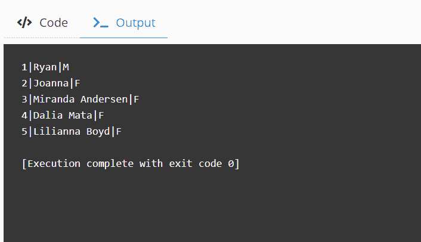
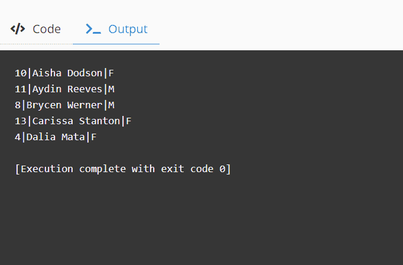

# SQL 中的 ROW _ NUMBER–选择 SQL 和 SQL Server 中的顶级示例

> 原文：<https://www.freecodecamp.org/news/row_number-in-sql-select-top-example-in-sql-and-sql-server2/>

SQL，或结构化查询语言，让我们通过查询从数据库中收集数据。它还使我们能够插入、更新和删除这些数据。

在这篇博文中，我们将关注如何使用 SQL 获取数据并限制结果。

## 为什么要限制 SQL 查询结果？

数据库通常是一个巨大的数据集合。有时我们不需要获取所有的结果。为了限制结果，我们可以优化查询。

限制查询结果对于数据库性能非常重要。在不需要的时候获取大量结果会给数据库带来额外的负载，并影响用户体验。

## 如何在 SQL 中限制查询结果

SQL Server、Oracle 和 MySQL 限制数据的语法是不同的。

*   MySQL 用的是`LIMIT`。
*   甲骨文用`FETCH FIRST`。
*   MS Access 和 SQL Server 使用`TOP`。

我们将在下面看到每一个是如何详细工作的例子。

### 演示数据库

我们有一个名为`students`的表格，其详细信息如下所示:

| 身份证明 | 名字 | 性别 |
| --- | --- | --- |
| one | 赖安(男子名) | M |
| Two | 乔安娜 | F |
| three | 米兰达·安德森 | F |
| four | 达利娅·马塔 | F |
| five | 莉莉安娜·博伊德 | F |
| six | 莱西·夏普 | M |
| seven | Jazlene Cordova | F |
| eight | 布莱斯·维纳 | M |
| nine | 卡里·特纳 | F |
| Ten | 艾莎·多德森 | F |
| Eleven | 艾登·里维斯 | M |

### 如何在 MySQL 中限制查询

下面是 MySQL 的语法。

```
SELECT  (expression)
FROM 
    table_name
LIMIT 5; 
```

例如，我们将从表中选择前 5 条记录。

让我们用我们的桌子`students`来做这个演示。

```
-- fetch top 5 values from table

SELECT * FROM students
LIMIT 5;
```

输出:



### 如何将极限与排序结合起来

将 LIMIT 和 ORDER BY 结合使用，可以得到更有意义的结果。例如，我们可以使用它来查找考试得分超过 70%的前 5 名学生。

让我们用列`name`对表`students`进行排序，并从结果中选择前 5 名。你可以这样做:

```
SELECT * FROM students
order by name
LIMIT 5;
```

输出:



### 如何限制结果–Oracle 语法

下面是我们在 Oracle 中的第一个示例的等效语法。

```
SELECT * FROM students
FETCH FIRST 5 ROWS ONLY;
```

在 Oracle 的旧版本中，可以使用 ROWNUM 来限制查询返回的行数。

示例:

```
SELECT * FROM 
students 
WHERE ROWNUM < 5;
```

### 如何在 SQL–MS Access 语法中限制结果

下面是我们在 MS Access 中的第一个示例的等效语法。

```
SELECT TOP 5 * FROM students; 
```

## 包扎

当与排序结合使用时，限制功能对于查询优化来说是非常强大的。高效的查询对系统来说更轻便，对用户来说更快捷。始终建议在适用的情况下限制结果。