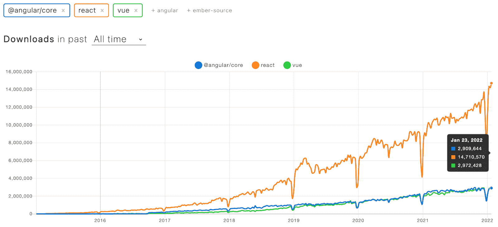

# 2022 年值得关注的前端发展趋势

> 原文：<https://www.freecodecamp.org/news/front-end-development-trends/>

与后端开发相比，前端开发并不总是得到应有的尊重。

以前很多工程师看不起 JavaScript。但是时代变了。Web 应用正在快速增长，这主要是由于开源工具的发展。

这一发展让我们离 jQuery 越来越远，并让几乎所有的科技公司都使用最新的 JavaScript 和工具，如 Eslint、Babel 和 Webpack。

如今，前端正以令人难以跟上的速度前进。

这个帖子讲的都是 2022 年赶上这个开发区的方向。也许你会在这些趋势中找到适合自己的东西。

## 苗条越来越受欢迎

苗条是一个相对较新的工具，理论上开始得太晚了，以至于不能有机会对抗反应，Vue 和角度。但它正以前所未有的速度稳步普及。

2021 年，StackOverflow 用户[宣布其为最受喜爱的前端框架](https://insights.stackoverflow.com/survey/2021#technology-most-loved-dreaded-and-wanted)。

但是苗条不仅仅是这些。它是一个构建优化前端的编译器。Svelte 不像其他流行的框架那样被导入到应用程序中。相反，用 Svelte 编写的代码会被编译成纯 JavaScript。这使得 Svelte 能够在速度方面战胜 React 或 Vue 等框架。

使用苗条的框架非常容易。下面是一个如何使用 state + forms 的例子:

```
Using the framework is very easy. Here is an example of using state + forms.
<script>
 let a = 1;
 let b = 2;
</script>

<label>
 <input type=number bind:value={a} min=0 max=10>
 <input type=range bind:value={a} min=0 max=10>
</label>

<label>
 <input type=number bind:value={b} min=0 max=10>
 <input type=range bind:value={b} min=0 max=10>
</label>

<p>{a} + {b} = {a + b}</p> 
```

就这么简单！注意这里的三件事:

1.  表单以简单、优雅的方式处理，就像在 SPA 框架出现之前的旧时代一样。不需要将 onChange 属性附加到输入上。
2.  标记和逻辑并存，封装了逻辑和一个可见层。
3.  状态很容易管理。

难怪该框架在社区中越来越受欢迎。新的流行平台诞生只是时间问题。

## React、Vue 和 Angular 将继续存在

大约六年前，我在 Angular 2 首映前开始了我的前端冒险。我记不清从那以后有多少次读到 Vue，React，或者 Angular 正在死去。

然而，事实证明完全不同。这三个框架中的每一个从一开始就越来越受欢迎。

下面是图表([来源:Npm 趋势](https://www.npmtrends.com/react-vs-vue-vs-@angular/core))。值得补充的是，图表上的每一次突然下跌都是因为 12 月。



Angular vs React vs Vue download trends

看一下上面的图表。请注意，Angular 的受欢迎程度增长了十倍以上。React 和 Vue 增长更快。所有三个框架都支持几乎相同的用例。

这意味着无论您选择这三个框架中的哪一个，您都可以期待它在未来的几年中得到使用和支持。

值得注意的是，React 在 2021 年并没有任何重大变化。然而它的适应速度是惊人的。很可能是因为围绕技术的生态系统。React 拥有最大的库和支持框架选择。

值得一提的两个例子是 Next 和 Gatsby。后者是下一个趋势的肇事者之一。

## 框架需要支持静态和动态页面

让我们用实际术语来建立什么是静态和动态页面。

当用户打开动态页面时，动态页面获取并处理内容。静态页面是在构建时预定义的。它们成为光盘上单独生成的文件。它们看起来和动态的一样，但是用户的浏览器需要做的工作更少。

如果你有一个商店，你可以有一个单一的动态产品页面，或数以千计的静态产品页面，每个产品一个。

这意味着静态页面对用户来说性能更好，但是构建起来要花更长的时间。

放弃静态页面的原因是 React 和 Vue 类型的单页面应用程序(SPA)框架的普及。他们还恢复了他们的青睐。

SPA 生成的动态内容比用 HTML 编写的现成内容要慢得多。当页面从服务器获取数据时，这种差异尤其明显。动态页面通常必须下载并处理这些数据。

这导致了 spa 中静态页面的诞生。Gatsby 通过在 React 中为静态页面构建一个框架和基础设施来解决这个问题。

像博客、作品集这样的网站，甚至像 freeCodeCamp 这样的课程平台，静态会快很多。即使是服务器端的渲染，就像 Next.js 通常的情况一样，也不能保证更好的速度([来源:Sidney Alcantara](https://hackernoon.com/gatsby-won-against-nextjs-in-this-heads-up-competition-xa7p3ysc) )。

关注第一次内容丰富的绘制的时间导致了在其他框架中生成静态页面的大量解决方案，例如 Vue 或 Svelte。

另一方面，静态页面很难扩展到几百万个页面。如果你正在开发一个有很多动态内容的应用，比如用户资料，你最好使用动态页面。这两种处理内容的方式都会存在。

## 平台将单个开发人员转变为整个 IT 部门

近年来，加速前端开发的平台大量涌现。这是巨大的，因为它允许小团队快速移动。

你可以使用 [Twilio](https://www.twilio.com/) 或 [Agora.io](https://www.agora.io/) 轻松实现视频。你可以使用 [Firebase](https://firebase.google.com/docs/auth) 、 [Amazon Cognito](https://aws.amazon.com/cognito/) 或 [Okta](https://www.okta.com/) 立即添加认证(Okta 还收购了 [Auth0](https://auth0.com/) )。

自动全局部署前端代码尤其值得一提。有三种解决方案:Vercel、Gatsby Cloud 和 Netlify。他们可以在 5 分钟内将一个拥有 GitHub 帐户的前端开发人员变成整个 DevOps 部门。

在撰写本文的时候，这三个平台都提供了相对相似的平均加载时间(来源: [Netlify vs Vercel](https://bejamas.io/compare/netlify-vs-vercel/) ， [Netlify vs Gatsby Cloud](https://bejamas.io/compare/netlify-vs-gatsby-cloud/) )。

Gatsby Cloud 是 React only，但它使处理无数静态页面变得几乎太容易了。如果你正在开发一个 Gatsby 应用程序，这可能是你最好的选择。

Vercel 支持主要的框架，包括服务器端的框架，如公司创始人自己的框架 Next.js。如果你正在开发服务器端渲染的应用程序，Vercel 将使你的生活变得容易得多。

Netlify 专注于客户端框架，如 pure React 和 Vue。它提供了一系列有用的工具，如即用型表单、认证和无服务器功能。我相信这是传统客户端应用的最佳选择。

值得一提的是 Shuffle.dev，它可以在几秒钟内随机创建一个专业的网站布局。它有相对较大的主题和 CSS 框架选择，并且每周都会添加新的特性和内容。在 [CodeAlly.io](https://codeally.io/) ，我们大量使用它来加速原型开发。

## 前端优化是关键

前端近年来又回到了原点。轻型站点变成了重型平台，渲染时间很长。有些人可能还记得 Slack 用 React 的开发者版本的时候([来源:Robert Pankowecki](https://twitter.com/pankowecki/status/892294002040594434) )。加快水疗速度的趋势已经存在多年，但势头仍在增强。

对性能有负面影响的库，如 Moment.js，被它们更轻便、性能更好的对应物(如 Day.js)所取代。示例包括材质 UI 和 Lodash。

错误记录的市场领导者 Sentry 几个月前才开始致力于包大小的优化。在整个前端生态系统中，越来越强调使用延迟加载，在服务器端呈现前端，或者使用 CSS 文件而不是用 JavaScript 设计应用程序的样式，例如，样式化组件就是这种情况。

顺风最近越来越受欢迎，在 2022 年，它肯定会继续受欢迎。它处理减少应用程序加载时间，几乎没有其他 CSS 工具。

也就是说，它有一个陡峭的学习曲线。顺风代码通常很难读懂。

我也强烈推荐尝试 Linaria。Linaria 结合了样式化组件的优点和使用静态 CSS 文件的速度。我们已经在 [CodeAlly.io](https://codeally.io/) 使用了一段时间，整个前端团队都喜欢这个库:【https://github.com/callstack/linaria】。

Linaria 中的示例代码:

```
import { styled } from '@linaria/react';
import mainTheme from 'themes/mainThemeV2';

export const Wrapper = styled.div`
 display: flex;
 flex-direction: column;
 align-items: center;
 height: 100%;
 width: 30px;
 max-height: 60px;
 border-bottom: 1px solid ${mainTheme.colors.neutral300};
 background-color: ${mainTheme.colors.primary300};
 border-radius: 8px;
`; 
```

注意如何在样式中使用 JavaScript。还可以重用样式，因为它们是常规的 JS 常量。在构建过程中，代码被编译成 CSS 文件。

这将带来出色的开发人员体验和超快的前端。

## 结论

当我开始的时候，事情进展得很慢。有很多创新正在发生，前端也在快速发展。如果你想在这个行业工作，你可能想去看看 [CodeAlly](https://codeally.io/) 。这是我和朋友一起创建的一个平台，科技公司通过邀请程序员来竞争他们的工作。

几乎没有经验的新程序员也可以通过内置的 VSCode 和 Docker 代码挑战来证明他们的技能。我希望这篇文章读起来有趣，并且你在这里找到了一些有价值的东西。下次见！