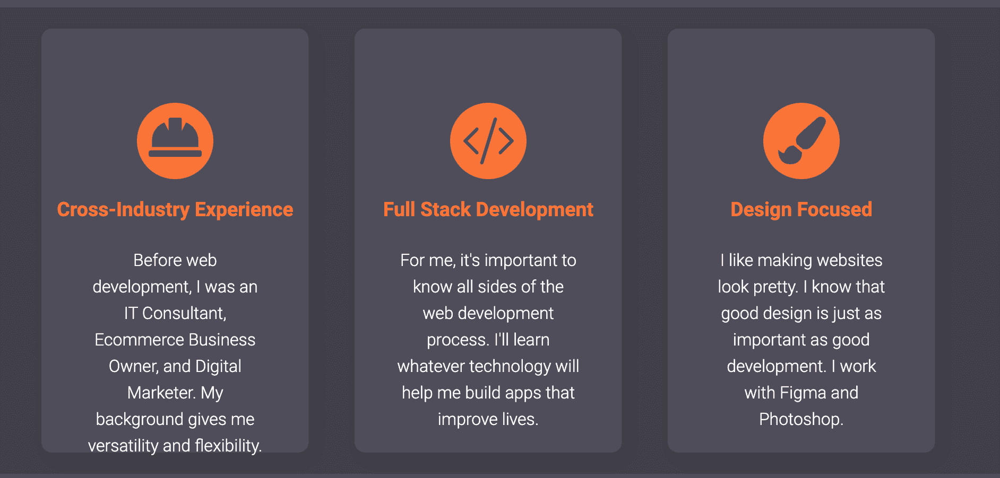
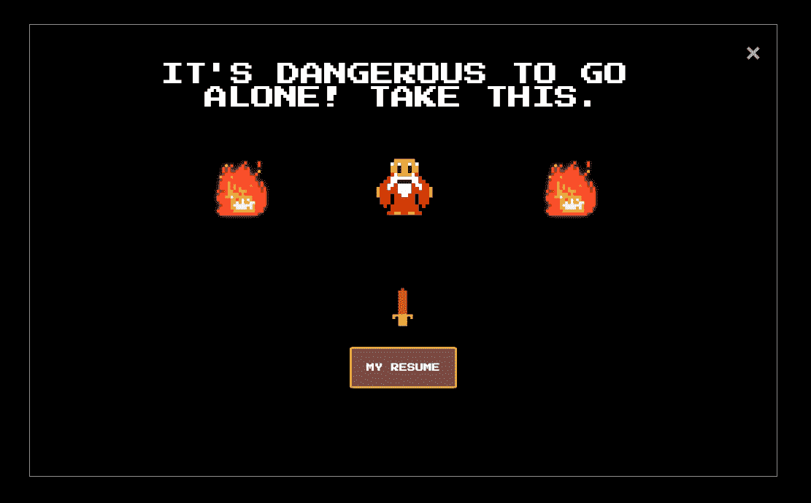

# 如何提升您的开发人员组合

> 原文：<https://www.freecodecamp.org/news/level-up-developer-portfolio/>

建立一个开发人员组合可以大大增加你被雇用的机会，这不是什么大秘密。

每个人都这么告诉你。但是，他们并不总是告诉你什么是好的。

你看，许多投资组合都很普通，相当无趣。如果你的投资组合看起来和其他人一样，那么你怎么能指望它脱颖而出呢？

嗯，不会很突出。

但是不要担心——我也经历过。我的第一个作品集平淡无奇，缺乏灵感，有很多我在这篇文章中提到的不该做的事情。

然而，我是一名前营销人员，后来成为开发者，我知道如何让一些东西脱颖而出。我已经做了广告活动，销售额暴涨，人们开始谈论。我意识到我需要像营销人员一样思考，让我的投资组合脱颖而出。

好消息是，同样的原则也可以应用到你的投资组合中，使之更上一层楼。如果你阅读了这个指南并实施了这些提示，你将会把你的投资组合提升到其他想要脱颖而出的初级开发者的海洋之上。

在我们开始学习提升你的投资组合的五个技巧之前，让我们确保我们在同一页上。

## 什么是投资组合？

作品集是一种展示你是谁，你有什么技能，最重要的是你已经完成的工作的方式。

作为一名开发者，你的作品集将以网站的形式出现。这个网站的主要目标是尽可能以最好的方式展示你自己和你的作品。

它需要让你脱颖而出，需要让雇主认为“哇！我想和这个人一起工作”。最终，你需要向他们展示，和你一起工作会很棒，这样他们就不得不更多地了解你。

因此，投资组合应该包括一些标准元素。以下是你的投资组合必须包含的最基本的元素。

## 投资组合的最低限额

这些是任何开发者投资组合的不可协商之处:

1.  响应式设计(了解如何做到这一点[在这里](https://www.freecodecamp.org/learn/responsive-web-design/)
2.  展示你作品的项目
3.  一个“关于我”的部分或者其他地方，人们可以通过阅读你的网站来了解你
4.  你的投资组合需要是可访问的
5.  你的投资组合应该有一个自定义域。购买域名——不到 10 美元就能买到。不要派人去 39238834.netfily.com
6.  人们联系你的方式，最好是你的电子邮件

如果你的投资组合中有这六个不可协商的因素，你就有了一个好的开始。

现在让我们来看看五种提升你投资组合的方法，从一种不明显的方法开始。

# 你可以做五件事来提升你的开发者组合

## 1.了解你的目标受众

有一个方面可以帮助你提升你的投资组合，那就是准确地知道你投资组合的目的是什么。也就是说，这个投资组合是给谁的？

如果我问你你投资组合的目的是什么，你的产出与目的相符吗？比方说，你的投资组合的目的是获得你的第一个初级开发人员角色。那么你的投资组合将会看起来与那些想成为自由网络开发者的人非常不同。

因此，你需要做的第一件事是问你投资组合的目的是什么。从宽泛开始，然后尝试细化。保持初级开发人员角色示例，您可以将其细化为专门从事 React 的初级前端开发人员。

如果你是初级前端开发人员，那么你的投资组合不需要像下面的通用技能卡这样的东西。

这些卡片更适合正在寻找自由职业者的人。

当你知道你的投资组合的目的时，你可以更好地定制信息来传达为什么有人应该帮助你实现你的目的。

## 2.提升您的项目细节

这是你的投资组合中最重要的部分，也是我经常看到执行得不好的部分。

如果你浏览像 r/webdev 这样的东西并搜索“portfolio ”,让我告诉你如果你点击 90%的 portfolio 并查看项目，你会看到什么。你会看到一个计算器应用程序，一个天气应用程序，井字游戏，一个电影查找应用程序，“插入大网站”克隆，等等。

现在，不要误解我——这些是学习他们所需技能的有用项目。人们花时间来制作它们。问题是每个人都造同样的东西。你通常可以跟着教程做，不需要太多思考就可以创建它们。

这里有两个问题。

首先是你没有区分自己。如果我是人力资源部或招聘经理，我为什么要选择你的计算器应用程序，而不是收件箱里的其他 30 个？还有，我怎么能相信这是你自己做的，而不是从教程中复制/粘贴代码呢？

第二是大多数人只是把项目放进去，链接到 GitHub repo，可能还有现场演示。这并没有告诉可能会大量雇用你的人，也没有给他们更多的理由雇用你，而不是其他已经雇用你的人。

那么，你如何让你的项目部分脱颖而出呢？让我们来看看你可以提升投资组合中项目部分的一些方法。

### 添加原始项目

你不需要重新发明轮子或者开发下一个伟大的社交媒体应用。但是如果你尝试使用不同的 API 而不是标准的天气 API，那就太好了。

例如，您可以创建一个与天气应用相同的冲浪报告应用，但您调用的是不同的端点。这向我展示了你知道如何在教程之外调用 API。

如果你不确定如何制作自己的原创项目，那么看看这个指南[如何为初学者规划和构建一个编程项目](https://www.peterlunch.com/blog/how-to-plan-and-build-a-programming-project)。

### 给出一些关于这个项目的细节

第一个问题是很多项目没有原创性。第二是大多数人除了关于项目的基本细节之外，不会给出更多的信息。

让你脱颖而出的是给出你项目的一些细节。当我说细节的时候，我的意思是给我一个关于这个项目的故事。我看到的关于项目的最佳投资组合告诉我不要只是给我看。

试着回答这些问题。

*   为什么选择建设这个项目？
*   在制作这个项目时，什么挑战了你？
*   你从制作这个项目中学到了什么？
*   你在其他项目中学到了什么？
*   下次你会做什么不同的事？
*   你有没有遇到什么困难？你是怎么摆脱困境的？
*   你完成这个项目的过程是怎样的？你做了线框，做了一个 Trello 板，还是你只是陷进去了？

如果你回答了这些问题，并把它们加工成几个简洁的段落，我现在会更加了解你作为开发人员的能力。我可以看到你对什么感兴趣，你如何克服挑战，你如何从那些挑战中学习，你是什么技能水平。

如果你遵循这个建议，你已经在脱颖而出的路上了。

## 3.从你的文件夹中去掉不必要的绒毛

有时候，改善你的投资组合的最好办法就是删除一些东西。

你应该去掉那些对你的目标受众没有价值的东西，以及那些降低你可信度的东西。

这里有一个清单，列出了你需要移除的东西以及移除的原因。

1.  **循序渐进的辅导项目。这些项目损害了你的信誉。他们没有创意，他们没有告诉我你能做什么。相反，他们告诉我，你可以复制别人做的事情。**
2.  与发展或你试图获得的工作无关的项目。这些与你的目标受众无关。
3.  如果你的项目之一是投资组合本身。为什么去掉这个？原因是它们现在在你的投资组合中。他们正在与项目互动。因此，为另一个项目节省空间。
4.  **技能进度条。虽然他们看起来很酷，但他们很坏。如果你是一个大三学生，你可能只懂 10%的 JavaScript，你会想代表它吗？80% CSS 到底是什么意思？**如果你去掉一件东西，请把它做成这些。****
5.  **如果你的投资组合是别人投资组合的翻版——重新开始**。对新手来说这不酷。另外，我想看看你能做什么，而不是你能复制什么。从长远来看，它会反过来伤害你。

## 4.给你的关于我的一些个性

保罗·凯利有一首歌叫做“每个城市”，这首歌的大意是每个城市都是一样的。我看过很多投资组合，很多看起来都一样。

经常出现的相同部分是“关于我”部分。下面我们来看一个例子。

“大家好，我叫 Jonny Lucky，是一名来自 Example Town 的全栈式 Web 开发人员。我喜欢建立解决生活中独特问题的网站。

我主要与 MongoDB、Express、React、Node 和 GraphQL 合作，并建立了无数的 WordPress 和 Shopify 网站。我之前的职业是 IT 顾问、电子商务企业主和数字营销人员。我也非常喜欢摆弄 CSS。

在我的空闲时间，我玩电子游戏，也健身。"

你好乔尼·拉基，还是露西·可爱？我忘记了，因为我是人力资源人员，我已经阅读了 50 个这样的投资组合，它们都非常相似。

如果我改变你的名字、城镇和科技堆栈，这些候选人将会变成一个。

公平地说，有一些个人接触，如他们“玩视频游戏，也锻炼”。但是，你猜怎么着？很多其他申请人也喜欢这些东西。

如果你有一个类似上面的关于我的部分，你能发现问题吗？你不会引人注目，而且会给人一种有点僵硬的印象。

你的“关于我”需要有一点辛辣，它需要显示你的个性和经历。因为你的个性与其他人不同，所以你的“关于我”部分也应该如此。

让我们看看我的，给你一个你应该争取的想法。我得到了一些赞美。

“我是一名前营销人员，喜欢用代码构建东西。

我第一次迷上编程是在 2015 年。我和我姐夫在旧金山，他告诉我一个叫 Python 的东西，以及它是如何实现自动化的。作为一个追求效率的人，我被迷住了。

在回澳大利亚的航班上，我直接进入了 Python。很快，我就在自动化自己的东西了。我制作了一个在健身房预定课程的机器人，一个给我的老板发送每周报告的机器人，我甚至制作了一个喜欢我女朋友在 Instagram 上的内容的机器人。不幸的是，事情就到此为止了。不久之后，我得到了提升。所以，我学习的时间少了，我放弃了编程。

但是，后来 Covid 出现了，我突然有了更多不用通勤的时间。于是，我又开始学习了。具体来说，我学习了 web 开发，因为我有自己想做的东西。

经过几个月的自学，我知道这是我想为自己的职业生涯做的事情。因此，我报名参加了编码器学院训练营，并全身心地投入其中。我每天都在编码，直到深夜，周末也是如此。直到我准备好投入生产代码。

自从训练营以来，我已经成长为一名开发人员，与帮助我提高对任何 web 应用程序期望的标准的高级开发人员一起工作。

我现在正在寻找一份全职工作，在那里我可以贡献我在编码和商业方面的技能，帮助一家公司实现他们的目标。"

如你所见，我的“关于我”部分是我独有的。我要说，在这个星球上没有另一个人可以不说谎就写出同样的关于我的文章。

现在，你的“关于我”部分不必很滑稽，可以很专业。但是，这是一个关键点...

> 你需要让它变得有趣，这样读它的人就会想继续读下去。

为了让你的“关于我”部分变得有趣，你可以尝试像故事和轶事这样的东西。试着把它们和你想要表达的重点编织在一起。

另一种思考方式是，如果你被邀请参加面试，你的“关于我”会不会足够有趣，以至于面试你的人会说“嘿，我喜欢你文件夹里那个关于 X 的故事”？如果它能做到这一点，你就赢了，因为你打开了更多的对话。

最后，你要努力激发看你投资组合的人的兴趣。

这样想吧。如果人力资源部有 50 份申请要通过，他们只会面试其中的 5 个人。

如果你的“关于我”部分像第一部分一样平淡无奇，他们很可能会浏览一遍，然后进入下一部分。如果你的投资组合中没有其他突出的东西，那么他们会继续下一个应用程序，直到有东西跳出来。你想抓住他们的注意力，让他们把你转移到面试堆里。

由于大多数投资组合都是通用的，所以不需要太多就能脱颖而出。如果你的经验比别人少，但他们的投资组合是通用的，而你的不是，我认为你更有可能被面试选中。

为什么？因为我们喜欢和我们喜欢的人一起工作，如果你表现出你是一个有趣的独特的人，我可能会喜欢至少更多地了解你。

## 5.在上面撒些糖末

在我早期的编码训练营中，我学到的最重要的一课就是，在撒糖之前，你需要甜甜圈。

看看这个关于你的投资组合的类比，甜甜圈是我上面列出的所有其他东西。你需要像坚实的项目，一个有趣的关于我的部分，和响应式设计的投资组合的基线要求。

在你拥有了所有的基础知识之后，就应该开始撒糖了。所以，如果你按照上面的建议做，你就有了甜甜圈。现在，你可以开始让你的投资组合大放异彩了。

添加一些能让未来雇主惊叹的东西！你可以添加像[克里斯多佛·切鲁比](https://cherupil.com/)这样的惊人动画，像[菲利普·奈芙](https://philippeneveu.com/)这样的酷炫过渡效果，或者像[杰伊·汤普金斯](https://jhey.dev/)这样的黑暗模式。

我添加了一个[塞尔达主题的模型](https://www.peterlunch.com/blog/javascript-exit-intent-modal),以确保未来的雇主在他们离开我的旧投资组合网站之前拿走我的简历。我只是先确保自己掌握了基本知识。

你也可以尽情发挥你的想法，只要确保你执行了它们。你不会想要未经打磨的面包屑，它会带走你的甜甜圈的主要成分。

## 摘要

如果你读了这篇文章，然后想，哦，伙计，我的投资组合很普通，不要担心。现在你有 5 件事可以做来提升你的文件夹，让它从“被遗忘”的那一堆移到“给这个人一次采访”的那一堆。

我经常出现在 Reddit 和 Twitter 上的投资组合建议帖子中，试图为试图进入该行业的人提供建议。

当你完成了你的投资组合的升级，并且你正在寻找一些关于它的反馈，一定要把它发给我，并附上你网站的链接。

如果你有一个你引以为豪的作品集，或者你正在寻找关于它的反馈， **[在 twitter 上关注我](https://twitter.com/thelynchpinau)** 并把链接发给我，这样我可以查看它并给你一些反馈。

如果你有一个很棒的，我甚至会把它添加到我的[投资组合的流行列表](https://github.com/pin0S/portfolios-that-pop)。