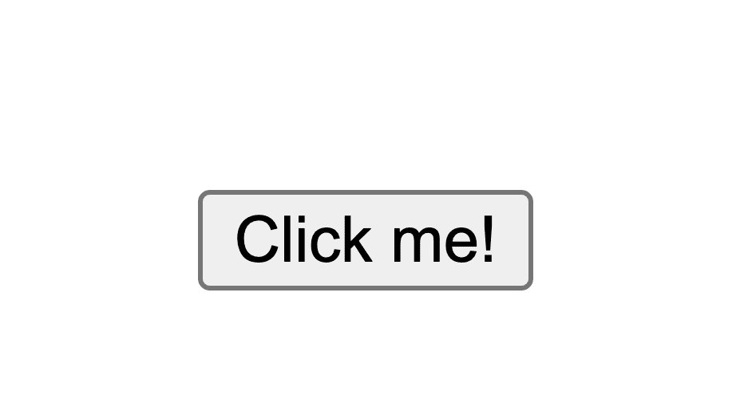
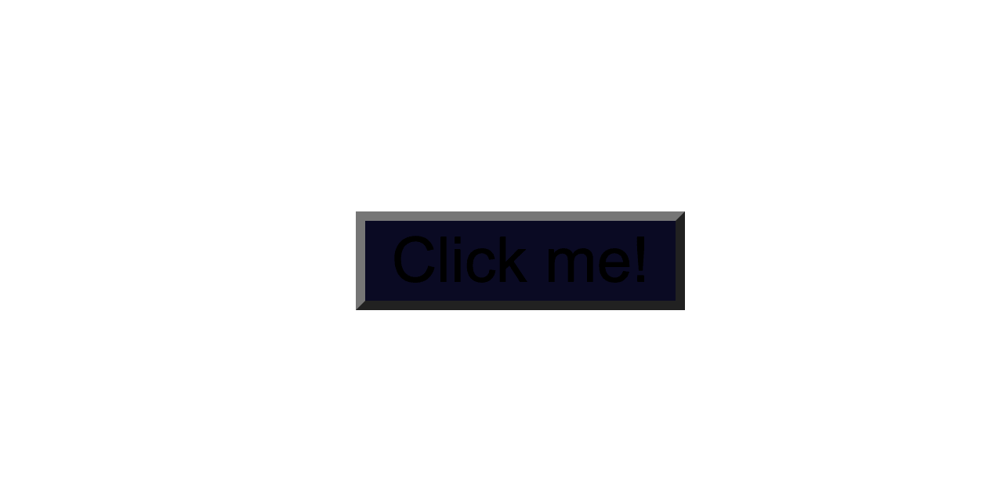
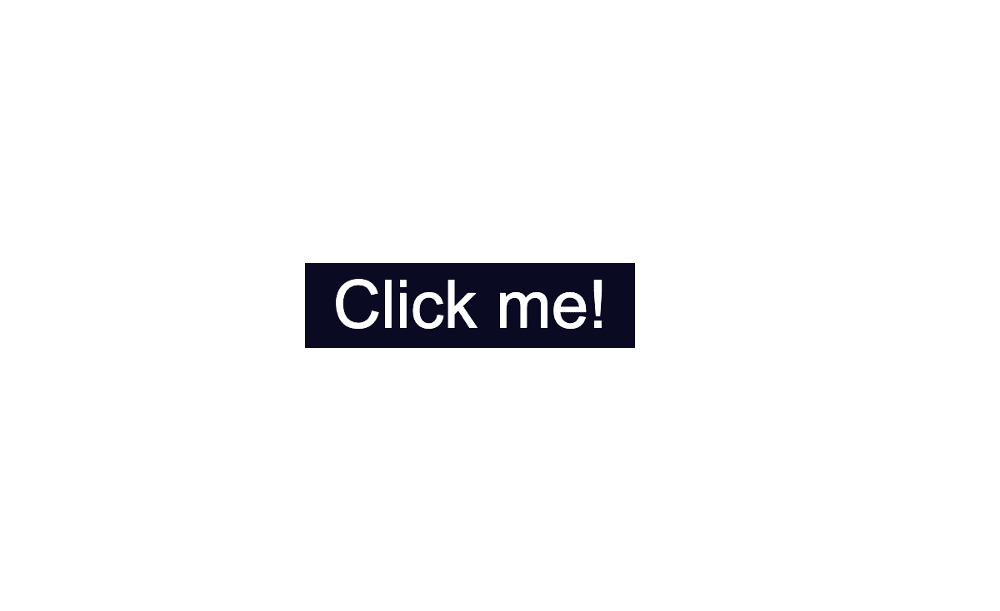
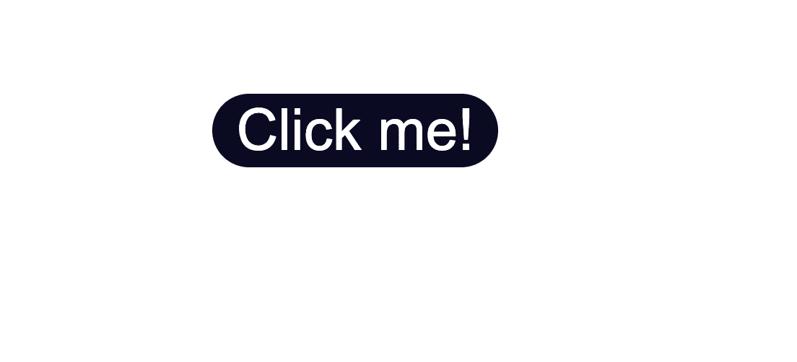
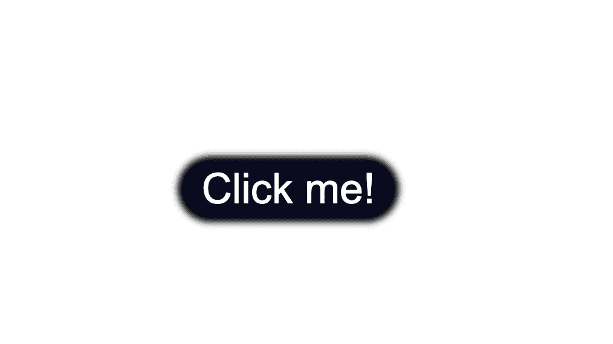
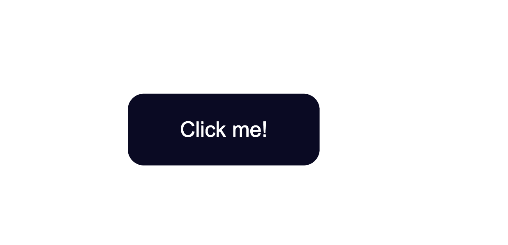
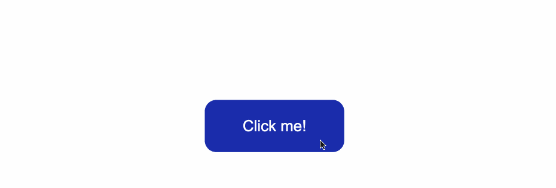
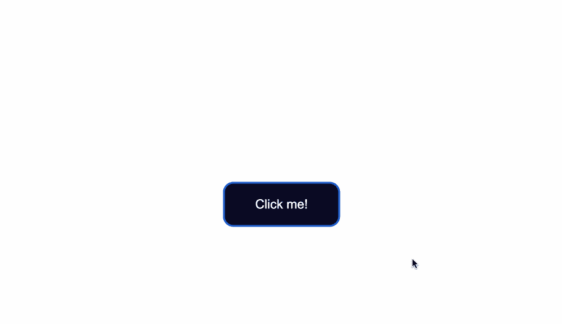
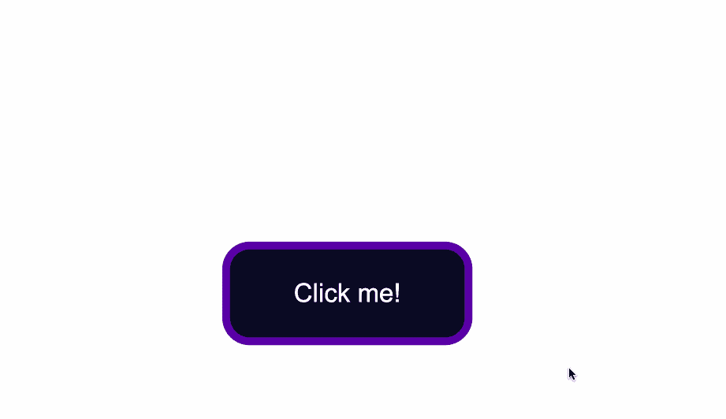
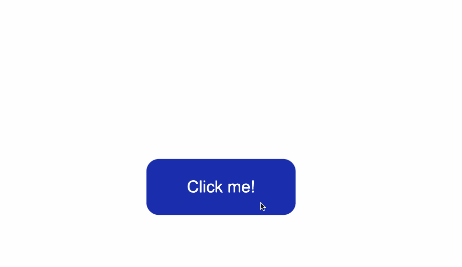

# CSS 按钮样式–悬停、颜色和背景

> 原文：<https://www.freecodecamp.org/news/css-button-style-hover-color-and-background/>

在这篇文章中，你将看到如何使用 CSS 来设计一个按钮的样式。

我的目标主要是展示不同的 CSS 规则和样式是如何应用和使用的。我们不会看到太多的设计灵感，也不会讨论造型的想法。

相反，这将更多地是对样式本身如何工作、哪些属性是常用的以及它们如何组合的概述。

您将首先看到如何在 HTML 中创建一个按钮。然后您将学习如何覆盖按钮的默认样式。最后，您将大致了解如何为按钮的三种不同状态设计样式。

# 目录

1.  [在 HTML 中创建一个按钮](#html)
2.  [更改按钮的默认样式](#default)
    1.  [改变背景颜色](#background)
    2.  [改变文本颜色](#text)
    3.  [改变边框样式](#border)
    4.  [改变尺寸](#size)
3.  [样式按钮状态](#states)
    1.  [样式悬停状态](#hover)
    2.  [样式焦点状态](#focus)
    3.  [样式活动状态](#active)
4.  [结论](#conclusio)

我们开始吧！

## 如何在 HTML 中创建按钮

要创建一个按钮，使用`<button>`元素。

与使用用`<div>`元素创建的通用容器相比，这是一个更容易访问的语义选项。

在下面的`index.html`文件中，我已经创建了网页的基本结构，并添加了一个按钮:

```
<!DOCTYPE html>
<html lang="en">
<head>
    <meta charset="UTF-8">
    <meta http-equiv="X-UA-Compatible" content="IE=edge">
    <meta name="viewport" content="width=device-width, initial-scale=1.0">
    <link rel="stylesheet" href="style.css">
    <title>CSS Button Style</title>
</head>
<body>
    <button type="button" class="button">Click me!</button>
</body>
</html> 
```

让我们来分解一下这条线`<button type="button" class="button">Click me!</button>`:

*   首先添加按钮元素，它由开始标签`<button>`和结束标签`</button>`组成。
*   开始的`<button>`标签中的`type="button"`属性显式地创建了一个可点击的按钮。因为这个特殊的按钮不是用来提交表单的，所以出于语义的原因，添加它是有用的，这样可以使代码更加清晰，并且不会触发任何不必要的操作。
*   属性将用于在一个单独的 CSS 文件中设置按钮的样式。值`button`可以是您选择的任何其他名称。例如，你可以使用`class="btn"`。
*   文本`Click me!`是按钮内部的可见文本。

应用于按钮的任何样式都将放入一个单独的`style.css`文件中。

通过将两个文件链接在一起，可以将样式应用于 HTML 内容。您可以使用在`index.html`中使用的`<link rel="stylesheet" href="style.css">`标签来完成这项工作。

在`style.css`文件中，我添加了一些样式，只把按钮放在浏览器窗口的中间。

注意`class="button"`与`.button`选择器一起使用。这是一种将样式直接应用于按钮的方法。

```
* {
    box-sizing: border-box;
} 

body {
    display:flex;
    justify-content: center;
    align-items: center;
    margin:50px auto;
}

.button {
    position: absolute;
    top:50%
} 
```

上面的代码将产生以下结果:



按钮的默认样式会因您使用的浏览器而异。

这是 Google Chrome 浏览器上按钮的本地样式的一个例子。

## 如何更改按钮的默认样式

### 如何改变按钮的背景颜色

要改变按钮的背景颜色，使用 CSS `background-color`属性并给它一个你喜欢的颜色值。

在`.button`选择器中，使用`background-color:#0a0a23;`来改变按钮的背景颜色。

```
.button {
    position: absolute;
    top:50%;
    background-color:#0a0a23;
} 
```



### 如何改变按钮的文字颜色

文本的默认颜色是黑色，所以当你添加深色背景色时，你会注意到文本已经消失了。

另一件要确定的事情是按钮的背景颜色和文本颜色之间有足够的对比度。这有助于使文本可读性更好，看起来更舒服。

接下来，使用`color`属性来改变文本的颜色:

```
.button {
    position: absolute;
    top:50%;
    background-color:#0a0a23;
    color: #fff;
} 
```


### 如何改变按钮的边框样式

注意到按钮边缘的灰色了吗？这是按钮边框的默认颜色。

解决这个问题的一种方法是使用`border-color`属性。您将该值设置为与`background-color`的值相同。这确保了边框与按钮的背景颜色相同。

另一种方法是使用`border:none;`完全移除按钮周围的边框。

```
.button {
  position: absolute;
  top:50%;
  background-color:#0a0a23;
  color: #fff;
  border:none;
} 
```



接下来，您还可以通过使用`border-radius`属性来舍入按钮的边缘，如下所示:

```
.button {
    position: absolute;
    top:50%;
    background-color:#0a0a23;
    color: #fff;
    border:none;
    border-radius:10px;
  } 
```



您还可以使用`box-shadow`属性在按钮周围添加轻微的阴影效果:

```
 position: absolute;
    top:50%;
    background-color:#0a0a23;
    color: #fff;
    border:none;
    border-radius:10px;
    box-shadow: 0px 0px 2px 2px rgb(0,0,0); 
```



### 如何改变按钮的大小

在按钮边框内创建更多空间的方法是增加按钮的`padding`。

下面我为按钮的顶部、底部、右侧和左侧填充添加了 15px 的值。

我还分别用`min-height`和`min-width`属性设置了最小高度和宽度。对于所有不同类型的设备，按钮都需要足够大。

```
.button {
    position: absolute;
    top:50%;
    background-color:#0a0a23;
    color: #fff;
    border:none; 
    border-radius:10px; 
    padding:15px;
    min-height:30px; 
    min-width: 120px;
  } 
```



## 如何设计按钮状态的样式

按钮有三种不同的状态:

*   `:hover`
*   `:focus`
*   `:active`

这三个状态最好是不同的样式，并且不共享相同的样式。

在接下来的部分中，我将简要解释每种状态的含义以及触发它们的原因。您还将看到为每个单独的状态设计按钮样式的一些方法。

### 如何样式化`:hover`状态

当用户将鼠标或触控板放在按钮上，而不是选择或点击按钮时，就会出现`:hover`状态。

当你悬停在按钮上时，要改变按钮的样式，使用`:hover` CSS
伪类选择器。

用`:hover`做的一个常见改变是切换按钮的背景颜色。

为了使变化不那么突然，将`:hover`与`transition`属性配对。

属性将有助于使从无状态到状态的 T2 转换更加平滑。

背景颜色的变化会比没有`transition`属性时慢一些。这也将有助于使最终结果对用户来说不那么刺耳。

```
.button:hover {
      background-color:#002ead;
      transition: 0.7s;
  } 
```

在上面的例子中，我使用了一个十六进制的颜色代码值，当我悬停在按钮上时，使背景颜色变浅。

在`transition`属性的帮助下，当从无状态到`:hover`状态的转换发生时，我还造成了`0.7s`的延迟。这导致从原始的`#0a0a23`背景色到`#002ead`背景色的过渡变慢。



请记住，`:hover`伪类不适用于移动设备屏幕和移动应用程序。选择将悬停效果仅用于桌面 web 应用程序，而不用于触摸屏。

### 如何样式化`:focus`状态

`:focus`状态对键盘用户有效——特别是当你点击`Tab`键(`⇥`)聚焦一个按钮时，它将被激活。

如果您正在跟随，当您在按下`Tab`键后聚焦在按钮上时，您将看到以下内容:



注意到当获得焦点时按钮周围的淡蓝色轮廓了吗？

浏览器为`:focus`伪类提供了默认样式，用于辅助键盘导航。完全去掉那个`outline`并不是一个好主意。

但是，您可以为它创建自定义样式，使其易于检测。

一种方法是首先将轮廓颜色设置为`transparent`。

之后，您可以维护`outline-style`到`solid`。最后，使用`box-shadow`属性，当元素被聚焦时，你可以添加你喜欢的颜色:

```
 .button:focus {
    outline-color: transparent;
    outline-style:solid;
    box-shadow: 0 0 0 4px #5a01a7;
} 
```


根据您想要达到的效果，您还可以将这些样式与`transition`属性配对:

```
 .button:focus {
    outline-color: transparent;
    outline-style:solid;
    box-shadow: 0 0 0 4px #5a01a7;
    transition: 0.7s;
} 
```



### 如何样式为`:active`状态

当你通过点击电脑鼠标或按下笔记本电脑的触控板来点击按钮时，`:active`状态会激活*。*

 *也就是说，在我应用并保持了`:hover`和`:focus`状态的样式之后，看看当我单击按钮时会发生什么:



当我将鼠标悬停在按钮上时，会在单击之前应用`:hover`状态样式。

也应用了`:focus`状态样式，因为当一个按钮被点击时，它也会获得一个`:focus`状态和一个`:active`状态。

然而，请记住，它们是*而不是*同一个东西。

`:focus`状态是当一个元素被聚焦时，而`:active`是当用户通过按住一个元素来`clicks`该元素时。

要改变用户点击按钮时的样式，将样式应用于`:active` CSS 伪选择器。

在这个例子中，我改变了用户点击按钮时按钮的背景颜色

```
.button:active {
    background-color: #ffbf00;
} 
```


## CSS 按钮样式的视频解释

[https://scrimba.com/scrim/co3524355bcd2543752fa537c?pl=pBe55fP?embed=freecodecamp,mini-header](https://scrimba.com/scrim/co3524355bcd2543752fa537c?pl=pBe55fP?embed=freecodecamp,mini-header)

[https://scrimba.com/scrim/coa4a454f9e83e63fbe1a80ed?pl=pBe55fP?embed=freecodecamp,mini-header](https://scrimba.com/scrim/coa4a454f9e83e63fbe1a80ed?pl=pBe55fP?embed=freecodecamp,mini-header)

## 结论

现在你知道了！现在你知道了如何用 CSS 设计一个按钮的基本样式。

我们讨论了如何改变按钮的背景颜色和文本颜色，以及如何为按钮的不同状态设置样式。

要了解更多关于网页设计的知识，请查看 freeCodeCamp 的[响应式网页设计认证](https://www.freecodecamp.org/learn/2022/responsive-web-design/)。在互动课程中，您将通过构建 15 个练习项目和 5 个认证项目来学习 HTML 和 CSS。

请注意，上述证书仍处于测试阶段-如果您想要最新的稳定版本，[请查看此处](https://www.freecodecamp.org/learn/responsive-web-design)。

感谢阅读和快乐编码！*