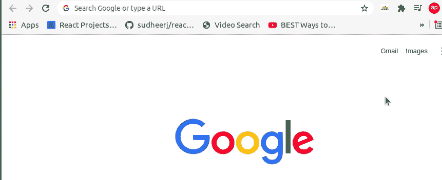
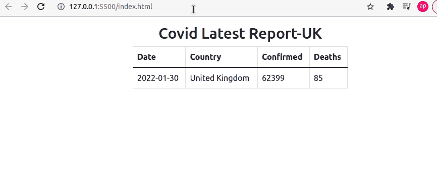
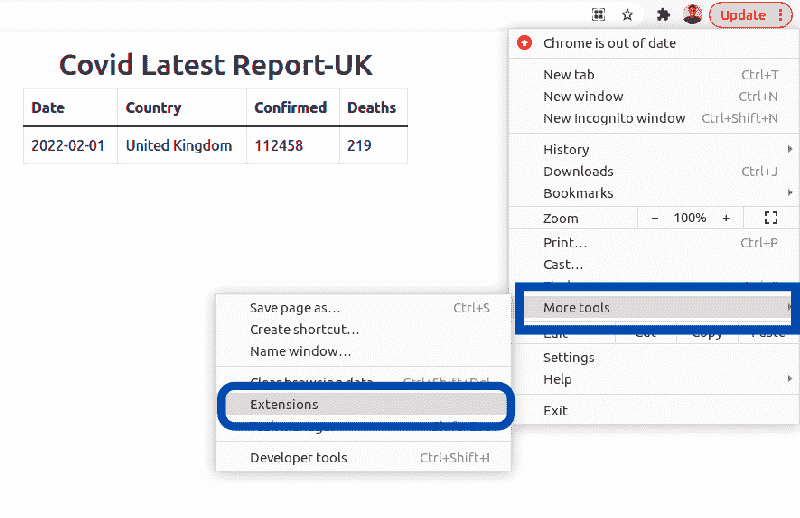
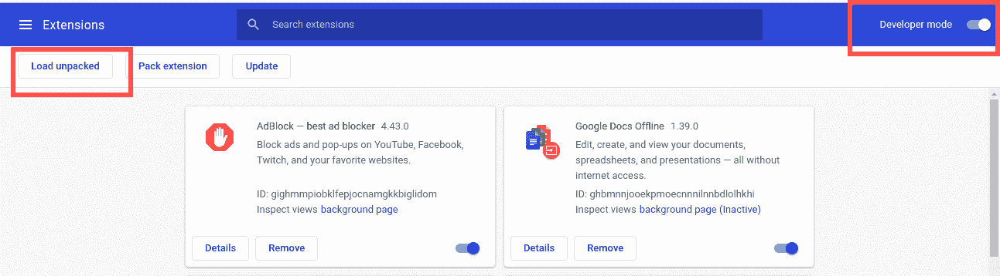
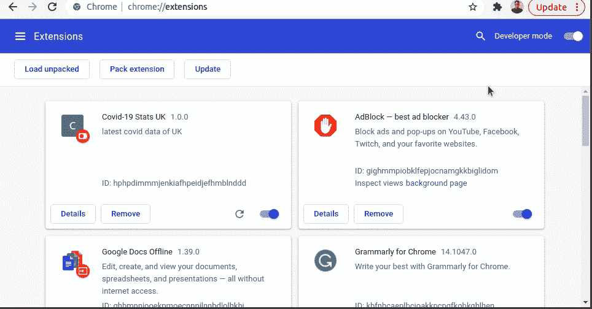

# 如何创建自己的谷歌浏览器扩展

> 原文：<https://www.freecodecamp.org/news/building-chrome-extension/>

如果你是谷歌 Chrome 用户，你可能已经在浏览器中使用了一些扩展。

你有没有想过怎么自己造一个？在本文中，我将向您展示如何从头开始创建 Chrome 扩展。

## 目录

*   [什么是 Chrome 扩展](#what-is-a-chrome-extension)？
*   [我们的 Chrome 扩展会是什么样子](#what-will-our-chrome-extension-look-like)？
*   [如何创建 Chrome 扩展](#how-to-create-a-chrome-extension)
*   [创建 manifest.json 文件](#manifest-json-file)
*   [结论](#conclusion)

## 什么是 Chrome 扩展？

chrome 扩展是安装在 Chrome 浏览器中的一个程序，用于增强浏览器的功能。您可以使用 HTML、CSS 和 JavaScript 等 web 技术轻松构建一个。

创建一个 chrome 扩展类似于创建一个 web 应用程序，但是它需要一个`manifest.json`文件，我们将在本文的最后一节讨论这个文件。

## 我们的 Chrome 扩展会是什么样子？



Latest Covid Report of UK-Chrome Extension

正如你所看到的，上面的 chrome 扩展显示了英国冠状病毒(新冠肺炎)的最新数据。我们将在这篇博文中探讨如何创建这个扩展。

这里，我们将使用[https://api.coronavirus.data.gov.uk/v1/data](https://api.coronavirus.data.gov.uk/v1/data)API 来获取数据。为了这篇文章的简洁，我们将只显示最新的记录。

这个项目的完整源代码可以在 [GitHub](https://github.com/SampurnaC/chrome_extension_fcc) 上找到。

## 如何创建一个 Chrome 扩展

首先，我们需要创建一个空文件夹，我们将在其中添加 HTML、CSS 和 JavaScript 文件。

在该文件夹中，让我们使用以下 HTML 样板代码创建一个 index.html 文件:

```
<!DOCTYPE html>
<html>
<head>
    <title>Covid-19 Stats- UK</title>
    <meta charset="utf-8">
</head>
<body>
</body>
</html>
```

现在，让我们在 head 标签中添加一个到引导 CDN 的链接。我们将在这里使用 [Bootstrap 框架](https://getbootstrap.com/docs/5.0/getting-started/introduction/)，这样我们就不必在这个例子中编写一些额外的 CSS。

```
<head>
    <title>Covid-19 Stats- UK</title>
    <meta charset="utf-8">
    <link href="https://cdn.jsdelivr.net/npm/bootstrap@5.1.3/dist/css/bootstrap.min.css" rel="stylesheet">
</head>
```

在演示中，我们看到记录显示为表格。所以现在我们需要创建一个表。

```
<!DOCTYPE html>
<html>
<head>
    <title>Covid-19 Stats- UK</title>
    <meta charset="utf-8">
    <link href="https://cdn.jsdelivr.net/npm/bootstrap@5.1.3/dist/css/bootstrap.min.css" rel="stylesheet">
</head>
<body>
    <div class="container mt-3" style="width: 450px;">
        <h2 class="text-center">Covid Latest Report-UK</h2>
        <table class="table table-bordered">
            <thead>
            <tr>
                <th>Date</th>
                <th>Country</th>
                <th>Confirmed</th>
                <th>Deaths</th>
            </tr>
            </thead>
            <tbody>
            <tr>
                <td id="date"></td>
                <td id="areaName"></td>
                <td id="latestBy"></td>
                <td id="deathNew"></td>
            </tr>
            </tbody>
        </table>
    </div>
</body>
<script src="script.js"></script>
</html> 
```

上面的代码创建了一个宽度为`450px`的表格。表格中有四个不同的标题:`Date`、`Country`、`Confirmed`和`Deaths`。

在这里，您可以看到每个表数据`td`都被分配了不同的 id。我们将在 JavaScript 中使用这些 id 的值来更新表数据。此外，在加载完所有的 HTML 内容后，我们最终加载了 JavaScript。

现在，表已经显示出来了，我们需要编写 JavaScript 来从 API 获取数据。

让我们创建一个`script.js`文件并添加以下代码:

```
async function fetchData() {
    const res=await fetch ("https://api.coronavirus.data.gov.uk/v1/data");
    const record=await res.json();
    document.getElementById("date").innerHTML=record.data[0].date;
    document.getElementById("areaName").innerHTML=record.data[0].areaName;
    document.getElementById("latestBy").innerHTML=record.data[0].latestBy;
    document.getElementById("deathNew").innerHTML=record.data[0].deathNew;
}
fetchData();
```

现在，让我们分解上面的代码:

*   这里我们使用了名为`fetchData`的异步函数。
*   正在从[https://api.coronavirus.data.gov.uk/v1/data](https://api.coronavirus.data.gov.uk/v1/data)API 获取数据。
*   JSON 数据存储在一个名为`record`的变量中。
*   id 为`date`、`areaName`、`latestBy`和`deathNew`的 td 的 HTML 内容由 API 的相应值更新。

如果我们检查浏览器，我们将能够看到以下结果。



Latest Covid Report of UK - Browser Preview

数据是从 API 中获取的，只要 API 中的数据发生变化，数据就会不断更新。

## Manifest.json 文件

正如我们之前讨论的，构建 Chrome 扩展类似于构建任何 web 应用程序。唯一的区别是 Chrome 扩展需要一个`manifest.json`文件来保存所有的配置。

manifest.json 文件包含构建 Chrome 扩展所需的所有必要信息。这是扩展检查的第一个文件，所有内容都从这个文件中加载。

现在，让我们在根文件夹中创建一个`manifest.json`文件，并添加以下代码:

```
{
    "name": "Covid-19 Stats UK",
    "version": "1.0.0",
    "description": "latest covid data of UK",
    "manifest_version": 3,
    "author": "Sampurna Chapagain",
    "action":{
        "default_popup": "index.html",
        "default_title": "Latest Covid Report"
    }
}
```

Manifest.json

我们的`manifest.json`文件包含`name`、`version`、`description`、`manifest_version`(在本例中为 3，这是最新的清单版本)、`author`和`action`字段的值。在 action 字段中，有一个`default_popup`的值，它包含 HTML 文件的路径，在本例中是`index.html`。

你可以在这里查看[来查看一个`manifest.json`文件的所有配置。](https://developer.chrome.com/docs/extensions/mv3/manifest/)

现在，由于我们已经添加了 manifest.json 文件，我们准备将这个项目作为扩展添加到我们的 Chrome 浏览器中。

为此，我们需要转到`Select More Tools`，然后从浏览器菜单中选择`Extensions`，如下图所示:



Navigating to extensions in Chrome

选择扩展后，它会重定向到 Chrome 中的扩展页面。确保在此处启用`Developer mode`。



一旦完成，你需要点击`Load unpacked`按钮，这将允许我们在 Chrome 扩展商店中加载我们的项目。

现在，该扩展在我们的 Chrome 扩展商店中可用。您也可以在浏览器中锁定扩展，如下图所示:



Pin extension to the browser

此扩展仅在您的浏览器中有效。如果你想在 Chrome 网络商店上发布，可以关注这个[链接](https://developer.chrome.com/docs/webstore/register/)。

## 结论

如果你有一些 HTML、CSS 和 JavaScript 知识，你可以很容易地构建 Chrome 扩展。我希望看完这篇博文后，你会创建一些很酷的扩展。

编码快乐！

你可以在 [Twitter](https://twitter.com/saam_codes) 上找到我，获取与 Web 开发相关的日常内容。

