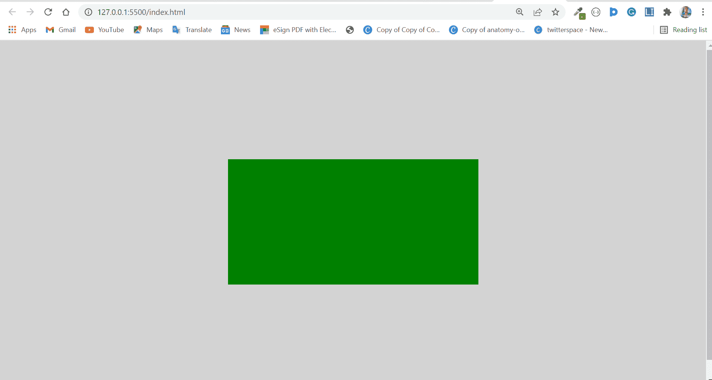
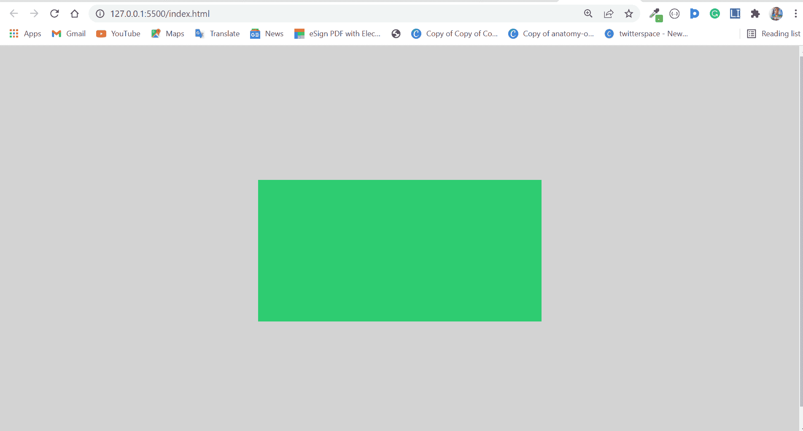
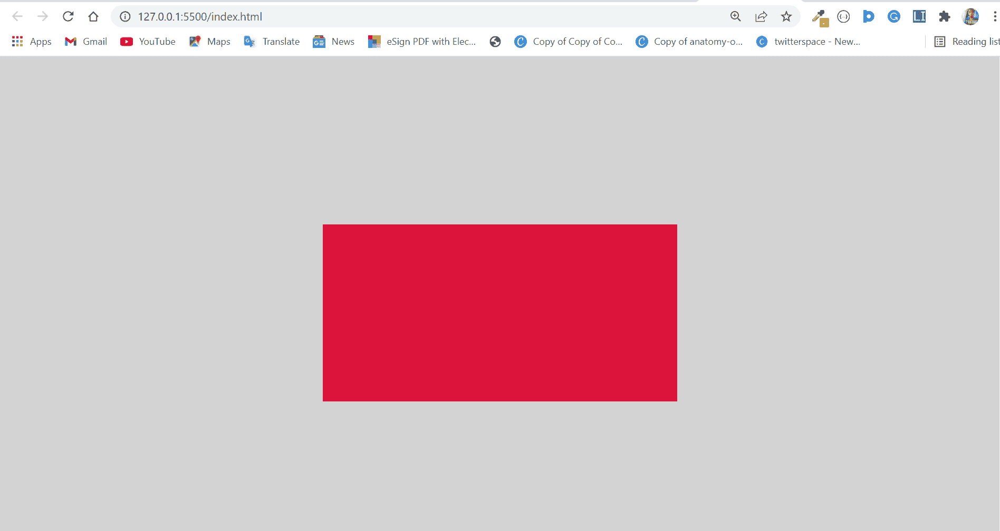
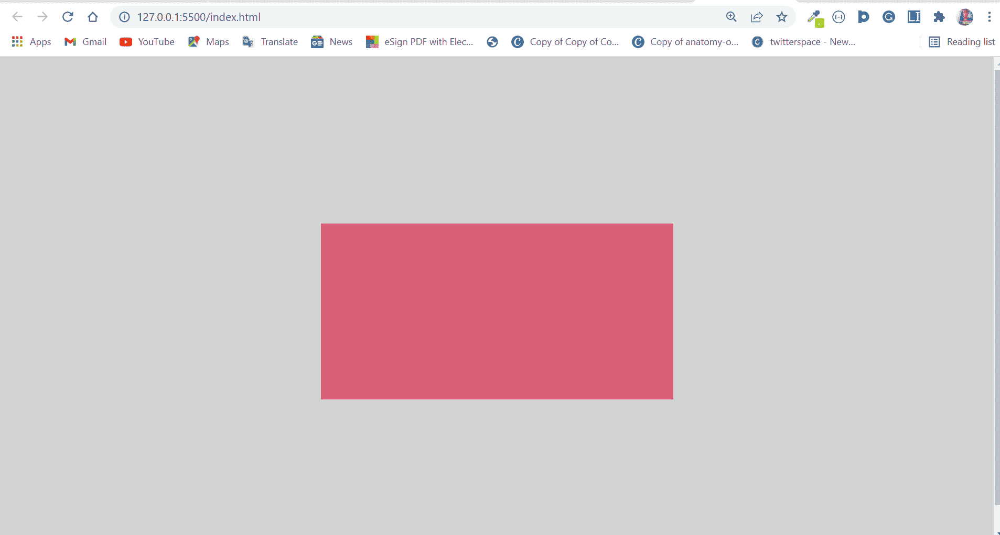
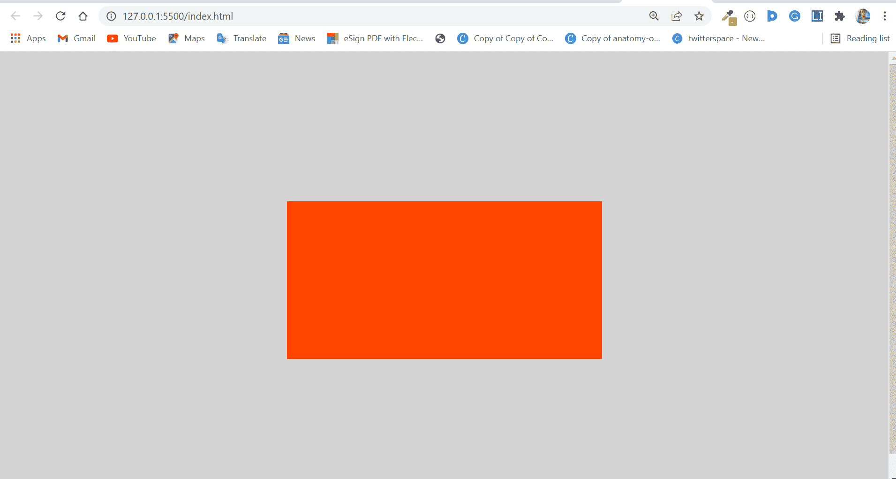

# 如何在 CSS 中改变背景颜色

> 原文：<https://www.freecodecamp.org/news/div-background-color-how-to-change-background-color-in-css/>

如果你正在做一个 web 开发项目，设置一个漂亮的背景色可以给网站一个更吸引人的外观。

要为 CSS 中的`div`或相关元素设置背景颜色，可以使用`background-color`属性。

当设置这个背景色时，你的创造力是你想走多远的极限。

所以在这篇文章中，我将向你展示如何设置这种背景色。

## 如何用命名颜色设置背景色

使用命名颜色，您可以通过引入`background-color`属性并为其分配一个用颜色名称表示的值来设置背景颜色，如`red`、`green`、`blue`等等。

```
 div {
      background: green;
    } 
```



您可以使用以下样式使网页看起来更好。只需设置`div`的宽度和高度，这样背景色就可以生效:

```
body {
   display: flex;
   align-items: center;
   justify-content: center;
   height: 100vh;
   background-color: #d3d3d3;
 }

div {
   background: green;
 } 
```

现代浏览器可以识别大约 147 种颜色，所以你还是会受到一些限制。

## 如何用十六进制颜色设置背景色

使用十六进制值，您可以为一个`div`或任何其他总共有 6 个字符的元素设置背景颜色。

十六进制颜色以井号(#)开始，从 0 到 9 的任何数字，最后是从 A 到 f 的任何字母。

前两个值代表红色，后两个值代表绿色，最后两个值代表蓝色。

使用十六进制值，您可以深入到色轮中，甚至使用从未有人使用过的颜色。

```
div {
   background: #2ecc71;
 } 
```



你可以在这里阅读更多关于十六进制颜色的信息。

## 如何用 RGB 颜色设置背景色

RGB 代表红色、绿色和蓝色。

要用 RGB 设置背景色，可以用 0 到 255 之间的数字指定所需的红色、绿色和蓝色的数量。

```
div {
      background: rgb(220, 20, 60);
    } 
```



RGB 也有一个变种叫做 RGBA。最后一个 A 表示 alpha，它让你决定你想要的颜色的不透明程度。

alpha 取 0.0 到 1.0 之间的值。0.0 表示 0%不透明度，0.5 表示 50%不透明度，1.0 表示 100%不透明度。

```
div {
    background: rgb(220, 20, 60, 0.6);
 } 
```



你可以[在这里](https://www.freecodecamp.org/news/rgb-color-html-and-css-guide/)阅读更多关于 RGB 颜色的信息。

## 如何用 HSL 颜色设置背景色

HSL 代表色调、饱和度和亮度。它是您可以为`div`或其他元素指定背景颜色的方法中最动态的。

*   **色相**代表 360°中的色轮。0 是红色，120 是绿色，240 是蓝色
*   **饱和度**是颜色中的灰色量，以百分比表示。0%是灰色的阴影，100%是颜色本身。
*   顾名思义，**明度**是颜色中暗度和明度的量，用百分比表示。0%是黑，100%是白。

```
div {
   background: hsl(16, 100%, 50%);
 } 
```



## 结论

因为你可以用 4 种不同的方式来应用颜色，你一定想知道你应该用哪一种。

当你使用命名的颜色时，你在应用不同深浅的颜色时会受到一定的限制。

每种颜色，如红色、绿色、蓝色、黄色或任何其他颜色，都有很多你无法用命名的颜色获得的变化。

您只能访问浏览器识别的大约 147 种预定义颜色。另一方面，十六进制颜色是非常动态的。它们大多在开发人员中使用，创造力是极限。这些十六进制颜色允许您使用同一颜色的不同阴影。

RGB 颜色与十六进制颜色一样动态。您可以指定从 0 到 255 的红色、绿色和蓝色的数量，也可以使用添加的 alpha 值来指定颜色的透明度。

HSL 是其中最有活力的。您可以在色轮中精确指定 0 到 360 度的颜色，以百分比形式设置饱和度和暗度，并将不透明度设置为 0.0 到 1.0 之间的任何值。

因此，决定在命名、十六进制、RGB 和 HSL 颜色之间使用哪一种取决于你，取决于你想有多有创意，取决于你的项目需要什么。

感谢您的阅读。