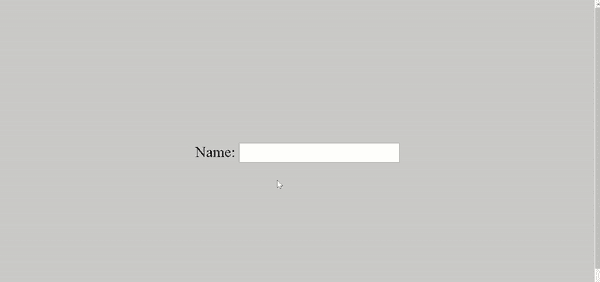

# HTML 标签–标签标记示例

> 原文：<https://www.freecodecamp.org/news/html-label-label-tag-example/>

您使用 HTML `<label>`标签为表单控件添加标题。`<label>`是一个行内元素——这意味着它不会占据一整行，除非你在它前面加上一个 break 标签。

根据定义，表单控件是指表单元素中的元素。

表单控件的例子有`<input type="text"/>`、`<input type="number"/>`、`<input type="radio"/>`、`<input type="checkbox"/>`、`<textarea></textarea>`、`<button></button>`等等。

标记表单控件的最大好处是表单控件可以绑定到标签上。这意味着用户不必在输入变为活动之前只单击它。

将标签绑定到表单控件也有助于视力受损的用户，因为当输入被聚焦时，屏幕阅读器总是会读出标签。

在本文中，我将向您展示如何使用`<label>`标签，这样您就可以以一种独特的方式逐步推进您的项目。

## 如何使用`<label>`标签

有两种方法可以使用`<label>`标签:

*   作为独立元素，方法是使用 for 属性将窗体控件绑定到它
*   将它包裹在表单控件周围

如果你把它作为一个独立的元素使用，你必须通过给标签属性`for`和表单控件属性`id`分配相同的值来把它连接到表单控件。

此外，用户不必仅仅通过点击来获得表单控件的焦点。如果他们也单击标签，控件就会成为焦点。这对于用户体验来说是加分的。

它是这样工作的:

```
<form>
      <label for="name"> Name: </label>
      <input type="text" id="name" />
</form> 
```



这个 CSS 使页面变得更好:

```
body {
      display: flex;
      align-items: center;
      justify-content: center;
      flex-direction: column;
      height: 100vh;
      background-color: #cacaca;
    } 
```

如果你把它包装在一个表单控件上，你不需要`for`和`id`属性。在这种情况下，输入和标签是隐式关联的。

它是这样工作的:

```
<form>
      <label>
        Name:
        <input type="text" />
      </label>
</form> 
```


**备注:**如果标签的`for`属性和表单控件的`id`属性的值不相同，那么当标签被点击时，表单控件不会获得焦点。

## 结论

在本文中，您学习了如何正确使用`label`标签，因为它是用户体验和可访问性的重要部分。

有了正确的标签，你总是可以制作出用户乐于填写的表单。

感谢您的阅读。