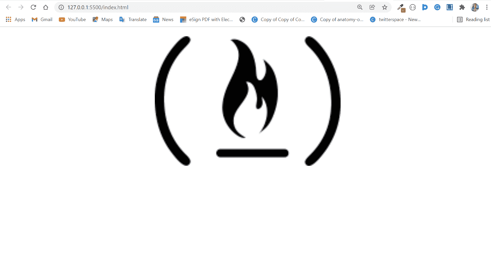
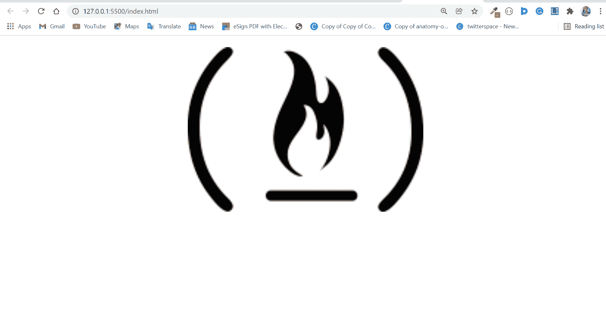

# HTML 中心图像–CSS 对齐 Img 中心示例

> 原文：<https://www.freecodecamp.org/news/html-center-image-css-align-img-center-example/>

如果你用 HTML 和 CSS 制作网站，你将会大量使用图像。

开发人员经常为 CSS 中的图像对齐而烦恼，尤其是当试图找出如何将图像居中时。

在 CSS 中居中不是一件简单的事情——尤其是对初学者来说。这就是人们吹嘘能够将 div 居中的原因。:)

由于`img`元素是一个内嵌元素，这使得居中变得有点困难。不过不用担心，可以把图像转换成块元素，然后居中。

在这篇文章中，我将向你展示 4 种不同的方法，你可以将一幅图像居中对齐。

## 目录

*   [如何使用文本对齐属性将图像居中](#howtocenteranimagewiththetextalignproperty)
*   [如何使用 Flexbox 将图像居中](#howtocenteranimagewithflexbox)
*   [如何用 CSS 网格将图像居中](#howtocenteranimagewithcssgrid)
*   [如何使用边距属性将图像居中](#howtocenteranimagewiththemarginproperty)

## 如何使用文本对齐属性将图像居中

您可以使用`text-align`属性将图像居中。

您应该知道的一件事是，引入图像的标签–`img`–是一个内联元素。使用`text-align`属性居中仅对块级元素有效。

那么，如何使用 text-align 属性使图像居中呢？您将图像包装在类似于`div`的块级元素中，并赋予`div`一个`center`的`text-align`。

```
<div>
    
</div> 
```

```
div {
      text-align: center;
    } 
```



## 如何使用 Flexbox 使图像居中

CSS Flexbox 的引入使得任何事情都更容易居中。

Flexbox 的工作原理是把你想要的放在一个容器中，并给容器一个`flex`的`display`。然后，它将`justify-content`设置为`center`，如下面的代码片段所示:

```
 div {
      display: flex;
      justify-content: center;
    } 
```


**附注:**设置为`center`的`justify-content`属性会使图像水平居中。要使图像垂直居中，你需要将`align-items` 设置为`center`。

## 如何使用 CSS 网格将图像居中

CSS 网格的工作方式类似于 Flexbox，与 Flexbox 的二维网格不同，它的额外优势是网格是多维的。

要用 CSS 网格将图像居中，将图像包装在容器 div 元素中，并给它一个显示`grid`。然后将`place-items`属性设置为居中。

```
 div {
      display: grid;
      place-items: center;
    } 
```


**P.S.:** `place-items`值为`center`时，任何内容水平和垂直居中。

## 如何使用 Margin 属性将图像居中

您也可以通过将图像的左右边距设定为“自动”来居中图像。但是就像`text-align`属性一样，`margin`只适用于块级元素。

因此，您需要做的是首先通过显示 block 将图像转换为块级元素。

```
img {
      display: block;
      margin: 0 auto;
    } 
```

这两个属性就足够了。但是有时候，你必须为图片设置一个宽度，这样 auto 的左边和右边就有空间了。

```
 img {
      display: block;
      margin: 0 auto;
      width: 40%;
    } 
```



附注:你可能不需要把宽度降低到 40%。图像被扭曲了 60%以上，这就是为什么我去低至 40%。

我希望这篇文章能帮助你选择最适合你的图像居中方法。

感谢您的阅读。