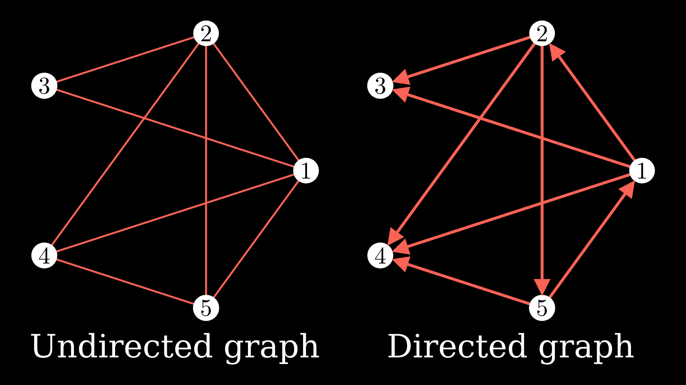
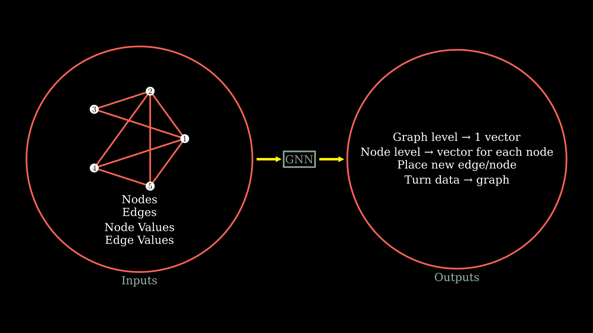
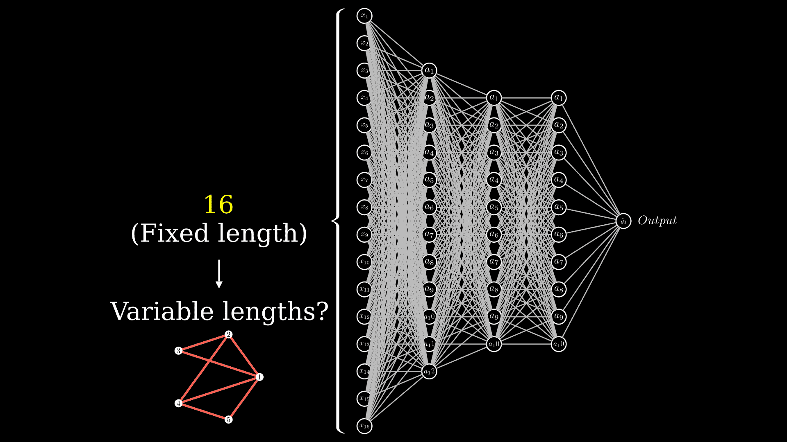
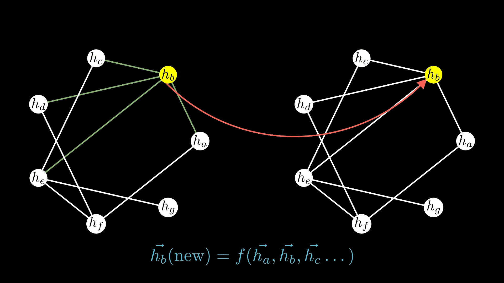
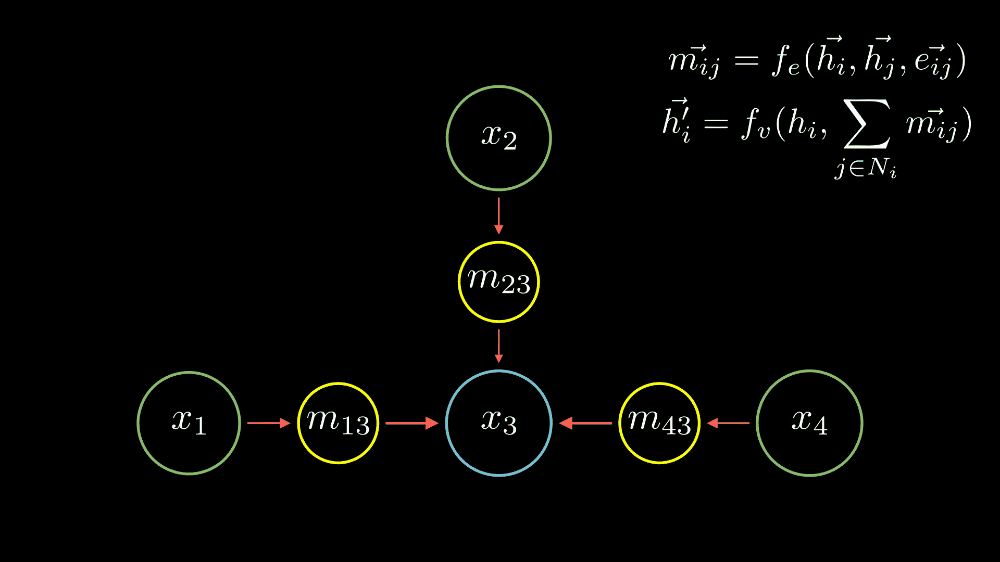
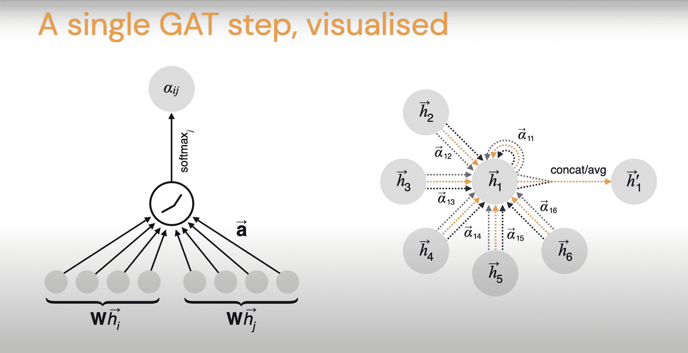

# 什么是图形神经网络？GNNs 如何工作，用例子解释

> 原文：<https://www.freecodecamp.org/news/graph-neural-networks-explained-with-examples/>

图形神经网络越来越受欢迎，并被广泛应用于各种项目中。

在本文中，我将帮助您开始并理解图形神经网络是如何工作的，同时尝试解决每个阶段的问题“为什么”。

最后，我们还将看看如何用代码实现我们在本文中讨论的一些方法。

不要担心——你不需要了解太多的数学知识就能理解这些概念并学会如何应用它们。

## 什么是图？

简单地说，图是节点和节点之间的边的集合。在下图中，白色圆圈代表节点，它们通过红色线条连接在一起。

您可以继续向图中添加节点和边。你也可以在边上添加方向，这将使它成为一个有向图。



A simple representation of a graph

很方便的是邻接矩阵，它是一种表示图形的方式。矩阵\(A_{ij}\)的值定义为:

\[A _ { ij } = \ left \ { \ begin { array } { c l } 1 & \ quad \ textrm {如果存在边} j \ right arrow I \ \ 0 & \ quad \ textrm {如果不存在边} \end{array} \right。\]

表示邻接矩阵的另一种方式是简单地翻转方向，因此在同一个等式中，如果有边\(i \rightarrow j\)，则\(A_{ij}\)将为 1。

后面的表象其实就是我在学校学的东西。但通常在机器学习论文中，你会发现使用的第一个符号——因此对于本文，我们将坚持第一个表示。

从邻接矩阵中你可能会注意到许多有趣的事情。首先，你可能会注意到，如果这个图是无向的，你最终会得到一个对称矩阵和更多有趣的性质，特别是这个矩阵的特征值。

在上下文中有帮助的一种解释是取矩阵的幂，\((A^n)_{ij}\给出了节点(I)和(j)之间长度为(n)的(有向或无向)步数。

## 为什么要处理图表中的数据？

井图被用于各种常见的场景，它们有许多可能的应用。

用图表表示数据的最常见的应用可能是用分子图来表示化学结构。这些有助于预测键长、电荷和新分子。

通过分子图，你可以使用机器学习来预测一个分子是否是一种有效的药物。

例如，您可以训练一个图形神经网络来预测一个分子是否会抑制某些细菌，并对您知道结果的各种化合物进行训练。

然后你可以将你的模型应用到任何分子上，最终发现一个以前被忽视的分子实际上是一种很好的抗生素。这就是 Stokes 等人在他们的论文(2020)中如何预测一种叫做 Halicin 的新抗生素。

DeepMind 的另一篇有趣的论文([谷歌地图中用图形神经网络进行 ETA 预测](https://arxiv.org/abs/2108.11482)，2021)将交通地图建模为图形，并运行图形神经网络，以将谷歌地图中 ETA 的准确性提高高达 50%。

在本文中，他们将旅行路线划分为超级段，这些超级段对路线的一部分进行建模。这给了他们一个图形结构来运行图形神经网络。

还有其他有趣的论文将自然发生的数据表示为图形(社交网络、电路、费曼图等)，这些论文也有重大发现。

如果你仔细想想，标准的神经网络也可以用图形来表示🤯。

## 我们能用图形神经网络做什么？

让我们首先从我们可能想要用我们的图形神经网络做什么开始，然后理解我们将如何做。

我们可能希望从我们的图形神经网络得到的一种输出是在整个图形级别上，有一个单一的输出向量。你可以把这种输出和 ETA 预测联系起来，或者从我们讨论的例子中，从分子结构预测结合能。

您可能想要的另一种输出是节点或边级别的预测，并以每个节点或边的向量结束。你可以用一个例子来说明这一点，在这个例子中，你需要对预测中的每个节点进行排序，或者根据给定的分子结构来预测所有键的键角。

您可能还对回答“我应该在哪里放置新的边或节点”或预测边或节点可能出现的位置感兴趣。我们不仅可以从图表中得到预测，还可以将其他数据转化为图表。



Defining what we want our GNN to do

您可能已经猜到了图形神经网络，我们首先希望生成一个输出图或潜在值，然后我们就可以根据它来处理各种各样的标准任务。

因此，本质上，我们需要从潜在图(每个节点的特征表示为\(\vec{h_i}\))中为图级预测做的*是:*

*   首先找出一些方法来聚集所有的向量(比如简单地求和)，然后
*   然后创建一些函数来获得预测:

\[\ vec { Z _ G } = f(\ sum _ I \ vec { h _ I })\]

现在，很容易在高层次上显示我们需要从 latents 做什么来获得我们的输出。

对于节点级输出，我们只需将一个节点向量传递给我们的函数，并获得该节点的预测值:

\[\vec{Z_i} = f(\vec{h_i})\]

## 可变大小输入的问题

现在我们知道了我们可以用图形神经网络做什么，以及为什么您可能希望用图形来表示您的数据，让我们看看我们将如何对图形数据进行训练。

但是首先，我们有一个问题:图形本质上是可变大小的输入。在标准的神经网络中，如下图所示，输入层(图中显示为\(x_i\))具有固定数量的神经元。在这个网络中，你不能突然将网络应用于可变大小的输入。



Why the standard neural network won't work?

但是，如果您还记得，您可以将卷积神经网络应用于可变大小的输入。

让我们用一个例子来说明这一点:您有一个与过滤器计数\(K=5\)、空间范围\(F=2\)、步幅\(S=4\)的卷积，并且没有零填充\(P=0\)。您可以传入\((256 \乘以 256 \乘以 3)\)输入并获取\((64 \乘以 64 \乘以 5)\)输出(\(\ left \ l floor { \ frac { 256-2+0 } { 4 }+1 } \ right \ r floor \))，也可以传入\((96 \乘以 96 \乘以 6)\)输入并获取\((24 \乘以 24 \乘以 5)\)输出，依此类推-它本质上与大小无关。

这确实让我们想知道是否可以从卷积神经网络中获得一些启发。

另一个真正有趣的解决可变输入大小问题的方法是从物理学中获得灵感，来自 DeeepMind (2020)的论文[学习用图形网络](https://arxiv.org/abs/2002.09405)模拟复杂物理。

让我们从一些粒子\(i\)开始，这些粒子中的每一个都有一定的位置\(\vec{r_i}\)和速度\(\vec{v_i}\)。假设这些粒子之间有弹簧来帮助我们理解任何相互作用。

当然，这个系统是一个图表:你可以把粒子看作节点，把弹簧看作边。如果你现在回忆起简单的高中物理，\(力=质量\cdot 加速度\)–那么，在这个系统中，还有什么方法来表示作用在粒子上的合力？它是作用在所有相邻粒子上的力的总和。

现在可以写(\(e_{ij}\)表示 I 和 j 之间的边或弹簧的性质):

\ { m \ frac } \ vec { v _ I } } { \ mathrm { d } t } = \ sum _ { j \ in \ text ram {邻居} \vec{F}(\vec{r_i}、\vec{r_j}、\ e _ { ij })\]

我想让你们注意的是，这个力定律总是不变的。也许弹簧或边缘的性质有所不同，但你仍然可以应用相同的定律。你可以有不同数量的节点和边，你仍然可以应用完全相同的运动方程。



Visualizing the presented solutions to variable sized inputs

如果你仔细观察，我们讨论的解决固定输入问题的直觉与它们有一个相似之处:很明显，第二种方法考虑了相邻的节点和边，并创建了它的一些函数(这里是力)。我想指出的是，卷积神经网络的工作方式没有太大的不同。

## 如何从图表中的数据中学习

既然我们已经讨论了创建图形神经网络的灵感来源，现在让我们尝试实际构建一个。在这里，我们将看到如何从图表中的数据中学习。

我们将从讨论“**神经信息传递**开始，这类似于我们在前面部分讨论的卷积神经网络或力中的过滤器的*。*

*假设我们有一个有 3 个节点的图(有向或无向)。你可能已经猜到了，我们对每个节点\(x_1\)、\(x_2\)和\(x_3\)都有一个对应的值。*

*就像任何神经网络一样，我们的目标是找到一种算法来更新这些节点值，这类似于图形神经网络中的一层。然后你当然可以继续添加这样的层。*

*那么如何进行这些更新呢？一个想法是使用我们图表中的边。出于本文的目的，让我们假设从这 3 个节点我们有一条指向\(x _ 3 \右箭头 x_1\)的边。我们可以沿着这条边发送一条消息，它将携带一个值，该值将由某个神经网络计算。*

*在这种情况下，我们可以这样写下来(我们也将分解这意味着什么):*

*\[\vec{m_{31}}=f_e(\vec{h_3}, \vec{h_1}, \vec{e_{31}})\]*

*我们将使用相同的符号:*

*   *\(m_31\)是从节点 3 传递到节点 1 的消息，*
*   *\(\vec{h_3}\)是节点 3 具有的值，*
*   *\(\vec{e_{31}}\)是节点 3 和节点 1 之间的边的值，并且*
*   *\(f_e\)表示依赖于所有这些值的“某个神经网络”函数，通常称为消息函数。*

*假设我们也有来自\(x _ 2 \右箭头 x_1\)的边。我们可以应用上面创建的相同表达式，只是替换节点编号。*

*如果您有更多的节点，您可能希望对指向节点 1 的每条边都这样做。而积累这一切最简单的方法就是简单的总结。仔细观察，你会发现这与我们之前讨论的粒子直觉非常相似！*

*现在，您有了到达节点 2 的消息的聚合值，但是您仍然需要更新它的权重。所以我们将使用另一个神经网络\(f_v\)通常称为更新网络。这取决于两个因素:当然是节点 3 的原始值，以及我们得到的消息的总和。*

*简单地把这些放在一起，不仅仅是对于我们例子中的节点 3，而是对于任何图中的任何节点，我们可以把它写为:*

*\[ \vec{h_i^{\prime}} = f_v(h_i，\sum_{j \in N_i} \vec{m_{ij}}) \]*

*\(\vec{h_i^{\prime}}\)是我们的更新节点值，而\(\vec{m_{ij}}\)是到达我们先前计算的节点\(i\)的消息。*

*然后，您将对构成图的每个节点应用这两个相同的神经网络\(f_e\)和\(f_v\)。*

*这里需要注意的非常重要的一点是，我们必须更新节点值的两个神经网络像标准神经网络一样对固定大小的输入进行操作。通常我们所说的两个神经网络\(f_e\)和\(f_v\)都是小 MLP。*

*

Visualizing Message Passing Neural Networks* 

*前面我们谈到了我们感兴趣的从图形神经网络获得的不同类型的输出。您可能已经注意到，当按照我们讨论的方式训练我们的模型时，我们将能够生成节点级别的预测:每个节点的向量。*

*为了执行图分类，我们希望在训练我们的网络之后尝试并聚集所有的节点值。我们将使用一个读出或池层(很清楚这个名字是怎么来的)。*

*通常，我们可以根据节点值集创建一个函数\(f_r\)。但是它也应该是独立于排列的(在您选择标记节点时应该没有关系)，它应该看起来像这样:*

*\[y^{\prime} = f _ r({ x _ I \ vert I \ in \ textrm { graph } })\]*

*定义读出函数的最简单方法是对所有节点值求和。然后找到最适合这种情况的平均值、最大值或最小值，或者甚至是这些或其他置换不变属性的组合。Your \(f_r\)，你可能已经猜到了，也可以是实践中经常用到的神经网络。*

*我们刚刚谈到的想法和直觉创造了消息传递神经网络(MPNNs)，这是最强有力的图形神经网络之一，首次在[量子化学的神经消息传递](http://proceedings.mlr.press/v70/gilmer17a.html)中提出(Gilmer et al. 2017)。*

### *如何更改边缘值*

*现在看来，我们确实已经创建了一个通用的图形神经网络。但是你可以看到我们的消息网络需要\(e_{ij}\)，edge 属性——就像你在开始时随机初始化节点值一样。*

*但是，虽然节点值在每一步都会发生变化，但是边值也是由您初始化的——但是它们不会发生变化。因此，我们也需要尝试推广这一点，对我们刚刚看到的内容进行扩展。*

*理解了节点更新是如何工作的，我想你也可以很容易地将类似的东西应用到边更新函数中。*

*\(U_{edge}\)是另一种标准的神经网络:*

*\[e_{ij}^{\prime} = u _ { edge }(e _ { ij }，x_i，x_j)\]*

*你还可以用这个框架做的事情是\(U_{edge}\)的输出已经是边缘级别的属性了——那么为什么不直接用它们作为我的消息呢？你也可以这么做。*

### *消息传递神经网络探讨*

*消息传递神经网络(MPNN)是最常见的图形神经网络层。但是这确实需要存储和操作边缘消息以及节点特征。*

*这在内存和表示方面会有点麻烦。因此，有时这些方法会遇到可伸缩性问题，实际上适用于小图。*

*正如 Petar Velič ković所说，“MPNNs 是图域的 MLP”。我们将关注 MPNN 的一些扩展，以及如何在代码中实现 MPNN。*

*你可以很容易地在 PyTorch 或 TensorFlow 中应用我们所讨论的内容——但是试着这样做，你会发现这只会破坏记忆。*

*通常我们对标准神经网络所做的是对批量数据进行处理。因此，你通常会向神经网络传递一个形状为[批量大小，输入神经元数量]的输入数组，以使其有效工作。*

*现在，我们这里的输入神经元的数量与之前强调的不同，是的，卷积神经网络确实可以处理任意大小的图像。但是当你考虑批次时，你需要所有的图像都是相同的尺寸。*

*你可以做很多事情:*

*   *一次操作一个图表(当然效率非常低)*
*   *您还可以将您的图形聚合到一个大图形中，并且不允许消息从一个较小的图形传递到另一个较小的图形。这将在进行图形级预测时引入复杂性，并且您将不得不调整您的读出功能。*
*   *你也可以使用不等长张量:一个很棒的教程可以在这里找到。*
*   *再次从 CNN 获得灵感:你可以使用填充，这样你的批处理就有了不同大小的图表。所以你只要拿一个有 7 个节点的图，把剩下的 3 个节点设为 0。这与有 8 个节点的图类似，将剩余的 2 个节点设置为 0。*

## *其他受欢迎的 GNN 建筑*

*在这一节中，我将向您概述一些其他广泛使用的图形神经网络层。*

*我们不会关注这些层背后的直觉，也不会关注更新函数中每个部分是如何组合在一起的。相反，我会给你这些方法一个高层次的概述。你当然可以阅读原文来获得更好的理解。*

### *图形卷积网络*

*Kipf 等人的[图卷积网络](https://arxiv.org/abs/1609.02907) (GCN)是最流行的 GNN 架构之一，它本质上是一种频谱方法。*

*光谱方法处理[光谱域](https://arxiv.org/abs/1312.6203)中的图形表示。这里的谱意味着我们将利用拉普拉斯特征向量。*

*GCNs 是基于 ChebNets 之上的，cheb nets 提出任何向量的特征表示应该只受其 k 跳邻域的影响。我们可以用切比雪夫多项式来计算卷积。*

*在 GCN 中，这被简化为\(K=1\)。我们将从定义度矩阵(邻接矩阵的逐行求和)开始:*

*\[\波状符号} _ { ij } = \ sum _ j \波状符号} _ { ij }]*

*使用对称归一化后的图形卷积网络更新规则可以写成其中 H 是特征矩阵，W 是可训练权重矩阵:*

*硬件)\ \]*

*对于节点，您可以这样写，其中\(N_i\)和\(N_j\)是节点邻域的大小:*

*\[\vec{h_i^{\prime}} = \西格玛(\ sum _ { I \ in n _ j } \ frac { 1 } { | n _ I | | n _ j | } } w \vec{h_j^{\prime}})\]*

*当然，有了 GCN，你就不再有边的特征，节点可以跨图发送一个值，这是我们之前讨论过的 MPNN 的想法。*

### *图形注意网络*

*还记得我们刚刚看到的 GCN 的节点更新规则吗？\(\frac{1}{\sqrt{|N_i||N_j|}}\)是从图的度矩阵导出的。*

*在 Velič ković等人的[图注意网络](https://arxiv.org/abs/1710.10903) (GAT)中，这个系数\(\alpha_{ij}\)是隐式计算的。因此，对于一个特定的边，您可以获取发送方节点、接收方节点以及边的特征，并通过一个关注函数传递它们。*

*\[a_{ij}=a(\vec{h_i}，\vec{h_j}，\vec{e_{ij}})\]*

*\(a\)可以是任何可学习的、共享的、自我关注的机制，如变形金刚。然后，这些可以通过邻域内的 softmax 函数进行归一化:*

*(法语)我是说，我是说，我是说，我是说，我是说，我是说，我是说，我的意思是，我的意思是，我的意思是，我的意思是，我的意思是，我的意思是，我的意思是，我的意思是，我的意思是，我的意思是，我的意思是，我的意思是，我的意思是，我的意思是...*

*这构成了 GAT 更新规则。作者假设这可以通过多头自我关注得到显著的稳定。这篇论文的作者展示了 GAT 的一个步骤。*

*

A single GAT step* 

*这种方法也是非常可扩展的，因为它必须为从节点 I 到节点 j 的影响计算一个*标量*，并且像在 MPNN 中一样记录一个向量。但是这可能不像 MPNNs 那样普遍。*

## *图形神经网络的代码实现*

*有了 PyTorch Geometric、TF-GNN、Spektral(基于 TensorFlow)等多种框架，实现图形神经网络确实相当简单。我们将从 MPNNs 开始看几个例子。*

*以下是如何使用 PyTorch Geometric 创建一个类似于原始论文“量子化学的神经信息传递”中的信息传递神经网络:*

```
*`import torch.nn as nn
import torch.nn.functional as F
import torch_geometric.transforms as T
from torch_geometric.utils import normalized_cut
from torch_geometric.nn import NNConv, global_mean_pool, graclus, max_pool, max_pool_x

def normalized_cut_2d(edge_index, pos):
    row, col = edge_index
    edge_attr = torch.norm(pos[row] - pos[col], p=2, dim=1)
    return normalized_cut(edge_index, edge_attr, num_nodes=pos.size(0))

class Net(nn.Module):
    def __init__(self):
        super().__init__()
        nn1 = nn.Sequential(
            nn.Linear(2, 25), nn.ReLU(), nn.Linear(25, d.num_features * 32)
        )
        self.conv1 = NNConv(d.num_features, 32, nn1, aggr="mean")

        nn2 = nn.Sequential(nn.Linear(2, 25), nn.ReLU(), nn.Linear(25, 32 * 64))
        self.conv2 = NNConv(32, 64, nn2, aggr="mean")

        self.fc1 = torch.nn.Linear(64, 128)
        self.fc2 = torch.nn.Linear(128, d.num_classes)

    def forward(self, data):
        data.x = F.elu(self.conv1(data.x, data.edge_index, data.edge_attr))
        weight = normalized_cut_2d(data.edge_index, data.pos)
        cluster = graclus(data.edge_index, weight, data.x.size(0))
        data.edge_attr = None
        data = max_pool(cluster, data, transform=transform)

        data.x = F.elu(self.conv2(data.x, data.edge_index, data.edge_attr))
        weight = normalized_cut_2d(data.edge_index, data.pos)
        cluster = graclus(data.edge_index, weight, data.x.size(0))
        x, batch = max_pool_x(cluster, data.x, data.batch)

        x = global_mean_pool(x, batch)
        x = F.elu(self.fc1(x))
        x = F.dropout(x, training=self.training)
        return F.log_softmax(self.fc2(x), dim=1)`*
```

*你可以在这里找到一个完整的演示实现[的 Colab 笔记本，确实挺重的。在 TensorFlow 中实现这一点也很简单，你可以在这里找到关于](https://colab.research.google.com/drive/11gtwzl_E4TWqEswwv5mZh4ZWHRz0b3PA?usp=sharing) [Keras 示例的完整教程](https://keras.io/examples/graph/mpnn-molecular-graphs)。*

*使用 PyTorch Geometric 实现 GCN 也非常简单。您也可以使用 TensorFlow 轻松实现它，您可以在这里找到完整的 Colab 笔记本[。](https://colab.research.google.com/drive/1Dgs2rpYleGGTYg0ciCX792zGpfQrtp4p?usp=sharing)*

```
*`class Net(torch.nn.Module):
    def __init__(self):
        super().__init__()
        self.conv1 = GCNConv(dataset.num_features, 16, cached=True,
                             normalize=not args.use_gdc)
        self.conv2 = GCNConv(16, dataset.num_classes, cached=True,
                             normalize=not args.use_gdc)

    def forward(self):
        x, edge_index, edge_weight = data.x, data.edge_index, data.edge_attr
        x = F.relu(self.conv1(x, edge_index, edge_weight))
        x = F.dropout(x, training=self.training)
        x = self.conv2(x, edge_index, edge_weight)
        return F.log_softmax(x, dim=1)`*
```

*现在让我们试着实现一个 GAT。你可以在这里找到完整的 Colab 笔记本。*

```
*`class Net(torch.nn.Module):
    def __init__(self, in_channels, out_channels):
        super().__init__()

        self.conv1 = GATConv(in_channels, 8, heads=8, dropout=0.6)
        # On the Pubmed dataset, use heads=8 in conv2.
        self.conv2 = GATConv(8 * 8, out_channels, heads=1, concat=False,
                             dropout=0.6)

    def forward(self, x, edge_index):
        x = F.dropout(x, p=0.6, training=self.training)
        x = F.elu(self.conv1(x, edge_index))
        x = F.dropout(x, p=0.6, training=self.training)
        x = self.conv2(x, edge_index)
        return F.log_softmax(x, dim=-1)`*
```

## *结论*

*谢谢你坚持到最后。我希望你已经对图形神经网络有所了解，并且喜欢阅读这些图形神经网络的直觉是如何形成的。*

*如果你学到了新的东西或者喜欢阅读这篇文章，请分享给其他人看。在那之前，下期帖子再见！*

*最后，对于有兴趣的读者来说，除了其他人之外，我还想鼓励你读一下 GNN 首次提出的原始论文“图形神经网络模型”，因为它真的很有趣。论文的开放存取档案可以在这里找到。本文还从[图神经网络理论基础](https://www.youtube.com/watch?v=uF53xsT7mjc)和 [CS224W](http://web.stanford.edu/class/cs224w/index.html) 中得到启发，建议你去看看。*

*你也可以在 Twitter [@rishit_dagli](https://twitter.com/rishit_dagli) 上找到我，我在那里发关于机器学习和一点 Android 的微博。*