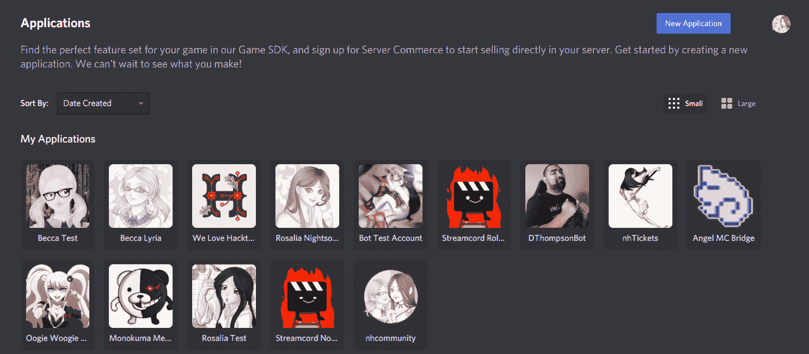
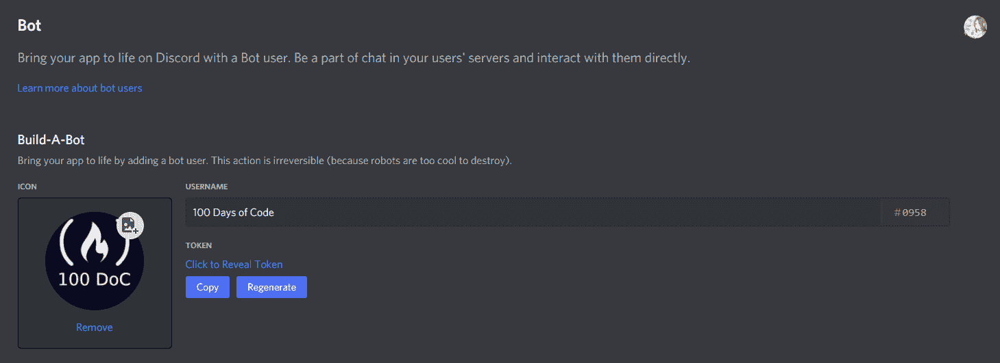
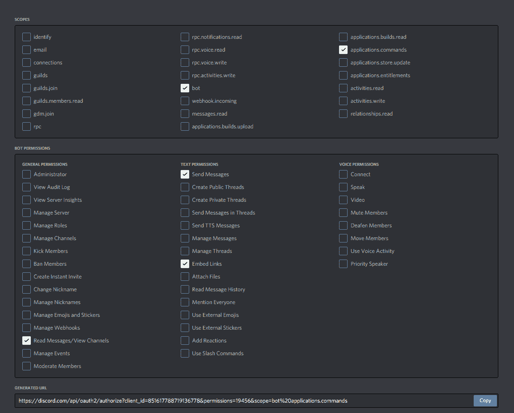
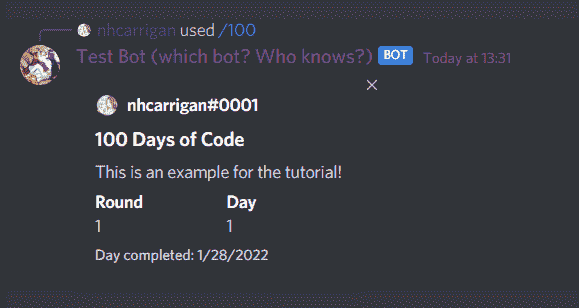
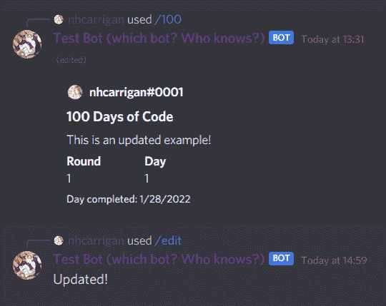
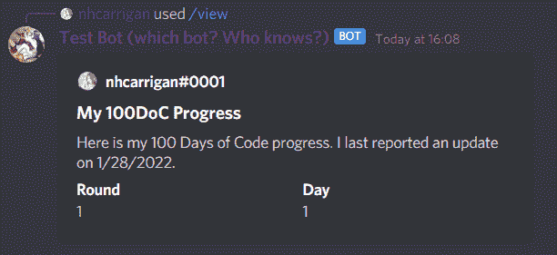
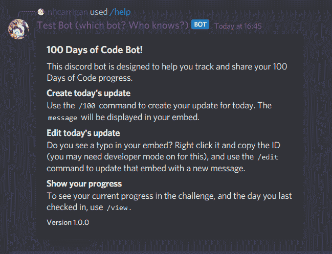

# 用 TypeScript、MongoDB 和 Discord.js 13 构建一个 100 天的代码不和谐机器人

> 原文：<https://www.freecodecamp.org/news/build-a-100-days-of-code-discord-bot-with-typescript-mongodb-and-discord-js-13/>

代码挑战 100 天在寻求提升技能的新程序员和开发人员中非常受欢迎。它如此受欢迎，以至于我们的[不和谐服务器](https://www.freecodecamp.org/news/freecodecamp-discord-chat-room-server/)有一个完整的频道专门用于它。

根据大众的要求，我们建造了一个不和谐机器人，帮助人们跟踪他们在挑战中的进展。

今天我将向你展示如何建立你自己的 100 天代码机器人。

> 注意，discord.js 已经发布了 14 版，其中包含了突破性的变化。为了与本教程兼容，你需要确保你使用的是 discord . js13——你可以用`npm install discord.js@13`安装它。如果你有任何问题，欢迎加入我的[不和谐服务器](https://chat.nhcarrigan.com)。

<details><summary>Contents</summary>

*   [创建一个不和谐机器人应用](#create-a-discord-bot-application)
*   [设置您的项目](#set-up-your-project)
*   [创建不和机器人](#create-the-discord-bot)
*   [网关事件不和谐](#gateway-events-in-discord)
*   [连接数据库](#connect-to-the-database)
*   [环境变量验证](#environment-variable-validation)
*   [“互动”事件](#the-interaction-event)
*   [准备命令](#prepare-for-commands)
*   [数据库模型](#database-model)
*   [编写机器人命令](#write-bot-commands)</details> 

## 创建一个不和谐机器人应用程序

您的第一步是设置一个 Discord bot 应用程序。前往 [Discord 开发者门户](https://discord.dev)，如果需要，登录，并从侧边栏中选择“应用”。



Screenshot of the Developer Portal. If this is your first bot, you will not have any applications here.

单击“新建应用程序”按钮。给它一个名字，并将其设置为“个人”应用程序。您现在将被带到应用程序的设置。在这里你可以改变名字，或者给它一个头像。

从边栏中选择“机器人”，然后单击“添加机器人”按钮。这将为您的应用程序创建一个不和谐的 Bot 帐户。



Screenshot of the Bot settings page. If you did not set an avatar, you will see a default based on your bot's name.

这是您将获得机器人令牌的屏幕。保持这个令牌的秘密是非常重要的，因为令牌允许你的代码连接到你的机器人。请妥善保管，不要与任何人分享。

现在，您需要将机器人添加到服务器，以便与之交互。点按边栏上的“OAuth2”选项，然后选择“URL 生成器”。

在“示波器”下，选择`bot`和`application.commands`。`bot`作用域允许您的 bot 帐户加入服务器，`application.commands`作用域允许您更新斜杠命令(稍后将详细介绍)。

当您选择`bot`时，将出现一个新的“机器人权限”部分。选择下列权限:

*   发送消息
*   嵌入链接
*   阅读信息/查看频道



Screenshot of the OAuth screen with the required settings.

复制生成的 URL，并将其粘贴到浏览器中。这将带你通过 Discord 的过程来添加你的新机器人到服务器。

请注意，您必须在要添加 bot 的服务器中拥有“管理服务器”权限。如果您没有此权限，可以创建一个服务器来测试您的 bot。

现在您已经准备好编写一些代码了！

## 设置您的项目

您首先需要为您的项目设置基础设施和工具。

确保你已经安装了 Node.js **版本 16** 和`npm`。请注意，您将使用的包不支持 Node 的早期版本。

### 准备`package.json`

为您的项目创建一个目录或文件夹。打开指向新文件夹的终端。运行命令`npm init`来设置您的`package.json`文件。对于本教程，默认值已经足够了，但是您可以随意编辑它们。

您应该以类似于下面的`package.json`结束:

```
{
  "name": "100doc-tutorial",
  "version": "1.0.0",
  "description": "",
  "main": "index.js",
  "scripts": {
    "test": "echo \"Error: no test specified\" && exit 1"
  },
  "author": "",
  "license": "ISC"
} 
```

现在，您需要做一些更改，为 TypeScript 实现做好准备。

首先，用`./prod/index.js`替换`index.js`的`main`值——您将设置您的类型脚本编译到一个`prod`目录。

然后删除`test`脚本并添加以下两个脚本:

```
"build": "tsc",
"start": "node -r dotenv/config ./prod/index.js"
```

`build`脚本将把你的类型脚本编译成 JavaScript，这样 Node 就可以运行它，而`start`脚本将运行`index.js`入口点文件。

在这里添加`-r dotenv/config`将动态导入并运行`dotenv`包中的`config`方法，它从`.env`文件中加载您的环境变量。

说到包，下一步是安装依赖项。使用`npm install`，安装这些依赖项:

*   这是将处理网关连接和管理 Discord API 调用的库。
*   `@discordjs/builders`–用于构建应用命令的 discord.js 包
*   `@discordjs/rest`–用于与 Discord REST API 交互的自定义 API 客户端。
*   `discord-api-types`–Discord REST API 的类型定义和处理程序。
*   `dotenv`–将`.env`值加载到节点流程中的包。
*   `mongoose`–MongoDB 连接的包装器，提供结构化数据的工具。

最后，用`npm install --save-dev`安装开发依赖项。开发依赖项是在开发环境中处理项目所需的包，但不是在生产环境中运行代码库所需的包。

*   `typescript`–这是 TypeScript 语言的包，包含了用 TypeScript 编写代码并将其编译成 JavaScript 所需的一切。
*   `@types/node`–TypeScript 依靠类型定义来理解您编写的代码。这个包定义了 Node.js 运行时环境的类型，比如`process.env`对象。

安装了这些包之后，您现在应该有一个类似于下面的`package.json`:

```
{
  "name": "100doc-tutorial",
  "version": "1.0.0",
  "description": "",
  "main": "./prod/index.js",
  "scripts": {
    "build": "tsc",
    "start": "node -r dotenv/config ./prod/index.js"
  },
  "author": "",
  "license": "ISC",
  "dependencies": {
    "@discordjs/builders": "^0.11.0",
    "@discordjs/rest": "^0.2.0-canary.0",
    "discord.js": "^13.6.0",
    "dotenv": "^14.2.0",
    "mongoose": "^6.1.7"
  },
  "devDependencies": {
    "@types/node": "^17.0.10",
    "typescript": "^4.5.4"
  }
} 
```

### 准备打字稿

TypeScript 的编译器提供了许多不同的设置，以最大限度地控制生成的 JavaScript。

您通常可以通过项目根目录下的一个`tsconfig.json`文件来修改编译器设置。您可以使用`npx tsc --init`为这个文件生成默认的样板文件，如果您在另一个项目中设置了一个样板文件，可以使用现有的样板文件，甚至可以从头开始编写一个样板文件。

因为编译器设置会显著改变 TypeScript 的行为，所以在遵循本教程时最好使用相同的设置。以下是您应该使用的设置:

```
{
  "compilerOptions": {
    "target": "ES6",
    "module": "CommonJS",
    "rootDir": "./src",
    "outDir": "./prod",
    "strict": true,
    "esModuleInterop": true,
    "skipLibCheck": true,
    "forceConsistentCasingInFileNames": true,
    "resolveJsonModule": true
  }
}
```

这里最重要的设置是`rootDir`和`outDir`设置。这些告诉编译器你所有的代码都将在`src`目录中，结果 JavaScript 应该在`prod`目录中。

如果您想测试您的设置，请创建一个`src`目录并在其中放置一个`index.ts`文件。编写一些代码(比如一个`console.log`语句)并在您的终端中运行`npm run build`。您应该看到一个`prod`目录被创建，一个`index.js`包含您编译的代码。

### 附加设置说明

如果您使用`git`作为版本控制，您希望避免将秘密和不必要的代码推送到您的存储库中。在您的根项目目录下创建一个`.gitignore`文件，并添加以下内容:

```
/node_modules/
/prod/
.env
```

`.gitignore`文件告诉`git`不要跟踪与您输入的模式相匹配的文件/文件夹。忽略`node_modules`文件夹可以防止你的库变得臃肿。

推送已编译的 JavaScript 也是不必要的，因为您的项目通常在运行时之前在生产中编译。文件包含秘密值，比如 API 密钥和令牌，所以它们不应该被提交给存储库。

## 创造不和谐机器人

下一步是准备初始的 bot 连接。如果您之前没有这样做，请在其中创建一个`src`目录和一个`index.ts`文件。

从一个匿名的立即调用函数表达式(IIFE)开始，以允许顶级`await`使用:

```
(async () => {

})();
```

在这个函数中，你将实例化你的不和谐机器人。在文件的顶部，用`import { Client } from "discord.js";`导入`Client`类。`Client`类代表你的不和谐机器人的会话。

在您的函数内部，构建一个新的`Client`实例，并用`const BOT = new Client();`将它赋给一个`BOT`变量。现在`BOT`变量将代表你的机器人。

要将您的 bot 连接到 Discord 网关并开始接收事件，您需要在您的 bot 实例上使用`.login()`方法。`.login()`方法接受一个参数，这是您之前创建的 bot 应用程序的令牌。

`discord.js`中的许多方法都是异步的，所以这里需要使用`await`。给你的生活添加一行`await BOT.login(process.env.BOT_TOKEN);`。

您的`index.ts`文件现在应该是这样的:

```
import { Client } from "discord.js";

(async () => {
  const BOT = new Client();

  await BOT.login(process.env.BOT_TOKEN);
})();
```

如果你尝试运行`npm run build`，你会看到一个错误:`An argument for 'options' was not provided.`

在 discord.js 13 中，当实例化 bot 时，需要指定网关意图。网关意图告诉 Discord 你的机器人应该接收什么事件。

在你的`src`文件夹中，创建一个`config`文件夹——然后在`config`中，创建一个`IntentOptions.ts`文件。

在新文件中，添加行`export const IntentOptions = ["GUILDS"]`。这将告诉 Discord 你的机器人应该收到公会事件。

然后，回到您的`index.ts`文件中，为您的`new Client()`调用添加一个参数:`new Client({intents: IntentOptions})`。您需要用`import { IntentOptions } from "./config/IntentOptions;`将它导入到文件的顶部。

看来你还是有一个错误:`Type 'string' is not assignable to type 'number | `${bigint}`| intentstring | Readonly<BitField<intentstring，number>>| RecursiveReadonlyArray<number |`${bigint}`| intentstring | Readonly<...>>’。`

TypeScript 将您的`IntentOptions`数组推断为一个字符串，但`Client`构造函数需要更具体的类型。

回到您的`config/IntentOptions.ts`文件，添加另一个导入:`import { IntentsString } from "discord.js"`。然后用新的类型定义更新您的变量:`export const IntentOptions: IntentsString[] = ["GUILDS"];`。

现在`npm run build`应该成功了。如果你已经把你的新机器人添加到一个不和谐的服务器，运行`npm start`将会显示你的机器人在那个服务器上线。然而，机器人还不会对任何事情做出反应，因为你还没有开始监听事件。

## 门户事件不和谐

网关“事件”是在 Discord 上发生动作时生成的，通常作为 JSON 有效负载发送给客户机(包括您的 bot)。您可以使用`.on()`方法来监听这些事件，允许您编写逻辑，让您的机器人在特定事件发生时遵循。

要监听的第一个事件是“就绪”事件。当你的机器人已经连接到网关并且*准备好*处理事件时，这个事件被触发。在您的`.login()`通话上方，添加`BOT.on("ready", () => console.log("Connected to Discord!"));`。

为了使您的更改生效，再次使用`npm run build`来编译新代码。现在如果你尝试`npm run start`，你应该会看到“连接到不和谐！”在你的终端上打印。

## 连接到数据库

您将使用`mongoose`包连接到 MongoDB 实例。如果您愿意，可以在本地运行 MongoDB，也可以使用 MongoDB Atlas 免费层来实现基于云的解决方案。

如果你没有 MongoDB Atlas 账户，freeCodeCamp 有一个关于设置账户的很棒的教程。

获取数据库的连接字符串，并将其作为`MONGO_URI=""`添加到`.env`文件中，连接字符串放在引号中。对于数据库名称，使用`oneHundredDays`。

创建一个名为`database`的目录来保存包含数据库逻辑的文件。在该目录中，创建一个名为`connectDatabase.ts`的文件。您将在这里编写启动数据库连接的逻辑。

从导出的函数声明开始:

```
export const connectDatabase = async () => {

}
```

Note that you need to use the `async` keyword here, as the database connection method is asynchronous.

`mongoose`提供了连接数据库的`connect`方法。在你的文件顶部输入`import { connect } from "mongoose";`。

然后用`await connect(process.env.MONGO_URI);`使用函数内部的方法。在那之后添加一个`console.log`语句，这样您就可以识别出您的 bot 已经连接到数据库。

您的`connectDatabase.ts`文件现在应该看起来像这样:

```
import { connect } from "mongoose";

export const connectDatabase = async () => {
    await connect(process.env.MONGO_URI);
    console.log("Database Connected!")
}
```

现在，在你的`index.ts`文件中，用`import { connectDatabase } from "./database/connectDatabase"`导入这个函数，并将`await connectDatabase()`添加到你的生活中，就在`.login()`方法之前。继续再跑一次`npm run build`。


A compiler error, indicating that: Argument of type string or undefined is not assignable to parameter of type string.

哦不——一个错误！

## 环境变量验证

环境变量的问题是它们都可以是`undefined`。如果你在环境变量名中打错了字，或者把这个名字和另一个名字搞混了(这是我写这篇教程时犯的一个错误，在某些地方用了`TOKEN`而不是`BOT_TOKEN`)，这种情况就会经常发生。

TypeScript 警告您,`connect`方法接受一个字符串，而`undefined`值会破坏东西。您可以解决这个问题，但是首先您需要编写一个函数来处理对环境变量的验证。

在您的`src`目录中，创建一个`utils`目录来包含您的实用函数。在那里添加一个`validateEnv.ts`文件。

在名为`validateEnv`的文件中创建一个函数。这个函数将是同步的，不需要`async`关键字。在该函数中，添加检查两个环境变量的条件。如果缺少任何一个，返回`false`。否则，返回`true`。

您的代码可能如下所示:

```
export const validateEnv = () => {
  if (!process.env.BOT_TOKEN) {
    console.warn("Missing Discord bot token.");
    return false;
  }

  if (!process.env.MONGO_URI) {
    console.warn("Missing MongoDB connection.");
    return false;
  }
  return true;
}; 
```

回到您的`index.ts`文件，用`import { validateEnv } from "./utils/validateEnv"`导入这个验证函数。然后在生命的开始，如果函数返回 false，使用 if 语句提前返回。你的`index.ts`应该是这样的:

```
import { Client } from "discord.js";
import { connectDatabase } from "./database/connectDatabase";
import { validateEnv } from "./utils/validateEnv";

(async () => {
  if (!validateEnv()) return;

  const BOT = new Client();

  BOT.on("ready", () => console.log("Connected to Discord!"));

  await connectDatabase();

  await BOT.login(process.env.BOT_TOKEN);
})(); 
```

如果您再次尝试`npm run build`，您将会看到与之前相同的错误信息。这是因为虽然我们知道环境变量存在，但 TypeScript 仍然无法推断出它。如果缺少环境变量，验证函数将退出进程，因此我们将告诉 TypeScript 它肯定是一个字符串。

回到您的`connectDatabase.ts`文件，在`connect`函数中使用`process.env.MONGO_URI as string`将类型强制转换为`string`。错误应该会消失，现在您可以运行`npm run build`和`npm start`。

您应该在终端中看到您为 Discord 和 MongoDB 连接编写的消息。

## “互动”事件

当你在你的机器人上取得巨大进步的时候，它仍然不能做任何事情。为了接收命令，您需要创建另一个事件侦听器。

Discord 推出了斜杠命令，具有新的 UI 和新的网关事件。当有人对你的机器人使用斜杠命令时，就会触发`interactionCreate`事件。这是你想听的事件。因为逻辑比`ready`事件稍微复杂一点，所以您需要创建一个单独的文件。

在您的`src`目录中，创建一个`events`目录，并在那里创建一个`onInteraction.ts`文件。首先定义一个导出的函数`onInteraction`。这应该是一个异步函数，只有一个名为`interaction`的参数。

```
export const onInteraction = async (interaction) => {

}; 
```

为了给你的参数提供一个类型定义，从`discord.js`导入`Interaction`类型。

```
import { Interaction } from "discord.js";

export const onInteraction = async (interaction: Interaction) => {

}; 
```

`interaction`事件实际上触发任何命令交互，包括按钮点击和选择菜单，以及我们想要的斜杠命令。

因为您将只为这个 bot 编写斜杠命令，所以您可以过滤掉任何其他交互类型，并帮助 TypeScript 理解您正在处理的数据。

在您的新函数中，添加一个条件来检查`interaction.isCommand()`。稍后您将在这个块中编写逻辑。

```
import { Interaction } from "discord.js";

export const onInteraction = async (interaction: Interaction) => {
  if (interaction.isCommand()) {
  }
}; 
```

现在，回到您的`index.ts`文件，您可以挂载另一个监听器。在您的`.on("ready")`监听器旁边，添加一个`BOT.on("interactionCreate")`监听器。对于这个事件，回调使用一个`interaction`参数，您可以将它传递给新的`onInteraction`函数。

```
 BOT.on(
    "interactionCreate",
    async (interaction) => await onInteraction(interaction)
  );
```

Remember that you will need to import your `onInteraction` function.

太好了！您可以运行`npm run build`来确认 TypeScript 没有抛出任何错误，但是没有实际的命令可以使用，您还不能完全测试这段代码。

## 准备命令

我维护了一些不和谐的机器人，我发现有助于保持代码可维护性和可读性的一件事是使组件模块化。

### 定义一个接口

您首先需要为您的命令定义一个公共结构。在`src`中创建一个`interfaces`文件夹。然后在`interfaces`里面创建一个名为`Command.ts`的文件。

现在，您将创建一个接口。在 TypeScript 中，接口通常用于定义对象的结构，并且是许多可用于声明变量类型的工具之一。

在您的`Command.ts`文件中，创建一个名为`Command`的导出接口:

```
export interface Command {

}
```

您的接口将有两个属性——`data`，它将保存发送给 Discord 的命令数据，以及`run`，它将保存回调函数和命令逻辑。

对于`data`属性，从`@discordjs/builders`导入`SlashCommandBuilder`和`SlashCommandSubcommandsOnlyBuilder`。将`data`属性定义为这两种类型之一。

对于`run`属性，从`discord.js`导入`CommandInteraction`类型。将`run`定义为一个接受`CommandInteraction`类型参数并返回`void`承诺的函数。

```
import {
  SlashCommandBuilder,
  SlashCommandSubcommandsOnlyBuilder,
} from "@discordjs/builders";
import { CommandInteraction } from "discord.js";

export interface CommandInt {
  data: SlashCommandBuilder | SlashCommandSubcommandsOnlyBuilder;
  run: (interaction: CommandInteraction) => Promise<void>;
} 
```

### 创建命令列表

接下来，您需要一个地方来存储您所有的命令。在`src`目录下创建一个名为`commands`的文件夹，并添加一个名为`_CommandList.ts`的文件。这里的下划线将使该文件位于列表的顶部。

`_CommandList.ts`文件需要两行。首先，导入您的`Command`接口，然后声明一个`CommandList`数组。该数组现在是空的，但是给它一个`Command[]`类型，这样 TypeScript 就知道它最终会保存您的命令对象。该文件应该类似于:

```
import { Command } from "../interfaces/Command";

export const CommandList: Command[] = [];
```

该文件的目的是创建一个 bot 命令数组，您将在交互事件侦听器中迭代该数组。有很多方法可以自动化这个，但是对于较小的机器人来说，这些方法往往过于复杂。

### 检查命令

回到您的`onInteraction.ts`文件，您应该开始研究查找和运行命令的逻辑。

在您的`interaction.isCommand()`条件块中，遍历`CommandList`数组(记得导入它！)用一个`for...of`循环。

```
for (const Command of CommandList) {

}
```

从 Discord 接收的交互有效负载包括一个`commandName`属性，您可以使用它来查找用户选择的命令。要检查这一点，比较一下`interaction.commandName`和`Command.data.name`属性。

```
if (interaction.commandName === Command.data.name) {

}
```

现在，如果您找到了用户选择的命令，您需要运行该命令的逻辑。这是通过一个`Command.run(interaction)`调用实现的——将交互有效负载传递到命令中。

您的最终文件应该如下所示:

```
import { Interaction } from "discord.js";
import { CommandList } from "../commands/_CommandList";

export const onInteraction = async (interaction: Interaction) => {
  if (interaction.isCommand()) {
    for (const Command of CommandList) {
      if (interaction.commandName === Command.data.name) {
        await Command.run(interaction);
        break;
      }
    }
  }
}; 
```

Note that after we run the command, we `break` the loop to avoid unnecessary searches.

## 数据库模型

在您准备开始编写命令之前，还有一个步骤。这个机器人将跟踪你的社区成员 100 天的代码进度。你需要把这个过程存储在数据库中。

`mongoose`帮助构建您的 MongoDB 记录，防止您将格式错误或不完整的数据传递到您的数据库中。

首先在您的`database`目录中创建一个`models`文件夹。在`models`文件夹中，创建一个`CamperModel.ts`文件。这将是用户对象的结构。

您首先需要从`mongoose`库中导入必要的值。在文件的顶部添加`import { Document, model, Schema } from "mongoose";`。

因为使用的是 TypeScript，所以需要为数据库对象创建类型定义。创建另一个名为`CamperInt`的接口，就像您对命令所做的那样。

```
export interface CamperInt extends Document {

}
```

The `extends` keyword tells TypeScript we are adding properties on top of the `Document` type.

您的数据库模型将有四个属性。将这些添加到您的界面中:

*   `discordId: string;`–每个不一致的用户对象都有一个唯一的标识符，称为雪花，用于将他们与其他用户区分开来。与用户名或鉴别符(用户名后的四位数)不同，`id`值不能更改。这使得它成为将您存储的数据链接到不和谐用户的理想值。
*   `round: number;`–这将代表用户在挑战中的“回合”。当一个人完成了 100 天的挑战，他们可能会选择再次接受挑战。例如，当他们这样做时，他们经常称之为“第二轮”。
*   `day: number;`–这代表用户参加挑战的日期。
*   `timestamp: number;`–您将使用该值来跟踪用户上次提交 100 天代码帖子的时间。

太好了！现在您需要为数据库条目定义模式。`mongoose`使用一个模式对象来定义进入数据库集合的文档的形状。`Schema`导入有一个构造函数，您将把它赋给一个变量。

```
export const Camper = new Schema();
```

这个构造函数将一个对象作为它的参数，这个对象定义了数据库的键和类型。继续，传入一个类似于您的接口的对象。

```
export const Camper = new Schema({
    discordId: String,
    round: Number,
    day: Number,
    timestamp: Number,
})
```

Note that we are using `String` and not `string`. `String` refers to the JavaScript primitive type, where `string` is the TypeScript type definition.

接下来你需要创建`model`。在`mongoose`中，`model`对象用于创建、读取和更新 MongoDB 数据库中的文档。在你的文件底部添加`export default model();`。

`model`函数有几个参数。第一个是字符串，是数据库中文档的名称。对于此集合，使用`"camper"`。第二个参数是用于数据的模式——使用您的`Camper`模式。

默认情况下，`mongoose`将使用您的`model`姓名的复数形式用于收藏。在我们的例子中，那就是“露营者”。如果您想改变这一点，您可以传入第三个参数`{ collection: "name" }`，将集合设置为`name`。

如果您使用的是 JavaScript，这就足以设置好您的数据库模型。但是，因为您使用的是 TypeScript，所以应该利用类型安全。`model()`默认返回一个`Document`类型的`any`。

要解决这个问题，您可以将一个泛型类型传递给`model`函数。在某种意义上，泛型类型充当类型定义的变量。您需要为您的`model`设置通用类型来使用您的接口。将`model`改为`model<CamperInt>`，添加通用类型。

就差一步了。您的`CamperInt`接口只定义了您在 MongoDB 文档中设置的属性，但不包括标准属性。

把你的`export interface CamperInt`改成`export interface CamperInt extends Document`。这告诉 TypeScript，您的类型定义是现有的`Document`类型定义的扩展——您实际上是在向该结构添加属性。

您的最终文件应该如下所示:

```
import { Document, model, Schema } from "mongoose";

export interface CamperInt {
  discordId: string;
  round: number;
  day: number;
  timestamp: number;
}

export const Camper = new Schema({
  discordId: String,
  round: Number,
  day: Number,
  timestamp: Number,
});

export default model<CamperInt>("camper", Camper); 
```

作为安全检查，再次使用`npm run build`。您应该不会在终端中看到任何错误。

## 编写 Bot 命令

您终于准备好开始编写一些命令了！由于这是一个 100 天代码机器人，您应该从创建 100 天代码更新的命令开始。

### 100 命令

在您的`commands`文件夹中，创建一个`oneHundred.ts`文件。这将保存你 100 天的代码命令。用`import { Command } from "../interfaces/Command;`导入你的命令界面。

现在声明一个导出的变量`oneHundred`，并赋予它`Command`类型:

```
import { Command } from "../interfaces/Command";

export const oneHundred: Command = {

}; 
```

首先，创建`data`属性。您将使用`@discordjs/builders`包来构建一个斜杠命令。

从从`@discordjs/builders`包导入`SlashCommandBuilder()`开始。然后，用`new SlashCommandBuilder()`在`data`属性中构造一个新的实例。您将在这里链接一些方法，将您想要的信息传递到构建器中。

方法允许你设置你的斜杠命令的名字。将名称设置为`"100"`。`setDescription()`选项允许您在 Discord 的 UI 中显示命令的描述。将描述设置为`"Check in for the 100 Days of Code challenge."`。

斜杠命令也可以接受`option`值。这些用于从用户那里获取参数，有多种类型。对于这个命令，您需要一个带有`addStringOption()`方法的字符串选项。选项方法采用一个回调函数，带有一个`option`参数。

然后可以在`option`参数上链接方法来配置参数的信息。使用`.setName()`方法给选项命名为`"message"`，使用`.setDescription()`方法给选项描述为`"The message to go in your 100 Days of Code update."`。最后，使用`.setRequired()`方法将选项设置为必填。

这是你现在应该有的:

```
import { SlashCommandBuilder } from "@discordjs/builders";
import { Command } from "../interfaces/Command";

export const oneHundred: Command = {
  data: new SlashCommandBuilder()
    .setName("100")
    .setDescription("Check in for the 100 Days of Code challenge.")
    .addStringOption((option) =>
      option
        .setName("message")
        .setDescription("The message to go in your 100 Days of Code update.")
        .setRequired(true)
    ),
}; 
```

如果您在启用了 Intellisense 的 IDE 中编码，您可能已经注意到这将在`data`属性上抛出一个类型错误。这是因为`SlashCommandBuilder`实际上返回了一个`Omit`类型！一个`Omit`类型用于告诉 TypeScript 该类型是*几乎与另一个类型*相同，但是移除了特定的属性。

转到您的`interfaces/Command.ts`文件来更新类型。用`Omit<SlashCommandBuilder, "addSubcommandGroup" | "addSubcommand">`替换`SlashCommandBuilder`型。这将告诉 TypeScript】应该是一个`SlashCommandBuilder`，但是没有那两个特定的属性。

```
import {
  SlashCommandBuilder,
  SlashCommandSubcommandsOnlyBuilder,
} from "@discordjs/builders";
import { CommandInteraction } from "discord.js";

export interface Command {
  data:
    | Omit<SlashCommandBuilder, "addSubcommandGroup" | "addSubcommand">
    | SlashCommandSubcommandsOnlyBuilder;
  run: (interaction: CommandInteraction) => Promise<void>;
} 
```

太好了！既然您的类型错误已经解决，回到您的`oneHundred.ts`命令文件——是时候编写命令逻辑了。

您的机器人响应命令的所有逻辑都将放在`run`属性中。正如您在接口中所做的那样，首先创建一个带`interaction`参数的异步函数。然后，让你的函数的第一行是`await interaction.deferReply();`。

Discord 希望机器人在三秒钟内对命令做出反应。因为这个命令可能需要更长的处理时间，所以使用`.deferReply()`方法发送一个确认响应，给你整整 15 分钟的时间来发送实际的响应。

接下来，您需要从命令中提取一些数据。首先，用`const { user } = interaction;`从交互有效载荷中析构出`user`对象。`user`对象代表调用该命令的 Discord 用户。

然后获取你用`const text = interaction.options.getString("message", true);`发送的`message`选项。通过这一行，您可以访问交互的`options`属性。`.getString()`方法专门抓取一个字符串选项(还记得你在`data`中创建的选项)，而`"message"`是选项的**名**。`true`参数表明这是一个必需的选项，因此 TypeScript 不会认为它是可空的。

您的文件应该如下所示:

```
import { SlashCommandBuilder } from "@discordjs/builders";
import { Command } from "../interfaces/Command";

export const oneHundred: Command = {
  data: new SlashCommandBuilder()
    .setName("100")
    .setDescription("Check in for the 100 Days of Code challenge.")
    .addStringOption((option) =>
      option
        .setName("message")
        .setDescription("The message to go in your 100 Days of Code update.")
        .setRequired(true)
    ),
  run: async (interaction) => {
    await interaction.deferReply();
    const { user } = interaction;
    const text = interaction.options.getString("message", true);
  },
}; 
```

该命令的下一步是从数据库中获取数据。因为您的许多命令都需要这样做，所以您应该为它创建一个模块。

### 处理数据库逻辑

创建一个`src/modules`目录，并在其中添加一个`getCamperData.ts`文件。创建一个名为`getCamperData`的导出异步函数，并给它一个名为`id`的字符串参数。然后，在函数中，您可以查询数据库。

从`database`目录中导入您的`CamperModel`，通过`findOne()`方法查询露营者的`id` : `const camperData = await CamperModel.findOne({ discordId: id });`。

```
import CamperModel from "../database/models/CamperModel";

export const getCamperData = async (id: string) => {
  const camperData = await CamperModel.findOne({ id });
}; 
```

我们还有一个步骤。如果露营者以前没有使用过机器人，他们不会有现有的数据库记录。在这种情况下，`findOne()`将返回`null`——因此您可以添加一个回退值。

```
import CamperModel from "../database/models/CamperModel";

export const getCamperData = async (id: string) => {
  const camperData =
    (await CamperModel.findOne({ discordId: id })) ||
    (await CamperModel.create({
      discordId: id,
      round: 1,
      day: 0,
      date: Date.now(),
    }));
}; 
```

Here we start a new camper on Round 1 Day 0 - this allows us to update their status if they are using the 100 command.

最后，你需要`return`你的数据。在函数的末尾加上`return camperData`。为了额外的类型安全，将函数的返回类型定义为`Promise<CamperData>`。

```
import CamperModel, { CamperInt } from "../database/models/CamperModel";

export const getCamperData = async (id: string): Promise<CamperInt> => {
  const camperData =
    (await CamperModel.findOne({ discordId: id })) ||
    (await CamperModel.create({
      discordId: id,
      round: 1,
      day: 0,
      date: Date.now(),
    }));
  return camperData;
}; 
```

您现在有了一种从数据库中获取露营者数据的方法，但是您还需要一种更新它的方法。在您的`/src/modules`目录中创建另一个名为`updateCamperData.ts`的文件。这将处理逻辑来增加一个营员的进度。

从名为`updateCamperData`的导出异步函数开始。它应该带有一个`Camper`参数，这个参数是您从 MongoDB 获取的数据。

```
import { CamperInt } from "../database/models/CamperModel";

export const updateCamperData = async (Camper: CamperInt) => {

}; 
```

您将更新数据的唯一时间是在`/100`命令中——在这里您将增加露营者的天数，检查他们是否已经开始新一轮，并更新时间戳。

首先，用`Camper.day++;`增加天数。按照 100 天代码挑战的方式，如果一个露营者已经过了第 100 天，那么他们已经开始了新的一轮。您将需要一个条件来检查是否`Camper.day > 100`，如果是，将日期重置为 1 并增加一轮。

在该条件之后，用`Camper.timestamp = Date.now();`更新时间戳，用`await Camper.save();`保存数据。最后，返回修改后的数据对象，以便可以在命令中使用它。

您的最终文件应该是这样的:

```
import { CamperInt } from "../database/models/CamperModel";

export const updateCamperData = async (Camper: CamperInt) => {
  Camper.day++;
  if (Camper.day > 100) {
    Camper.day = 1;
    Camper.round++;
  }
  Camper.timestamp = Date.now();
  await Camper.save();
  return Camper;
}; 
```

### 100 命令继续

现在您的数据库逻辑已经准备好了，返回到您的`oneHundred.ts`文件。提醒一下，该文件应该如下所示:

```
import { SlashCommandBuilder } from "@discordjs/builders";
import { Command } from "../interfaces/Command";

export const oneHundred: Command = {
  data: new SlashCommandBuilder()
    .setName("100")
    .setDescription("Check in for the 100 Days of Code challenge.")
    .addStringOption((option) =>
      option
        .setName("message")
        .setDescription("The message to go in your 100 Days of Code update.")
        .setRequired(true)
    ),
  run: async (interaction) => {
    await interaction.deferReply();
    const { user } = interaction;
    const text = interaction.options.getString("message", true);
  },
}; 
```

在文件的顶部导入两个新模块。然后，在从交互对象中提取值的逻辑之后，用`const targetCamper = await getCamperData(user.id);`从数据库中获取露营者的数据。用`const updatedCamper = await updateCamperData(targetCamper);`更新数据。

```
import { SlashCommandBuilder } from "@discordjs/builders";
import { Command } from "../interfaces/Command";
import { getCamperData } from "../modules/getCamperData";
import { updateCamperData } from "../modules/updateCamperData";

export const oneHundred: Command = {
  data: new SlashCommandBuilder()
    .setName("100")
    .setDescription("Check in for the 100 Days of Code challenge.")
    .addStringOption((option) =>
      option
        .setName("message")
        .setDescription("The message to go in your 100 Days of Code update.")
        .setRequired(true)
    ),
  run: async (interaction) => {
    await interaction.deferReply();
    const { user } = interaction;
    const text = interaction.options.getString("message", true);

    const targetCamper = await getCamperData(user.id);
    const updatedCamper = await updateCamperData(targetCamper);
  },
}; 
```

现在，您需要构造响应，以便在 camper 使用命令时将其发送回。

为此，您将使用 Discord 的消息嵌入功能。首先从 discord.js 导入`MessageEmbed`构造函数，并用`const oneHundredEmbed = new MessageEmbed();`创建一个新的嵌入。`MessageEmbed`类有一些方法可以用来构建嵌入的内容。

使用`.setTitle()`方法将嵌入的标题设置为`"100 Days of Code"`。

使用`.setDescription()`方法将嵌入的描述设置为 camper 在命令中提供的消息(记住，您之前将它提取到了`text`变量中)。嵌入的作者可以设置，并将显示在嵌入的顶部。

使用`.setAuthor()`方法传递一个对象，该对象的`name`属性设置为`user.tag`(将显示露营者的用户名和鉴别符，如`nhcarrigan#0001`)，而`iconURL`属性设置为`user.displayAvatarUrl()`(将露营者的头像附加到嵌入内容)。

嵌入也接受字段，字段是较小的文本块，有自己的标题和描述。`.addField()`方法接受两个或三个参数，第一个是字段标题，第二个是字段描述，第三个是可选的布尔值，用于将字段设置为 inline。

使用`.addField()`方法添加两个字段。第一个应该将标题设置为`"Round"`，将描述设置为`updatedCamper.round.toString()`。第二个应该将标题设置为`"Day"`，将描述设置为`updatedCamper.day.toString()`。两个字段都应该是内联的。

对于嵌入的最后一部分，使用`.setFooter()`方法添加小的页脚文本。传递一个属性设置为`"Day completed: " + new Date(updatedCamer.timestamp).toLocaleDateString()`的对象来显示露营者报告进度的时间。

最后，您需要将这个新的嵌入发送回 camper。因为您已经用`interaction.deferReply()`调用发送了一个响应，所以您不能发送另一个响应。相反，您需要编辑您发送的邮件。

使用`await interaction.editReply()`编辑响应。`.editReply()`方法接受一个具有各种属性的对象——在本例中，您发送的是一个嵌入。传递一个`embeds`属性设置为`[oneHundredEmbed]`的对象。

请注意，这是一个包含嵌入内容的数组。Discord 消息可以包含多达 10 个嵌入，API 期望一个嵌入对象数组来匹配。

您的最终命令文件应该如下所示:

```
import { SlashCommandBuilder } from "@discordjs/builders";
import { MessageEmbed } from "discord.js";
import { Command } from "../interfaces/Command";
import { getCamperData } from "../modules/getCamperData";
import { updateCamperData } from "../modules/updateCamperData";

export const oneHundred: Command = {
  data: new SlashCommandBuilder()
    .setName("100")
    .setDescription("Check in for the 100 Days of Code challenge.")
    .addStringOption((option) =>
      option
        .setName("message")
        .setDescription("The message to go in your 100 Days of Code update.")
        .setRequired(true)
    ),
  run: async (interaction) => {
    await interaction.deferReply();
    const { user } = interaction;
    const text = interaction.options.getString("message", true);

    const targetCamper = await getCamperData(user.id);
    const updatedCamper = await updateCamperData(targetCamper);

    const oneHundredEmbed = new MessageEmbed();
    oneHundredEmbed.setTitle("100 Days of Code");
    oneHundredEmbed.setDescription(text);
    oneHundredEmbed.setAuthor({
      name: user.tag,
      iconURL: user.displayAvatarURL(),
    });
    oneHundredEmbed.addField("Round", updatedCamper.round.toString(), true);
    oneHundredEmbed.addField("Day", updatedCamper.day.toString(), true);
    oneHundredEmbed.setFooter({
      text:
        "Day completed: " +
        new Date(updatedCamper.timestamp).toLocaleDateString(),
    });

    await interaction.editReply({ embeds: [oneHundredEmbed] });
  },
}; 
```

### 注册命令

如果你运行`npm run build`和`npm start`，一切都会启动——但是你没有办法实际使用你的新命令。这是因为 Discord 要求注册命令，以便它们在应用程序 UI 中可用。为此，我们需要采取几个步骤。

首先，转到您的`_CommandList.ts`文件并导入您的`oneHundred`命令。将它添加到您的`CommandList`数组中，这样它就可以在其他地方使用了。

```
import { Command } from "../interfaces/Command";
import { oneHundred } from "./oneHundred";

export const CommandList: Command[] = [oneHundred]; 
```

现在是时候添加向 Discord 发送命令信息的逻辑了。在您的`src/events`目录中，添加一个`onReady.ts`文件。我们将在`"ready"`事件中使用它。

创建一个名为`onReady`的导出异步函数，并给它一个名为`BOT`的参数。从 discord.js 导入`Client`类型，并将`BOT` typedef 设置为`Client`。

```
import { Client } from "discord.js";

export const onReady = async (BOT: Client) => {}; 
```

现在从`@discordjs/rest`导入`REST`模块。这将允许您实例化一个 API 客户机，您将使用它来发送命令。用`const rest = new REST();`构造一个新的实例。

对于 REST 客户机，您需要配置一些东西。首先，将一个对象传递到`REST()`构造函数中，并将`version`属性设置为`"9"`。这告诉客户端使用 Discord 的 API 的版本 9，这是当前的最新版本。

然后，在构造函数上链接一个`.setToken()`调用，将 API 令牌设置为`process.env.BOT_TOKEN`——您必须将它强制转换为一个`string`。

```
import { REST } from "@discordjs/rest";
import { Client } from "discord.js";

export const onReady = async (BOT: Client) => {
  const rest = new REST({ version: "9" }).setToken(
    process.env.BOT_TOKEN as string
  );
}; 
```

API 期望命令数据以特定的 JSON 格式发送，但是幸运的是我们使用的 slash 命令构建器有一个专门的方法。导入您的`CommandList`，然后创建一个新的数组并映射您的命令数据。

```
const commandData = CommandList.map((command) => command.data.toJSON());
```

在向 Discord 发送命令之前，需要注意有两种类型的命令。“全局命令”在你的机器人被使用的任何地方都是可用的，但是需要大约一个小时来更新。“公会命令”只在一个服务器上可用，但会立即更新。因为这个机器人被设计成在单一服务器上运行，我们将使用公会命令。

您需要获得您使用 bot 的服务器的 ID。为此，请确保您已经在 Discord 应用程序中启用了开发人员模式，然后右键单击您的服务器图标并选择“复制 ID”。在您的`.env`文件中，添加一个`GUILD_ID`变量，并为其分配您复制的 ID。它应该看起来像`GUILD_ID="778130114772598785"`。

回到您的`onReady.ts`文件，用`await rest.put()`开始您的 API 调用。发送一个`PUT`请求将更新任何现有的命令，其中一个`POST`将尝试创建新的命令，如果命令共享一个名称，将会出错。从`discord-api-types/v9`导入`Routes`，并在`rest.put()`调用内传递一个`Routes.applicationGuildCommands()`调用。这将用于构造 API 端点，以便向其发送命令。

这个调用需要两个参数。

第一个是与命令相关联的应用程序 ID。你可以从`BOT.user.id`值中得到这个——但是`user`可能是未定义的，所以你需要选择链接它。使用`BOT.user?.id || "missing id"`添加一个将出错的回退值——这将允许我们知道机器人的 ID 是否丢失。

第二个参数是服务器 ID，您将其设置为`process.env.GUILD_ID`(记住要强制类型！).

这个调用还需要第二个参数，也就是您想要发送的数据。将其作为`{ body: commandData }`传递，以匹配预期的格式。

最后，在文件末尾添加一个`console.log("Discord ready!")`来表示您的机器人在线。

```
import { REST } from "@discordjs/rest";
import { Routes } from "discord-api-types/v9";
import { Client } from "discord.js";
import { CommandList } from "../commands/_CommandList";

export const onReady = async (BOT: Client) => {
  const rest = new REST({ version: "9" }).setToken(
    process.env.BOT_TOKEN as string
  );

  const commandData = CommandList.map((command) => command.data.toJSON());

  await rest.put(
    Routes.applicationGuildCommands(
      BOT.user?.id || "missing id",
      process.env.GUILD_ID as string
    ),
    { body: commandData }
  );

  console.log("Discord ready!");
}; 
```

切换到您的`index.ts`文件并找到您的`"ready"`事件监听器。用新的`onReady`函数替换`console.log`调用——记得导入它，并使回调异步。

```
import { Client } from "discord.js";
import { IntentOptions } from "./config/IntentOptions";
import { connectDatabase } from "./database/connectDatabase";
import { onInteraction } from "./events/onInteraction";
import { onReady } from "./events/onReady";
import { validateEnv } from "./utils/validateEnv";

(async () => {
  if (!validateEnv()) return;
  const BOT = new Client({ intents: IntentOptions });

  BOT.on("ready", async () => await onReady(BOT));

  BOT.on(
    "interactionCreate",
    async (interaction) => await onInteraction(interaction)
  );

  await connectDatabase();

  await BOT.login(process.env.BOT_TOKEN);
})(); 
```

现在运行`npm run build`和`npm start`，不和谐地走向你的服务器。如果您键入`/`，您应该会看到新的`/100`命令出现。尝试使用命令并检查响应。



If you see this response, then you've successfully created your first command!

恭喜你！你有了第一次成功的指挥。有了您已经构建的所有基础设施，添加额外的命令将会更加顺利。我们现在就去做吧。

### 编辑命令

如果露营者在他们的`/100`信息中打错了会发生什么？因为 bot 发送响应，所以 camper 不能编辑它(Discord 不允许您编辑您没有发送的消息)。您应该创建一个命令来允许露营者这样做。

在您的`src/commands`目录中创建一个`edit.ts`文件。就像您使用`/100`命令一样，导入您的`SlashCommandBuilder`和`Command`接口，并导出一个类型为`Command`的`edit`对象。

使用`SlashCommandBuilder`准备`data`属性。将命令命名为`edit`，描述为`Edit a previous 100 days of code post.`，然后添加两个字符串选项。第一个字符串选项应该有一个名称`embed-id`和一个描述`ID of the message to edit.`，第二个应该有一个名称`message`和一个描述`The message to go in your 100 Days of Code update.`。这两个选项都应该是必需的。

您的代码应该如下所示:

```
import { SlashCommandBuilder } from "@discordjs/builders";
import { Command } from "../interfaces/Command";

export const edit: Command = {
    data: new SlashCommandBuilder()
    .setName("edit")
    .setDescription("Edit a previous 100 days of code post.")
    .addStringOption((option) =>
      option
        .setName("embed-id")
        .setDescription("ID of the message to edit.")
        .setRequired(true)
    )
    .addStringOption((option) =>
      option
        .setName("message")
        .setDescription("The message to go in your 100 Days of Code update.")
        .setRequired(true)
    ),
}
```

用一个异步函数和一个`interaction`参数创建你的`run`属性。从交互中析构`channel`和`user`，抓取`embed-id`和`message`选项。不要忘记推迟回应！

```
 run: async (interaction) => {
        await interaction.deferReply();
        const { channel, user } = interaction;
        const targetId = interaction.options.getString("embed-id", true);
        const text = interaction.options.getString("message", true);
    }
```

`channel`属性是可空的(例如，在交互通过 DM 发送的情况下)，所以您需要检查它是否存在。如果没有，则用一条消息来响应，指出该命令缺少参数。

```
 if (!channel) {
      await interaction.editReply({
        content: "Missing channel parameter.",
      });
      return;
    }
```

现在您已经知道通道存在，您可以获取等待者想要根据他们提供的 ID 编辑的消息。使用`channel.messages.fetch()`来做这件事，传入`targetId`作为参数。

因为目标消息可能不存在，所以您需要在代码中考虑到这一点。添加一个条件来检查这一点，如果没有找到消息，则用一个解释来响应。

```
 const targetMessage = await channel.messages.fetch(targetId);

    if (!targetMessage) {
      await interaction.editReply({
        content:
          "That does not appear to be a valid message ID. Be sure that you are using this command in the same channel as the message.",
      });
      return;
    }
```

您需要检查的最后一件事是，露营者正在编辑的消息实际上属于他们。您可以使用`.embeds`属性访问 embed——就像您发送它的方式一样，该属性作为 embed 对象的数组返回。

从数组中获取第一个嵌入，然后检查嵌入作者是否与用户的标签匹配。如果没有，让他们知道他们不能编辑这篇文章。

```
 const targetEmbed = targetMessage.embeds[0];

    if (targetEmbed.author?.name !== user.tag) {
        await interaction.editReply({
            content: "This does not appear to be your 100 Days of Code post. You cannot edit it."
        })
    }
```

既然您已经确认了一切都是正确的，那么您可以使用嵌入上的`.setDescription()`来更新文本。然后，使用新的嵌入内容编辑消息，并使用确认响应交互。

您的完整代码应该如下所示:

```
import { SlashCommandBuilder } from "@discordjs/builders";
import { Command } from "../interfaces/Command";

export const edit: Command = {
  data: new SlashCommandBuilder()
    .setName("edit")
    .setDescription("Edit a previous 100 days of code post.")
    .addStringOption((option) =>
      option
        .setName("embed-id")
        .setDescription("ID of the message to edit.")
        .setRequired(true)
    )
    .addStringOption((option) =>
      option
        .setName("message")
        .setDescription("The message to go in your 100 Days of Code update.")
        .setRequired(true)
    ),
  run: async (interaction) => {
    await interaction.deferReply();
    const { channel, user } = interaction;
    const targetId = interaction.options.getString("embed-id", true);
    const text = interaction.options.getString("message", true);

    if (!channel) {
      await interaction.editReply({
        content: "Missing channel parameter.",
      });
      return;
    }

    const targetMessage = await channel.messages.fetch(targetId);

    if (!targetMessage) {
      await interaction.editReply({
        content:
          "That does not appear to be a valid message ID. Be sure that you are using this command in the same channel as the message.",
      });
      return;
    }

    const targetEmbed = targetMessage.embeds[0];

    if (targetEmbed.author?.name !== user.tag) {
      await interaction.editReply({
        content:
          "This does not appear to be your 100 Days of Code post. You cannot edit it.",
      });
    }

    targetEmbed.setDescription(text);
    await targetMessage.edit({ embeds: [targetEmbed] });
    await interaction.editReply({ content: "Updated!" });
  },
}; 
```

将您的新`edit`命令添加到您的`CommandList`数组中，然后构建并运行您的 bot，您应该会看到新命令。尝试编辑您之前发送的嵌入内容。



You should see your embed update, and a confirmation from the bot!

### 查看命令

露营者应该有一种方法来查看他们当前的进度，所以我们需要创建一个命令来这样做。到目前为止，您应该对命令结构很熟悉了——我们鼓励您遵循这些说明，但是尝试在不看最终结果的情况下编写代码。

在您的命令目录中创建一个`view.ts`文件，并设置您的命令变量。使用名为`view`和描述为`Shows your latest 100 days of code check in.`的命令创建`data`属性。该命令不需要任何选项。

在`run`属性中设置您的异步函数，并延迟交互响应。从交互中提取出`user`对象。使用你的`getCamperData`模块从数据库中获取露营者的数据。然后，检查数据的`day`属性是否有非零值。如果没有，让露营者知道他们还没有开始 100 天的代码挑战，可以用`/100`命令来完成。

创建一个标题设置为`My 100DoC Progress`的嵌入。将描述设置为`Here is my 100 Days of Code progress. I last reported an update on:`，并添加露营者的时间戳。添加一个`Round`和`Day`字段，并为嵌入设置作者。然后在交互响应中发送嵌入。

记住将您的新命令添加到`CommandList`中，然后尝试构建并启动您的机器人。您应该看到该命令可用，并且能够从它那里得到响应。



如果您没有得到响应，您的代码应该是这样的。

```
import { SlashCommandBuilder } from "@discordjs/builders";
import { MessageEmbed } from "discord.js";
import { Command } from "../interfaces/Command";
import { getCamperData } from "../modules/getCamperData";

export const view: Command = {
  data: new SlashCommandBuilder()
    .setName("view")
    .setDescription("Shows your latest 100 Days of Code check in."),
  run: async (interaction) => {
    await interaction.deferReply();
    const { user } = interaction;
    const targetCamper = await getCamperData(user.id);

    if (!targetCamper.day) {
      await interaction.editReply({
        content:
          "It looks like you have not started the 100 Days of Code challenge yet. Use `/100` and add your message to report your first day!",
      });
      return;
    }

    const camperEmbed = new MessageEmbed();
    camperEmbed.setTitle("My 100DoC Progress");
    camperEmbed.setDescription(
      `Here is my 100 Days of Code progress. I last reported an update on ${new Date(
        targetCamper.timestamp
      ).toLocaleDateString()}.`
    );
    camperEmbed.addField("Round", targetCamper.round.toString(), true);
    camperEmbed.addField("Day", targetCamper.day.toString(), true);
    camperEmbed.setAuthor({
      name: user.tag,
      iconURL: user.displayAvatarURL(),
    });

    await interaction.editReply({ embeds: [camperEmbed] });
  },
}; 
```

### 帮助命令

您需要构建的最后一件事是一个 help 命令，它将解释露营者如何与机器人交互。

在命令目录中创建您的`help.ts`文件，并创建您的`data`属性。将命令命名为`help`，描述为`Provides information on using this bot.`

用 async 函数设置您的`run`属性，并记住推迟回复。创建一个嵌入，并使用描述和字段来提供您希望与营员共享的信息。在交互响应中发送嵌入。

将新的 help 命令加载到`CommandList`中，然后编译并启动 bot 来测试它。您应该会看到带有您创建的嵌入内容的响应。



根据您选择共享的信息，您的嵌入内容可能会有所不同。以下是我们用于上述嵌入的代码:

```
import { SlashCommandBuilder } from "@discordjs/builders";
import { MessageEmbed } from "discord.js";
import { Command } from "../interfaces/Command";

export const help: Command = {
  data: new SlashCommandBuilder()
    .setName("help")
    .setDescription("Provides information on using this bot."),
  run: async (interaction) => {
    await interaction.deferReply();
    const helpEmbed = new MessageEmbed();
    helpEmbed.setTitle("100 Days of Code Bot!");
    helpEmbed.setDescription(
      "This discord bot is designed to help you track and share your 100 Days of Code progress."
    );
    helpEmbed.addField(
      "Create today's update",
      "Use the `/100` command to create your update for today. The `message` will be displayed in your embed."
    );
    helpEmbed.addField(
      "Edit today's update",
      "Do you see a typo in your embed? Right click it and copy the ID (you may need developer mode on for this), and use the `/edit` command to update that embed with a new message."
    );
    helpEmbed.addField(
      "Show your progress",
      "To see your current progress in the challenge, and the day you last checked in, use `/view`."
    );
    helpEmbed.setFooter({ text: `Version ${process.env.npm_package_version}` });
    await interaction.editReply({ embeds: [helpEmbed] });
    return;
  },
}; 
```

Note how we use `npm_package_version` to display the current version of the bot.

## 结论

恭喜你！您已经成功地为 100 天代码挑战构建了一个不和谐机器人。

如果您有兴趣进一步探索，您可以查看启发了本教程的 live bot 的源代码，其中包括自定义错误日志、外部错误报告和一个文档站点。