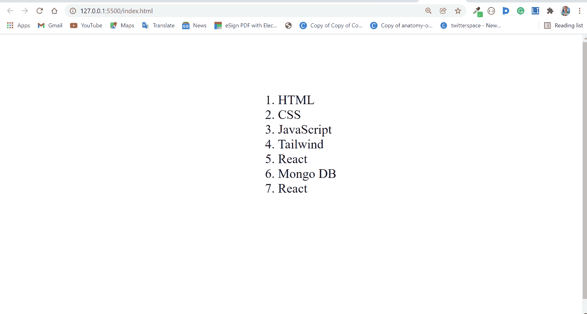
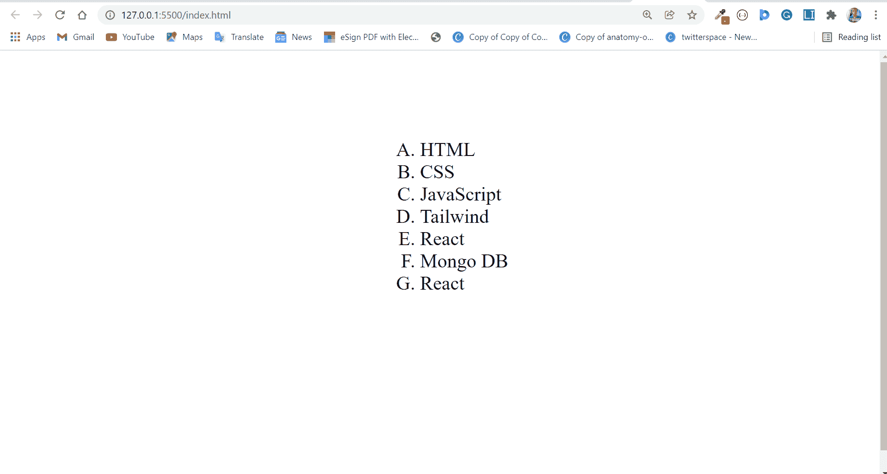
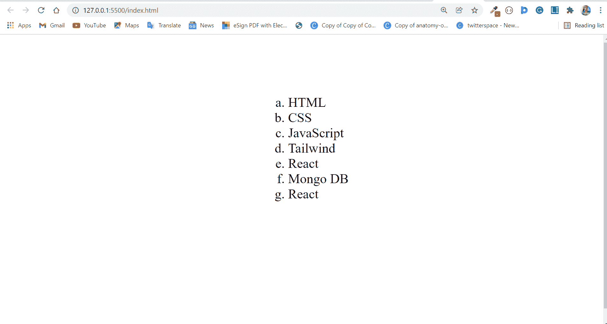
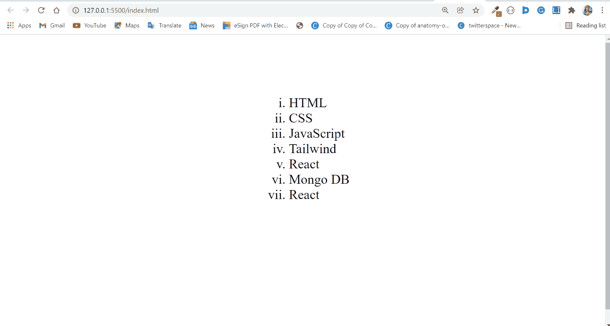
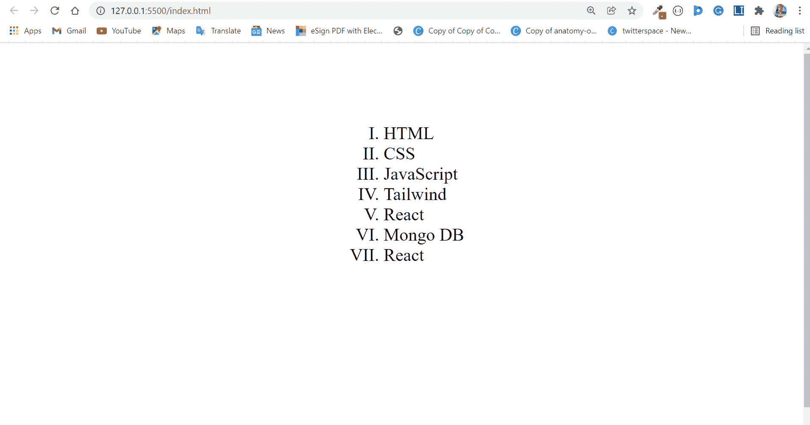
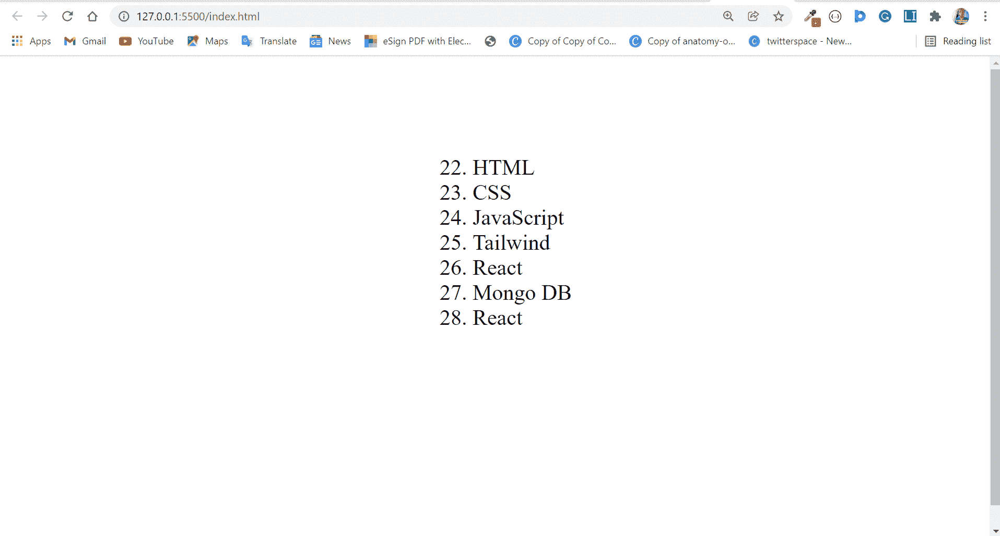
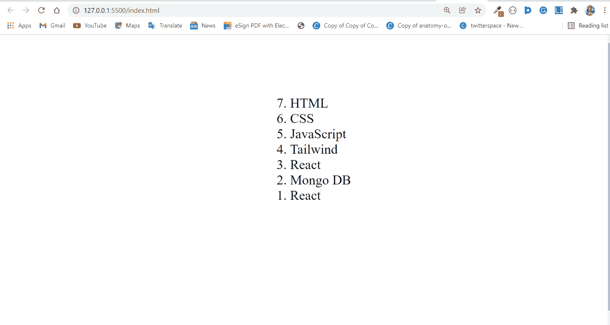

# HTML-OL 标签示例中的有序列表

> 原文：<https://www.freecodecamp.org/news/ordered-list-in-html-ol-tag-example/>

有序列表是一个列表，其中的项目被编号并且顺序很重要。

这与无序列表相反，在无序列表中，默认情况下项目是有项目符号的(顺序无关紧要)。

## `<ol>`标签的基本语法

标签定义了 HTML 中的有序列表。列表项由`<li>`标签定义。

`<ol>`标签不是空元素，所以它在`</ol>`中有一个结束标签

```
<ol>
      <li>...</li>
      <li>...</li>
      <li>...</li>
</ol> 
```

在浏览器中，有序列表显示为编号列表，如下所示:

```
<ol>
   <li>HTML</li>
   <li>CSS</li>
   <li>JavaScript</li>
   <li>Tailwind</li>
   <li>React</li>
   <li>Mongo DB</li>
   <li>React</li>
</ol> 
```



如果你想知道为什么列表项在页面上居中，这个 CSS 让它发生了:

```
body {
      display: grid;
      place-items: center;
      height: 100vh;
    } 
```

## `<ol>`标签的属性

`<ol>`标签接受`start`、`type`和`reversed`作为属性。

### `type`属性

`type`属性用于指定您想要为列表使用哪种类型的编号。

默认为阿拉伯数字。

可以使用的列表类型有:

*   `1`为阿拉伯数字(默认)

```
<ol type="1">
   <li>HTML</li>
   <li>CSS</li>
   <li>JavaScript</li>
   <li>Tailwind</li>
   <li>React</li>
   <li>Mongo DB</li>
   <li>React</li>
</ol> 
```


**附注:**如果您将使用阿拉伯数字作为编号类型，则无需指定，因为这是默认设置。

*   `A`为大写字母

```
<ol type="A">
  <li>HTML</li>
  <li>CSS</li>
  <li>JavaScript</li>
  <li>Tailwind</li>
  <li>React</li>
  <li>Mongo DB</li>
  <li>React</li>
</ol> 
```



*   `a`为小写字母

```
<ol type="a">
  <li>HTML</li>
  <li>CSS</li>
  <li>JavaScript</li>
  <li>Tailwind</li>
  <li>React</li>
  <li>Mongo DB</li>
  <li>React</li>
</ol> 
```



*   `i`为小写罗马数字

```
<ol type="i">
  <li>HTML</li>
  <li>CSS</li>
  <li>JavaScript</li>
  <li>Tailwind</li>
  <li>React</li>
  <li>Mongo DB</li>
  <li>React</li>
</ol> 
```



*   `I`为大写罗马数字

```
<ol type="I">
  <li>HTML</li>
  <li>CSS</li>
  <li>JavaScript</li>
  <li>Tailwind</li>
  <li>React</li>
  <li>Mongo DB</li>
  <li>React</li>
</ol> 
```



### `start`属性

可以引入 start 属性来指定列表从哪个数字开始。因此，它接受一个整数作为值。默认值为 1。

如果您指定一个数字，比如 22，那么下一个列表项将采用下一个数字 23，依此类推…

```
<ol start="22">
  <li>HTML</li>
  <li>CSS</li>
  <li>JavaScript</li>
  <li>Tailwind</li>
  <li>React</li>
  <li>Mongo DB</li>
  <li>React</li>
</ol> 
```



### `reversed`属性

当您在有序列表上使用`reversed`属性时，列表项以相反的顺序呈现。即从最高数字到最低数字。

您不需要为`reversed`属性指定一个值，因为您指定的任何值都将被忽略。

```
<ol reversed>
  <li>HTML</li>
  <li>CSS</li>
  <li>JavaScript</li>
  <li>Tailwind</li>
  <li>React</li>
  <li>Mongo DB</li>
  <li>React</li>
</ol> 
```



## 结论

在本文中，您了解了`<ol>`标签及其属性，因此您可以在项目中对其进行更多的控制。

如果你觉得这篇文章有帮助，不要犹豫，与你的朋友和家人分享。