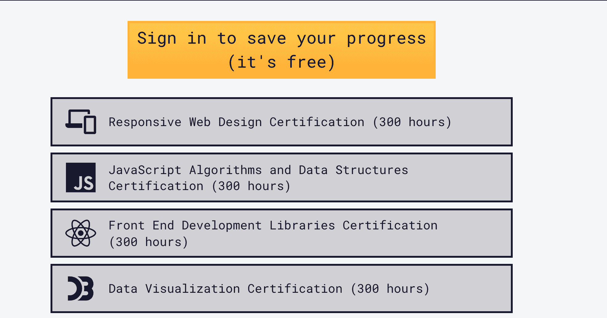
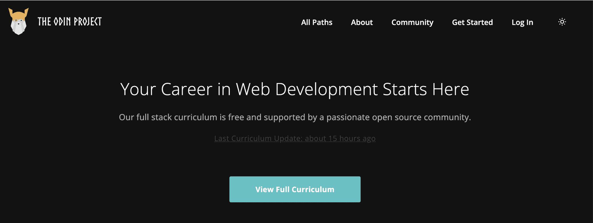

# 学习网络开发——面向初学者的免费全套开发者课程

> 原文：<https://www.freecodecamp.org/news/learn-web-development-free-full-stack-developer-courses-for-beginners/>

术语[全栈](https://www.freecodecamp.org/news/what-is-a-full-stack-developer-back-end-front-end-full-stack-engineer/)开发者指的是与 web 应用的前端和后端组件一起工作。

前端是用户交互的对象，而后端是 web 应用程序的逻辑。

在本文中，我将介绍一些可以帮助您成为全栈开发人员的资源:

*   [freeCodeCamp](https://www.freecodecamp.org/learn/)
*   [CS50 用 Python 和 JavaScript 进行 Web 编程](https://www.edx.org/course/cs50s-web-programming-with-python-and-javascript)
*   [奥丁计划](https://www.theodinproject.com/)

我还将提供 YouTube 课程的附加链接，您可以通过构建更多项目来继续练习您的技能。

*   [freeCodeCamp](#freecodecamp)
*   [奥丁计划](#the-odin-project)
*   [CS50 用 Python 和 JavaScript 进行 Web 编程](#cs50-s-web-programming-with-python-and-javascript)
*   [建议的 YouTube 全栈项目教程](#suggested-youtube-full-stack-project-tutorials)

## 自由代码营

freeCodeCamp 是一个免费的在线互动学习平台，你可以在这里学习网络开发并获得认证。每门课程都有一系列的挑战，你将学习材料，然后完成 5 个认证项目。

前四门课程涵盖了前端技术，包括 HTML、CSS、普通 JavaScript、React 和 D3。后端开发、关系数据库课程和质量保证认证涵盖 Node、Express、SQL、Chai 测试、MongoDB 等。

下面是您将要构建的一些项目的列表。

*   产品登录页面
*   随机报价机
*   25 +5 时钟
*   世界杯数据库
*   数独求解器

完成这些认证后，您将知道如何构建完整的 web 应用程序。从那里你可以为你的投资组合建立自己的项目，并开始申请入门级的工作。

剩下的认证涵盖 Python 和机器学习。这些是更高级的中级认证，假设您已经完成了之前的 JavaScript 认证。

如果你需要课程方面的帮助，请联系 [freeCodeCamp 论坛](https://forum.freecodecamp.org/)，在那里世界各地的开发者可以帮助你编写代码。

## 奥丁计划

Odin 项目是一个基于项目的免费在线平台，在这里你可以学习[全栈 JavaScript](https://www.theodinproject.com/paths/full-stack-javascript?) 或[全栈 Ruby on Rails](https://www.theodinproject.com/paths/full-stack-ruby-on-rails?) 。

你将首先通过[基础课程](https://www.theodinproject.com/paths/foundations/courses/foundations)学习 HTML、CSS、JavaScript 基础知识、Git、命令行以及如何使用文本编辑器。这些课程建议阅读材料、作业和项目在学习过程中完成。

以下是您将在[基础课程](https://www.theodinproject.com/paths/foundations/courses/foundations)中构建的一些项目列表:

*   石头剪刀布
*   蚀刻素描
*   登录页面

从那里你可以选择 JavaScript 或者 Ruby on Rails 课程。如果你需要帮助来决定选择哪一个，请阅读 Odin 项目中的[指南。](https://www.theodinproject.com/paths/foundations/courses/foundations/lessons/choose-your-path-forward)

Ruby on Rails 课程涵盖了 Ruby 编程、中级到高级的 HTML 和 CSS、Ruby on Rails 框架等等。

这里有一些你将在 [Ruby on Rails 课程](https://www.theodinproject.com/paths/full-stack-ruby-on-rails?)中构建的项目。

*   Tic Tac Toe(微塔式机)
*   SQL 动物园
*   个人投资组合

[JavaScript 课程](https://www.theodinproject.com/paths/full-stack-javascript?)涵盖了中级到高级 HTML 和 CSS、JavaScript、MongoDB、Node、Express 等等。他们还提供了一份关于如何在[找到第一份工作的有用指南。](https://www.theodinproject.com/paths/full-stack-ruby-on-rails/courses/getting-hired)

以下是您将在 [JavaScript 课程](https://www.theodinproject.com/paths/full-stack-javascript?)中构建的一些项目:

*   餐厅页面
*   天气应用
*   博客 API

如果你在课程上需要帮助，请联系奥丁计划不和谐频道。

## CS50 的使用 Python 和 JavaScript 的 Web 编程

这个 [CS50 Web 编程课程](https://www.edx.org/course/cs50s-web-programming-with-python-and-javascript)会教你 HTML，CSS，JavaScript，Git，Python，Django，SQL 等等。你首先需要参加 [CS50 的计算机科学入门](https://www.edx.org/course/introduction-computer-science-harvardx-cs50x)。

《计算机科学导论》将通过一系列的习题集和一个期末项目教会你编程的基础。然后你可以继续学习网络编程课程，进一步发展你的技能。

本课程由哈佛大学顶级讲师大卫·马兰和余腾渤教授。完成这些课程后，您将在全栈 web 开发方面有一个坚实的基础。

这两个课程都可以在 [edX](https://www.edx.org/) 上找到，并且可以免费旁听。

如果你需要 CS50 课程的帮助，请联系他们的任何一个社交媒体平台。

## YouTube 上的全栈项目教程

在您已经建立了全栈 web 开发的基础之后，您可以研究这些额外的资源来构建更多的项目以加强您的技能。

*   [Flutter & Firebase 课程——打造全栈 Instagram 克隆](https://www.youtube.com/watch?v=mEPm9w5QlJM)
*   [云课程中的全栈 Web 开发- Svelte、Postgres、Vercel、Gitpod](https://www.youtube.com/watch?v=OUzaUJ3gEug)
*   [全栈 MERN 项目-构建并部署一个应用| React + Redux，Node，Express，MongoDB[第 1/2 部分]](https://www.youtube.com/watch?v=ngc9gnGgUdA)
*   [全栈 MERN 项目-构建并部署一个应用| React + Redux，Node，Express，MongoDB[第 2/2 部分]](https://www.youtube.com/watch?v=aibtHnbeuio)
*   [带有 Django 和 Vue 教程的电子商务网站(Django Rest 框架)](https://www.youtube.com/watch?v=Yg5zkd9nm6w)
*   [Python 微服务 Web App(带 React、Django、Flask) -全程](https://www.youtube.com/watch?v=0iB5IPoTDts)
*   [PERN Stack 课程-构建 Yelp 克隆(Postgres，Express，React，Node.js)](https://www.youtube.com/watch?v=J01rYl9T3BU)