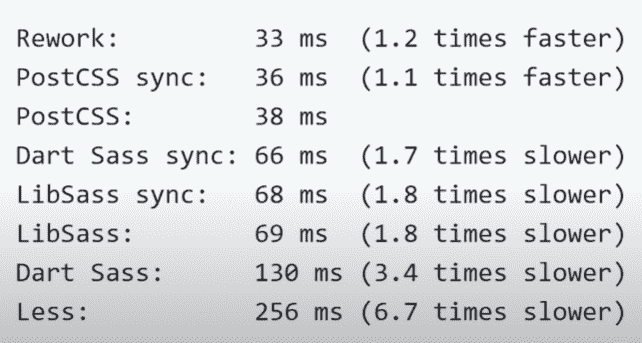
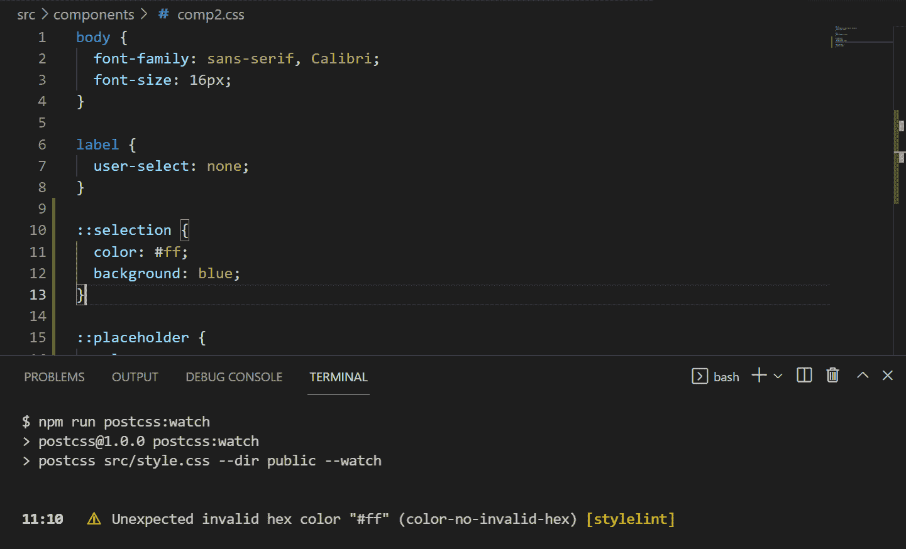

# 什么是 PostCSS？如何使用插件来自动化 CSS 任务

> 原文：<https://www.freecodecamp.org/news/what-is-postcss/>

PostCSS 是一个 Node.js 工具，它使用 JavaScript 插件来转换您的样式。

它在 [NPM](https://www.npmtrends.com/less-vs-postcss-vs-sass-vs-stylus) 上每周产生的下载量超过了其他 CSS 预处理程序如 Sass、Less 和 Stylus 的总和。


PostCSS download trends comparing to other CSS preprocessors

## 在本文中，我们将讨论:

*   什么是 PostCSS？
*   PostCSS 的特性和优势
*   一些流行的 PostCSS 插件
*   如何设置 PostCSS 配置

# 什么是 PostCSS？

PostCSS 是一个 JavaScript 工具，它将你的 CSS 代码转换成抽象语法树(AST)，然后提供一个 API(应用程序编程接口)来使用 JavaScript 插件分析和修改它。

PostCSS 提供了一个庞大的插件生态系统来执行不同的功能，如林挺、缩小、插入厂商前缀等。

尽管有它的名字，它既不是后处理器也不是前处理器，它只是一个 ****transpiler**** 将一个特殊的 PostCSS 插件语法变成一个普通的 CSS。你可以把它想象成 CSS 的 [****通天塔****](https://babeljs.io/docs/en/) 工具。

您可以将 PostCSS 与现有的预处理程序(如 Sass、Less 和 Stylus)结合使用。或者你也可以用它来代替所有的功能，因为它有所有需要的功能可以单独使用。

您可能已经在不知不觉中使用了 PostCSS。它用在流行的 Autoprefixer 插件中，该插件用于自动将供应商前缀添加到需要它们的 CSS 属性中。

PostCSS 也被其他技术使用，如 Vite 和 Next.js，以及 CSS 框架 [TailwindCSS](https://tailwindcss.com/docs/using-with-preprocessors#using-post-css-as-your-preprocessor) ，这是一个 PostCSS 插件。

# PostCSS 功能和优势

*   PostCSS 是完全可定制的，所以你可以只使用你的应用程序需要的插件和特性。
*   与其他预处理程序相比，它的构建速度更快。



Different build times for different CSS preprocessors comparing to PostCSS

*   如果你愿意，你可以编写自己的定制插件。你可以把它和普通的 CSS 一起使用，也可以和其他预处理程序一起使用，比如 Sass。

PostCSS 都是关于插件的(就其本身而言，它只是一个 API)。它有一个由 356 个插件组成的生态系统(在撰写本文时)。每个插件都是为特定的任务而创建的。

你可以使用官方 PostCSS GitHub 页面上的[插件目录](https://github.com/postcss/postcss/blob/main/docs/plugins.md)来浏览插件，或者使用这个[可搜索的 postscs 插件目录](https://www.postcss.parts/)。

在开始编写代码之前，我强烈建议您遵循以下步骤:

1.  将下面的[****postcss-tutorial****](https://github.com/adamA113/postcss-tutorial)**下载或分支到您的机器上，并尝试跟随。(请务必阅读 README.md 文件。)**
2.  **安装 [****PostCSS 语言支持**** ****插件****](https://marketplace.visualstudio.com/items?itemName=csstools.postcss)**如果您正在使用 Visual Studio 代码编辑器，那么您的编辑器可以识别任何新的语法并停止向您提供错误(如果您正在使用其他代码编辑器，请跳过此步骤)。****

# ****流行的 PostCSS 插件****

### ****PostCSS Import****

****要使用的最基本也是最重要的插件之一是 [postcss-import](https://github.com/postcss/postcss-import) 。它允许我们将 CSS 文件导入到其他文件中。****

****要检查如何使用这个插件，请到 postcss-tutorial 库中的`src/style.css`。****

```
**`@import './components/comp1.css';
@import './components/comp2.css';`**
```

****您可以看到，这与我们在 Sass 中使用@import 方法的方式非常相似。****

********注意:**** `postcss-import`与原生 CSS 中的[导入规则](https://developer.mozilla.org/en-US/docs/Web/CSS/@import)不同。您应该避免在原生 CSS 中使用导入规则，因为它可以防止样式表被同时下载，这会影响加载速度和性能。****

**浏览器必须等待每一个导入的文件都被加载，而不是能够一次加载所有的 CSS 文件。**

## **[自动修复程序](https://github.com/postcss/autoprefixer)**

**这是最流行的 PostCSS 插件之一。您可以使用它来解析供应商前缀，如`-webkit`、`-moz`和`-ms`，并使用来自[我可以使用](https://caniuse.com/)网站的值将它们添加到 CSS 规则中。**

**我们使用 Can I Use 网站来查看哪些浏览器的版本支持 CSS 功能。这有助于我们确定是否需要添加前缀。**

**Autoprefixer 使用 [Browserslist](https://github.com/browserslist/browserslist) ，因此您可以在项目中指定您希望查询的浏览器。**

**我们可以使用“browser list”键在 package.json 文件中配置 browser list:**

```
 `"browserslist": [ 
     "defaults"  
 ]`
```

**上面的`defaults`查询是以下内容的简短版本:**

*   **全球使用率至少为 0.5%的浏览器。**
*   **`last 2 versions`每个浏览器的最后两个版本*，***
*   **`Firefox ESR`最新[火狐扩展支持发布](https://support.mozilla.org/en-US/kb/choosing-firefox-update-channel)。,**
*   **过去 24 个月内获得官方支持或更新的浏览器。**

**或者我们可以在根目录中使用一个`.browserslistrc`文件，在里面我们输入我们的配置。**

```
`defaults`
```

**为了测试这个插件，我们在`src/components/comp2.css`文件中添加了一些需要前缀的 CSS 规则:**

```
`label {
  user-select: none;
}

::selection {
  color: white;
  background: blue;
}

::placeholder {
  color: gray;
}`
```

**基于我们之前的“browserslist”设置，最终输出将是:**

```
`label {
  -webkit-user-select: none;
     -moz-user-select: none;
      -ms-user-select: none;
          user-select: none;
}

::-moz-selection {
  color: white;
  background: blue;
}

::selection {
  color: white;
  background: blue;
}

::-moz-placeholder {
  color: gray;
}

:-ms-input-placeholder {
  color: gray;
}

::placeholder {
  color: gray;
}`
```

## **[PostCSS 预设环境](https://github.com/csstools/postcss-plugins/tree/main/plugin-packs/postcss-preset-env)**

**这个插件使我们能够在我们的代码中使用现代 CSS(比如嵌套和自定义媒体查询)，把它转换成浏览器可以理解的普通 CSS。**

**它有一个`stage`选项，该选项根据 CSS 特性在成为 web 标准的过程中的稳定性来决定填充哪些 CSS 特性。**

**`stage`可以是 0(实验性的)到 4(稳定的)，或者假。阶段 2 是默认的。**

**对于嵌套，我们需要使用阶段 1。**

```
`module.exports = {
    plugins: [
        require('postcss-preset-env')({ stage: 1 })
    ],
}`
```

**此外，预设环境插件默认包括[自动修复](https://github.com/postcss/autoprefixer)插件和`[browsers](https://github.com/csstools/postcss-preset-env#browsers)`选项将被自动传递给它。**

**在`src/components/comp1.css`中，我们使用了与 Sass 预处理器非常相似的嵌套特性:**

```
`article {
    background: purple;

    & .title {
        font-size: 6rem;
    }

    & li {
        list-style-type: none;
    }
}`
```

**由于今天的 CSS 不支持嵌套，我们需要转换上面的代码，以便 web 浏览器能够理解它。**

**以下代码是最终结果:**

```
`article {
    background: purple
}

article .title {
        font-size: 6rem;
    }

article li {
        list-style-type: none;
    }`
```

## **[PostCSS 嵌套](https://github.com/postcss/postcss-nested)**

**如果我们想让**只有**使用嵌套特性，那么这个插件是完美的选择，因为它产生的结果和之前的插件一样。**

## **[后 CSS 混合](https://github.com/postcss/postcss-mixins)**

**Mixins 允许您定义可以在整个代码中重用的样式。**

**在我们的代码中，我们在`src/components/comp1.css`文件中使用了一些 mixins。**

**我们首先使用关键字`@defin-mixin`定义 mixin，后跟 mixin 名称。然后我们通过在`@mixin`关键字后面写名字来使用它。**

```
`@define-mixin reset-list {
  margin: 0;
  padding: 0;
  list-style: none;
}

nav ul {
  @mixin reset-list;
}`
```

**今天的 CSS 不支持 Mixins，所以需要编译成普通的 CSS。**

**最终代码将是:**

```
`nav ul {
  margin: 0;
  padding: 0;
  list-style: none;
}`
```

## **[Stylelint](https://stylelint.io/)**

**这是一个 CSS linter，帮助我们避免代码中的错误，以免它们破坏我们的用户界面(UI)。**

**可以通过[多种方式](https://stylelint.io/user-guide/configure)进行配置。其中之一是通过使用`package.json`中的`stylelint`属性，如下所示:**

```
`"stylelint": {
    "rules": {
      "color-no-invalid-hex": true
    }
  }`
```

**在`stylelint`中，我们有多个选项可以配置。这里我们将只讨论“规则”选项，它让你定义 linter 应该寻找的规则，并在不遵守时给出错误。**

**如果一个无效的十六进制值作为给定 CSS 属性的颜色提供，那么`"color-no-invalid-hex": true`规则会在终端中给出一个错误。**

**

Styleint linter gives an error as an invalid hex value provided as color at line 11.** 

****注意:**默认不打开任何规则，也没有默认值。您必须明确配置每个规则才能启用它。**

## **[Cssnano](https://cssnano.co/docs/Introduction/)**

**这是一个用来尽可能减少最终 CSS 文件大小的迷你程序，这样你的代码就可以用于生产环境了。**

**一些部分将被修改以尽可能地减小大小，比如删除不必要的空格、新行、重命名值和变量、合并在一起的选择器等等。**

**这是我们缩小前的最终 CSS 代码:**

```
`* {
  padding: 0;
  margin: 0;
}

article {
    background: purple
}

article .title {
        font-size: 6rem;
    }

article li {
        list-style-type: none;
    }

nav ul {
  margin: 0;
  padding: 0;
  list-style: none;
}

body {
  font-family: sans-serif, Calibri;
  font-size: 16px;
}

label {
  -webkit-user-select: none;
     -moz-user-select: none;
      -ms-user-select: none;
          user-select: none;
}

::-moz-selection {
  color: white;
  background: blue;
}

::selection {
  color: white;
  background: blue;
}

::-moz-placeholder {
  color: gray;
}

:-ms-input-placeholder {
  color: gray;
}

::placeholder {
  color: gray;
}`
```

**在缩小过程之后，我们为生产环境准备的最终 CSS 代码将如下所示:**

```
`*{margin:0;padding:0}article{background:purple}article .title{font-size:6rem}article li{list-style-type:none}nav ul{list-style:none;margin:0;padding:0}body{font-family:sans-serif,Calibri;font-size:16px}label{-webkit-user-select:none;-moz-user-select:none;-ms-user-select:none;user-select:none}::-moz-selection{background:blue;color:#fff}::selection{background:blue;color:#fff}::-moz-placeholder{color:gray}:-ms-input-placeholder{color:gray}::placeholder{color:gray}`
```

## **[后置 CSS 规格化](https://github.com/csstools/postcss-normalize)**

**这个插件可以让你使用一些流行的库 [normalize.css](https://github.com/csstools/normalize.css) 或者 [sanitize.css](https://github.com/csstools/sanitize.css) 。**

**这些 CSS 库为 HTML 元素提供了一致的、跨浏览器的默认样式，并且它们还纠正了错误和常见的浏览器不一致。**

**这个插件依赖于你提供给`"**browserslist"**`的值来显示 HTML 元素的正确样式。这里有一个[的例子](https://github.com/csstools/postcss-normalize#examples)。**

# **如何设置 PostCSS**

**要开始使用 PostCSS，我们首先需要使用以下命令全局安装它和它的[命令行接口](https://github.com/postcss/postcss-cli) (CLI):**

```
`npm i -g postcss-cli`
```

*   **`-g`全球下载。**

**然后使用以下命令在本地安装 PostCSS:**

```
`npm i -D postcss`
```

*   **`-D`是`--save-dev`的简称，将已安装的包保存为开发依赖项。**

**要开始使用 PostCSS，我们需要下载至少一个插件。**

**如果您正在使用 [postcss-tutorial](https://github.com/adamA113/postcss-tutorial) repo，您可以简单地运行`npm install`来下载所有的包和依赖项。**

## ****使用 PostCSS CLI 设置 post CSS****

**需要在终端中运行的命令的一般语法是:**

```
 `postcss [input.css] [OPTIONS] [-o|--output output.css] [--watch|-w]
 postcss <input.css> [OPTIONS] --dir <output-directory> [--watch|-w]`
```

**我们可以直接在终端中运行以下命令:**

```
`postcss src/style.css --use postcss-import --dir public --watch`
```

**选项列出了我们正在使用的插件。**

**`--watch`选项监视文件的任何变化并重新编译它们。**

## ****通过 package.json 文件中的 NPM 脚本设置 PostCSS】****

**在“脚本”中的 package.json 文件内，我们需要键入以下内容:**

```
`"postcss:watch": "postcss src/style.css --use postcss-import 
--dir public --watch"`
```

**上述命令将创建一个名为“public”的新目录，其中包含我们最终的普通 CSS 文件，该文件与源文件(style.css)同名。**

**如果我们希望输出文件的名称不同于源文件的名称，我们需要用`-o public/<file-name>`替换`--dir public`。**

**比如说: `-o public/main.css`。**

**我们可以用不同的[选项](https://github.com/postcss/postcss-cli)配置我们的命令在 PostCSS CLI 中运行，以获得我们想要的结果。**

**现在要运行上面的命令，我们在终端中键入`npm run <command name>`。(我们的`<command name>`是 ****postcss:手表**** ，你想取什么名字都可以)。**

**随着我们的项目越来越大，我们更有可能添加更多的插件。对于使用的每个插件，我们需要在上面的命令中的关键字`--use`后面写下它的名字，这使得它非常长，不是一个好的做法。**

**另一个解决方案是创建一个 postcss.config.js 文件。**

## **通过设置 PostCSS 配置文件来设置 PostCSS**

**在项目的根目录下，创建一个文件，命名为****postcss . config . js****。**

**其中的代码将如下所示:**

```
`module.exports = {
    plugins: [
     	require('postcss-import'),
        require('postcss-mixins'),
        require("stylelint"),
        require('postcss-preset-env')({ stage: 1 }),
        require('cssnano'),
    ],
}`
```

**在插件数组中，我们添加插件。**

****注意:**在我们的列表顶部添加 postcss-import 插件非常重要，因为这是文档所要求的。**

**在我们的 package.json 文件中运行 PostCSS 的命令需要改为:**

```
`"postcss:watch": "postcss src/style.css --dir public --watch"`
```

**正如你所看到的，唯一需要的改变是删除`--use`选项，因为我们提到的插件列表现在是一个单独的文件。**

## ****使用任务运行器(或 M** 模块捆绑器)设置 PostCSS**

**PostCSS 可以被设置为与各种任务运行器一起工作，如 [Gulp](https://github.com/postcss/gulp-postcss) 、 [Grunt](https://github.com/C-Lodder/grunt-postcss) ，以及模块打包器，如 [Rollup](https://github.com/egoist/rollup-plugin-postcss) 和 [Webpack](https://github.com/webpack-contrib/postcss-loader) 。**

**在这一节中，我们将看到如何为 PostCSS 设置 Grunt。**

**首先，我们需要在本地将 grunt 安装到“开发”依赖项中:**

```
`npm i -D grunt`
```

**然后全局安装 grunt-cli:**

```
`npm install -g grunt-cli`
```

**现在我们需要在项目的根目录下创建一个文件，并将其命名为 ****Gruntfile.js**** 。**

**然后我们需要安装一个特定的插件 [@lodder/grunt-postcss](https://www.npmjs.com/package/@lodder/grunt-postcss) ，让我们通过下面的命令使用 grunt 运行 postcss:**

```
`npm i -D @lodder/grunt-postcss`
```

**在`initCnfig`函数中，我们设置了 PostCSS 配置。**

```
`module.exports = function(grunt) {

    grunt.initConfig({
        postcss: {
            options: {
                processors: [
                    require('postcss-import')(),
                    require('postcss-mixins'),
                    require("stylelint"),
                    require('postcss-preset-env')({ stage: 1 }),
                    require('cssnano')(),
                ]
            },
            dist: {
                src: 'src/style.css',
                dest: 'public/style.css'
            }
        }
    })

    grunt.loadNpmTasks('@lodder/grunt-postcss');
}`
```

**这里我们将坚持运行 PostCSS 的基本要求，即:**

*   **在`processors`数组中调用我们的插件。**
*   **在`dist`对象中设置源文件和目标文件。**

**要了解更多配置，您可以随时查看官方文档中的 [@lodder/grunt-postcss](https://github.com/C-Lodder/grunt-postcss) 。**

**为了完成我们的配置，我们需要使用`grunt.loadNpmTasks`方法加载我们的插件。**

**最后，为了运行我们的普通任务，我们键入:**

```
`grunt postcss`
```

# ****结论****

**PostCSS 从 2015 年就有了，在 CSS 预处理者中很受欢迎。**

**您可以将其作为独立工具使用，也可以与其他现有的预处理程序结合使用。**

**何时使用以及如何使用(独立使用还是联合使用)取决于您的项目需求。**

**现在是时候去发现它提供的各种插件并开始使用它了。快乐编码:)**