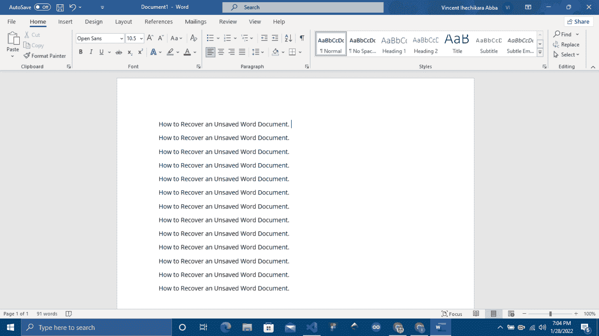
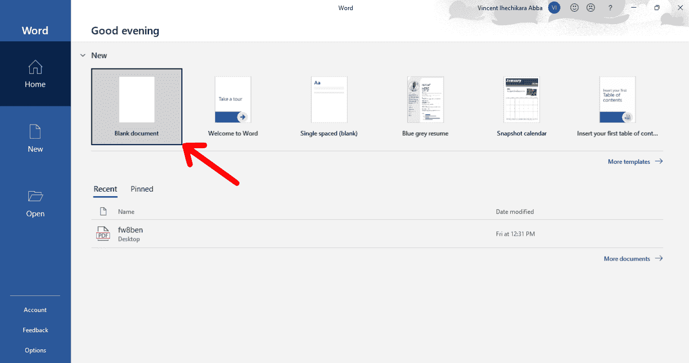
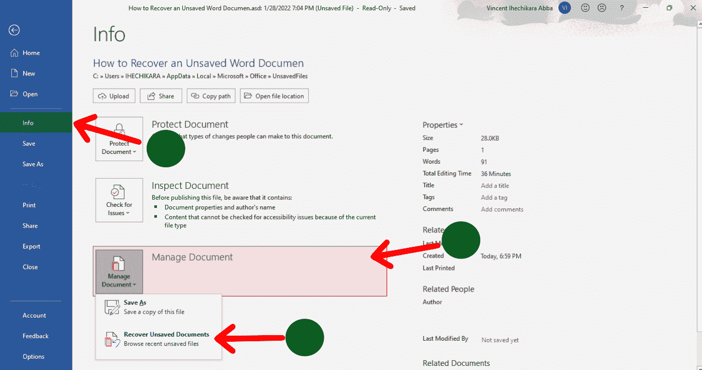
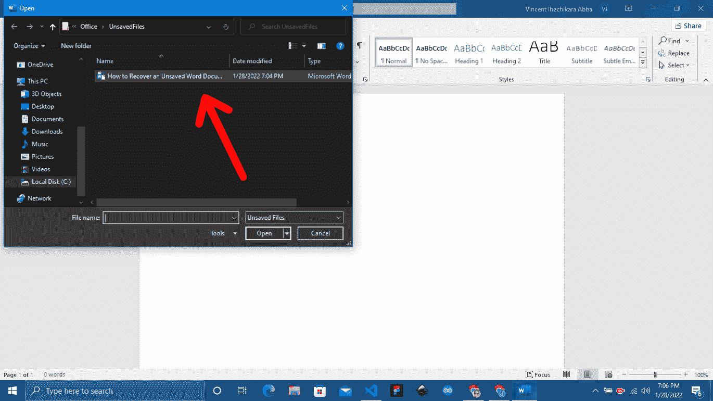

# 如何恢复未保存的 Word 文档–恢复已删除的 Word 文件

> 原文：<https://www.freecodecamp.org/news/how-to-recover-an-unsaved-word-document-restore-a-deleted-word-file/>

有时，您可能会不小心关闭了 Word 应用程序，而没有保存文件。您可能认为您的进度已经丢失，但实际上有一种方法可以在不丢失任何内容的情况下恢复文件。

这正是本文将向您展示的方法。

为了跟随本教程，如果您有一个可以使用的 Word 文档将会很有帮助。下面是我将使用的一个:

我已经关闭了应用程序，但没有保存文档。现在让我们开始简单的恢复过程。

### **步骤 1–在 Word 中创建一个空白文档**

*   再次启动应用程序。
*   在启动页面上，单击“空白文档”。

### **步骤 2–使用打开选项**

*   按下 **Ctrl+O** 。
*   或者，你可以点击空白文档标题中的**文件**选项，然后点击工具条上的**打开**。

### **步骤 3–点击“恢复未保存的文档”**

*   点击页面底部的**恢复未保存的文档**。

如果您没有看到**恢复未保存的文档**按钮，请按照以下步骤查看选项:

1.  在您的空白文档中，按下 **Ctrl+O** 或点击标题部分的**文件**。
2.  点击侧边栏中的**信息**。
3.  点击**管理文档**。
4.  点击**恢复未保存的文档**。

### **步骤 4–选择未保存的文档**

点击**恢复未保存的文档**按钮后，会弹出一个新窗口，列出未保存的文档。浏览列表并打开你的文档，你所有的进展应该仍然完好无损。

## 结论

在本文中，我们回顾了恢复未保存的 Word 文档所需的步骤。这些步骤可以在任何时候关闭 Word 而不保存文档时使用。

这次别忘了攒！